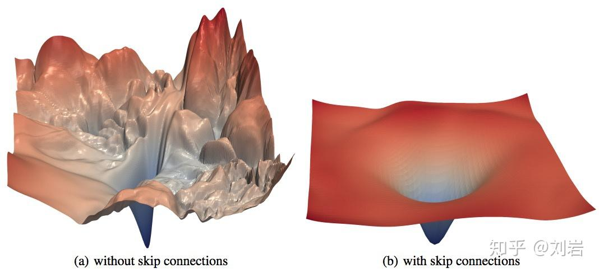
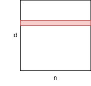

（新坑：经典论文圣地巡礼）

# Transformers
> The transformer model is a type of neural network architecture that excels at processing sequential data, most prominently associated with large language models (LLMs). Transformer models have also achieved elite performance in other fields of artificial intelligence (AI), such as computer vision, speech recognition and time series forecasting. [reference](https://www.ibm.com/think/topics/transformer-model)

```
@article{vaswani2017attention,
  title={Attention is all you need},
  author={Vaswani, Ashish and Shazeer, Noam and Parmar, Niki and Uszkoreit, Jakob and Jones, Llion and Gomez, Aidan N and Kaiser, {\L}ukasz and Polosukhin, Illia},
  journal={Advances in neural information processing systems},
  volume={30},
  year={2017}
}
```

something

# Batch Normalization

> Training Deep Neural Networks is complicated by the fact that the distribution of each layer's inputs changes during training, as the parameters of the previous layers change. This slows down the training by requiring lower learning rates and careful parameter initialization, and makes it notoriously hard to train models with saturating nonlinearities. We refer to this phenomenon as internal covariate shift, and address the problem by normalizing layer in puts. Our method draws its strength from making normalization a part of the model architecture and performing the normalization for each training mini-batch. Batch Normalization allows us to use much higher learning rates and be less careful about initialization. It also acts as a regularizer, in some cases eliminating the need for Dropout. Applied to a state-of-the-art image classification model, Batch Normalization achieves the same accuracy with 14 times fewer training steps, and beats the original model by a significant margin. Using an ensemble of batch normalized networks, we improve upon the best published result on ImageNet classification: reaching 4.9% top-5 validation error (and 4.8% test error), exceeding the ac curacy of human raters.

```
@misc{ioffe2015batchnormalizationacceleratingdeep,
      title={Batch Normalization: Accelerating Deep Network Training by Reducing Internal Covariate Shift}, 
      author={Sergey Ioffe and Christian Szegedy},
      year={2015},
      eprint={1502.03167},
      archivePrefix={arXiv},
      primaryClass={cs.LG},
      url={https://arxiv.org/abs/1502.03167}, 
}
```

深度神经网络训练过程中，每一层的输入分布都会随着前一层参数的变化而变化，往往需要较低的学习率和精细的参数初始化，从而减缓了训练速度，并且使得训练具有饱和非线性（**注**：参考[AlexNet论文](https://proceedings.neurips.cc/paper_files/paper/2012/file/c399862d3b9d6b76c8436e924a68c45b-Paper.pdf)，这里的非线性指的是类似sigmoid和tanh这样的激活函数，饱和指的是这个函数是个有界函数，比如sigmoid上界是1下界是0；同理可知，非饱和就是类似ReLU这种没有上界的函数，因为随自变量增加函数值会一直增加）的模型变得非常困难。（**注**：样本方差较大时，容易梯度消失，直观理解就是饱和函数越往两侧延伸越平）这种现象被称为内部协变量移位（Internal Covariate Shift, ICS），BN就是来解决这个问题的。（**注**：参考[这篇论文](https://arxiv.org/abs/1805.11604)和[这篇博客](https://zhuanlan.zhihu.com/p/54171297)，有大佬证明BN与ICS无关，BN起到平滑损失平面(loss landscape)的作用，就是让原本崎岖的损失平面变得平滑）BN将归一化作为模型架构的一部分，并对mini-batch训练的每一步执行归一化。BN允许我们使用更高的学习率，并且对初始化不那么小心。它还充当正则化器，在某些情况下消除了Dropout的需要。



*可以理解成BN让左边变成右边*

在一个d维输入的层中，输入为：
$$
x=(x^{(1)}...x^{(d)})
$$
随后对每一维度归一化：
$$
\hat{x}^{(k)}=\frac{x^{(k)}-\Epsilon{[x^{(k)}]}}{\sqrt{\mathrm{Var}[x^{(k)}]}}
$$


*BN大致的样子*

BN会对模型的收敛有帮助，但是也可能破坏已经学习到的特征。为了解决这个问题，BN添加了两个可以学习的变量$ \gamma $和$ \beta $用于控制网络能够表达直接映射，也就是能够还原BN之前学习到的特征。[[reference]](https://zhuanlan.zhihu.com/p/54171297)
$$
y^{(k)}=\gamma^{(k)}\hat{x}^{(k)}+\beta^{(k)}
$$
可以理解为一个映射：
$$
\mathrm{BN}_{\gamma,\beta}:x_{1...m}\to y_{1...m}
$$
算法：

**Input**:

mini-batch样本
$$
\mathcal{B}=\{x_{1...m}\}
$$
带学习的参数$ \gamma $和$ \beta $

**Output**:
$$
\{y_i=\mathrm{BN}_{\gamma,\beta}(x_i)\}
$$

1. 计算mini-batch的均值
   $$
   \mu_{\mathcal{B}}\leftarrow\frac{1}{m}\sum_{i=1}^m{x_i}
   $$

2. 计算mini-batch的方差

3. 


# Layer Normalization

> Layer Normalization stabilizes and accelerates the training process in deep learning. In typical neural networks, activations of each layer can vary drastically which leads to issues like exploding or vanishing gradients which slow down training. Layer Normalization addresses this by normalizing the output of each layer which helps in ensuring that the activations stay within a stable range. [reference](https://arxiv.org/abs/1607.06450)

```
@misc{ba2016layernormalization,
      title={Layer Normalization}, 
      author={Jimmy Lei Ba and Jamie Ryan Kiros and Geoffrey E. Hinton},
      year={2016},
      eprint={1607.06450},
      archivePrefix={arXiv},
      primaryClass={stat.ML},
      url={https://arxiv.org/abs/1607.06450}, 
}
```

在Layer Norm之前的是Batch Norm[[1](https://arxiv.org/abs/1502.03167)] [[2]()] [[3]()]

# Alex Net

# Residual Network


