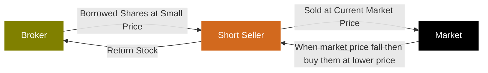

金融计算期末复习+总结，应付考试集大成之作。（悲


题图：凉前辈教你量化金融！由ChatGPT-Image2生成。

# What is Algo-Trading?

* Algorithmic trading, also called Algo Trading, Quant Trading, RoboTrading, Program Trading
* Use of mathematical models and computer algorithms/programs to
  * generate trading signals (i.e. Decision making)
  * automate trading process (i.e. Execution)
* Objectives:
  * maximize profits
  * control execution costs
  * hedging and manage investment risks

## Types

|  | Human Trading | Robo-Advisory | Robo-Trading |
|:-:|:-:|:-:|:-:|
| Working Hours | ~9*5 | ~9*5 | 24*7 |
| Execution Speed | Slow | Moderate | Immediately |
| Data Inputs | Limited | Almost unlimited | Almost unlimited |
| Trading Frequency | Low | Low - mid | Low – High |
| Scalability | Limited investment size due to stress | Moderate | High |
| Accuracy/ Discipline | Variable especially when you lose | Consistent | High |
| Customization | High | Medium | Low |
| User Control | Full | Partial | Minimal |
| Risk Management | Subjective | Algorithmic | Algorithmic |

* 从时间间隔分类Time Frames:
  * Long Term: Months to Years
  * Short Term: Days, Weeks, Months
  * Intraday: Seconds to Hours
  * High frequency: Fractions of Seconds

### 👉Exercise1👈

* In comparing human trading, robo-advisory, and robo-trading, which of the following statements provides the most accurate insight regarding the scalability and risk management approaches of each trading method? **E**
  * A. Human trading is the most scalable due to its ability to adapt strategies based on market conditions, while robo-advisory relies on limited data inputs, making it less scalable.
  * B. Both human trading and robo-advisory exhibit high scalability due to personalized strategies, while robo-trading has limited scalability because it follows predefined algorithms.
  * C. Human trading is characterized by algorithmic risk management, whereas robo-advisory and robo-trading rely solely on subjective risk assessments.
  * D. Robo-advisory systems provide the highest level of customization in risk management compared to human trading and robo-trading, which both follow rigid frameworks.
  * **E. Robo-trading offers the highest scalability due to its continuous operation and algorithmic risk management, while human trading struggles with scalability due to emotional factors.**

## Terminology

1. Long and short position
2. Short-selling
3. Order book
4. Bid price, ask price
5. Market spread
6. Order types
7. Slippage
8. Mark-to-market
9. Trading system
10. Margin & leverage

### Long and short position

* Long position 多头头寸
  * Definition: Buying an asset with the expectation that its price will rise. 买入资产并预期其价格上涨。
  * Goal: Sell at a higher price to realize a profit. 以更高价格出售以实现盈利。
  * Example: Buying 100 shares of a stock at $50, selling when it reaches $70. 以50美元的价格购买100股股票，当股价达到70美元时卖出。

* Short Position 空头头寸
  * Definition: Selling an asset that you do not own, with the intention of buying it back later at a lower price. 出售你不拥有的资产，意图在日后以更低的价格买回。
  * Goal: Profit from a decline in the asset's price. 从资产价格下跌中获利。
  * Example: Selling 100 shares of a stock at $70, buying back at $50. 以70美元的价格卖出100股股票，再以50美元的价格回购。

### Short-selling

* How Short-Selling Works（有三个人：broker负责借出股、short seller负责买卖和归还、market）
  * Borrowing Shares: Obtain shares from a broker to sell. 借股：从经纪人处获取股票以进行出售。
  * Selling the Borrowed Shares: Sell the shares at the current market price. 出售借入股票：以当前市场价格出售股票。
  * Buying Back Shares: Later, buy the same number of shares at a lower price. 回购股票：稍后，以较低的价格购回相同数量的股票。
  * Returning Shares: Return the borrowed shares to the broker. 归还股票：将借用的股票归还给经纪人。



* Risks of Short-Selling
  * Unlimited Loss Potential: If the asset price rises significantly.
  * Margin Calls: Brokers may require additional funds if the trade goes against you.
  * Regulatory Risks: Short-selling can be subject to restrictions.


### Order book

* The Order Book is a real-time, continually updating list of buy and sell orders for a specific financial instrument, sorted by price level. 订单簿是特定金融工具的实时、持续更新的买卖订单列表，按价格水平排序。
* Key components
  * **Ask** Book: the list/queue for sellers 询价簿：**卖家**的列表/队列
  * **Bid** Book: the list/queue for buyers 报价簿：**买家**的列表/队列
  * Price: The price points at which investors are willing to trade 价格：投资者愿意交易的价格点
  * Size: The number of shares, contracts, or lots that traders want to buy or sell 规模：交易者想要买入或卖出的股票、合约或批次的数目
* Order Ledger 订单账簿
  * The order book is listed in a sorted price ledger, which can be ascending or descending. 订单簿列在已排序的价格账簿中，可以是升序或降序。
  * The longer the price ledger is, the more liquidity an instrument provides. It is also called "market depth". 价格账本越长，金融工具提供的流动性就越多。这也被称为“市场深度”。
* Top of the Book 报价簿顶部
  * The order book is separated into bid-book and ask-book 报价簿分为买入报价簿和卖出报价簿
  * Bid orders are sorted in descending price 买入报价按价格从高到低排序
  * Ask orders are sorted in ascending price 卖出报价按价格从低到高排序
  * The highest bid and the lowest ask are referred to "the top of the book" 最高买入价和最低卖出价统称为“报价簿顶部”
* Cumulative Book 累计报价簿
  * For each of the bid and ask book, order size accumulates from the top of the book. 对于买入报价簿和卖出报价簿，订单规模从报价簿顶部开始累计。

### Bid price, ask price

* Bid Price & Bid Size
  * Bid price is the highest price that a buyer (bidder) is willing to pay for a particular security.
  * Bid size represents the quantity a buyer is willing to purchase at the bid price.
  * The top price and size in a bid order book.
  * For example, if a buyer bids $207.01 x 3000 for a stock, it means they are willing to buy 3000 shares for not more than $207.01

* Ask Price & Ask Size
  * Ask price is the lowest price a seller is willing to accept for a security.
  * Ask size represents the quantity a seller is willing to sell at the ask price.
  * The top price and size in an ask order book.
  * For example, if a seller asks $209.94 x 200 for a stock, it implies they are willing to sell 200 shares for not less than $209.94

* 买入价与买入规模
  * 买入价是指买方（竞标者）愿意为特定证券支付的最高价格。
  * 买盘规模表示买方愿意以买盘价格购买的数量。
  * 竞价订单簿中的最高价格和最大规模。
  * 例如，如果买家对某只股票出价207.01美元x3000，这意味着他们愿意以不超过207.01美元的价格购买3000股

* 卖价与卖盘量
  * 卖价是指卖方愿意接受的证券最低价格。
  * 卖方报价量表示卖方愿意以报价价格出售的数量。
  * 卖盘簿中的最高价格和最大规模。
  * 例如，如果卖家为某只股票报价209.94美元×200股，这意味着他们愿意以不低于209.94美元的价格出售200股

### Market spread ⭐️

* The difference between the bid price and the ask price is known as the bid-ask spread.
* The bid-ask spread is a key measure of the **liquidity** of an asset or security.
* A **smaller** spread indicates a **more liquid** market, while a larger spread indicates a less liquid market.
* Percentage Spread
  * Percentage spread is often used for comparing the spread between different instruments
  * $$Percentage Spread = \frac{AskPrice - BidPrice}{MidPrice} = \frac{2\times(AskPrice - BidPrice)}{AskPrice + BidPrice}$$
* For example, if the bid price for a stock is $24 and the ask price is $25, the bid-ask spread will be $1, the percentage spread will be 4.08%.

### Order types

* Market Order
  * A market order is to buy or sell at the best available price in the current market.
  * That is, when opening a buy (sell) position using market order, it will try to execute at the best ask (bid) price.
  * A market order typically ensures an execution, but it does not guarantee a specified price. It is appropriate to use market orders when you want an immediate execution.

* 市价单
  * 市价单是指以当前市场上的最佳可用价格进行买入或卖出。
  * 即，当使用市价单开立买入（卖出）头寸时，系统会尝试以最佳卖价（买价）执行。
  * 市价单通常能确保交易执行，但不保证执行价格。当您希望立即执行交易时，使用市价单是合适的。

* Limit Order
  * A limit order is to buy or sell with a condition on the maximum price to pay or the minimum price to receive (the "limit price").
  * If the order is filled, it will only be at the specified limit price or better. However, there is no guarantee of execution.
  * A limit order may be appropriate when you think you can buy at a price lower than (or sell at a price higher than) the current market quote.
  * Example
    * The last trade price is roughly $138
    * investor who wants to buy (or sell) immediately would place a market order, which would be executed at or near the current price of $138 (white line) provided that the market was open.
    * investor who wants to buy the stock when it dropped to $131.78 would place a buy limit order with a limit price of $131.78 (green line). If the price falls to $131.78 or lower, the limit order would be triggered and executed at $131.78 or below. If the stock doesn't drop to $131.78 or below, no execution would occur.
    * investor who wants to sell the stock when it reached $143.82 would place a sell limit order with a limit price of $143.82 (red line). If the price rises to $143.82 or higher, the limit order would be triggered and executed at $143.82 or above. If the stock doesn't rise to $143.82 or above, no execution would occur.

* 限价单
  * 限价单是指以设定的最高支付价格或最低接收价格为条件进行买入或卖出（“限价”）。
  * 若订单成交，则仅以指定的限价或更优价格成交。然而，无法保证订单一定能执行。
  * 当你认为你能以低于当前市场报价的价格买入（或以高于当前市场报价的价格卖出）时，限价单可能是合适的。
  * 示例
    * 最新交易价格约为138美元
    * 想要立即买入（或卖出）的投资者会下达市价单，只要市场开放，该订单就会以当前价格138美元（白线）或接近该价格的价格执行。
    * 投资者若想在股价跌至131.78美元时买入股票，则会设置一个限价委托，将限价设为131.78美元（绿线）。如果股价跌至131.78美元或更低，则限价委托将被触发并以131.78美元或更低的价格执行。如果股价未跌至131.78美元或更低，则不会执行委托。
    * 投资者若想在股价达到143.82美元时卖出股票，则会设置一个限价卖出订单，限价为143.82美元（红线）。如果股价上涨至143.82美元或以上，限价订单将被触发并以143.82美元或以上的价格执行。如果股价未上涨至143.82美元或以上，则不会执行订单。

* Stop Order
  * A stop order is to buy or sell at the market price when it has traded at or through a specified price (the "stop price").
  * If the stock reaches the stop price, the order becomes a market order and is filled at the next available market price. If it doesn't reach the stop price, the order will not be executed.
  * A stop order may be appropriate in these scenarios:
    * you want to buy when a stock breaks out above a certain level, and believe that it will continue the trend
    * your holding stock has risen a lot and you want to protect the gain when it begins to fall
  * Example
    * The stop buy order will trigger when the price reaches 143.82 or above, and will execute as a market order at that current price.
    * Thus, if the price rise further after hitting the stop price, it is possible that the order could be executed at a price higher than the stop price.
    * Similarly for the stop sell order, once the stop price of $131.78 is reached, the order could be executed at a lower price

* 止损单
  * 止损单是指在市场价格达到或穿过指定价格（即“止损价”）时，以市场价格买入或卖出。
  * 如果股票价格达到止损价，订单将变为市价单，并以下一个可用的市场价格成交。如果未达到止损价，订单将不会被执行。
  * 在以下情况下，止损单可能适用：
    * 当股票突破某一水平时，您希望买入，并认为其趋势会持续
    * 您的持仓股票已大幅上涨，而您希望在股价开始下跌时保护收益
  * 示例
    * 当价格达到143.82或以上时，止损买入单将被触发，并以当前价格作为市价单执行。
    * 因此，若价格在触及止损价后进一步上涨，订单可能会以高于止损价的价格执行。
    * 同样，对于止损卖单，一旦达到131.78美元的止损价格，订单可能会以更低的价格执行


### Slippage

* Slippage refers to the difference between the expected execution price and the price it actually traded
* It often occurs
  * during periods of higher volatility when market orders are used
  * when large orders are executed when market depth is not sufficient to maintain the expected price of trade
* Example
  * Let's assume you have an algorithm set to buy a stock when the price drops to $50. The algorithm detects the price drop and places a buy order.
  * However, due to high demand or low liquidity, the order gets executed at $51. This $1 difference is the slippage.
  * This means that even if you were expecting to spend $5000 on 100 shares, you would end up spending $5100. The $100 is the cost of slippage

* 滑点是指预期执行价格与实际交易价格之间的差异。
* 它通常发生在
  * 使用市价单时波动性较高的时期；
  * 当市场深度不足以维持预期交易价格时执行大额订单。
* 示例
  * 假设您设置了一个算法，当股价跌至50美元时买入股票。算法检测到股价下跌并发出买入订单。
  * 然而，由于需求高涨或流动性较低，订单以51美元的价格执行。这1美元的差价就是滑点。
  * 这意味着，即使你原本预计花费5000美元购买100股，最终也会花费5100美元。这100美元就是滑点成本


### Mark-to-market

* Entry: Based on a trade signal, generate order to go short or long a certain financial instrument in a certain quantity. Trade results in a certain position in this security
* Mark-to-Market: As the price of the security changes, so does your unrealized PnL
  * For long order: $$PnL=Quantity\times(P_{bid}-P_{entry})$$.
  * For short order: $$PnL=-1\times Quantity\times(P_{ask}-P_{entry})$$.
* Exit: Generate order to exit the position and create a realized PnL
  * $$PnL=Side\times Quantity\times(P_{exit}-P_{entry})$$
* It is an accounting method to calculate the asset or portfolio value according to its current market value, rather than its book value
* It involves determining the price at which you could immediately sell an asset or close a position
* Example:
  * Suppose you purchase 100 shares of ABC stock
  * The current bid and ask price of ABC are $9.5 and $10.5
  * Mark-to-market value of your stock will be 100*$9.5 = $9500

* 入场：基于交易信号，生成指令以特定数量做空或做多某种金融工具。交易结果为该证券的特定持仓 
* 逐日结算：随着证券价格的变化，未实现损益也会相应变化
  * 对于多头订单：$$PnL=Quantity\times(P_{bid}-P_{entry})$$。
  * 对于短线订单：$$PnL=-1\times 数量\times(P_{ask}-P_{entry})$$。
* 出场：生成离场指令并计算已实现损益
  * $$PnL=持仓方向\times 数量\times(P_{出场}-P_{入场})$$ 
* 这是一种根据资产或投资组合的当前市场价值而非账面价值来计算其价值的会计方法
* 它涉及确定您能立即卖出资产或平仓的价格
* 示例：
  * 假设您购买了100股ABC股票
  * ABC股票的当前买入价和卖出价分别为9.5美元和10.5美元
  * 您股票的市值将达到100*$9.5 = 9500美元

### Trading system - Order Management System (OMS)

* Order based system
  * Transactions are managed in a round order manner
  * Partial close is not supported
  * Trading platforms: MetaTrader, TradingView, MetaStock, etc
* Position based system
  * Transactions are independent and no linkage with each other
  * Partial close is allowed
  * Trading Platforms
    * Most of the banks (eg. HSBC, SBC, BOC, etc)
    * Interactive Brokers, Binance, etc
* Example
  * Suppose you open 3 offsetting trades: #1: buy 2 shares of ABC at $123 #2: sell 1 share of ABC at $124 #3: sell 1 share of ABC at $125
  * For order based system, the unrealized PnL will be 2\*(bid - 123) + 1\*(124 - ask) + 1\*(125 - ask) = $3 + 2\*(bid - ask). You need to close all the 3 trades to realize the PnL.
  * For position based system, the orders will be offsetted based on FIFO, and PL will become realized so long as the position is net to zero. Thus, your PnL will be realized at $3.

* 基于订单的系统
  * 交易以轮次顺序管理
  * 不支持部分平仓
  * 交易平台MetaTrader、TradingView、MetaStock等
* 基于持仓的系统
  * 交易独立进行，彼此之间无关联
  * 允许部分平仓
  * 交易平台
    * 大多数银行（如汇丰银行、渣打银行、中国银行等）
    * 盈透证券、币安等
* 示例
  * 假设您开立了3笔对冲交易：#1：以123美元买入2股ABC股票 #2：以124美元卖出1股ABC股票 #3：以125美元卖出1股ABC股票
  * 对于基于订单的系统，未实现的盈亏将是2\*(买入价 - 123) + 1\*(124 - 卖出价) + 1\*(125 - 卖出价) = 3美元 + 2\*(买入价 - 卖出价)。您需要平掉所有3笔交易以实现盈亏。
  * 对于基于头寸的系统，订单将根据先进先出（FIFO）原则进行抵消，只要头寸净值为零，损益（PL）就会实现。因此，您的损益（PnL）将在3美元时实现。


### Margin & leverage

* Leverage refers to using borrowed capital as a funding source for investment to increase the potential return: $$Leverage Ratio=\frac{Asset}{Equity}=1+\frac{Debt}{Equity}$$.
* Margin is a way to create leverage: $$Margin Amount=(Account Asset Value)-(Borrowed Amount)=Equity held at broker$$.
  * There are 2 market quotations for margin requirement
    * Fixed Margin Amount: Mostly used by stock exchanges
    * Margin as a percentage: Mostly used by FX/Crypto exchanges
* As HSI Index Future has a price magnifier of 50, meaning that 1 index point change will lead to ±HK$50. Suppose current HSI Index Future price is 25000, and buying 1 lot of HSI Index Future require HK$116,774 as margin. Then, leverage ratio is calculated to be ($25000*50)/$116,774 = 10.7044
* Suppose you pay $600,000 to get stocks worth $1,000,000. Thus, leverage ratio is calculated to be $1,000,000/$600,000 = 1.6667
* As you can imagine, the lower is the margin requirement, the higher is the leverage ratio. In general, $$Leverage Ratio=\frac{1}{Margin Requirement}$$.
* Buying Power
  * For leveraged trading where traders can take out a loan based on the amount of cash held in their broker account, buying power refers to the amount of money available for investors to purchase securities. Mathematically, $$Buying Power = Leverage Ratio \times Investor's Equity$$.
  * For example, suppose an investor made an initial deposit US$100,000 to a 20:1 leveraged broker account. Then, the investor would be able to purchase, at maximum, US$2,000,000 worth of securities. Hence, a buying power of US$2,000,000

* 杠杆是指利用借入资本作为投资资金来源以增加潜在回报：$$杠杆率=\frac{资产}{权益}=1+\frac{债务}{权益}$$。
* 保证金是一种创造杠杆的方式：$$保证金金额=(账户资产价值)-(借款金额)=在经纪商处持有的净值$$。
  * 保证金要求有两种市场报价方式：
    * 固定保证金金额：主要由股票交易所使用
    * 保证金百分比：主要由外汇/加密货币交易所使用
* 由于恒生指数期货的价格放大器为50，即指数点数的变动将导致±50港元。假设当前恒生指数期货价格为25000，购买1手恒生指数期货需要116,774港元作为保证金。那么，杠杆率计算为($25000*50)/$116,774 = 10.7044
* 假设你支付60万美元购买价值100万美元的股票。因此，杠杆率计算为$1,000,000/$600,000 = 1.6667
* 你可以想象，保证金要求越低，杠杆率就越高。一般来说，杠杆率=1/保证金要求。
* 购买力
  * 在杠杆交易中，交易者可以根据其经纪账户中的现金金额申请贷款，购买力是指投资者可用于购买证券的资金金额。从数学上讲，$$购买力 = 杠杆比率 \times 投资者权益$$。
  * 例如，假设投资者向一个杠杆比率为20:1的经纪账户存入10万美元的初始存款。那么，投资者最多能够购买价值200万美元的证券。因此，其购买力为200万美元

### 👉Exercise2👈

* What is one of the main disadvantages of using a market order? **C**
  * A) It guarantees the execution price
  * B) It may not be executed at all
  * **C) It can lead to slippage in volatile markets**
  * D) It requires a waiting period
  * E) It cannot be used for large orders

* What is a primary advantage of using a limit order? **B**
  * A) It guarantees immediate execution
  * **B) It allows for price control on the order execution**
  * C) It is always executed before market orders
  * D) It eliminates the risk of slippage
  * E) It can be used only for small orders

* What does the cumulative book represent? **C**
  * A) Historical trading volumes
  * B) Individual buy and sell orders
  * **C) Total quantities of orders at each price level**
  * D) The highest trading price of the day
  * E) The average liquidity of a market

* What does the "Top of the Book" refer to in trading? **B**
  * A) The total number of trades executed
  * **B) The highest bid and lowest ask prices**
  * C) The trading volume over time
  * D) The closing price of a stock
  * E) The most recent trades

* What information does the bid-ask spread in an order book indicate? **B**
  * A) The total number of shares traded in a day
  * **B) The difference between the highest bid and the lowest ask prices**
  * C) The average price of trades over a specified period
  * D) The total market capitalization of a stock
  * E) The time elapsed since the last trade

* What does a smaller bid-ask spread typically indicate? **C**
  * A) Increased trading costs
  * B) Higher market volatility
  * **C) Greater market liquidity**
  * D) Decreased trading activity
  * E) Lower investor interest

* Which of the following statements best describes the mechanics and risks associated with short-selling a stock? **B**
  * A) Short-selling involves buying shares with the expectation that the price will rise, allowing for a profit upon selling.
  * **B) In short-selling, an investor borrows shares from a broker to sell them at the current market price, aiming to buy them back later at a lower price.**
  * C) Short-sellers are guaranteed profits as long as they can find a buyer for the borrowed shares.
  * D) Short-selling is considered a low-risk strategy because the maximum loss is capped at the initial investment.
  * E) Regulations prohibit short-selling during periods of high market volatility to protect investors.

* Which of the following statements about short-selling in the stock market is the most accurate? **B**
  * A) Short-selling allows investors to profit from an increase in stock prices by borrowing shares.
  * **B) Short-selling involves borrowing shares and selling them with the expectation that the stock price will decline.**
  * C) Short-selling is only permitted for institutional investors and not for retail investors.
  * D) The losses from short-selling are limited to the initial investment made by the investor.
  * E) Short-selling has no impact on the overall market liquidity or stock prices.

* In an Order Management System (OMS), which statement most accurately highlights the distinction between an order-based system and a position-based system? **D**
  * A) An order-based system permits partial closures, whereas a position-based system does not.
  * B) In an order-based system, transactions are handled independently, while in a position based system, they follow a round order process.
  * C) An order-based system design is commonly adopted by banks.
  * **D) In an order-based system, transactions are processed in a round order and do not accommodate partial closures, while a position-based system enables independent transaction management and supports partial closures.**
  * E) Both systems function identically and exhibit no differences in transaction management.

* A trader is analyzing two stocks, Stock A and Stock B. The following bid and ask prices are observed: Stock A: Bid Price= $30, Ask Price= $32. Stock B: Bid Price= $25, Ask Price= $27. Calculate the percentage spread for both stocks and determine which stock has a better liquidity. **C**
  * A) Stock A: 6.45%, Stock B: 7.69%; Stock B has a better liquidity.
  * B) Stock A: 3.22%, Stock B: 3.85%; Stock A has a better liquidity.
  * **C) Stock A: 6.45%, Stock B: 7.69%; Stock A has a better liquidity.**
  * D) Stock A: 3.22%, Stock B: 3.85%; Stock B has a better liquidity.
  * E) Stock A: $2, Stock B: $2; Stock A and Stock B have the same liquidity.

$$A=\frac{2\times(AskPrice - BidPrice)}{AskPrice + BidPrice}=\frac{2\times(32-30)}{32+30}=6.45\%$$

$$B=\frac{2\times(AskPrice - BidPrice)}{AskPrice + BidPrice}=\frac{2\times(27-25)}{27+25}=7.69\%$$

$$A<B$$


### 👉Takeaway1👈

1. 交易类型有三种：人、机器辅助和机器自动。人最慢、最主观、规模最小、但是控制最高、定制最强。
2. 做空需要三个角色：broker负责借给short seller股权，short seller负责向market以当前价格出售股权，然后当股价下跌时回购，short seller此时将回购的股权还给broker。
3. bid-买-从高到低，ask-卖-从低到高
4. Order Ledger、Top of the Book、Cumulative Book的区别
5. spread必考一道计算题
6. Market Order、Limit Order、Stop Order的区别。Limit Order是期望的价格，不一定成交；Stop Order是Market Order穿过某一价格时以Market Order成交。
7. Market Order会造成slippage
8. Order based system和Position based system。Position based system是银行，允许Partial close


# Data Scrapy

## 👉Exercise3👈

* A data analyst is tasked with scraping stock data from a financial website using Python. The website has dynamic content that loads additional data upon scrolling. The analyst decides to use BeautifulSoup to extract the data. Which of the following approaches would likely yield the best results for scraping the desired information? **B**
  * A) Use BeautifulSoup alone to scrape the initial page, as it is sufficient for extracting static HTML content.
  * **B) Implement Selenium to automate scrolling and loading of dynamic content before passing the page source to BeautifulSoup for parsing.**
  * C) Use the requests library to fetch the page content, then manually parse the HTML using regex to extract the data.
  * D) Rely on the built-in scraping functionality of the financial website's API to retrieve the data without additional libraries.
  * E) Scrape the data using BeautifulSoup and then use a CSV library to write the data directly to a file without storing it in memory.

* A data analyst needs to scrape user reviews from an online trading forum using Python. The reviews are loaded dynamically as the user scrolls down the page. The scientist considers various libraries and techniques for the task. Which of the following strategies would be the most effective for scraping all available reviews? **C**
A) Use the requests library to fetch the initial HTML content, then parse it with BeautifulSoup, as it is sufficient to extract all reviews from the website.
B) Utilize BeautifulSoup to dynamically fetch the page content.
**C) Implement Selenium to simulate user scrolling, allowing all reviews to load, and then use BeautifulSoup to parse the complete page source.**
D) Rely on the website's RSS feed to access reviews directly without further scraping techniques.
E) Use a headless browser with BeautifulSoup to extract data directly from the page, then write to a file without storing it into memory.

* You need to extract stock prices from a financial website that employs JavaScript to dynamically render its content. Which of the following approaches is the most effective and robust for this task? **D**
A) Employ BeautifulSoup to parse the HTML response received from the server.
B) Utilize the requests library to repeatedly send HTTP requests and obtain the raw HTML content.
C) Use lxml to parse the HTML content retrieved.
**D) Implement Selenium to automate a web browser, allowing JavaScript execution and retrieval of dynamic content.**
E) Leverage Scrapy to initiate a web crawl without executing JavaScript.

* When scraping a website frequently, you notice that your IP address often gets blocked. Which of the following strategies would best help prevent this issue? **C**
  * A) Increase the scraping speed to avoid detection.
  * B) Use a single proxy server for all requests.
  * **C) Randomize user agents and implement delays between requests.**
  * D) Always scrape during off-peak hours.
  * E) Avoid using any headers in your requests.

* Which of the following statements best describes a limitation of web scraping? **B**
  * A) Web scraping can only be done on static HTML pages.
  * **B) Websites can implement measures to block scraping, such as CAPTCHAs.**
  * C) Scraped data is always accurate and up-to-date.
  * D) Web scraping is illegal in all circumstances.
  * E) Scraping always requires a paid subscription to access data.

* You are using BeautifulSoup to scrape a webpage containing a table of stock information. Given the following code snippet: Which of the following lines should replace the comment at line #14 to correctly extract the stock symbols? **ABD**
  * **A) symbols.append(row.select_one('td.symbol').text)**
  * **B) symbols.append(row.find_all('td')\[0\] .text)**
  * C) symbols.append(row.get('symbol'))
  * **D) symbols.append(row.find('td', {'class': 'symbol'}).text)**
  * E) symbols.append(row.td.symbol)

```python
1  from bs4 import BeautifulSoup
2  import requests
3
4  url = 'https://example.com/stock-table'
S  response = requests.get(url)
6  soup = BeautifulSoup(response.text, 'html.parser')
7
8  # Assume the table rows are structured like this:
9  # <tr><td class=''symbol ">AAPL</td><td>Apple Inc.</td></tr>
10
11 # Your task is to extract the stock symbols
12 symbols = []
13 for row in soup.find_all('tr'):
14     # Which Line should be used here?
15
16
17 print{symbols)
```

> A. `select_one` 是 BeautifulSoup 提供的 CSS 选择器方法，可以作用于任意 Tag（包括 `row`）。`'td.symbol'` 表示选取 class 为 `symbol` 的 `<td>` 元素。`.text` 获取该元素的文本内容。
>
> B. `find_all` 是 BeautifulSoup 提供的方法，可以作用于任意 Tag（包括 `row`）。`'td'` 表示选取所有 `<td>` 元素。`[0]` 表示选取第一个 `<td>` 元素。`.text` 获取该元素的文本内容。
>
> C. `row.get('symbol')` 是在 `<tr>` 标签上查找名为 `symbol` 的属性（例如 `<tr symbol="...">`）。而我们需要的是子标签 `<td>` 的文本内容，并非 `<tr>` 的属性。因此该方法会返回 `None`，无法得到股票代码。
>
> D. `find` 方法可在 `row` 内部搜索标签，第一个参数是标签名 `'td'`，第二个参数是一个字典，表示属性过滤条件 `{'class': 'symbol'}`。BeautifulSoup 对 `class` 属性有特殊处理，即使传递的是字典形式，也能正确匹配（只要 class 列表中包含 `'symbol'` 即可）。`.text` 获取文本内容。
>
> E. `row.td` 可以返回第一个 `<td>` 子标签（即 `<td class="symbol">AAPL</td>`）。但紧接着的 `.symbol` 会尝试访问该 `<td>` 标签中名为 `symbol` 的属性或子标签，而这里是 class 名称，并不是一个属性或子元素，因此会返回 `None` 或触发 `AttributeError`。同时，整行代码缺少 `.text`，即便偶然返回了某个子标签，也不会得到字符串文本。

* You are tasked with scraping a news website to collect the titles of the latest articles. The website has articles listed in <h2> tags within <div> elements. Given the following code snippet, which line should replace the comment at line #15 to correctly extract the article titles? **ABCE**

  * **A) article.h2.text**
  * **B) article.find('h2').get_text()**
  * **C) article.select_one('h2').string**
  * D) article.h2.get('title') get是获取属性，h2没有title属性
  * **E) article.find_all('h2')\[0\].text**

```python
1  from bs4 import BeautifulSoup
2  import requests
3
4  url = 'https://example.com/latest-news'
5  response = requests.get(url)
6  soup = BeautifulSoup(response.text, 'html.parser')
7
8  # Assume the articles are structured like this:
9  # <div class="article"><h2>ArticLe Title 1</h2></div>
10 # <div class="article"><h2>Article Title 2</h2></div>
11 # Your task is to extract the article titles
12 titles = []
13 for article in soup.find_all('div', class_='article'):
14    # # Which line should be used here?
15    titles.append(__________)
16
17 print(titles)
```

## 👉Takeaway2👈

1. **按属性定位标签**：用 `find` 加 `class` 字典。  
2. **CSS选择器定位**：`select_one` 精确便捷。  
3. **取文本用 `.text`**：通用，避免只用 `.string`。  
4. **别把类名当属性**：`get(类名)` 是错的。
5. 动态JavaScript、滑动屏幕用selenium，xml用lxml


# Database

## 👉Exercise4👈

* When designing a database for storing historical market data, which of the following design choices could lead to performance issues? **C**
  * A) Storing data in separate tables for transactions, dividends, and stock splits.
  * B) Partitioning the Market Data Table by month to speed up queries.
  * **C) Using a single, large Market Data Table for all stock data without partitioning.**
  * D) Implementing foreign keys to maintain relationships between tables.
  * E) Indexing commonly queried fields like stock ticker and date.

* Which of the following designs for a database storing historical market data could potentially cause performance issues? **B**
  * A) Storing data in a normalized structure with separate tables for transactions, dividends, and stock splits.
  * **B) Using a single, extensive Market Data Table that includes all historical records for effective data analysis.**
  * C) Implementing indexing on frequently queried fields, such as stock ticker and transaction date.
  * D) Utilizing partitioning strategies based on stock categories to enhance query efficiency.
  * E) Regularly archiving old data to reduce the size of the active tables.

* In the context of a database used for algo-trading, which of the following practices is most crucial for ensuring data integrity? **B**
  * A) Regularly updating the database schema.
  * **B) Implementing proper validation rules for data entry.**
  * C) Using a single table for all financial instruments.
  * D) Allowing duplicate entries to speed up data retrieval.
  * E) Storing all data as plain text files for simplicity.


# Backtesting

## Key Procedures

1. Data Collection
2. Data Cleaning
  * Missing Data
  * Duplicated Records
  * Incorrect Logics
3. Strategy Implementation
4. Performance Evaluation

## Lifecycle

1. Strategy Design / Research
2. Backtesting
  * New logics
  * Coding
  * Debug
  * Evaluate
  * Optimize
3. Paper Trading
4. Real Trading
5. Monitoring

## Pitfalls

1. Overfitting
  * Definition: Tailoring a strategy too closely to historical data, making it less likely to perform well on new, unseen data.
  * Symptoms: Exceptional past performance without sound reasoning.
  * Avoidance: Use out-of-sample testing and cross-validation.
2. Look-ahead bias
  * Definition: Using future data that would not have been available at the time of the trade decision.
  * Symptoms: Unrealistically high profits.
  * Avoidance: Ensure all data used for decisions is available up to the point in time being simulated.
3. Survivorship Bias
  * Definition: Only considering assets that have survived until the end of the period, ignoring those that have failed.
  * Symptoms: Overestimation of strategy performance.
  * Avoidance: Include delisted or bankrupt companies in the dataset.
4. Data-Snooping Bias
  * Definition: Repeatedly testing multiple strategies on the same dataset until one works, which may be due to chance.
  * Symptoms: High chance of false positives.
  * Avoidance: Validate the strategy on different datasets or time periods.
5. Ignore assumptions you made
  * Examples:
    * Failing to account for costs such as commissions, slippage, financing costs, and taxes
    * Short selling on certain stocks cannot be traded in real market
    * Exceptionally high leverage is not doable in practice
    * Potential delay between signal calculation and execution (eg. during market closure, using a complicated trading model, etc)
  * Avoidance:
    * Incorporate realistic estimates of transaction costs into the backtest.
    * Do some market research to check if your assumptions can be implemented in real market

* Best Practice
  * Robust Validation: Use out-of-sample testing and walk-forward analysis.
  * Realistic Assumptions: Incorporate transaction costs and market impact.
  * Continuous Monitoring: Regularly update and review the strategy.

## 👉Exercise5👈

* What is the significance of backtesting strategies? **E**
  * A) It ensures that strategies will always be profitable
  * B) It eliminates the need for real-time trading
  * C) It focuses solely on future market predictions
  * D) It guarantees success in automated trading
  * **E) It allows for analysis of strategies against historical data**

* Why is data cleaning considered a crucial step in the backtesting process? **C**
  * A) It reduces the amount of historical data available for analysis.
  * B) It ensures that the trading strategy is implemented correctly.
  * **C) It increases data quality and consistency for more accurate statistical modeling.**
  * D) It simplifies the visualization of trading results.
  * E) It eliminates the need for performance metrics.

* Which of the following statements about the algo-trading lifecycle is FALSE? **C**
  * A) The cycle begins with strategy design and research, where traders analyze market conditions.
  * B) Backtesting is used to validate a trading strategy's effectiveness using historical data.
  * **C) Real trading involves executing strategies in a live market environment without prior testing.**
  * D) Paper trading allows traders to simulate trading strategies in real-time without financial risk.
  * E) Monitoring is essential to adapt the strategy based on performance and market changes.

* Which of the following statements about data issues and their corresponding cleaning methods is FALSE? **A**
  * **A) Duplicated records should always be kept to ensure all data points are represented.**
  * B) Missing values can be handled by filling them with adjacent observations or deleting the affected rows.
  * C) Incorrect logics in data can be addressed by capping and flooring values within valid ranges.
  * D) Data cleaning improves the overall quality and consistency of the dataset.
  * E) Proper data cleaning processes can lead to more accurate statistical models in analysis.

* Which of the following scenarios is most likely an indication of overfitting in a backtest? **E**
  * A) A trading strategy performs well on both in-sample and out-of-sample data.
  * B) The strategy incorporates transaction costs and slippage in its calculations.
  * C) The strategy is validated using multiple datasets from different time periods.
  * D) A strategy demonstrates a consistent performance across various economic conditions.
  * **E) A strategy shows exceptional returns during the testing period but fails to perform in live trading.**

* Which of the following statements best describes survivorship bias in backtesting? **A**
  * **A) It occurs when only successful assets are considered, ignoring those that have failed.**
  * B) It results from using too many datasets, leading to false positives.
  * C) It is the practice of testing multiple strategies until one is successful.
  * D) It arises from not accounting for transaction costs in the backtest.
  * E) It happens when trading strategies are validated against past performance without realtime data.

* Which of the following statements about best practices in backtesting is FALSE? **D**
  * A) Continuous monitoring of a trading strategy is important to adapt to changing market conditions.
  * B) Out-of-sample testing helps validate a strategy's effectiveness on data that was not used during the development phase.
  * C) Incorporating realistic assumptions about transaction costs can lead to a more accurate representation of a strategy's performance.
  * **D) Once a strategy demonstrates success in backtesting, it requires no further adjustments or reviews.**
  * E) Walk-forward analysis allows for ongoing validation of a strategy over time.

* Which of the following practices is most likely to introduce look-ahead bias into a backtest? **B**
  * A) Using historical closing prices to make trading decisions.
  * **B) Incorporating economic indicators that were released after the backtest period.**
  * C) Ensuring all data used for decisions is up to the point in time being simulated.
  * D) Validating the strategy with out-of-sample testing.
  * E) Using only data available at the time of each trade decision.

## 👉Takeaway3👈

1. Overfitting 过拟合：策略过度匹配历史数据。
2. Look-ahead bias 前视偏差：误用当时未知的未来数据。
3. Survivorship Bias 幸存者偏差：忽略退市或失败资产。
4. Data-Snooping Bias 数据窥探：同一数据集反复测试致偶然性。
5. Ignore assumptions you made 忽视成本与限制：佣金、滑点、卖空等。
6. Out-of-sample testing 样本外验证：用新数据做稳健测试。
7. 持续监控更新策略。


# Candlestick - K线

* A candlestick chart (also called K-line) is a type of financial chart that displays the price movement of an asset over time.
* It summarizes OHLC data in a single chart
  * Open: The price at the start of the time period.
  * Close: The price at the end of the time period.
  * High: The highest price during the period.
  * Low: The lowest price during the period.
* OHLC data is aggregated in different time intervals (eg. 1-min, 1 hour, 1-day)
* In Technical Analysis, a candlestick pattern could provide indication on the future direction.
* Components:
  * Body: The area between the opening and closing prices.
  * Wicks: Lines extending above and below the body, representing the high and low prices.
* Visual display:
  * Bullish Candle: Close > Open (often colored green or white)
  * Bearish Candle: Close < Open (often colored red or black)


## Patterns

1. Doji
  * Description: A Doji candlestick forms when the open and close prices are nearly equal, creating a small body.
  * Market Insight: The Doji indicates indecision in the market. Traders are **uncertain** about price direction, which can precede a reversal or continuation of the trend.
  * Example: If a Doji appears after a bullish trend, it may signal a potential reversal, prompting traders to reevaluate their positions.
  * 
2. Hammer
  * Description: The Hammer pattern consists of a long lower wick and a small body at the top, appearing after a downtrend.
  * Market Insight: This pattern suggests a **bullish reversal**. The long lower wick indicates that sellers pushed prices down, but buyers stepped in, driving the price back up.
  * Example: When a Hammer forms at a support level, it can indicate strong buying interest, signaling traders to consider long positions.
  * 
3. Shooting Star
  * Description: The Shooting Star features a long upper wick with a small body at the bottom, forming after an uptrend.
  * Market Insight: This pattern indicates a potential **bearish reversal**. The long upper wick shows that buyers pushed prices higher, but sellers took control, pushing the price back down.
  * Example: If a Shooting Star appears at a resistance level, it may signal traders to consider short positions.
  * 
4. Double Bottom
  * Description:
    * A Double Bottom is a **bullish reversal** pattern that occurs after a downtrend.
    * It consists of two troughs at approximately the same price level, with a peak in between.
  * Market Insight:
    * The first trough represents strong selling pressure, while the second trough indicates a potential reversal as buyers begin to emerge.
    * A breakout above the peak confirms the pattern, signaling potential price appreciation.
  * Example: Traders often look for confirmation with increased volume during the breakout to enhance reliability
  * 
5. Double Top
  * Description:
    * A Double Top is a **bearish reversal** pattern that occurs after an uptrend.
    * It consists of two peaks at roughly the same price level, with a trough in between.
  * Market Insight:
    * The first peak indicates strong buying pressure, but the second peak shows weakening momentum as sellers begin to take control.
    * A breakout below the trough confirms the pattern, signaling a potential price decline.
  * Example: As with the Double Bottom, increased volume during the breakout can enhance the pattern's validity
  * 
6. Head and Shoulders
  * 
7. Bull/Bear Flag
  * 
8. Bull/Bear Pennant
  * 
9. Ascending/Descending Triangle
  * 


## 👉Exercise6👈

* Which of the following correctly describes the components of a candlestick? **A**
  * **A) The body represents the difference between the open and close prices, while the wicks indicate the high and low prices.**
  * B) The body shows the high price, and the wicks show the open and close prices.
  * C) The body is always colored red, while the wicks are always green.
  * D) The body represents the total trading volume, while the wicks show price fluctuations.
  * E) The body only appears for bullish trends, while the wicks indicate bearish trends.

* Which of the following statements accurately describes the significance of a "Shooting Star" candlestick pattern? **B**
  * A) It indicates a strong bullish reversal after a downtrend.
  * **B) It suggests a potential bearish reversal after an uptrend.**
  * C) It confirms a continuation of the current trend.
  * D) It represents a consolidation phase in the market.
  * E) It signals a breakout from a trading range.

## 👉Takeaway4👈

1. wick线是最高最低，body块是是开盘价和收盘价。
2. 涨：hammer、double bottom。跌：shooting star、double top。未知：doji


# Moving Average

* Definition: A moving average (MA) is a statistical calculation used to analyze data points by creating a series of averages of different subsets of the full data set.
* Purpose: To smooth out short-term fluctuations and highlight longerterm trends in data.
* Types of Moving Averages:
  * Simple Moving Average (SMA)
  * Exponential Moving Average (EMA)

## Simple Moving Average (SMA)

* The average price over a specific number of periods n.
* $$MA(n) = \frac{1}{n}\sum_{t=1}^nP_t$$
* Example:
  * [10, 12, 14, 16, 18]
  * SMA(5) = (10+12+14+16+18)/5 = 14

## Exponential Moving Average (EMA) ⭐️

* Gives more weight to recent prices, making it more responsive to new information
* $$EMA_t = P_t\times k+(1-k)\times EMA_{t-1}$$
* Commonly chosen $$\begin{cases}k=\frac{2}{n+1}\\ EMA_0=P_0\end{cases}$$

## MA Cross Strategy

* Define
  * fast MA as 7-day moving average
  * slow MA as 14-day moving average
* Based on a sliding window approach to collect the previous 14 closing price
  * Calculate fast MA and slow MA values
  * Open order conditions:
    * Golden Cross: BUY if fast MA(t-1) < slow MA(t-1) AND fast MA(t) > slow MA(t), OR
    * Death Cross: SELL if fast MA(t-1) > slow MA(t-1) AND fast MA(t) < slow MA(t)
  * Close order conditions:
    * If previous BUY and now Death Cross appears, OR
    * If previous SELL and now Golden Cross appears
* Repeat the same process until the backtest period end


## 👉Exercise7👈

* Given the following closing prices of a stock over the last five days: If you want to calculate the 3-day Exponential Moving Average (EMA) for Day 5, and
you use a smoothing factor of 0.5, what is the EMA for Day 5? **C**
* Day 1: $10, Day 2: $12, Day 3: $14, Day 4: $16, Day 5: $18
  * A) $14
  * B) $15
  * **C) $16**
  * D) $17
  * E) $18

$$EMA(3)=\frac{10+12+14}{3}=12,\quad EMA(4)=0.5\times16+0.5\times12=14,\quad EMA(5)=0.5\times18+0.5\times14=16$$

* Given the following daily closing prices, what is the 3-day Exponential Moving Average (EMA) on Day 5, assuming a smoothing factor of 0.5? **D**
  * A) 102.67
  * B) 103.33
  * C) 104.33
  * **D) 104.67**
  * E) None of above

| Day | Price |
|:-:|:-:|
| 0 | 100 |
| 1 | 102 |
| 2 | 105 |
| 3 | 103 |
| 4 | 104 |
| 5 | 106 |

$$EMA(2)=\frac{100+102+105}{3}=102.33,\quad EMA(3)=0.5\times103+0.5\times102.33=102.665,$$

$$EMA(4)=0.5\times104+0.5\times102.665=103.3325,\quad EMA(5)=0.5\times106+0.5\times103.3325=104.67$$

## 👉Takeaway5👈

1. EMA的指数乘在当前值上。
2. 慢从上变下卖，慢从下变上买。


# Relative Strength Index - RSI

## Definition

* a momentum oscillator that measures the speed and change of price movements
* typically used to identify overbought or oversold conditions in a market
* It ranges from 0 to 100
  * Overbought: RSI > 70, indicating that the asset may be overvalued and a price correction could occur.
  * Oversold: RSI < 30, suggesting that the asset may be undervalued and a price increase could occur.
* Define:
  * Average Gain: Sum of gains over a specified period divided by the number of periods.
  * Average Loss: Sum of losses over the same period divided by the number of periods.
  * Period: Commonly 14 days.
* $$RS=\frac{AVG(Gain)}{AVG(Loss)},\quad RSI=100-\frac{100}{1+RS}$$

## RSI Trading Logic

* Collect daily closing price
* Calculate the latest RSI(14) value
* Order open conditions:
  * if we have NO outstanding position,
    * if RSI value < 30, we open a buy order
    * if RSI value > 70, we open a sell order
* Order close conditions:
  * if we have outstanding position,
    * if we previously submit a buy order and RSI value reverses back to or above 50, then close the buy order
    * if we previously submit a sell order and RSI value reverses back to or below 50, then close the sell order
* Repeat the process until the backtest period end

## Questionned

* Which of the following technical indicators is most commonly used in trend following strategies to confirm the strength of a trend? **D**
  * A) Standard Derivation
  * *B) Moving Average Convergence Divergence (MACD)* 这道题ChatGPT选B...
  * C) Bollinger Bands
  * **D) Relative Strength Index (RSI)**
  * E) Average True Range (ATR)


# Market Classification

The financial market can generally be classified into

1. Trending (Momentum)
  * Momentum trading involves
    * buying securities that are trending upwards and selling them when they appear to have peaked, or
    * shorting securities that are trending downwards and covering them when they appear to have bottomed out.
2. Mean Reversion
  * Mean reversion suggests that asset prices and historical returns eventually revert to their long-term mean or average level.
  * Based on the idea that extreme price movements are temporary and will revert to the mean.
3. Random Walk
  * It implies that price changes are random and do not follow any patterns or trends.
    * Efficient Market Hypothesis (EMH): Underpins the idea that all known information is already reflected in stock prices, making it impossible to consistently achieve higher returns than average market returns.
    * Independence: Each price change is independent of previous price changes.
    * Unpredictability: Future price movements cannot be predicted based on past price movements.


# Statistical Time Series Analysis

* Time series analysis involves examining data points collected or recorded at specific time intervals.
* It aims to identify patterns, trends, and other characteristics in the data.
* Examples:
  * Stock prices over time
  * Monthly unemployment rates
  * Daily temperature readings
  * Quarterly GDP growth rates

## Simple Linear Regression ⭐️

* Linear regression is a statistical method for modeling the linear relationship between a dependent variable and independent variable.
* Key Concepts:
  * Dependent Variable (Y): The variable we are trying to predict or explain.
  * Independent Variable (X): The variable we use to make predictions.
  * Linear Equation: $$Y=\beta_0+\beta_1X+\epsilon$$, where $$\beta_0$$ is the intercept, and $$\beta_1$$ is the slope, and $$\epsilon$$ is the error term.
* Why Use Linear Regression?
  * Simplicity: Easy to understand and implement.
  * Interpretability: Coefficients provide insights into the relationship between variables.
  * Efficiency: Computationally efficient for small to medium-sized datasets.
  * Foundation: Basis for more complex models.

### Parameter Estimation ⭐️

* Define $$y_i$$ is the actual value, $$\hat{y_i}$$ is the predicted value, $$N$$ is the number of observations, and $$\bar{X},\bar{Y}$$ are the mean of $$\{x_i\}$$ and $$\{y_i\}$$ respectively.
* Residual is the difference between actual and model estimated value $$e_i=y_i-\hat{y_i}$$
* Mean Squared Error (MSE) irepresents the average squared residual $$MSE=\frac{\sum{e_i^2}}{n-2}=\frac{\sum{(y_i-\hat{y_i})^2}}{n-2}$$
* Predicted value $$\hat{y_i}=\beta_0+\beta_1x_i$$
* Sum of Squared Error (SSE): $$SSE=\sum{(y_i-\hat{y_i})^2}=\sum{(y_i-(\beta_0+\beta_1x_i))^2}$$
* Take partial derivatives, and set to zero to solve for $$\beta_0$$ and $$\beta_1$$.
  * $$\frac{\partial SSE}{\partial \beta_0}=-2\sum{y_i-(\beta_0+\beta_1x_i)}=0,\quad \boxed{\beta_0=\bar{Y}-\beta_1\bar{X}}$$
  * $$\frac{\partial SSE}{\partial \beta_1}=-2\sum{x_i(y_i-(\beta_0+\beta_1x_i))}=0,\quad \boxed{\beta_1=\frac{\sum{(x_i-\bar{X})(y_i-\bar{Y})}}{\sum{(x_i-\bar{X})^2}}}$$
* Distribution of $$\beta_0,\beta_1$$
  * Assume error term follows identical independent normal distribution (i.i.d.) $$\epsilon\sim N(0,\sigma^2)$$
  * Unbiased estimate of $$\sigma^2$$ is $$s^2=MSE=\frac{SSE}{n-2}=\frac{\sum{(y_i-\hat{y_i})^2}}{n-2}$$
  * Standard error of $$\beta_1$$ is $$SE(\beta_1)=\sqrt{\frac{s^2}{\sum{(x_i-\bar{X})^2}}}$$
  * Standard error of $$\beta_0$$ is $$SE(\beta_0)=s\sqrt{\frac{1}{n}+\frac{\bar{X}^2}{\sum{(x_i-\bar{X})^2}}}$$
* Confidence Interval
  * A 100(1-$$\alpha$$)% confidence interval for $$\beta_1$$ is $$\hat{\beta_1}\pm t_{\frac{\alpha}{2},n-2}\sqrt{\frac{s^2}{\sum{(x_i-\bar{X})^2}}}$$
  * A 100(1-$$\alpha$$)% confidence interval for $$\beta_0$$ is $$\hat{\beta_0}\pm t_{\frac{\alpha}{2},n-2}\times s\sqrt{\frac{1}{n}+\frac{\bar{X}^2}{\sum{(x_i-\bar{X})^2}}}$$
* Model Assumptions
  1. Linear Relationship: the existence of a linear relationship between the dependent variable and the independent variables. This linearity can be visually inspected using scatterplots, which should reveal a straight-line relationship rather than a curvilinear one.
  2. Multivariate Normality: it assumes that the residuals are normally distributed. This assumption can be assessed by examining histograms or Q-Q plots of the residuals, or through statistical tests such as the Kolmogorov-Smirnov test.
  3. Independence: each observation is independent of the others
  4. No Multicollinearity: the independent variables $$\{X_1,X_2,...\}$$ are not highly correlated with each other. This can be checked using correlation matrices.
  5. Homoscedasticity: The variance of error terms (residuals) should be consistent across all levels of the independent variables. A scatterplot of residuals versus predicted values should not display any discernible pattern, such as a cone-shaped distribution, which would indicate heteroscedasticity
* 模型假设
  1. 线性关系：因变量与自变量之间存在线性关系。这种线性关系可以通过散点图进行直观检验，散点图应显示直线关系而非曲线关系。
  
  2. 多变量正态性：它假设残差是正态分布的。这一假设可以通过检查残差的直方图或Q-Q图，或通过Kolmogorov-Smirnov检验等统计检验来评估。
  
  3. 独立性：每个观测值都与其他观测值独立
  
  4. 无多重共线性：自变量 $$\{X_1,X_2,...\}$$ 之间不存在高度相关性 $$X_1\nsim X_2$$ 。这可以通过相关矩阵来检验。
  5. 同方差性：误差项（残差）的方差在自变量的所有水平上应保持一致。残差与预测值的散点图不应显示出任何可辨识的模式，如锥形分布，因为锥形分布表明存在异方差性
  

### Model Effectiveness ⭐️⭐️

* R-Squared (Coefficient of Determination)
  * represents the proportion of the variance in the dependent variable that is predictable from the independent variable(s).
  * Indicates how well the data points fit a regression line.
* Interpretation
* $$R^2$$ ranges from 0 to 1.
* $$R^2=1$$: Perfect fit (the model explains all the variability of the response data around its mean).
* $$R^2=0$$: The model does not explain any of the variability of the response data around its mean.
* $$\boxed{R^2=1-\frac{SSE}{SST}}$$
  * $$\boxed{SSE=\sum{(y_i-\hat{y_i})^2}}$$
  * $$\boxed{SST=\sum{(y_i-\bar{Y})^2}}$$


## Multiple Linear Regression

* It is an extension of the simple linear regression model.
* Dependent Variable (Y): The outcome we are trying to predict (eg. stock price).
* Independent Variables ($$X_1,X_2,...,X_p$$): The predictors or features that influence Y (eg. economic indicators, technical indicators).
* $$Y=\beta_0+\beta_1X_1+\beta_2X_2+...+\beta_pX_p+\epsilon$$, where $$\beta_0$$ is the intercept, $$\beta_i$$ are the coefficients, and $$\epsilon$$ is the error term.
* For p independent variables and n observations, in matrix presentation,
  * $$\underline{Y}=X\underline{\beta}+\underline{\epsilon}$$
  * where $$\underline{Y}=\begin{pmatrix}y_1\\y_2\\\vdots\\y_n\end{pmatrix}$$, $$X=\begin{pmatrix}1&x_{11}&x_{12}&\cdots&x_{1p}\\1&x_{21}&x_{22}&\cdots&x_{2p}\\\vdots&\vdots&\vdots&\ddots&\vdots\\1&x_{n1}&x_{n2}&\cdots&x_{np}\end{pmatrix}$$, $$\underline{\beta}=\begin{pmatrix}\beta_0\\\beta_1\\\vdots\\\beta_p\\\end{pmatrix}$$, $$\underline{\epsilon}=\begin{pmatrix}\epsilon_1\\\epsilon_2\\\vdots\\\epsilon_n\end{pmatrix}$$
* Find a linear plane such that the total distance between the data points and the plane is the smallest
  * 

### Least Square Estimation of $$\beta$$

* Fitted value $$\hat{Y}=X\beta$$
* Residual $$e=Y-\hat{Y}$$
* Sum of Squared Error (SSE) $$SSE=\sum_{i=1}^n{(y_i-\hat{y_i})^2}=(Y-\hat{Y})^T(Y-\hat{Y})=(Y-X\beta)^T(Y-X\beta)$$
* The estimator $$\beta$$ satisfies $$\frac{\partial}{\partial \beta}((Y-X\beta)^T(Y-X\beta))=0$$
* Assume X is full ranked and $$X^TX$$ is invertible, then $$\beta=(X^TX)^{-1}X^TY$$

### Distribution of $$\beta$$

* Expected value $$E(\beta)=E((X^TX)^{-1}X^TY)=(X^TX)^{-1}X^TE(Y)=(X^TX)^{-1}X^TX\beta=\beta$$
* Variance $$Var(\beta)=(X^TX)^{-1}X^TVar(Y)X(X^TX)^{-1}=(X^TX)^{-1}X^T\sigma^2I_nX(X^TX)^{-1}=\sigma^2(X^TX)^{-1}$$
* Assume error term follows identical independent normal distribution (i.i.d.) $$\epsilon\sim N(0,\sigma^2I_n)$$
* $$\beta$$ is a linear transformation of Y and therefore $$\beta\sim N(\hat{\beta},\sigma^2(X^TX)^{-1})$$
* Unbiased estimate of $$\sigma^2$$ is $$s^2=MSE=\frac{SSE}{n-p}$$
* Standard error of $$\beta_j$$ will be the j-th diagonal element of $$s^2(X^TX)^{-1}$$

### Determine if a factor is significant

* Hypothesis test: $$H_0: \beta_j=0\quad H_1: \beta_j\neq0$$
* Test statistic $$\frac{\beta_j-\hat{\beta_j}}{SE(\beta_j)}\sim t_{n-p}$$
* Interval estimate at a confidence level $$1-\alpha$$ (e.g. $$\alpha=95\%$$) $$\hat{\beta_j}\pm t_{\frac{\alpha}{2},n-p}SE(\beta_j)$$

### Guidelines for choosing factors

1. Ensure factors have a logical connection to the outcome you want to predict.
2. Use statistical tests (eg. p-values) to assess the significance of each factor.
3. Avoid multicollinearity
  * If some of the independent variables $$X_i,X_j$$ are highly correlated, X will not be full ranked and thus $$X^TX$$ is not invertible
4. Data availability
  * Many economic factors such as GDP only release every quarter/year
  * There is time lag in data release
  * May not be suitable for short term trading
5. Simplicity and Interpretability
  * Choose a manageable number of factors to avoid overfitting.
  * Prioritize easily interpretable factors for better insights.
  * Rule of thumb: at least 30 observations for estimating a parameter
6. Data transformation if necessary
  * Y and X has no linear relationship. The coefficient may show insignificant in hypothesis test
  * However, after log transformation, Y and log(X) can show a strong linear relationship


## 👉Exercise8👈

* In the context of linear regression analysis, which of the following statements about R-squared ($$R^2$$) is the most accurate? **C**
  * A) $$R^2$$ measures the strength of the correlation between the independent and dependent variables.
  * B) An $$R^2$$ value of 0 indicates a perfect fit of the model to the data.
  * **C) $$R^2$$ can only take values between 0 and 1, where a higher value indicates a better fit of the model.**
  * D) $$R^2$$ is a definitive measure of the model's predictive power and should be the sole criterion for model selection.
  * E) $$R^2$$ can decrease when adding more independent variables to the model.

* Which of the following statements correctly describes an assumption of a linear regression model? **C** ⭐️
  * A) Linearity means that all independent variables are of first order. 线性回归的“线性”是指模型对参数而言是线性的，并不要求变量本身必须是一次方。模型中完全可以包含$$x^2,\log{x}$$等高阶或转换项，只要它们与回归系数是乘法关系即可。
  * B) Independence means that the residuals from the regression model should be correlated with each other. 独立性恰恰要求残差之间不相关。如果残差之间存在相关关系（例如时间序列数据中的自相关），就违反了独立性的假设。
  * **C) Homoscedasticity requires that the variance of the residuals remains constant across all levels of the independent variables.** 这正是同方差性的标准定义（Homoscedasticity）。它保证了模型的稳定性，如果方差随着自变量增大而增大（异方差性），模型估计虽然无偏但不再是最优的。
  * D) Multicollinearity implies that the independent variables are perfectly correlated with the dependent variable. 多重共线性描述的是自变量之间的关系。当两个或多个自变量之间存在高度相关（或完全线性相关）时，会导致模型无法准确估计每个自变量的单独影响。
  * E) Multivariate normality mandates that the dependent variable must be normally distributed for each value of the independent variables. 线性回归不要求自变量呈正态分布

* When assessing the relevance of potential independent variables for inclusion in a regression model, which of the following methods is most appropriate? **B**
  * A) Selecting factors based solely on their correlation with the dependent variable.
  * **B) Evaluating factors based on their economic or theoretical significance and their statistical significance in preliminary analyses.**
  * C) Including all available variables from the dataset without further analysis.
  * D) Ignoring factors that have high p-values, regardless of their theoretical background.
  * E) Only considering factors that have a strong linear relationship with the dependent variable.

* Given the following data points for actual values ($$Y$$) and predicted values ($$\hat{Y}$$) from a linear regression model: What is the R-squared value? (round to 2 decimals and choose the closest answer) **D**
  * A) 0.85
  * B) 0.70
  * C) 0.90
  * **D) 0.75**
  * E) 0.65

| Actual Values ($$Y$$) | Predicted Values ($$\hat{Y}$$) |
|:-:|:-:|
| 3 | 2.5 |
| 4 | 3.8 |
| 5 | 4.2 |
| 6 | 5.1 |
| 7 | 6.3 |

$$Y=[3,4,5,6,7],\quad \hat{Y}=[2.5,3.8,4.2,5.1,6.3],\quad \bar{Y}=5$$

$$SSE=[(3-2.5)^2+(4-3.8)^2+(5-4.2)^2+(6-5.1)^2+(7-6.3)^2]=2.23$$

$$SST=[(3-5)^2+(4-5)^2+(5-5)^2+(6-5)^2+(7-5)^2]=10$$

$$R^2=1-\frac{SSE}{SST}=1-\frac{2.23}{10}=0.777$$


* Consider the following pairs of time series data for variables X and Y: Using the least squares method, what's the R-squared ($$R^2$$) value for the linear regression model that predicts Y based on X. **E**
  * A) 0.87
  * B) 0.90
  * C) 0.94
  * D) 0.96
  * **E) 0.99**

| Time | $$X$$ | $$Y$$ |
|:-:|:-:|:-:|
| 1 | 2 | 3 |
| 2 | 4 | 5 |
| 3 | 6 | 7 |
| 4 | 8 | 10 |
| 5 | 10 | 12 |

> 这道题需要先拟合模型，再算SSE和SST

$$X=[2,4,6,8,10],\quad Y=[3,5,7,10,12],\quad \bar{X}=6 \quad \bar{Y}=7.4$$

$$\beta_1=\frac{\sum{(x_i-\bar{X})(y_i-\bar{Y})}}{\sum{(x_i-\bar{X})^2}}=\frac{(-4)\times(-4.4)+(-2)\times(-2.4)+2\times2.6+4\times4.6}{16+4+4+16}=1.15$$

$$\beta_0=\bar{Y}-\beta_1\bar{X}=7.4-1.15\times6=0.5$$

$$Y=\beta_0+\beta_1X=0.5+1.15x$$

$$\hat{Y}=[2.8,5.1,7.4,9.7,12]$$

$$SSE=[(3-2.8)^2+(5-5.1)^2+(7-7.4)^2+(10-9.7)^2+(12-12)^2]=0.3$$

$$SST=[(3-7.4)^2+(5-7.4)^2+(7-7.4)^2+(10-7.4)^2+(12-7.4)^2]=53.2$$

$$R^2=1-\frac{SSE}{SST}=1-\frac{0.3}{53.2}=0.99436$$

* Consider a simple linear regression model: $$Y=\beta_0+\beta_1X+\epsilon$$ where Y (dependent variable) is a stock's daily closing price series and X (independent variable) is the date sequence. The following data points were used to estimate this equation: Now you want to forecast the next day's stock price. In other words, if X is 6, what is the
estimated value of Y? **B**
  * A) 20.1
  * **B) 21.1**
  * C) 22.4
  * D) 23.2
  * E) 24.3

| Observation | $$X$$ | $$Y$$ |
|:-:|:-:|:-:|
| 1 | 1 | 5.6 |
| 2 | 2 | 8.7 |
| 3 | 3 | 11.8 |
| 4 | 4 | 14.9 |
| 5 | 5 | 18.0 |

$$X=[1,2,3,4,5],\quad Y=[5.6,8.7,11.8,14.9,18.0],\quad \bar{X}=3 \quad \bar{Y}=11.8$$

$$\beta_1=\frac{\sum{(x_i-\bar{X})(y_i-\bar{Y})}}{\sum{(x_i-\bar{X})^2}}=\frac{(-2)\times(-6.2)+(-1)\times(-3.1)+1\times3.1+2\times6.2}{4+1+1+4}=3.1$$

$$\beta_0=\bar{Y}-\beta_1\bar{X}=11.8-3.1\times3=2.5$$

$$Y=\beta_0+\beta_1X=2.5+3.1x$$

* The following 3 questions will base on the OLS regression results for a multiple linear regression model below.
  * Based on the OLS regression results, which of the following factors is statistically significant at the 0.05 significance level? **E**
    * A) GDP
    * B) Interest Rate
    * C) Inflation Rate
    * D) None of above
    * **E) All of the above** GDP、Interest Rate、Inflation Rate 的 p-value 都小于 0.05，因此都显著。
  * Which of the following statements about the coefficients in the model is FALSE? **E**
    * A) The coefficient of GDP (18.1576) indicates that a 1-unit increase in GDP will increase the stock price by approximately 18.16 units.
    * B) The coefficient of Interest Rate (21.2167) indicates that a 1% increase in the interest rate will increase the stock price by approximately 21.22 units.
    * C) The coefficient of Inflation Rate (-11.8930) indicates that a 1-unit increase in inflation will decrease the stock price by approximately 11.89 units.
    * D) The coefficient of the constant suggests that if all economic factors are zero, the stock price would be approximately 5.99.
    * **E) All the statements above are correct.**
  * Which of the following statements identifies a potential issue in the model building process based on the OLS regression results? **D**
    * A) The R-squared value is very high, indicating a good model fit.
    * B) The R-squared value is too good to be true (i.e. very close to 1), indicating the existence of multi-collinearity among the variables.
    * C) The F-statistic indicates that the overall model is statistically significant.
    * **D) The number of observations is too small given the number of parameters being estimated.**
    * E) The coefficients of independent variables are statistically significant.

```text
                            OLS Regression Results
==================================================================================
Dep. Variable:           Stock_Price   R-squared:                       0.995
Model:                           OLS   Adj. R-squared:                  0.993
Method:                Least Squares   F-statistic:                     493.9
Date:               Fri, 09 May 2025   Prob (F-statistic):           1.80e-06
Time:                      20:05:00    Log-Likelihood:                -14.332
No. Observations:                 8    AIC:                             34.66
Df Residuals:                     5    BIC:                             34.90
Df Model:                         2
Covariance Type:          nonrobust
==================================================================================
                     coef    std err          t      P>|t|       [0.025      0.975]
----------------------------------------------------------------------------------
const              5.988       0.331     19.418      0.000       4.274       7.702
GDP               18.1576      0.213    109.635      0.000       9.8582      26.457
Interest_Rate     21.2167      1.588      6.849      0.001       17.503      24.9304
Inflation_Rate   -11.8930      4.227     -2.793      0.038      -22.775      -1.011
==================================================================================
Omnibus:                         0.549   Durbin-Watson:                   1.556
Prob(Omnibus):                   0.760   Jarque-Bera (JB):                0.454
Skew:                            0.441   Prob(JB):                        0.797
Kurtosis:                        2.236   Cond. No.                     5.40e+16
==================================================================================
```

* The following 2 questions will base on the OLS regression results for a multiple linear regression model below.
  * Which of the following statements about the coefficients can be considered accurate? **A**
    * **A) The constant term (intercept) is estimated to be 20.6816, indicating the expected stock price when all independent variables are zero.**
    * B) The coefficient for GDP suggests that a one-unit increase in GDP is associated with a decrease in stock price.
    * C) The coefficient for Population indicates that for every additional 1 million increase in the population, the stock price is expected to increase by 5.383 units.
    * D) The coefficient for Inflation Rate shows a strong negative relationship with stock price, as indicated by its value of -0.8580.
    * E) The standard error for the GDP coefficient is 0.002, which suggests that the estimate is highly unreliable.
  * Which of the following statements identifies a potential issue in the model building process based on the OLS regression results? **D**
    * A) The R-squared value is very high, indicating a good model fit.
    * B) The F-statistic indicates that the overall model is statistically significant.
    * C) The coefficients of independent variables are statistically significant.
    * **D) The number of observations is too small given the number of parameters being estimated.**
    * E) The R-squared value is too good to be true (i.e. very close to 1), indicating the existence of multi-collinearity among the variables.

```text
                            OLS Regression Results
==================================================================================
Dep. Variable:           Stock_Price   R-squared:                       0.996
Model:                           OLS   Adj. R-squared:                  0.993
Method:                Least Squares   F-statistic:                     326.1
Date:               Fri, 19 Dec 2025   Prob (F-statistic):           3.14e-06
Time:                       17:30:00   Log-Likelihood:                0.38063
No. Observations:                 10   AIC:                             9.239
Df Residuals:                      5   BIC:                             10.75
Df Model:                          4
Covariance Type:           nonrobust
==================================================================================
                     coef    std err          t      P>|t|      [0.025      0.975]
----------------------------------------------------------------------------------
const             20.6816      3.278      6.309      0.001      12.254      29.109
GDP                0.0037      0.002      1.554      0.181      -0.002       0.010
Population      5.383e-05    1.6e-05      3.356      0.020    1.26e-05    9.51e-05
Temperature       -0.0914      0.053     -1.729      0.144      -0.227       0.044
Inflation_Rate     0.8580      0.241      3.566      0.016       0.239       1.477
==================================================================================
Omnibus:                         1.570   Durbin-Watson:                   2.394
Prob(Omnibus):                   0.456   Jarque-Bera (JB):                0.750
Skew:                            0.053   Prob(JB):                        0.687
Kurtosis:                        1.662   Cond. No.                     1.82e+07
==================================================================================
```

## 👉Takeaway6👈

1. 记住斜率和截距的估计方式，记住R平方的计算方法。题目给出Y和Y_hat直接求R平方，给出X和Y先求线性回归表达式再求R平方。
2. Linear Relationship中的变量可以不是线性的，模型对参数而言必须是线性的。Multivariate Normality假设误差是正态分布，变量不一定是正态分布。Independence要求残差之间不相关。No Multicollinearity要求变量之间不能线性相关。Heteroscedasticity要求残差方差是恒定的。
3. R平方[0,1]，越1越准确。


## Auto Regressive Integrated Moving Average - ARIMA ⭐️

* ARIMA stands for AutoRegressive Integrated Moving Average
  * AR (AutoRegressive): A model that uses the dependency between an observation and a number of lagged observations (previous time steps).
  * I (Integrated): Involves differencing the observations to make the time series stationary.
  * MA (Moving Average): A model that uses dependency between an observation and a residual error from a moving average model applied to lagged observations.
* ARIMA(p,d,q) is denoted as:
  * $$y_t=\Phi_0+\Phi_1y_{t-1}+\Phi_2y_{t-2}+...+\Phi_py_{t-p}+\theta_1\epsilon_{t-1}+\theta_2\epsilon_{t-2}+...+\theta_q\epsilon_{t-q}+\epsilon_t$$
  * or $$(1-\sum_{i=1}^{p}{\Phi_iL^i})y_t=\Phi_0+(1-\sum_{i=1}^{q}{\theta_iL^i})\epsilon_t$$
  * where $$p$$ is number of lag observations (AR part), $$d$$ is number of differencing of the orginal time series (I part), $$q$$ is the number of moving average terms (MA part), $$\Phi$$ is Coefficients for the autoregressive terms, $$\theta$$ is Coefficients for the moving average terms, $$L$$ is the lag operator, $$\epsilon_t$$ is Error term at time t; also called white noise with zero mean and constant variance, and $$\Delta y_t=y_t-y_{t-1}$$
* Model Assumptions
  1. The time series is stationary (i.e. mean, variance, and autocorrelation are constant over time).
  2. The residuals (errors) are normally distributed.
  3. The residuals are uncorrelated (no autocorrelation).
* Terminology
  * Sample moment is defined as $$E(X^T)=\frac{1}{n}\sum_{i=1}^{n}{x_i^r}$$ for r=1,2,...
  * Auto-covariance is defined as $$\gamma_k=Cov(X_t,X_{t-k})=\frac{1}{n}\sum_{i=1}^{n}{(X_{t-i}-E(X_t))(X_{t-i-k}-E(X_{t-k}))}$$ for lag k=1,2,...
  * Auto-correlation function (ACF) is defined as $$\rho_k=\frac{\gamma_k}{\sqrt{Var(X_t)}\sqrt{Var(X_{t-k})}}$$ for lag k=1,2,...
  * For a general time series $$\{z_t\}$$, Partial Auto-correlation function (PACF) is defined as $$\begin{cases}\phi_{1,1} = \text{Corr}(z_{t+1}, z_t) & \text{for } k = 1 \\ \phi_{k,k} = \text{Corr}(z_{t+k} - z_{t+k}', z_t - z_t') & \text{for } k \geq 2 \end{cases}$$, where $$ z_{t+k}' $$, $$ z_t' $$ are linear combination of $$ \{z_{t+1}, \dots, z_{t+k-1}\} $$ that minimize MSE of $$ z_{t+k} $$, $$ z_t $$ respectively.
  * By Durbin–Levinson Algorithm, $$\begin{cases}\phi_{n,n} = \dfrac{\rho_n - \sum_{k=1}^{n-1} \phi_{n-1,k} \rho_{n-k}}{1 - \sum_{k=1}^{n-1} \phi_{n-1,k} \rho_k} \\ \phi_{n,k} = \phi_{n-1,k} - \phi_{n,n} \phi_{n-1,n-k} & \text{for } 1 \leq k \leq n-1\end{cases}$$

### Parameter Estimation

#### AR model

* Consider AR(1): $$ y_t = \phi_0 + \phi_1 y_{t-1} + e_t $$
* There are 2 parameters and need 2 equations to solve
  1. $$ E(y_t) = E(\phi_0 + \phi_1 y_{t-1} + e_t) = \phi_0 + \phi_1 E(y_{t-1}) $$
  2. $$ \text{Cov}(y_t, y_{t-1}) = \text{Cov}(\phi_0 + \phi_1 y_{t-1} + e_t, y_{t-1}) = \phi_1 \text{Var}(y_{t-1}) $$
  3. $$ \phi_1 = \widehat{\rho_1},\quad\phi_0 = (1 - \widehat{\rho_1}) \mu $$
* For a general AR(p) model, $$ y_t = \phi_0 + \phi_1 y_{t-1} + \phi_2 y_{t-2} + \dots + \phi_p y_{t-p} + e_t $$
* Yule-Walker Equations:
  * $$\begin{cases}\rho_1 = \phi_1 \rho_0 + \phi_2 \rho_1 + \dots + \phi_p \rho_{p-1} \\\rho_2 = \phi_1 \rho_1 + \phi_2 \rho_0 + \dots + \phi_p \rho_{p-2} \\\vdots \\\rho_p = \phi_1 \rho_{p-1} + \phi_2 \rho_{p-2} + \dots + \phi_p \rho_0\end{cases}$$
  * Finally, $$ \phi_0 = (1 - \phi_1 - \phi_2 - \dots - \phi_p) \mu $$
  * Solving the system of linear equations, we can get $$\phi_1, \dots, \phi_p$$

#### MA model

* Consider MA(1): $$ y_t = \theta_1 e_{t-1} + e_t $$
  1. $$ Var(y_t) = Cov(y_t, y_t) = Cov(\theta_1 e_{t-1} + e_t, \theta_1 e_{t-1} + e_t) = (\theta_1^2 + 1) Var(e_t) $$
  2. $$ Cov(y_t, y_{t-1}) = Cov(\theta_1 e_{t-1} + e_t, y_{t-1}) = \theta_1 Cov(e_{t-1}, \theta_1 e_{t-2} + e_{t-1}) = \theta_1 Var(e_t) $$
* We got a quadratic equation in $$\theta_1$$
  * $$ \rho_1 = \frac{Cov(y_t, y_{t-1})}{Var(y_t)} = \frac{\theta_1 Var(e_t)}{(\theta_1^2 + 1) Var(e_t)} = \frac{\theta_1}{\theta_1^2 + 1} $$
* In general MA(q) model, the parameters for $$\{\theta_k\}$$ are non linear which could only be solved numerically

### Unit Root

* For ARMA(p,q), $$\left(1 - \sum_{i=1}^{p} \phi_i L^i \right) y_t = \phi_0 + \left(1 - \sum_{i=1}^{q} \theta_i L^i \right) e_t$$
* A unit root is present if the polynomial $$(1 - \phi_1 x - \phi_2 x^2 - \dots - \phi_p x^p)$$ has a root equal to 1.
* When unit root exists, the time series is highly persistent over time, meaning that shocks or changes to the series have a long-lasting effect, and autocorrelation decays to zero very slowly.
* A time series is non-stationary if it contains a unit root but the reverse is not true.
* Consider the AR(1) process $$ y_t = \phi_0 + \phi_1 y_{t-1} + e_t $$
* It has unit root if $$\phi_1 = 1$$
* In this case, $$ y_t = \phi_0 t + y_0 + e_1 + e_2 + \dots + e_t $$
* So the mean will be a function of t, and hence the time series is non-stationary $$ E(y_t) = \phi_0 t + y_0 $$

> 什么是单位根
>
> 最典型例子是：
>
> $$Y_t=Y_{t-1} + \epsilon_t$$
>
> 这就是 random walk 随机游走。它的特征是：当前值等于上期值加一个随机扰动，冲击会永久累积下去，方差随时间增长。所以它不是平稳的。

### Random Walk Process

* Consider the random walk process which is a special case of AR(1) model $$ y_t = y_{t-1} + e_t $$
* In this case, $$ y_t = y_0 + e_1 + e_2 + \dots + e_t $$
* The mean is constant but the variance depends on time, and hence non-stationary $$ E(y_t) = y_0 $$, $$ Var(y_t) = Var(e_1) * t $$

### Augmented Dickey Fuller (ADF) Test ⭐️

* If a price series is mean reverting, then the current price level will tell us something about what the price’s next move will be:
  * If the price level is higher than the mean, the next move will be a downward move;
  * if the price level is lower than the mean, the next move will be an upward move.
* The ADF test is based on this observation. We can describe the price changes using a linear model: $$\Delta y_t = \lambda y_{t-1} + \mu + \beta t + \alpha_1 \Delta y_{t-1} + \dots + \alpha_k \Delta y_{t-k} + \varepsilon_t$$
* When $$\lambda=0$$, the equation becomes $$\Delta y_t = \mu + \beta t + \alpha_1 \Delta y_{t-1} + \dots + \alpha_k \Delta y_{t-k} + \varepsilon_t$$
  * This indicates that the change in the series $$\Delta y_t$$ is not dependent on its previous value $$y_{t-1}$$
  * In other words, past values do not predict future changes, which suggests that shocks to the series have permanent effects. This is characteristic of a unit root process (non-stationary).
* The ADF test will find out if there is unit root (i.e. $$H0: \lambda=0$$) by looking at the test statistics $$\frac{\lambda}{\sigma_{\lambda}}$$
  * If $$\frac{\lambda}{\sigma_{\lambda}}$$ is significantly negative, the time series tends to be mean reverting
  * If $$\frac{\lambda}{\sigma_{\lambda}}$$ is significantly positive, the time series tends to be trending

### Stationarity

* ACF and PACF assume stationarity of the underlying time series. Stationarity can be checked by performing an ADF test:
  * p-value > 0.05: Fail to reject the null hypothesis (H0), the data has a unit root and is non-stationary.
  * p-value <= 0.05: Reject the null hypothesis (H0), the data does not have a unit root and is stationary


## 👉Exercise9👈

* Which of the following correctly describes the components of the ARIMA model? **C**
  * A) ARIMA consists of AutoRegressive, Random, and Integrated components.
  * B) The AR component uses current observations to predict future values.
  * **C) The I component involves differencing the series to achieve stationarity.**
  * D) The MA component exclusively uses lagged observations from the current series.
  * E) ARIMA models can only be applied to stationary time series without any differencing.

* Which of the following statements correctly describes the assumptions underlying the ARIMA model? **B**
  * A) The residuals of the model should exhibit non-constant variance over time (heteroscedasticity).
  * **B) The time series data must be stationary in mean and variance before fitting an ARIMA model.**
  * C) The model assumes that all observations are independent of each other, regardless of time.
  * D) The ARIMA model does not require the residuals to be normally distributed.
  * E) The parameters of the model must be estimated without any prior information about the time series.


* Which of the following statements is true regarding the identification of the parameters (p, d, q) in an ARIMA model? **A**
  * **A) The parameter p is determined by observing the PACF plot, specifically the number of lags where the PACF cuts off.** 如果一个序列更像 AR(p)，那么：PACF 会在第 p 阶附近“截尾”，ACF 往往是拖尾。比如 AR(2) 常见表现是：PACF 在 lag 2 后显著性快速消失，ACF 逐渐衰减。因此“通过 PACF 截尾判断 p”是标准说法。
  * B) The parameter d is the number of MA terms needed in the model. d 是差分次数。
  * C) The ACF plot should show a gradual decay for identifying the value of p. 识别 p 主要看 PACF，不是 ACF。ACF 渐进衰减更像是 AR 过程的辅助特征，但不直接给 p。
  * D) The parameter q is identified from the ACF plot, where it indicates the number of AR terms. q 表示的是 MA 项个数。
  * E) It indicates a non-zero q value if the ACF plot oscillates around 0. 这并不是一个标准判断规则。ACF 围绕 0 振荡可能由很多结构造成，不能直接推出 q 非零。

> ARIMA 中 p 通常看 PACF 截尾，q 通常看 ACF 截尾，d 是差分阶数。


* In the context of ARIMA modeling, which of the following statements correctly describes how to determine the parameters p, d, and q? **E**
  * A) The value of p represents the number of non-seasonal differences needed to make the time series stationary.
  * B) The value of d indicates the number of lagged observations included in the model.
  * C) The value of q represents the number of non-seasonal differences needed to make the time series stationary.
  * D) The value of d is determined by analyzing the autocorrelation function (ACF) for stationarity.
  * **E) The value of p is determined by examining the partial autocorrelation function (PACF) to identify the number of AR terms.** ARIMA 中 p 是 AR 阶数，通常通过 PACF 辅助判断。


* Which of the following statements is true regarding unit roots and stationary processes? **B**
  * A) A time series with a unit root is stationary because it exhibits constant mean and variance. 有单位根通常意味着非平稳。
  * **B) A random walk process is an example of a non-stationary time series due to its dependence on previous values and increasing variance over time.**
  * C) Stationarity implies that the autocorrelation of the series increases indefinitely over time. 平稳不意味着自相关无限增加。平稳序列的相关结构应当是稳定的，而且通常会随 lag 衰减。
  * D) If a time series is non-stationary, then it contains unit roots. 非平稳的原因很多
  * E) A unit root indicates that the time series will revert to a fixed mean over time. “回归固定均值”更接近 均值回复过程，不是单位根过程。

> Random walk 是非平稳过程，方差随时间增长，通常具有 unit root。


* Which of the following statements about the Augmented Dickey-Fuller (ADF) test is correct? **A**
  * **A) The ADF test is used to determine if a time series is stationary by testing for the presence of a unit root.** ADF 检验用于检验单位根，从而判断序列是否平稳。
  * B) A p-value greater than 0.05 indicates that the null hypothesis (the presence of a unit root) should be rejected.
  * C) The ADF test only considers the first difference of the time series and ignores seasonal effects.
  * D) A significant negative test statistic suggests that the time series is non-stationary.
  * E) The ADF test can only be applied to time series data that has been previously differenced.


* Suppose you derived an AR(2) model for a stock price series as follows. $$Y_t=12+0.2\times Y_{t-1}-0.35\times Y_{t-2}+\epsilon_t$$. Given the following observations, what is the projected stock price at date 7. **D**
  * A) 13.6
  * B) 14.5
  * C) 10.3
  * **D) 9.8**
  * E) 10.4

| Date | Stock closing price |
|:-:|:-:|
| 1 | 10.0 |
| 2 | 11.2 |
| 3 | 10.5 |
| 4 | 11.8 |
| 5 | 12.1 |

$$Y_6=12+0.2\times12.1-0.35\times11.8=10.29$$

$$Y_7=12+0.2\times10.29-0.35\times12.1=9.823$$

* Suppose you derived an ARIMA(l,0,1) model for a stock price series as follows: $$Y_t=5+0.6\times Y_{t-1}+0.3\times \epsilon_{t-1}+\epsilon_t$$. Given the following observations and the last observed error $$\epsilon_5$$ is 0.2, what is the projected stock price on date 7. **D**
  * A) 11.86
  * B) 12.08
  * C) 12.10
  * **D) 12.28**
  * E) 12.37


| Date | Stock closing price |
|:-:|:-:|
| 1 | 10.0 |
| 2 | 11.2 |
| 3 | 11.5 |
| 4 | 10.3 |
| 5 | 11.8 |

$$Y_6=5+0.6\times11.8+0.3\times0.2=12.14$$

$$Y_7=5+0.6\times12.14=12.284$$

> 未来误差期望是0


## 👉Takeaway7👈

1. AR: AutoRegressive，自回归。I: Integrated，差分。MA: Moving Average，移动平均。
2. ARIMA(p,d,q)：p：AR 的阶数。d：差分次数。q：MA 的阶数。
3. AR(p)：看 PACF。MA(q)：看 ACF。d：看要差分几次才能平稳。
4. 一个时间序列若是平稳的，通常表示：1. 均值不随时间变。2. 方差不随时间变。3. 自协方差只和时间间隔有关，不和具体时点有关。
5. Random walk 是非平稳过程，方差随时间增长，通常具有 unit root。有单位根通常意味着非平稳。
6. ADF 检验用于检验单位根，从而判断序列是否平稳。p-value <= 0.05, reject null hypothesis H0, no unit root, stationary.
7. ARIMA三个假设：1. 时序是平稳的。2. error正态分布。3. error不相关。

## Hurst Exponent ⭐️

* The speed of diffusion can be characterized by the variance
  * $$Var(\tau) = \langle |z(t + \tau) - z(t)|^2 \rangle$$
  * where $$z=\log{(y)}$$ is the log of the price series, $$\tau$$ is an arbitrary time lag, $$\langle\|\cdots\|\rangle$$ is an average over all t.
* For a geometric random walk, we know the variance is proportional to $$\tau$$
  * $$\langle |z(t + \tau) - z(t)|^2 \rangle \sim \tau$$
* This equation won’t hold for mean reverting or trending series.
* We can re-write it as
  * $$ \langle |z(t + \tau) - z(t)|^2 \rangle \sim \tau^{2H} $$
* This is the definition of Hurst Exponent. The series exhibit as
  * geometric random walk If H = 0.5
  * mean reverting if H < 0.5
  * trending if H > 0.5
* H can be an indicator for the degree of mean reverting or trending
  * If H is close to 0, it will be more mean reverting
  * If H is close to 1, it will be more trending

### Variance Ratio Test

* Hypothesis test:
  * H0: $$H = 0.5$$ (i.e. random walk)
  * H1: $$H \neq 0.5$$
* It simply tests whether below equal to 1.
  * $$ \frac{Var(z(t) - z(t - \tau))}{\tau Var(z(t) - z(t - 1))} \sim \tau^{2H-1} $$

### Mean Reversion

* In practice, it is important to know how quick a time series revert to its mean
* Let’s consider the Ornstein Uhlenbeck formula for a mean reverting process
  * $$ dy_t = \kappa(\theta - y_t) \, dt + \sigma \, d\varepsilon $$
  * where $$\kappa > 0$$ is the rate of mean reversion, $$\theta$$ is the long terms mean, $$\sigma > 0$$ is the volatility of the Brownian process
* Solution: for any $$0 < s < t$$,
  * $$ y_t = \theta + (y_s - \theta)e^{-\kappa(t-s)} + \sigma \int_s^t e^{-\kappa(t-u)} \, dW_u $$
  * $$ E(y_t) = \theta + (y_s - \theta)e^{-\kappa(t-s)} $$
  * $$ \text{Var}(y_t) = \frac{\sigma^2}{2\kappa} (1 - e^{-2\kappa(t-s)}) $$
* Half Life
  * Note that the expected value delay exponentially to $$\theta$$
    * $$ E(y_t) = \theta + (y_s - \theta)e^{-\kappa(t-s)} $$
  * Consider
    * $$ \frac{1}{2}(y_0 - \theta) = (y_0 - \theta)e^{-\kappa t} $$
  * Half life will be
    * $$ t = \frac{\log(2)}{\kappa} $$

### Parameter Estimation

* Consider the Ornstein Uhlenbeck in a discrete form
  * $$ dy_t = \kappa(\theta - y_t) \, dt + \sigma \, d\varepsilon $$
  * $$ \Delta y_t = \kappa\theta - \kappa y_{t-1} + \varepsilon_t $$
* We can fit a linear regression model $$\Delta y_t$$ against $$y_{t-1}$$ where $$-\kappa$$ is the slope and $$\kappa\theta$$ is the constant term

## 👉Exercise10👈

* If a time series has a Hurst Exponent of 0.3, which of the following statements is true? **E**
  * A) The series is likely to produce consistent long-term trends.
  * B) The series will demonstrate random walk behavior.
  * C) The series has increasing volatility over time.
  * D) The series is non-stationary with unit root characteristics.
  * **E) The series is expected to revert to its mean quickly.**

* If a time series has a Hurst Exponent of 0.5, which of the following statements is true? **B**
  * A) The series is likely to produce consistent long-term trends.
  * **B) The series will demonstrate random walk behavior.**
  * C) The series has increasing volatility over time.
  * D) The series is stationary with unit root characteristics.
  * E) The series is expected to revert to its mean quickly.


* If the variance of log prices over time $$\tau$$ is modeled as $$Var(\tau) \sim \tau^{2H}$$ and you find that $$Var(10) = 250$$ and $$Var(20) = 1000$$, what is the estimated Hurst Exponent (H)? **D**
  * A) 0.25
  * B) 0.5
  * C) 0.75
  * **D) 1.0**
  * E) 0.33

$$\frac{Var(20)}{Var(10)}=\frac{1000}{250}=4$$

$$\frac{20^{2H}}{10^{2H}}=2^{2H}=4$$

$$2H=2,\quad H=1$$

* In the context of a mean-reverting process, if the estimated rate of mean reversion ($$\kappa$$) is 0.1, what is the half-life of mean reversion? **A**
  * **A) 6.93 days**
  * B) 10 days
  * C) 20 days
  * D) 30.1 days
  * E) 69.3 days

$$ t = \frac{\ln(2)}{\kappa}=6.93 $$

* In a mean-reverting market, the expected value of a variable $y_t$ is given by: $$ E(y_t) = \theta + (y_s - \theta)e^{-\kappa(t-s)} $$ Where: $$\theta$$ is the long-term mean, $$y_s$$ is the value at time, $$\kappa$$ is the speed of mean reversion. Given that the half-life of mean reversion is defined as the time it takes for the value to revert to half the distance to the long-term mean. If the speed of mean reversion $$\kappa$$ is 0.05, what is the half-life of mean reversion? **A**
  * **A) 13.86**
  * B) 14.39
  * C) 15.00
  * D) 20.00
  * E) 25.00

$$ t = \frac{\ln(2)}{\kappa}=13.8629 $$


## 👉Takeaway8👈

1. $$H\in[0,1]$$, H=0.5 random walk, H<0.5 mean reverting, H>0.5 trending.
2. 越靠近1越trending，越靠近0越mean reverting.
3. $$ t = \frac{\ln(2)}{\kappa} $$，底数是e

## Martingale Strategy - For random walk market

* It is a betting system that originated in 18th century France and was popularized in the 19th century.
* The system was named after a casino owner in London named John Henry Martindale, who encouraged players to use the strategy to win at his casino.
* Example
  * Betting process:
    * The player places a $1 bet on red. If the ball lands on black, he lose the bet.
    * The player doubles their bet to $2 and places it on red again. If the ball lands on black again, he lose $2.
    * The player doubles their bet to $4 and places it on red again. If the ball lands on black again, he lose $4.
    * The player doubles their bet to $8 and places it on red again. If the ball lands on red this time, he win $8 and have recouped the previous losses and made a $1 profit.

| Bet | Outcome | Total Profit/Loss |
| :-: | :-: | :-: |
| $1 | Loss | -$1 |
| $2 | Loss | -$3 |
| $4 | Loss | -$7 |
| $8 | Win | +$1 |

* Mathematics
  * Assume initial bet size is $1, the betting sequence will be $$ \{1, 2, 4, 8, 16, ..., 2^n\} $$
  * Suppose the player loses for $$n$$ consecutive rounds and win at $$n+1$$ round,
    * Sum of all previous losses $$= 1 + 2 + 4 + ... + 2^{(n-1)} = 2^n - 1$$
    * Win at $$(n+1)$$ th round $$= 2^n$$
    * So the total profit/loss will be +1
  * The probability of losing $n$ consecutive rounds is $$0.5^n$$. The probability of losing 10 consecutive rounds is only 0.000976 which means that this strategy is highly likely to succeed in short term
* Assumptions and Limitations
  * Only 2 possible outcomes (i.e. win or lose)
  * The probability of win and lose are equal
  * Each round's outcome is independent
  * It requires unlimited capital in long run
* Enhancements
  * Entry only when the current market is detected to be random
  * Rather than always opening a buy order,
    * Enter long position if we detect a short term up trend
    * Enter short position if we detect a short term down trend
  * TL/SL size adjustable according to market liquidity

## 👉Exercise11👈

* Which of the following statements accurately describes the Martingale betting strategy? **E**
  * A) The strategy is based on increasing the bet size only after a win.
  * B) It assumes that the outcomes of each betting round are dependent on previous rounds.
  * C) It guarantees a profit regardless of the number of consecutive losses.
  * D) The strategy is effective in environments with multiple possible outcomes.
  * **E) The strategy requires unlimited capital to sustain long-term losses.**

> Martingale 策略通常是亏损后加倍下注，理论上需要无限资本才能承受连续亏损。


# Statistical Arbitrage

* A trading strategy that seeks to exploit statistical mis-pricings of one or more assets based on historical data.
* It is a mean reversion strategy that profits from the convergence of asset prices.
* Commonly involves pairs trading, basket trading, or market-neutral strategies.
* Due to market-neutral, it reduces exposure to overall market risk of a portfolio.

* 一种交易策略，旨在利用基于历史数据的一种或多种资产的统计性错误定价。
* 这是一种均值回归策略，通过资产价格的收敛来获利。
* 通常涉及配对交易、篮子交易或市场中性策略。
* 由于采取市场中性策略，它降低了投资组合面临的整体市场风险敞口。


## 👉Exercise12👈

* What does arbitrage exploit in financial markets? **B**
  * A) Long-term price trends
  * **B) Price differences between markets or instruments**
  * C) Psychological trading patterns
  * D) Market sentiment
  * E) Historical trading success

* What is the primary goal of a statistical arbitrage trading strategy? **D**
  * A) To invest in high-growth stocks regardless of market conditions.
  * B) To achieve maximum volatility in a trading portfolio.
  * C) To eliminate all market risks entirely.
  * **D) To exploit statistical mis-pricings of one or more assets based on historical data.**
  * E) To focus solely on long-term investment strategies.

* Which of the following is a requirement for successful arbitrage trading? **C**
  * A) Patience and slow execution
  * B) Exclusive access to one exchange
  * **C) Speed and access to multiple markets**
  * D) Long-term market analysis
  * E) Emotional decision-making

* Which of the following best describes a condition necessary for successful arbitrage in financial markets? **E**
  * A) High transaction costs that are consistently lower than potential gains
  * B) Instantaneous execution of trades across all involved markets
  * C) Market inefficiencies that persist over long periods
  * D) Correlation between asset prices that can be predicted
  * **E) Sufficient liquidity to support large-scale trades without affecting prices**

* What are the two key components of algorithmic trading? **B**
  * A) Data collection and analysis
  * **B) Decision-making and order execution**
  * C) Emotional control and market entry
  * D) Strategy formulation and risk management
  * E) Script writing and debugging

* Understanding the characteristics of financial markets is essential for designing effective trading algorithms. Which of the following market is NOT typically favored for algorithmic trading? **C**
  * A) Exchange-Traded Funds (ETFs)
  * B) Commodities
  * **C) Bonds** 债券市场相对分散、流动性和透明度较低，通常不如 ETF、FX、商品适合算法交易。
  * D) Foreign Exchange
  * E) None of the above


# Pairs Trading

* A market-neutral trading strategy that involves trading two correlated assets.
* Exploits the relative price movements between the two assets.
* Example: Buying one stock and simultaneously selling another if their price spread deviates from the historical mean.


## 👉Exercise13👈

## 👉Takeaway9👈

## 👉Takeaway10👈

# Foreign Exchange - FX

## 👉Exercise👈

## 👉Takeaway👈


# Risk

## Definition

Risk simply refers to uncertainty. In finance, risk refers to the uncertainty of the investment return.
* Up-side risk: the possibility of making money
* Down-side risk: the possibility of losing money

## Risk Management Cycle

1. Risk Identification
2. Risk Assessment / Measurement
3. Risk Treatment
4. Risk Monitoring

## Risk Identification

这里可能会考风险类别的判断

1. Market Risk
  * Equity Risk
  * FX Risk
  * Commodity Risk
2. Interest rate Risk
3. Credit Risk
4. Liquidity Risk
5. Operational Risk
6. Legal Risk
7. Reputational Risk
8. Strategic Risk

1234 are **investment related risks**.

### Market Risk

Market Risk is the potential for financial losses due to changes in market prices. It affects assets such as stocks, bonds, currencies, and commodities. This type of risk is inherent to all investments and can be influenced by factors like economic changes, political events, and natural disasters.

* Example: Suppose you own shares in a tech company. If the stock market experiences a downturn, the value of your shares may decrease regardless of the company's performance, due to overall market sentiment.

### Interest Rate Risk

Interest Rate Risk is the potential for investment losses due to fluctuations in interest rates. It primarily affects the value of bonds and other fixed-income securities. When interest rates rise, bond prices typically fall, and vice versa. This risk is crucial for investors and financial institutions managing portfolios sensitive to interest rate changes.

* Example: Imagine you own a bond with a fixed interest rate of 3%. If the market interest rate rises to 4%, new bonds offer better returns, making your bond less attractive. Consequently, the market value of your bond decreases.

### Credit Risk

Credit Risk is the possibility of a loss resulting from a borrower's failure to repay a loan or meet contractual obligations. It affects lenders and investors in bonds or loans. Credit risk is a key consideration in lending and investing, influencing interest rates and lending terms.

* Example: If a bank lends money to a business, and the business defaults on the loan, the bank faces credit risk. This risk can lead to financial loss for the bank due to the unpaid loan amount.

### Liquidity Risk

Liquidity Risk is the risk that an entity may not be able to quickly convert assets into cash without significant loss in value. It affects individuals, businesses, and financial institutions. Liquidity risk is important for managing cash flow and ensuring that obligations can be met when they come due.

* Example: Imagine a company owns a large amount of real estate. If it suddenly needs cash to cover expenses, selling the properties quickly might force them to accept lower prices, resulting in a financial loss.

### 👉Exercise11👈

* What type of risk involved in these examples?

  1. A company defaults on its loan payment. **Credit Risk**
  2. You need to sell a property quickly but can't find a buyer without reducing the price significantly. **Liquidity Risk**
  3. The value of your bond portfolio decreases due to rising interest rates. **Interest Rate Risk**
  4. Stock prices drop due to a sudden economic downturn. **Market Risk (Stock Risk)**
  5. A bank is unable to meet its short-term cash obligations. **Liquidity Risk**
  6. An investor worries about a borrower's ability to repay a loan. **Credit Risk**
  7. The price of a commodity fluctuates widely and affects your investment. **Market Risk (Commodity Risk)**
  8. You are a fresh graduate. You worry about the house price keeps increasing and unaffordable to buy. **No Risk**

### 👉Take Away1👈

1. 借钱不还信用风险，银行没钱流动风险
2. 股票套牢市场风险，没钱买房车无风险


## Risk Assessment / Measurement

### Volatility Analysis - Historical Estimates

* Standard Deviation: $$\sigma_{t,n}=\sqrt{\frac{1}{n}\sum_{i=1}^{n}(x_{t,i}-\bar{x}_{t})^2}$$
  * Standard derivation is a statistical measure that quantifies the amount of variation or dispersion in a set of data values. 标准差是一种统计指标，用于量化一组数据值中的变异或离散程度。
  * Volatility is often measured using standard deviation. 波动性通常使用标准差来衡量。
  * High standard deviation indicates high volatility, meaning the asset's price can vary significantly. 标准差高表示波动性大，即资产价格可能存在显著波动。
  * Since n is fixed and the last n observations are used, we also call this a moving average (MA) estimate. 由于n是固定的，并且使用了最后n个观测值，因此我们也称此为移动平均（MA）估计。
  * Common values for n: 30, 60, 120 days, etc. n的常见取值：30天、60天、120天等。
  * If one believes that the long term volatility is a constant, then a larger n should be used. 如果认为长期波动率是恒定的，那么应使用较大的n值。
  * If one wants to reflect more about the current situation, then a smaller n should be considered. 如果想要更深入地思考当前形势，那么应考虑使用较小的n值。
  * Disadvantage: extreme observations can affect the estimate for a prolonged period of time (ghost features). A small n gives more pronounced ghost features but for a shorter period of time. 缺点：极端观测值可能会在较长时间内影响估计结果（产生虚假特征）。样本量较小会使虚假特征更为显著，但影响时间较短。


### Volatility Analysis - EWMA

### Volatility Analysis - ARCH

### Volatility Analysis - GARCH

### Value at Risk (VaR)

### Stress Testing

### Scenario Analysis

### 👉Take Away2👈


## Capital Management

### Fixed Sized

### Balance Rescaling

### Dollar Risk Approach

### Kelly Criterion

### 👉Take Away3👈


# Portfolio


