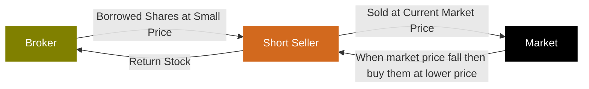

金融计算期末复习+总结，应付考试集大成之作。（悲


题图：凉前辈教你量化金融！由ChatGPT-Image2生成。

# Table of Contents

<!-- toc -->

- [What is Algo-Trading?](#what-is-algo-trading)
  * [Types](#types)
    + [👉Exercise1👈](#%F0%9F%91%89exercise1%F0%9F%91%88)
  * [Terminology](#terminology)
    + [Long and short position](#long-and-short-position)
    + [Short-selling](#short-selling)
    + [Order book](#order-book)
    + [Bid price, ask price](#bid-price-ask-price)
    + [Market spread ⭐️](#market-spread-%E2%AD%90%EF%B8%8F)
    + [Order types](#order-types)
    + [Slippage](#slippage)
    + [Mark-to-market](#mark-to-market)
    + [Trading system - Order Management System (OMS)](#trading-system---order-management-system-oms)
    + [Margin & leverage](#margin--leverage)
    + [👉Exercise2👈](#%F0%9F%91%89exercise2%F0%9F%91%88)
    + [👉Takeaway1👈](#%F0%9F%91%89takeaway1%F0%9F%91%88)
- [Data Scrapy](#data-scrapy)
  * [👉Exercise3👈](#%F0%9F%91%89exercise3%F0%9F%91%88)
  * [👉Takeaway2👈](#%F0%9F%91%89takeaway2%F0%9F%91%88)
- [Database](#database)
  * [👉Exercise4👈](#%F0%9F%91%89exercise4%F0%9F%91%88)
- [Backtesting](#backtesting)
  * [Key Procedures](#key-procedures)
  * [Lifecycle](#lifecycle)
  * [Pitfalls](#pitfalls)
  * [👉Exercise5👈](#%F0%9F%91%89exercise5%F0%9F%91%88)
  * [👉Takeaway3👈](#%F0%9F%91%89takeaway3%F0%9F%91%88)
- [Candlestick - K线](#candlestick---k%E7%BA%BF)
  * [Patterns](#patterns)
  * [👉Exercise6👈](#%F0%9F%91%89exercise6%F0%9F%91%88)
  * [👉Takeaway4👈](#%F0%9F%91%89takeaway4%F0%9F%91%88)
- [Moving Average](#moving-average)
  * [Simple Moving Average (SMA)](#simple-moving-average-sma)
  * [Exponential Moving Average (EMA) ⭐️](#exponential-moving-average-ema-%E2%AD%90%EF%B8%8F)
  * [MA Cross Strategy](#ma-cross-strategy)
  * [👉Exercise7👈](#%F0%9F%91%89exercise7%F0%9F%91%88)
  * [👉Takeaway5👈](#%F0%9F%91%89takeaway5%F0%9F%91%88)
- [Relative Strength Index - RSI](#relative-strength-index---rsi)
  * [Definition](#definition)
  * [RSI Trading Logic](#rsi-trading-logic)
  * [Questionned](#questionned)
- [Market Classification](#market-classification)
- [Statistical Time Series Analysis](#statistical-time-series-analysis)
  * [Simple Linear Regression ⭐️](#simple-linear-regression-%E2%AD%90%EF%B8%8F)
    + [Parameter Estimation ⭐️](#parameter-estimation-%E2%AD%90%EF%B8%8F)
    + [Model Effectiveness ⭐️⭐️](#model-effectiveness-%E2%AD%90%EF%B8%8F%E2%AD%90%EF%B8%8F)
  * [Multiple Linear Regression](#multiple-linear-regression)
    + [Least Square Estimation of $$\beta$$](#least-square-estimation-of-beta)
    + [Distribution of $$\beta$$](#distribution-of-beta)
    + [Determine if a factor is significant](#determine-if-a-factor-is-significant)
    + [Guidelines for choosing factors](#guidelines-for-choosing-factors)
  * [👉Exercise8👈](#%F0%9F%91%89exercise8%F0%9F%91%88)
  * [👉Takeaway6👈](#%F0%9F%91%89takeaway6%F0%9F%91%88)
  * [Auto Regressive Integrated Moving Average - ARIMA ⭐️](#auto-regressive-integrated-moving-average---arima-%E2%AD%90%EF%B8%8F)
    + [Parameter Estimation](#parameter-estimation)
      - [AR model](#ar-model)
      - [MA model](#ma-model)
    + [Unit Root](#unit-root)
    + [Random Walk Process](#random-walk-process)
    + [Augmented Dickey Fuller (ADF) Test ⭐️](#augmented-dickey-fuller-adf-test-%E2%AD%90%EF%B8%8F)
    + [Stationarity](#stationarity)
  * [👉Exercise9👈](#%F0%9F%91%89exercise9%F0%9F%91%88)
  * [👉Takeaway7👈](#%F0%9F%91%89takeaway7%F0%9F%91%88)
  * [Hurst Exponent ⭐️](#hurst-exponent-%E2%AD%90%EF%B8%8F)
    + [Variance Ratio Test](#variance-ratio-test)
    + [Mean Reversion](#mean-reversion)
    + [Parameter Estimation](#parameter-estimation-1)
  * [👉Exercise10👈](#%F0%9F%91%89exercise10%F0%9F%91%88)
  * [👉Takeaway8👈](#%F0%9F%91%89takeaway8%F0%9F%91%88)
  * [Martingale Strategy - For random walk market](#martingale-strategy---for-random-walk-market)
  * [👉Exercise11👈](#%F0%9F%91%89exercise11%F0%9F%91%88)
- [Statistical Arbitrage](#statistical-arbitrage)
  * [👉Exercise12👈](#%F0%9F%91%89exercise12%F0%9F%91%88)
- [Pairs Trading](#pairs-trading)
  * [Cointegration](#cointegration)
  * [Cointegrated Augmented Dickey Fuller Test (CADF)](#cointegrated-augmented-dickey-fuller-test-cadf)
  * [Vector Error Correction Model (VECM)](#vector-error-correction-model-vecm)
  * [Johansen Test for Cointegration](#johansen-test-for-cointegration)
  * [Cointegration vs Correlation](#cointegration-vs-correlation)
  * [👉Exercise13👈](#%F0%9F%91%89exercise13%F0%9F%91%88)
  * [👉Takeaway9👈](#%F0%9F%91%89takeaway9%F0%9F%91%88)
    + [知识梳理](#%E7%9F%A5%E8%AF%86%E6%A2%B3%E7%90%86)
    + [1. 配对交易（Pairs Trading）](#1-%E9%85%8D%E5%AF%B9%E4%BA%A4%E6%98%93pairs-trading)
    + [2. 协整（Cointegration）](#2-%E5%8D%8F%E6%95%B4cointegration)
    + [3. 协整增广迪基-富勒检验（CADF）](#3-%E5%8D%8F%E6%95%B4%E5%A2%9E%E5%B9%BF%E8%BF%AA%E5%9F%BA-%E5%AF%8C%E5%8B%92%E6%A3%80%E9%AA%8Ccadf)
    + [4. 向量误差修正模型（VECM）](#4-%E5%90%91%E9%87%8F%E8%AF%AF%E5%B7%AE%E4%BF%AE%E6%AD%A3%E6%A8%A1%E5%9E%8Bvecm)
    + [5. Johansen协整检验](#5-johansen%E5%8D%8F%E6%95%B4%E6%A3%80%E9%AA%8C)
    + [6. 协整与相关性的对比](#6-%E5%8D%8F%E6%95%B4%E4%B8%8E%E7%9B%B8%E5%85%B3%E6%80%A7%E7%9A%84%E5%AF%B9%E6%AF%94)
    + [总结](#%E6%80%BB%E7%BB%93)
    + [考点速记](#%E8%80%83%E7%82%B9%E9%80%9F%E8%AE%B0)
- [Foreign Exchange - FX](#foreign-exchange---fx)
  * [Currency Peg](#currency-peg)
  * [👉Exercise14👈](#%F0%9F%91%89exercise14%F0%9F%91%88)
  * [👉Takeaway10👈](#%F0%9F%91%89takeaway10%F0%9F%91%88)
- [Risk](#risk)
  * [Risk Management Cycle](#risk-management-cycle)
  * [Risk Identification ⭐️](#risk-identification-%E2%AD%90%EF%B8%8F)
    + [Market Risk](#market-risk)
    + [Interest Rate Risk](#interest-rate-risk)
    + [Credit Risk](#credit-risk)
    + [Liquidity Risk](#liquidity-risk)
    + [👉Exercise15👈](#%F0%9F%91%89exercise15%F0%9F%91%88)
    + [👉Takeaway11👈](#%F0%9F%91%89takeaway11%F0%9F%91%88)
  * [Risk Assessment / Measurement](#risk-assessment--measurement)
    + [Volatility Analysis - Historical Estimates](#volatility-analysis---historical-estimates)
    + [Exponentially Weighted Moving Averages - EWMA ⭐️](#exponentially-weighted-moving-averages---ewma-%E2%AD%90%EF%B8%8F)
  * [👉Exercise16👈](#%F0%9F%91%89exercise16%F0%9F%91%88)
  * [👉Takeaway12👈](#%F0%9F%91%89takeaway12%F0%9F%91%88)
    + [Autoregressive Conditional Heteroskedasticity - ARCH ⭐️⭐️](#autoregressive-conditional-heteroskedasticity---arch-%E2%AD%90%EF%B8%8F%E2%AD%90%EF%B8%8F)
      - [ARCH(1)](#arch1)
      - [ARCH(m)](#archm)
      - [Lagrange multiplier test](#lagrange-multiplier-test)
      - [model](#model)
  * [👉Exercise17👈](#%F0%9F%91%89exercise17%F0%9F%91%88)
  * [👉Takeaway13👈](#%F0%9F%91%89takeaway13%F0%9F%91%88)
    + [Generalized Autoregressive Conditional Heteroskedasticity - GARCH ⭐️⭐️](#generalized-autoregressive-conditional-heteroskedasticity---garch-%E2%AD%90%EF%B8%8F%E2%AD%90%EF%B8%8F)
      - [GARCH(1,1)](#garch11)
      - [forecast](#forecast)
      - [Summary of ARCH / GARCH](#summary-of-arch--garch)
  * [👉Exercise18👈](#%F0%9F%91%89exercise18%F0%9F%91%88)
  * [👉Takeaway14👈](#%F0%9F%91%89takeaway14%F0%9F%91%88)
    + [Value at Risk (VaR) ⭐️⭐️](#value-at-risk-var-%E2%AD%90%EF%B8%8F%E2%AD%90%EF%B8%8F)
  * [👉Exercise19👈](#%F0%9F%91%89exercise19%F0%9F%91%88)
    + [VaR Estimation Method](#var-estimation-method)
      - [Parametric VaR](#parametric-var)
  * [👉Exercise20👈](#%F0%9F%91%89exercise20%F0%9F%91%88)
      - [Historical VaR](#historical-var)
      - [Stress VaR](#stress-var)
      - [Hypothetical VaR](#hypothetical-var)
      - [Monte Carlo Simulation](#monte-carlo-simulation)
      - [Limitation](#limitation)
    + [Other Risk Measures](#other-risk-measures)
  * [👉Exercise21👈](#%F0%9F%91%89exercise21%F0%9F%91%88)
  * [👉Takeaway15👈](#%F0%9F%91%89takeaway15%F0%9F%91%88)
    + [Scenario Analysis](#scenario-analysis)
  * [Capital Management - Position Sizing](#capital-management---position-sizing)
    + [Fixed Sized](#fixed-sized)
    + [Balance Rescaling](#balance-rescaling)
    + [Dollar Risk Approach](#dollar-risk-approach)
    + [Kelly Criterion](#kelly-criterion)
      - [Utility Function U(W)](#utility-function-uw)
      - [Assumptions](#assumptions)
      - [Enhancement](#enhancement)
  * [👉Exercise22👈](#%F0%9F%91%89exercise22%F0%9F%91%88)
  * [👉Takeaway16👈](#%F0%9F%91%89takeaway16%F0%9F%91%88)
- [Portfolio](#portfolio)
  * [👉Exercise23👈](#%F0%9F%91%89exercise23%F0%9F%91%88)
    + [method1](#method1)
    + [method2](#method2)
  * [2 assets Portfolio](#2-assets-portfolio)
    + [Correlation Effect](#correlation-effect)
    + [Minimum Variance Portfolio](#minimum-variance-portfolio)
    + [Efficient Frontier](#efficient-frontier)
  * [N assets](#n-assets)
    + [Global Minimum Variance Portfolio](#global-minimum-variance-portfolio)
    + [Efficient Frontier](#efficient-frontier-1)
  * [Tangency Portfolio](#tangency-portfolio)
    + [Deriving](#deriving)
  * [👉Exercise24👈 ⭐️⭐️⭐️](#%F0%9F%91%89exercise24%F0%9F%91%88-%E2%AD%90%EF%B8%8F%E2%AD%90%EF%B8%8F%E2%AD%90%EF%B8%8F)
    + [Answer A](#answer-a)
    + [Answer B](#answer-b)
    + [Answer C](#answer-c)
  * [👉Takeaway17👈](#%F0%9F%91%89takeaway17%F0%9F%91%88)
- [Capital Asset Pricing Model (CAPM)](#capital-asset-pricing-model-capm)
  * [Market Portfolio](#market-portfolio)
  * [Assumptions](#assumptions-1)
  * [Capital Market Line (CML)](#capital-market-line-cml)
  * [Deriving CAPM (Sharpe’s Approach)](#deriving-capm-sharpes-approach)
  * [Security Market Line (SML)](#security-market-line-sml)
  * [Non-systematic risk](#non-systematic-risk)
  * [The Beta Coefficient](#the-beta-coefficient)
  * [👉Exercise25👈](#%F0%9F%91%89exercise25%F0%9F%91%88)
  * [👉Takeaway18👈](#%F0%9F%91%89takeaway18%F0%9F%91%88)
- [Performance Measures ⭐️⭐️](#performance-measures-%E2%AD%90%EF%B8%8F%E2%AD%90%EF%B8%8F)
  * [Sharpe Ratio](#sharpe-ratio)
  * [👉Exercise26👈](#%F0%9F%91%89exercise26%F0%9F%91%88)
  * [Sortino Ratio](#sortino-ratio)
  * [👉Exercise27👈](#%F0%9F%91%89exercise27%F0%9F%91%88)
  * [Treynor Ratio](#treynor-ratio)
  * [👉Exercise28👈](#%F0%9F%91%89exercise28%F0%9F%91%88)
  * [Jensen’s Alpha](#jensens-alpha)
  * [👉Exercise29👈](#%F0%9F%91%89exercise29%F0%9F%91%88)
  * [Comparison](#comparison)
  * [Information Ratio](#information-ratio)
  * [Maximum Drawdown](#maximum-drawdown)
  * [Calmar Ratio](#calmar-ratio)
  * [👉Exercise30👈](#%F0%9F%91%89exercise30%F0%9F%91%88)
  * [Choosing an Appropriate Measure](#choosing-an-appropriate-measure)
  * [Inclusion of a new asset](#inclusion-of-a-new-asset)
  * [👉Exercise31👈](#%F0%9F%91%89exercise31%F0%9F%91%88)
  * [👉Takeaway19👈](#%F0%9F%91%89takeaway19%F0%9F%91%88)
- [Stop Loss](#stop-loss)
  * [Fixed Stop Loss](#fixed-stop-loss)
  * [Trailing Stop Loss](#trailing-stop-loss)
  * [Portfolio level Stop Loss](#portfolio-level-stop-loss)
- [Risk Limit Control](#risk-limit-control)
- [Order Book](#order-book)
- [Market Impact (不是Genshin Impact)](#market-impact-%E4%B8%8D%E6%98%AFgenshin-impact)
  * [Order Splitting](#order-splitting)
  * [Use of Limit Orders](#use-of-limit-orders)
  * [Time-weighted Average Price (TWAP)](#time-weighted-average-price-twap)
  * [Volume-weighted Average Price (VWAP)](#volume-weighted-average-price-vwap)
- [Queuing Theory](#queuing-theory)
  * [M/M/1 Queue](#mm1-queue)
  * [👉Exercise32👈](#%F0%9F%91%89exercise32%F0%9F%91%88)
  * [Remarks](#remarks)
  * [Key Assumptions](#key-assumptions)
  * [Trading Strategies](#trading-strategies)
  * [Limitations](#limitations)
- [High Frequency Trading](#high-frequency-trading)
  * [Co-location](#co-location)
  * [Latency Arbitrage](#latency-arbitrage)
  * [Common Strategy](#common-strategy)
  * [HFT: Is it worth?](#hft-is-it-worth)
- [Arbitrage](#arbitrage)
  * [Types](#types-1)
  * [Triangular Arbitrage](#triangular-arbitrage)
  * [Polygonal Arbitrage](#polygonal-arbitrage)
  * [Computational Complexity](#computational-complexity)
  * [Important Notes](#important-notes)
  * [Can you execute in real market?](#can-you-execute-in-real-market)
  * [Conclusion](#conclusion)
- [Market Making](#market-making)
  * [Liquidity Providing](#liquidity-providing)
  * [Strategy](#strategy)
  * [Conclusion](#conclusion-1)
- [Strategy Optimization](#strategy-optimization)
  * [Brute force search / Grid search](#brute-force-search--grid-search)
  * [Gradient descent](#gradient-descent)
  * [Genetic algorithm](#genetic-algorithm)
  * [Optimal vs Robust Solution](#optimal-vs-robust-solution)
- [Investment Funds](#investment-funds)
  * [Exchange-Traded Funds (ETFs)](#exchange-traded-funds-etfs)
  * [Mutual Funds](#mutual-funds)
    + [Differences Between ETFs and Mutual Funds](#differences-between-etfs-and-mutual-funds)
  * [Money Market Funds](#money-market-funds)
  * [Private Equity Funds](#private-equity-funds)
  * [Hedge Funds](#hedge-funds)
  * [summary](#summary)
  * [The secret behind](#the-secret-behind)
- [Broker Selection](#broker-selection)
- [Proof-Of-Reserves (PoR)](#proof-of-reserves-por)
  * [Merkle Tree](#merkle-tree)
- [Market Tricks](#market-tricks)
  * [Misleading metrics](#misleading-metrics)
    + [Example](#example)
  * [Selective presentation of data](#selective-presentation-of-data)
  * [Psychological manipulation](#psychological-manipulation)
  * [Conclusion & Advices](#conclusion--advices)
  * [👉Exercise33👈](#%F0%9F%91%89exercise33%F0%9F%91%88)
- [Machine Learning](#machine-learning)
  * [👉Exercise34👈](#%F0%9F%91%89exercise34%F0%9F%91%88)
  * [👉Exercise👈](#%F0%9F%91%89exercise%F0%9F%91%88)
  * [👉Takeaway👈](#%F0%9F%91%89takeaway%F0%9F%91%88)

<!-- tocstop -->


-----------


# What is Algo-Trading?

* Algorithmic trading, also called Algo Trading, Quant Trading, RoboTrading, Program Trading
* Use of mathematical models and computer algorithms/programs to
  * generate trading signals (i.e. Decision making)
  * automate trading process (i.e. Execution)
* Objectives:
  * maximize profits
  * control execution costs
  * hedging and manage investment risks

## Types

|  | Human Trading | Robo-Advisory | Robo-Trading |
|:-:|:-:|:-:|:-:|
| Working Hours | ~9*5 | ~9*5 | 24*7 |
| Execution Speed | Slow | Moderate | Immediately |
| Data Inputs | Limited | Almost unlimited | Almost unlimited |
| Trading Frequency | Low | Low - mid | Low – High |
| Scalability | Limited investment size due to stress | Moderate | High |
| Accuracy/ Discipline | Variable especially when you lose | Consistent | High |
| Customization | High | Medium | Low |
| User Control | Full | Partial | Minimal |
| Risk Management | Subjective | Algorithmic | Algorithmic |

* 从时间间隔分类Time Frames:
  * Long Term: Months to Years
  * Short Term: Days, Weeks, Months
  * Intraday: Seconds to Hours
  * High frequency: Fractions of Seconds

### 👉Exercise1👈

* In comparing human trading, robo-advisory, and robo-trading, which of the following statements provides the most accurate insight regarding the scalability and risk management approaches of each trading method? **E**
  * A. Human trading is the most scalable due to its ability to adapt strategies based on market conditions, while robo-advisory relies on limited data inputs, making it less scalable.
  * B. Both human trading and robo-advisory exhibit high scalability due to personalized strategies, while robo-trading has limited scalability because it follows predefined algorithms.
  * C. Human trading is characterized by algorithmic risk management, whereas robo-advisory and robo-trading rely solely on subjective risk assessments.
  * D. Robo-advisory systems provide the highest level of customization in risk management compared to human trading and robo-trading, which both follow rigid frameworks.
  * **E. Robo-trading offers the highest scalability due to its continuous operation and algorithmic risk management, while human trading struggles with scalability due to emotional factors.**

## Terminology

1. Long and short position
2. Short-selling
3. Order book
4. Bid price, ask price
5. Market spread
6. Order types
7. Slippage
8. Mark-to-market
9. Trading system
10. Margin & leverage

### Long and short position

* Long position 多头头寸
  * Definition: Buying an asset with the expectation that its price will rise. 买入资产并预期其价格上涨。
  * Goal: Sell at a higher price to realize a profit. 以更高价格出售以实现盈利。
  * Example: Buying 100 shares of a stock at $50, selling when it reaches $70. 以50美元的价格购买100股股票，当股价达到70美元时卖出。

* Short Position 空头头寸
  * Definition: Selling an asset that you do not own, with the intention of buying it back later at a lower price. 出售你不拥有的资产，意图在日后以更低的价格买回。
  * Goal: Profit from a decline in the asset's price. 从资产价格下跌中获利。
  * Example: Selling 100 shares of a stock at $70, buying back at $50. 以70美元的价格卖出100股股票，再以50美元的价格回购。

### Short-selling

* How Short-Selling Works（有三个人：broker负责借出股、short seller负责买卖和归还、market）
  * Borrowing Shares: Obtain shares from a broker to sell. 借股：从经纪人处获取股票以进行出售。
  * Selling the Borrowed Shares: Sell the shares at the current market price. 出售借入股票：以当前市场价格出售股票。
  * Buying Back Shares: Later, buy the same number of shares at a lower price. 回购股票：稍后，以较低的价格购回相同数量的股票。
  * Returning Shares: Return the borrowed shares to the broker. 归还股票：将借用的股票归还给经纪人。



* Risks of Short-Selling
  * Unlimited Loss Potential: If the asset price rises significantly.
  * Margin Calls: Brokers may require additional funds if the trade goes against you.
  * Regulatory Risks: Short-selling can be subject to restrictions.


### Order book

* The Order Book is a real-time, continually updating list of buy and sell orders for a specific financial instrument, sorted by price level. 订单簿是特定金融工具的实时、持续更新的买卖订单列表，按价格水平排序。
* Key components
  * **Ask** Book: the list/queue for sellers 询价簿：**卖家**的列表/队列
  * **Bid** Book: the list/queue for buyers 报价簿：**买家**的列表/队列
  * Price: The price points at which investors are willing to trade 价格：投资者愿意交易的价格点
  * Size: The number of shares, contracts, or lots that traders want to buy or sell 规模：交易者想要买入或卖出的股票、合约或批次的数目
* Order Ledger 订单账簿
  * The order book is listed in a sorted price ledger, which can be ascending or descending. 订单簿列在已排序的价格账簿中，可以是升序或降序。
  * The longer the price ledger is, the more liquidity an instrument provides. It is also called "market depth". 价格账本越长，金融工具提供的流动性就越多。这也被称为“市场深度”。
* Top of the Book 报价簿顶部
  * The order book is separated into bid-book and ask-book 报价簿分为买入报价簿和卖出报价簿
  * Bid orders are sorted in descending price 买入报价按价格从高到低排序
  * Ask orders are sorted in ascending price 卖出报价按价格从低到高排序
  * The highest bid and the lowest ask are referred to "the top of the book" 最高买入价和最低卖出价统称为“报价簿顶部”
* Cumulative Book 累计报价簿
  * For each of the bid and ask book, order size accumulates from the top of the book. 对于买入报价簿和卖出报价簿，订单规模从报价簿顶部开始累计。

### Bid price, ask price

* Bid Price & Bid Size
  * Bid price is the highest price that a buyer (bidder) is willing to pay for a particular security.
  * Bid size represents the quantity a buyer is willing to purchase at the bid price.
  * The top price and size in a bid order book.
  * For example, if a buyer bids $207.01 x 3000 for a stock, it means they are willing to buy 3000 shares for not more than $207.01

* Ask Price & Ask Size
  * Ask price is the lowest price a seller is willing to accept for a security.
  * Ask size represents the quantity a seller is willing to sell at the ask price.
  * The top price and size in an ask order book.
  * For example, if a seller asks $209.94 x 200 for a stock, it implies they are willing to sell 200 shares for not less than $209.94

* 买入价与买入规模
  * 买入价是指买方（竞标者）愿意为特定证券支付的最高价格。
  * 买盘规模表示买方愿意以买盘价格购买的数量。
  * 竞价订单簿中的最高价格和最大规模。
  * 例如，如果买家对某只股票出价207.01美元x3000，这意味着他们愿意以不超过207.01美元的价格购买3000股

* 卖价与卖盘量
  * 卖价是指卖方愿意接受的证券最低价格。
  * 卖方报价量表示卖方愿意以报价价格出售的数量。
  * 卖盘簿中的最高价格和最大规模。
  * 例如，如果卖家为某只股票报价209.94美元×200股，这意味着他们愿意以不低于209.94美元的价格出售200股

### Market spread ⭐️

* The difference between the bid price and the ask price is known as the bid-ask spread.
* The bid-ask spread is a key measure of the **liquidity** of an asset or security.
* A **smaller** spread indicates a **more liquid** market, while a larger spread indicates a less liquid market.
* Percentage Spread
  * Percentage spread is often used for comparing the spread between different instruments
  * $$Percentage Spread = \frac{AskPrice - BidPrice}{MidPrice} = \frac{2\times(AskPrice - BidPrice)}{AskPrice + BidPrice}$$
* For example, if the bid price for a stock is $24 and the ask price is $25, the bid-ask spread will be $1, the percentage spread will be 4.08%.

### Order types

* Market Order
  * A market order is to buy or sell at the best available price in the current market.
  * That is, when opening a buy (sell) position using market order, it will try to execute at the best ask (bid) price.
  * A market order typically ensures an execution, but it does not guarantee a specified price. It is appropriate to use market orders when you want an immediate execution.

* 市价单
  * 市价单是指以当前市场上的最佳可用价格进行买入或卖出。
  * 即，当使用市价单开立买入（卖出）头寸时，系统会尝试以最佳卖价（买价）执行。
  * 市价单通常能确保交易执行，但不保证执行价格。当您希望立即执行交易时，使用市价单是合适的。

* Limit Order
  * A limit order is to buy or sell with a condition on the maximum price to pay or the minimum price to receive (the "limit price").
  * If the order is filled, it will only be at the specified limit price or better. However, there is no guarantee of execution.
  * A limit order may be appropriate when you think you can buy at a price lower than (or sell at a price higher than) the current market quote.
  * Example
    * The last trade price is roughly $138
    * investor who wants to buy (or sell) immediately would place a market order, which would be executed at or near the current price of $138 (white line) provided that the market was open.
    * investor who wants to buy the stock when it dropped to $131.78 would place a buy limit order with a limit price of $131.78 (green line). If the price falls to $131.78 or lower, the limit order would be triggered and executed at $131.78 or below. If the stock doesn't drop to $131.78 or below, no execution would occur.
    * investor who wants to sell the stock when it reached $143.82 would place a sell limit order with a limit price of $143.82 (red line). If the price rises to $143.82 or higher, the limit order would be triggered and executed at $143.82 or above. If the stock doesn't rise to $143.82 or above, no execution would occur.

* 限价单
  * 限价单是指以设定的最高支付价格或最低接收价格为条件进行买入或卖出（“限价”）。
  * 若订单成交，则仅以指定的限价或更优价格成交。然而，无法保证订单一定能执行。
  * 当你认为你能以低于当前市场报价的价格买入（或以高于当前市场报价的价格卖出）时，限价单可能是合适的。
  * 示例
    * 最新交易价格约为138美元
    * 想要立即买入（或卖出）的投资者会下达市价单，只要市场开放，该订单就会以当前价格138美元（白线）或接近该价格的价格执行。
    * 投资者若想在股价跌至131.78美元时买入股票，则会设置一个限价委托，将限价设为131.78美元（绿线）。如果股价跌至131.78美元或更低，则限价委托将被触发并以131.78美元或更低的价格执行。如果股价未跌至131.78美元或更低，则不会执行委托。
    * 投资者若想在股价达到143.82美元时卖出股票，则会设置一个限价卖出订单，限价为143.82美元（红线）。如果股价上涨至143.82美元或以上，限价订单将被触发并以143.82美元或以上的价格执行。如果股价未上涨至143.82美元或以上，则不会执行订单。

* Stop Order
  * A stop order is to buy or sell at the market price when it has traded at or through a specified price (the "stop price").
  * If the stock reaches the stop price, the order becomes a market order and is filled at the next available market price. If it doesn't reach the stop price, the order will not be executed.
  * A stop order may be appropriate in these scenarios:
    * you want to buy when a stock breaks out above a certain level, and believe that it will continue the trend
    * your holding stock has risen a lot and you want to protect the gain when it begins to fall
  * Example
    * The stop buy order will trigger when the price reaches 143.82 or above, and will execute as a market order at that current price.
    * Thus, if the price rise further after hitting the stop price, it is possible that the order could be executed at a price higher than the stop price.
    * Similarly for the stop sell order, once the stop price of $131.78 is reached, the order could be executed at a lower price

* 止损单
  * 止损单是指在市场价格达到或穿过指定价格（即“止损价”）时，以市场价格买入或卖出。
  * 如果股票价格达到止损价，订单将变为市价单，并以下一个可用的市场价格成交。如果未达到止损价，订单将不会被执行。
  * 在以下情况下，止损单可能适用：
    * 当股票突破某一水平时，您希望买入，并认为其趋势会持续
    * 您的持仓股票已大幅上涨，而您希望在股价开始下跌时保护收益
  * 示例
    * 当价格达到143.82或以上时，止损买入单将被触发，并以当前价格作为市价单执行。
    * 因此，若价格在触及止损价后进一步上涨，订单可能会以高于止损价的价格执行。
    * 同样，对于止损卖单，一旦达到131.78美元的止损价格，订单可能会以更低的价格执行


### Slippage

* Slippage refers to the difference between the expected execution price and the price it actually traded
* It often occurs
  * during periods of higher volatility when market orders are used
  * when large orders are executed when market depth is not sufficient to maintain the expected price of trade
* Example
  * Let's assume you have an algorithm set to buy a stock when the price drops to $50. The algorithm detects the price drop and places a buy order.
  * However, due to high demand or low liquidity, the order gets executed at $51. This $1 difference is the slippage.
  * This means that even if you were expecting to spend $5000 on 100 shares, you would end up spending $5100. The $100 is the cost of slippage

* 滑点是指预期执行价格与实际交易价格之间的差异。
* 它通常发生在
  * 使用市价单时波动性较高的时期；
  * 当市场深度不足以维持预期交易价格时执行大额订单。
* 示例
  * 假设您设置了一个算法，当股价跌至50美元时买入股票。算法检测到股价下跌并发出买入订单。
  * 然而，由于需求高涨或流动性较低，订单以51美元的价格执行。这1美元的差价就是滑点。
  * 这意味着，即使你原本预计花费5000美元购买100股，最终也会花费5100美元。这100美元就是滑点成本


### Mark-to-market

* Entry: Based on a trade signal, generate order to go short or long a certain financial instrument in a certain quantity. Trade results in a certain position in this security
* Mark-to-Market: As the price of the security changes, so does your unrealized PnL
  * For long order: $$PnL=Quantity\times(P_{bid}-P_{entry})$$.
  * For short order: $$PnL=-1\times Quantity\times(P_{ask}-P_{entry})$$.
* Exit: Generate order to exit the position and create a realized PnL
  * $$PnL=Side\times Quantity\times(P_{exit}-P_{entry})$$
* It is an accounting method to calculate the asset or portfolio value according to its current market value, rather than its book value
* It involves determining the price at which you could immediately sell an asset or close a position
* Example:
  * Suppose you purchase 100 shares of ABC stock
  * The current bid and ask price of ABC are $9.5 and $10.5
  * Mark-to-market value of your stock will be 100*$9.5 = $9500

* 入场：基于交易信号，生成指令以特定数量做空或做多某种金融工具。交易结果为该证券的特定持仓 
* 逐日结算：随着证券价格的变化，未实现损益也会相应变化
  * 对于多头订单：$$PnL=Quantity\times(P_{bid}-P_{entry})$$。
  * 对于短线订单：$$PnL=-1\times 数量\times(P_{ask}-P_{entry})$$。
* 出场：生成离场指令并计算已实现损益
  * $$PnL=持仓方向\times 数量\times(P_{出场}-P_{入场})$$ 
* 这是一种根据资产或投资组合的当前市场价值而非账面价值来计算其价值的会计方法
* 它涉及确定您能立即卖出资产或平仓的价格
* 示例：
  * 假设您购买了100股ABC股票
  * ABC股票的当前买入价和卖出价分别为9.5美元和10.5美元
  * 您股票的市值将达到100*$9.5 = 9500美元

### Trading system - Order Management System (OMS)

* Order based system
  * Transactions are managed in a round order manner
  * Partial close is not supported
  * Trading platforms: MetaTrader, TradingView, MetaStock, etc
* Position based system
  * Transactions are independent and no linkage with each other
  * Partial close is allowed
  * Trading Platforms
    * Most of the banks (eg. HSBC, SBC, BOC, etc)
    * Interactive Brokers, Binance, etc
* Example
  * Suppose you open 3 offsetting trades: #1: buy 2 shares of ABC at $123 #2: sell 1 share of ABC at $124 #3: sell 1 share of ABC at $125
  * For order based system, the unrealized PnL will be 2\*(bid - 123) + 1\*(124 - ask) + 1\*(125 - ask) = $3 + 2\*(bid - ask). You need to close all the 3 trades to realize the PnL.
  * For position based system, the orders will be offsetted based on FIFO, and PL will become realized so long as the position is net to zero. Thus, your PnL will be realized at $3.

* 基于订单的系统
  * 交易以轮次顺序管理
  * 不支持部分平仓
  * 交易平台MetaTrader、TradingView、MetaStock等
* 基于持仓的系统
  * 交易独立进行，彼此之间无关联
  * 允许部分平仓
  * 交易平台
    * 大多数银行（如汇丰银行、渣打银行、中国银行等）
    * 盈透证券、币安等
* 示例
  * 假设您开立了3笔对冲交易：#1：以123美元买入2股ABC股票 #2：以124美元卖出1股ABC股票 #3：以125美元卖出1股ABC股票
  * 对于基于订单的系统，未实现的盈亏将是2\*(买入价 - 123) + 1\*(124 - 卖出价) + 1\*(125 - 卖出价) = 3美元 + 2\*(买入价 - 卖出价)。您需要平掉所有3笔交易以实现盈亏。
  * 对于基于头寸的系统，订单将根据先进先出（FIFO）原则进行抵消，只要头寸净值为零，损益（PL）就会实现。因此，您的损益（PnL）将在3美元时实现。


### Margin & leverage

* Leverage refers to using borrowed capital as a funding source for investment to increase the potential return: $$Leverage Ratio=\frac{Asset}{Equity}=1+\frac{Debt}{Equity}$$.
* Margin is a way to create leverage: $$Margin Amount=(Account Asset Value)-(Borrowed Amount)=Equity held at broker$$.
  * There are 2 market quotations for margin requirement
    * Fixed Margin Amount: Mostly used by stock exchanges
    * Margin as a percentage: Mostly used by FX/Crypto exchanges
* As HSI Index Future has a price magnifier of 50, meaning that 1 index point change will lead to ±HK$50. Suppose current HSI Index Future price is 25000, and buying 1 lot of HSI Index Future require HK$116,774 as margin. Then, leverage ratio is calculated to be ($25000*50)/$116,774 = 10.7044
* Suppose you pay $600,000 to get stocks worth $1,000,000. Thus, leverage ratio is calculated to be $1,000,000/$600,000 = 1.6667
* As you can imagine, the lower is the margin requirement, the higher is the leverage ratio. In general, $$Leverage Ratio=\frac{1}{Margin Requirement}$$.
* Buying Power
  * For leveraged trading where traders can take out a loan based on the amount of cash held in their broker account, buying power refers to the amount of money available for investors to purchase securities. Mathematically, $$Buying Power = Leverage Ratio \times Investor's Equity$$.
  * For example, suppose an investor made an initial deposit US$100,000 to a 20:1 leveraged broker account. Then, the investor would be able to purchase, at maximum, US$2,000,000 worth of securities. Hence, a buying power of US$2,000,000

* 杠杆是指利用借入资本作为投资资金来源以增加潜在回报：$$杠杆率=\frac{资产}{权益}=1+\frac{债务}{权益}$$。
* 保证金是一种创造杠杆的方式：$$保证金金额=(账户资产价值)-(借款金额)=在经纪商处持有的净值$$。
  * 保证金要求有两种市场报价方式：
    * 固定保证金金额：主要由股票交易所使用
    * 保证金百分比：主要由外汇/加密货币交易所使用
* 由于恒生指数期货的价格放大器为50，即指数点数的变动将导致±50港元。假设当前恒生指数期货价格为25000，购买1手恒生指数期货需要116,774港元作为保证金。那么，杠杆率计算为($25000*50)/$116,774 = 10.7044
* 假设你支付60万美元购买价值100万美元的股票。因此，杠杆率计算为$1,000,000/$600,000 = 1.6667
* 你可以想象，保证金要求越低，杠杆率就越高。一般来说，杠杆率=1/保证金要求。
* 购买力
  * 在杠杆交易中，交易者可以根据其经纪账户中的现金金额申请贷款，购买力是指投资者可用于购买证券的资金金额。从数学上讲，$$购买力 = 杠杆比率 \times 投资者权益$$。
  * 例如，假设投资者向一个杠杆比率为20:1的经纪账户存入10万美元的初始存款。那么，投资者最多能够购买价值200万美元的证券。因此，其购买力为200万美元

### 👉Exercise2👈

* What is one of the main disadvantages of using a market order? **C**
  * A) It guarantees the execution price
  * B) It may not be executed at all
  * **C) It can lead to slippage in volatile markets**
  * D) It requires a waiting period
  * E) It cannot be used for large orders

* What is a primary advantage of using a limit order? **B**
  * A) It guarantees immediate execution
  * **B) It allows for price control on the order execution**
  * C) It is always executed before market orders
  * D) It eliminates the risk of slippage
  * E) It can be used only for small orders

* What does the cumulative book represent? **C**
  * A) Historical trading volumes
  * B) Individual buy and sell orders
  * **C) Total quantities of orders at each price level**
  * D) The highest trading price of the day
  * E) The average liquidity of a market

* What does the "Top of the Book" refer to in trading? **B**
  * A) The total number of trades executed
  * **B) The highest bid and lowest ask prices**
  * C) The trading volume over time
  * D) The closing price of a stock
  * E) The most recent trades

* What information does the bid-ask spread in an order book indicate? **B**
  * A) The total number of shares traded in a day
  * **B) The difference between the highest bid and the lowest ask prices**
  * C) The average price of trades over a specified period
  * D) The total market capitalization of a stock
  * E) The time elapsed since the last trade

* What does a smaller bid-ask spread typically indicate? **C**
  * A) Increased trading costs
  * B) Higher market volatility
  * **C) Greater market liquidity**
  * D) Decreased trading activity
  * E) Lower investor interest

* Which of the following statements best describes the mechanics and risks associated with short-selling a stock? **B**
  * A) Short-selling involves buying shares with the expectation that the price will rise, allowing for a profit upon selling.
  * **B) In short-selling, an investor borrows shares from a broker to sell them at the current market price, aiming to buy them back later at a lower price.**
  * C) Short-sellers are guaranteed profits as long as they can find a buyer for the borrowed shares.
  * D) Short-selling is considered a low-risk strategy because the maximum loss is capped at the initial investment.
  * E) Regulations prohibit short-selling during periods of high market volatility to protect investors.

* Which of the following statements about short-selling in the stock market is the most accurate? **B**
  * A) Short-selling allows investors to profit from an increase in stock prices by borrowing shares.
  * **B) Short-selling involves borrowing shares and selling them with the expectation that the stock price will decline.**
  * C) Short-selling is only permitted for institutional investors and not for retail investors.
  * D) The losses from short-selling are limited to the initial investment made by the investor.
  * E) Short-selling has no impact on the overall market liquidity or stock prices.

* In an Order Management System (OMS), which statement most accurately highlights the distinction between an order-based system and a position-based system? **D**
  * A) An order-based system permits partial closures, whereas a position-based system does not.
  * B) In an order-based system, transactions are handled independently, while in a position based system, they follow a round order process.
  * C) An order-based system design is commonly adopted by banks.
  * **D) In an order-based system, transactions are processed in a round order and do not accommodate partial closures, while a position-based system enables independent transaction management and supports partial closures.**
  * E) Both systems function identically and exhibit no differences in transaction management.

* Which of the following statements accurately describes the relationship between leverage and margin in trading? **B**
  * A) Margin is the total amount of money a trader has in their account, while leverage is the amount borrowed from the broker.
  * **B) Higher leverage allows traders to control larger positions with less capital, increasing both potential profits and potential losses.**
  * C) Using high leverage eliminates the need for a margin requirement, as traders can trade without any capital.
  * D) Leverage can only be used in forex trading but is not applicable in stock trading.
  * E) Lower margin requirements always lead to higher leverage ratios, reducing the overall risk for traders.

* A trader is analyzing two stocks, Stock A and Stock B. The following bid and ask prices are observed: Stock A: Bid Price= $30, Ask Price= $32. Stock B: Bid Price= $25, Ask Price= $27. Calculate the percentage spread for both stocks and determine which stock has a better liquidity. **C**
  * A) Stock A: 6.45%, Stock B: 7.69%; Stock B has a better liquidity.
  * B) Stock A: 3.22%, Stock B: 3.85%; Stock A has a better liquidity.
  * **C) Stock A: 6.45%, Stock B: 7.69%; Stock A has a better liquidity.**
  * D) Stock A: 3.22%, Stock B: 3.85%; Stock B has a better liquidity.
  * E) Stock A: $2, Stock B: $2; Stock A and Stock B have the same liquidity.

$$A=\frac{2\times(AskPrice - BidPrice)}{AskPrice + BidPrice}=\frac{2\times(32-30)}{32+30}=6.45\%$$

$$B=\frac{2\times(AskPrice - BidPrice)}{AskPrice + BidPrice}=\frac{2\times(27-25)}{27+25}=7.69\%$$

$$A<B$$


### 👉Takeaway1👈

1. 交易类型有三种：人、机器辅助和机器自动。人最慢、最主观、规模最小、但是控制最高、定制最强。
2. 做空需要三个角色：broker负责借给short seller股权，short seller负责向market以当前价格出售股权，然后当股价下跌时回购，short seller此时将回购的股权还给broker。
3. bid-买-从高到低，ask-卖-从低到高
4. Order Ledger、Top of the Book、Cumulative Book的区别
5. spread必考一道计算题
6. Market Order、Limit Order、Stop Order的区别。Limit Order是期望的价格，不一定成交；Stop Order是Market Order穿过某一价格时以Market Order成交。
7. Market Order会造成slippage
8. Order based system和Position based system。Position based system是银行，允许Partial close


# Data Scrapy

## 👉Exercise3👈

* A data analyst is tasked with scraping stock data from a financial website using Python. The website has dynamic content that loads additional data upon scrolling. The analyst decides to use BeautifulSoup to extract the data. Which of the following approaches would likely yield the best results for scraping the desired information? **B**
  * A) Use BeautifulSoup alone to scrape the initial page, as it is sufficient for extracting static HTML content.
  * **B) Implement Selenium to automate scrolling and loading of dynamic content before passing the page source to BeautifulSoup for parsing.**
  * C) Use the requests library to fetch the page content, then manually parse the HTML using regex to extract the data.
  * D) Rely on the built-in scraping functionality of the financial website's API to retrieve the data without additional libraries.
  * E) Scrape the data using BeautifulSoup and then use a CSV library to write the data directly to a file without storing it in memory.

* A data analyst needs to scrape user reviews from an online trading forum using Python. The reviews are loaded dynamically as the user scrolls down the page. The scientist considers various libraries and techniques for the task. Which of the following strategies would be the most effective for scraping all available reviews? **C**
A) Use the requests library to fetch the initial HTML content, then parse it with BeautifulSoup, as it is sufficient to extract all reviews from the website.
B) Utilize BeautifulSoup to dynamically fetch the page content.
**C) Implement Selenium to simulate user scrolling, allowing all reviews to load, and then use BeautifulSoup to parse the complete page source.**
D) Rely on the website's RSS feed to access reviews directly without further scraping techniques.
E) Use a headless browser with BeautifulSoup to extract data directly from the page, then write to a file without storing it into memory.

* You need to extract stock prices from a financial website that employs JavaScript to dynamically render its content. Which of the following approaches is the most effective and robust for this task? **D**
A) Employ BeautifulSoup to parse the HTML response received from the server.
B) Utilize the requests library to repeatedly send HTTP requests and obtain the raw HTML content.
C) Use lxml to parse the HTML content retrieved.
**D) Implement Selenium to automate a web browser, allowing JavaScript execution and retrieval of dynamic content.**
E) Leverage Scrapy to initiate a web crawl without executing JavaScript.

* When scraping a website frequently, you notice that your IP address often gets blocked. Which of the following strategies would best help prevent this issue? **C**
  * A) Increase the scraping speed to avoid detection.
  * B) Use a single proxy server for all requests.
  * **C) Randomize user agents and implement delays between requests.**
  * D) Always scrape during off-peak hours.
  * E) Avoid using any headers in your requests.

* Which of the following statements best describes a limitation of web scraping? **B**
  * A) Web scraping can only be done on static HTML pages.
  * **B) Websites can implement measures to block scraping, such as CAPTCHAs.**
  * C) Scraped data is always accurate and up-to-date.
  * D) Web scraping is illegal in all circumstances.
  * E) Scraping always requires a paid subscription to access data.

* You are using BeautifulSoup to scrape a webpage containing a table of stock information. Given the following code snippet: Which of the following lines should replace the comment at line #14 to correctly extract the stock symbols? **ABD**
  * **A) symbols.append(row.select_one('td.symbol').text)**
  * **B) symbols.append(row.find_all('td')\[0\] .text)**
  * C) symbols.append(row.get('symbol'))
  * **D) symbols.append(row.find('td', {'class': 'symbol'}).text)**
  * E) symbols.append(row.td.symbol)

```python
1  from bs4 import BeautifulSoup
2  import requests
3
4  url = 'https://example.com/stock-table'
S  response = requests.get(url)
6  soup = BeautifulSoup(response.text, 'html.parser')
7
8  # Assume the table rows are structured like this:
9  # <tr><td class=''symbol ">AAPL</td><td>Apple Inc.</td></tr>
10
11 # Your task is to extract the stock symbols
12 symbols = []
13 for row in soup.find_all('tr'):
14     # Which Line should be used here?
15
16
17 print{symbols)
```

> A. `select_one` 是 BeautifulSoup 提供的 CSS 选择器方法，可以作用于任意 Tag（包括 `row`）。`'td.symbol'` 表示选取 class 为 `symbol` 的 `<td>` 元素。`.text` 获取该元素的文本内容。
>
> B. `find_all` 是 BeautifulSoup 提供的方法，可以作用于任意 Tag（包括 `row`）。`'td'` 表示选取所有 `<td>` 元素。`[0]` 表示选取第一个 `<td>` 元素。`.text` 获取该元素的文本内容。
>
> C. `row.get('symbol')` 是在 `<tr>` 标签上查找名为 `symbol` 的属性（例如 `<tr symbol="...">`）。而我们需要的是子标签 `<td>` 的文本内容，并非 `<tr>` 的属性。因此该方法会返回 `None`，无法得到股票代码。
>
> D. `find` 方法可在 `row` 内部搜索标签，第一个参数是标签名 `'td'`，第二个参数是一个字典，表示属性过滤条件 `{'class': 'symbol'}`。BeautifulSoup 对 `class` 属性有特殊处理，即使传递的是字典形式，也能正确匹配（只要 class 列表中包含 `'symbol'` 即可）。`.text` 获取文本内容。
>
> E. `row.td` 可以返回第一个 `<td>` 子标签（即 `<td class="symbol">AAPL</td>`）。但紧接着的 `.symbol` 会尝试访问该 `<td>` 标签中名为 `symbol` 的属性或子标签，而这里是 class 名称，并不是一个属性或子元素，因此会返回 `None` 或触发 `AttributeError`。同时，整行代码缺少 `.text`，即便偶然返回了某个子标签，也不会得到字符串文本。

* You are tasked with scraping a news website to collect the titles of the latest articles. The website has articles listed in <h2> tags within <div> elements. Given the following code snippet, which line should replace the comment at line #15 to correctly extract the article titles? **ABCE**

  * **A) article.h2.text**
  * **B) article.find('h2').get_text()**
  * **C) article.select_one('h2').string**
  * D) article.h2.get('title') get是获取属性，h2没有title属性
  * **E) article.find_all('h2')\[0\].text**

```python
1  from bs4 import BeautifulSoup
2  import requests
3
4  url = 'https://example.com/latest-news'
5  response = requests.get(url)
6  soup = BeautifulSoup(response.text, 'html.parser')
7
8  # Assume the articles are structured like this:
9  # <div class="article"><h2>ArticLe Title 1</h2></div>
10 # <div class="article"><h2>Article Title 2</h2></div>
11 # Your task is to extract the article titles
12 titles = []
13 for article in soup.find_all('div', class_='article'):
14    # # Which line should be used here?
15    titles.append(__________)
16
17 print(titles)
```

## 👉Takeaway2👈

1. **按属性定位标签**：用 `find` 加 `class` 字典。  
2. **CSS选择器定位**：`select_one` 精确便捷。  
3. **取文本用 `.text`**：通用，避免只用 `.string`。  
4. **别把类名当属性**：`get(类名)` 是错的。
5. 动态JavaScript、滑动屏幕用selenium，xml用lxml


# Database

## 👉Exercise4👈

* When designing a database for storing historical market data, which of the following design choices could lead to performance issues? **C**
  * A) Storing data in separate tables for transactions, dividends, and stock splits.
  * B) Partitioning the Market Data Table by month to speed up queries.
  * **C) Using a single, large Market Data Table for all stock data without partitioning.**
  * D) Implementing foreign keys to maintain relationships between tables.
  * E) Indexing commonly queried fields like stock ticker and date.

* Which of the following designs for a database storing historical market data could potentially cause performance issues? **B**
  * A) Storing data in a normalized structure with separate tables for transactions, dividends, and stock splits.
  * **B) Using a single, extensive Market Data Table that includes all historical records for effective data analysis.**
  * C) Implementing indexing on frequently queried fields, such as stock ticker and transaction date.
  * D) Utilizing partitioning strategies based on stock categories to enhance query efficiency.
  * E) Regularly archiving old data to reduce the size of the active tables.

* In the context of a database used for algo-trading, which of the following practices is most crucial for ensuring data integrity? **B**
  * A) Regularly updating the database schema.
  * **B) Implementing proper validation rules for data entry.**
  * C) Using a single table for all financial instruments.
  * D) Allowing duplicate entries to speed up data retrieval.
  * E) Storing all data as plain text files for simplicity.


# Backtesting

## Key Procedures

1. Data Collection
2. Data Cleaning
  * Missing Data
  * Duplicated Records
  * Incorrect Logics
3. Strategy Implementation
4. Performance Evaluation

## Lifecycle

1. Strategy Design / Research
2. Backtesting
  * New logics
  * Coding
  * Debug
  * Evaluate
  * Optimize
3. Paper Trading
4. Real Trading
5. Monitoring

## Pitfalls

1. Overfitting
  * Definition: Tailoring a strategy too closely to historical data, making it less likely to perform well on new, unseen data.
  * Symptoms: Exceptional past performance without sound reasoning.
  * Avoidance: Use out-of-sample testing and cross-validation.
2. Look-ahead bias
  * Definition: Using future data that would not have been available at the time of the trade decision.
  * Symptoms: Unrealistically high profits.
  * Avoidance: Ensure all data used for decisions is available up to the point in time being simulated.
3. Survivorship Bias
  * Definition: Only considering assets that have survived until the end of the period, ignoring those that have failed.
  * Symptoms: Overestimation of strategy performance.
  * Avoidance: Include delisted or bankrupt companies in the dataset.
4. Data-Snooping Bias
  * Definition: Repeatedly testing multiple strategies on the same dataset until one works, which may be due to chance.
  * Symptoms: High chance of false positives.
  * Avoidance: Validate the strategy on different datasets or time periods.
5. Ignore assumptions you made
  * Examples:
    * Failing to account for costs such as commissions, slippage, financing costs, and taxes
    * Short selling on certain stocks cannot be traded in real market
    * Exceptionally high leverage is not doable in practice
    * Potential delay between signal calculation and execution (eg. during market closure, using a complicated trading model, etc)
  * Avoidance:
    * Incorporate realistic estimates of transaction costs into the backtest.
    * Do some market research to check if your assumptions can be implemented in real market

* Best Practice
  * Robust Validation: Use out-of-sample testing and walk-forward analysis.
  * Realistic Assumptions: Incorporate transaction costs and market impact.
  * Continuous Monitoring: Regularly update and review the strategy.

## 👉Exercise5👈

* What is the significance of backtesting strategies? **E**
  * A) It ensures that strategies will always be profitable
  * B) It eliminates the need for real-time trading
  * C) It focuses solely on future market predictions
  * D) It guarantees success in automated trading
  * **E) It allows for analysis of strategies against historical data**

* Why is data cleaning considered a crucial step in the backtesting process? **C**
  * A) It reduces the amount of historical data available for analysis.
  * B) It ensures that the trading strategy is implemented correctly.
  * **C) It increases data quality and consistency for more accurate statistical modeling.**
  * D) It simplifies the visualization of trading results.
  * E) It eliminates the need for performance metrics.

* Which of the following statements about the algo-trading lifecycle is FALSE? **C**
  * A) The cycle begins with strategy design and research, where traders analyze market conditions.
  * B) Backtesting is used to validate a trading strategy's effectiveness using historical data.
  * **C) Real trading involves executing strategies in a live market environment without prior testing.**
  * D) Paper trading allows traders to simulate trading strategies in real-time without financial risk.
  * E) Monitoring is essential to adapt the strategy based on performance and market changes.

* Which of the following statements about data issues and their corresponding cleaning methods is FALSE? **A**
  * **A) Duplicated records should always be kept to ensure all data points are represented.**
  * B) Missing values can be handled by filling them with adjacent observations or deleting the affected rows.
  * C) Incorrect logics in data can be addressed by capping and flooring values within valid ranges.
  * D) Data cleaning improves the overall quality and consistency of the dataset.
  * E) Proper data cleaning processes can lead to more accurate statistical models in analysis.

* Which of the following scenarios is most likely an indication of overfitting in a backtest? **E**
  * A) A trading strategy performs well on both in-sample and out-of-sample data.
  * B) The strategy incorporates transaction costs and slippage in its calculations.
  * C) The strategy is validated using multiple datasets from different time periods.
  * D) A strategy demonstrates a consistent performance across various economic conditions.
  * **E) A strategy shows exceptional returns during the testing period but fails to perform in live trading.**

* Which of the following statements best describes survivorship bias in backtesting? **A**
  * **A) It occurs when only successful assets are considered, ignoring those that have failed.**
  * B) It results from using too many datasets, leading to false positives.
  * C) It is the practice of testing multiple strategies until one is successful.
  * D) It arises from not accounting for transaction costs in the backtest.
  * E) It happens when trading strategies are validated against past performance without realtime data.

* Which of the following statements about best practices in backtesting is FALSE? **D**
  * A) Continuous monitoring of a trading strategy is important to adapt to changing market conditions.
  * B) Out-of-sample testing helps validate a strategy's effectiveness on data that was not used during the development phase.
  * C) Incorporating realistic assumptions about transaction costs can lead to a more accurate representation of a strategy's performance.
  * **D) Once a strategy demonstrates success in backtesting, it requires no further adjustments or reviews.**
  * E) Walk-forward analysis allows for ongoing validation of a strategy over time.

* Which of the following practices is most likely to introduce look-ahead bias into a backtest? **B**
  * A) Using historical closing prices to make trading decisions.
  * **B) Incorporating economic indicators that were released after the backtest period.**
  * C) Ensuring all data used for decisions is up to the point in time being simulated.
  * D) Validating the strategy with out-of-sample testing.
  * E) Using only data available at the time of each trade decision.

## 👉Takeaway3👈

1. Overfitting 过拟合：策略过度匹配历史数据。
2. Look-ahead bias 前视偏差：误用当时未知的未来数据。
3. Survivorship Bias 幸存者偏差：忽略退市或失败资产。
4. Data-Snooping Bias 数据窥探：同一数据集反复测试致偶然性。
5. Ignore assumptions you made 忽视成本与限制：佣金、滑点、卖空等。
6. Out-of-sample testing 样本外验证：用新数据做稳健测试。
7. 持续监控更新策略。


# Candlestick - K线

* A candlestick chart (also called K-line) is a type of financial chart that displays the price movement of an asset over time.
* It summarizes OHLC data in a single chart
  * Open: The price at the start of the time period.
  * Close: The price at the end of the time period.
  * High: The highest price during the period.
  * Low: The lowest price during the period.
* OHLC data is aggregated in different time intervals (eg. 1-min, 1 hour, 1-day)
* In Technical Analysis, a candlestick pattern could provide indication on the future direction.
* Components:
  * Body: The area between the opening and closing prices.
  * Wicks: Lines extending above and below the body, representing the high and low prices.
* Visual display:
  * Bullish Candle: Close > Open (often colored green or white)
  * Bearish Candle: Close < Open (often colored red or black)


## Patterns

1. Doji
  * Description: A Doji candlestick forms when the open and close prices are nearly equal, creating a small body.
  * Market Insight: The Doji indicates indecision in the market. Traders are **uncertain** about price direction, which can precede a reversal or continuation of the trend.
  * Example: If a Doji appears after a bullish trend, it may signal a potential reversal, prompting traders to reevaluate their positions.
  * 
2. Hammer
  * Description: The Hammer pattern consists of a long lower wick and a small body at the top, appearing after a downtrend.
  * Market Insight: This pattern suggests a **bullish reversal**. The long lower wick indicates that sellers pushed prices down, but buyers stepped in, driving the price back up.
  * Example: When a Hammer forms at a support level, it can indicate strong buying interest, signaling traders to consider long positions.
  * 
3. Shooting Star
  * Description: The Shooting Star features a long upper wick with a small body at the bottom, forming after an uptrend.
  * Market Insight: This pattern indicates a potential **bearish reversal**. The long upper wick shows that buyers pushed prices higher, but sellers took control, pushing the price back down.
  * Example: If a Shooting Star appears at a resistance level, it may signal traders to consider short positions.
  * 
4. Double Bottom
  * Description:
    * A Double Bottom is a **bullish reversal** pattern that occurs after a downtrend.
    * It consists of two troughs at approximately the same price level, with a peak in between.
  * Market Insight:
    * The first trough represents strong selling pressure, while the second trough indicates a potential reversal as buyers begin to emerge.
    * A breakout above the peak confirms the pattern, signaling potential price appreciation.
  * Example: Traders often look for confirmation with increased volume during the breakout to enhance reliability
  * 
5. Double Top
  * Description:
    * A Double Top is a **bearish reversal** pattern that occurs after an uptrend.
    * It consists of two peaks at roughly the same price level, with a trough in between.
  * Market Insight:
    * The first peak indicates strong buying pressure, but the second peak shows weakening momentum as sellers begin to take control.
    * A breakout below the trough confirms the pattern, signaling a potential price decline.
  * Example: As with the Double Bottom, increased volume during the breakout can enhance the pattern's validity
  * 
6. Head and Shoulders
  * 
7. Bull/Bear Flag
  * 
8. Bull/Bear Pennant
  * 
9. Ascending/Descending Triangle
  * 


## 👉Exercise6👈

* Which of the following correctly describes the components of a candlestick? **A**
  * **A) The body represents the difference between the open and close prices, while the wicks indicate the high and low prices.**
  * B) The body shows the high price, and the wicks show the open and close prices.
  * C) The body is always colored red, while the wicks are always green.
  * D) The body represents the total trading volume, while the wicks show price fluctuations.
  * E) The body only appears for bullish trends, while the wicks indicate bearish trends.

* Which of the following statements accurately describes the significance of a "Shooting Star" candlestick pattern? **B**
  * A) It indicates a strong bullish reversal after a downtrend.
  * **B) It suggests a potential bearish reversal after an uptrend.**
  * C) It confirms a continuation of the current trend.
  * D) It represents a consolidation phase in the market.
  * E) It signals a breakout from a trading range.

## 👉Takeaway4👈

1. wick线是最高最低，body块是是开盘价和收盘价。
2. 涨：hammer、double bottom。跌：shooting star、double top。未知：doji


# Moving Average

* Definition: A moving average (MA) is a statistical calculation used to analyze data points by creating a series of averages of different subsets of the full data set.
* Purpose: To smooth out short-term fluctuations and highlight longerterm trends in data.
* Types of Moving Averages:
  * Simple Moving Average (SMA)
  * Exponential Moving Average (EMA)

## Simple Moving Average (SMA)

* The average price over a specific number of periods n.
* $$MA(n) = \frac{1}{n}\sum_{t=1}^nP_t$$
* Example:
  * [10, 12, 14, 16, 18]
  * SMA(5) = (10+12+14+16+18)/5 = 14

## Exponential Moving Average (EMA) ⭐️

* Gives more weight to recent prices, making it more responsive to new information
* $$EMA_t = P_t\times k+(1-k)\times EMA_{t-1}$$
* Commonly chosen $$\begin{cases}k=\frac{2}{n+1}\\ EMA_0=P_0\end{cases}$$

## MA Cross Strategy

* Define
  * fast MA as 7-day moving average
  * slow MA as 14-day moving average
* Based on a sliding window approach to collect the previous 14 closing price
  * Calculate fast MA and slow MA values
  * Open order conditions:
    * Golden Cross: BUY if fast MA(t-1) < slow MA(t-1) AND fast MA(t) > slow MA(t), OR
    * Death Cross: SELL if fast MA(t-1) > slow MA(t-1) AND fast MA(t) < slow MA(t)
  * Close order conditions:
    * If previous BUY and now Death Cross appears, OR
    * If previous SELL and now Golden Cross appears
* Repeat the same process until the backtest period end


## 👉Exercise7👈

* Given the following closing prices of a stock over the last five days: If you want to calculate the 3-day Exponential Moving Average (EMA) for Day 5, and
you use a smoothing factor of 0.5, what is the EMA for Day 5? **C**
* Day 1: $10, Day 2: $12, Day 3: $14, Day 4: $16, Day 5: $18
  * A) $14
  * B) $15
  * **C) $16**
  * D) $17
  * E) $18

$$EMA(3)=\frac{10+12+14}{3}=12,\quad EMA(4)=0.5\times16+0.5\times12=14,\quad EMA(5)=0.5\times18+0.5\times14=16$$

* Given the following daily closing prices, what is the 3-day Exponential Moving Average (EMA) on Day 5, assuming a smoothing factor of 0.5? **D**
  * A) 102.67
  * B) 103.33
  * C) 104.33
  * **D) 104.67**
  * E) None of above

| Day | Price |
|:-:|:-:|
| 0 | 100 |
| 1 | 102 |
| 2 | 105 |
| 3 | 103 |
| 4 | 104 |
| 5 | 106 |

$$EMA(2)=\frac{100+102+105}{3}=102.33,\quad EMA(3)=0.5\times103+0.5\times102.33=102.665,$$

$$EMA(4)=0.5\times104+0.5\times102.665=103.3325,\quad EMA(5)=0.5\times106+0.5\times103.3325=104.67$$

## 👉Takeaway5👈

1. EMA的指数乘在当前值上。
2. 慢从上变下卖，慢从下变上买。


# Relative Strength Index - RSI

## Definition

* a momentum oscillator that measures the speed and change of price movements
* typically used to identify overbought or oversold conditions in a market
* It ranges from 0 to 100
  * Overbought: RSI > 70, indicating that the asset may be overvalued and a price correction could occur.
  * Oversold: RSI < 30, suggesting that the asset may be undervalued and a price increase could occur.
* Define:
  * Average Gain: Sum of gains over a specified period divided by the number of periods.
  * Average Loss: Sum of losses over the same period divided by the number of periods.
  * Period: Commonly 14 days.
* $$RS=\frac{AVG(Gain)}{AVG(Loss)},\quad RSI=100-\frac{100}{1+RS}$$

## RSI Trading Logic

* Collect daily closing price
* Calculate the latest RSI(14) value
* Order open conditions:
  * if we have NO outstanding position,
    * if RSI value < 30, we open a buy order
    * if RSI value > 70, we open a sell order
* Order close conditions:
  * if we have outstanding position,
    * if we previously submit a buy order and RSI value reverses back to or above 50, then close the buy order
    * if we previously submit a sell order and RSI value reverses back to or below 50, then close the sell order
* Repeat the process until the backtest period end

## Questionned

* Which of the following technical indicators is most commonly used in trend following strategies to confirm the strength of a trend? **D**
  * A) Standard Derivation
  * *B) Moving Average Convergence Divergence (MACD)* 这道题ChatGPT选B...
  * C) Bollinger Bands
  * **D) Relative Strength Index (RSI)**
  * E) Average True Range (ATR)


# Market Classification

The financial market can generally be classified into

1. Trending (Momentum)
  * Momentum trading involves
    * buying securities that are trending upwards and selling them when they appear to have peaked, or
    * shorting securities that are trending downwards and covering them when they appear to have bottomed out.
2. Mean Reversion
  * Mean reversion suggests that asset prices and historical returns eventually revert to their long-term mean or average level.
  * Based on the idea that extreme price movements are temporary and will revert to the mean.
3. Random Walk
  * It implies that price changes are random and do not follow any patterns or trends.
    * Efficient Market Hypothesis (EMH): Underpins the idea that all known information is already reflected in stock prices, making it impossible to consistently achieve higher returns than average market returns.
    * Independence: Each price change is independent of previous price changes.
    * Unpredictability: Future price movements cannot be predicted based on past price movements.


# Statistical Time Series Analysis

* Time series analysis involves examining data points collected or recorded at specific time intervals.
* It aims to identify patterns, trends, and other characteristics in the data.
* Examples:
  * Stock prices over time
  * Monthly unemployment rates
  * Daily temperature readings
  * Quarterly GDP growth rates

## Simple Linear Regression ⭐️

* Linear regression is a statistical method for modeling the linear relationship between a dependent variable and independent variable.
* Key Concepts:
  * Dependent Variable (Y): The variable we are trying to predict or explain.
  * Independent Variable (X): The variable we use to make predictions.
  * Linear Equation: $$Y=\beta_0+\beta_1X+\epsilon$$, where $$\beta_0$$ is the intercept, and $$\beta_1$$ is the slope, and $$\epsilon$$ is the error term.
* Why Use Linear Regression?
  * Simplicity: Easy to understand and implement.
  * Interpretability: Coefficients provide insights into the relationship between variables.
  * Efficiency: Computationally efficient for small to medium-sized datasets.
  * Foundation: Basis for more complex models.

### Parameter Estimation ⭐️

* Define $$y_i$$ is the actual value, $$\hat{y_i}$$ is the predicted value, $$N$$ is the number of observations, and $$\bar{X},\bar{Y}$$ are the mean of $$\{x_i\}$$ and $$\{y_i\}$$ respectively.
* Residual is the difference between actual and model estimated value $$e_i=y_i-\hat{y_i}$$
* Mean Squared Error (MSE) irepresents the average squared residual $$MSE=\frac{\sum{e_i^2}}{n-2}=\frac{\sum{(y_i-\hat{y_i})^2}}{n-2}$$
* Predicted value $$\hat{y_i}=\beta_0+\beta_1x_i$$
* Sum of Squared Error (SSE): $$SSE=\sum{(y_i-\hat{y_i})^2}=\sum{(y_i-(\beta_0+\beta_1x_i))^2}$$
* Take partial derivatives, and set to zero to solve for $$\beta_0$$ and $$\beta_1$$.
  * $$\frac{\partial SSE}{\partial \beta_0}=-2\sum{y_i-(\beta_0+\beta_1x_i)}=0,\quad \boxed{\beta_0=\bar{Y}-\beta_1\bar{X}}$$
  * $$\frac{\partial SSE}{\partial \beta_1}=-2\sum{x_i(y_i-(\beta_0+\beta_1x_i))}=0,\quad \boxed{\beta_1=\frac{\sum{(x_i-\bar{X})(y_i-\bar{Y})}}{\sum{(x_i-\bar{X})^2}}}$$
* Distribution of $$\beta_0,\beta_1$$
  * Assume error term follows identical independent normal distribution (i.i.d.) $$\epsilon\sim N(0,\sigma^2)$$
  * Unbiased estimate of $$\sigma^2$$ is $$s^2=MSE=\frac{SSE}{n-2}=\frac{\sum{(y_i-\hat{y_i})^2}}{n-2}$$
  * Standard error of $$\beta_1$$ is $$SE(\beta_1)=\sqrt{\frac{s^2}{\sum{(x_i-\bar{X})^2}}}$$
  * Standard error of $$\beta_0$$ is $$SE(\beta_0)=s\sqrt{\frac{1}{n}+\frac{\bar{X}^2}{\sum{(x_i-\bar{X})^2}}}$$
* Confidence Interval
  * A 100(1-$$\alpha$$)% confidence interval for $$\beta_1$$ is $$\hat{\beta_1}\pm t_{\frac{\alpha}{2},n-2}\sqrt{\frac{s^2}{\sum{(x_i-\bar{X})^2}}}$$
  * A 100(1-$$\alpha$$)% confidence interval for $$\beta_0$$ is $$\hat{\beta_0}\pm t_{\frac{\alpha}{2},n-2}\times s\sqrt{\frac{1}{n}+\frac{\bar{X}^2}{\sum{(x_i-\bar{X})^2}}}$$
* Model Assumptions
  1. Linear Relationship: the existence of a linear relationship between the dependent variable and the independent variables. This linearity can be visually inspected using scatterplots, which should reveal a straight-line relationship rather than a curvilinear one.
  2. Multivariate Normality: it assumes that the residuals are normally distributed. This assumption can be assessed by examining histograms or Q-Q plots of the residuals, or through statistical tests such as the Kolmogorov-Smirnov test.
  3. Independence: each observation is independent of the others
  4. No Multicollinearity: the independent variables $$\{X_1,X_2,...\}$$ are not highly correlated with each other. This can be checked using correlation matrices.
  5. Homoscedasticity: The variance of error terms (residuals) should be consistent across all levels of the independent variables. A scatterplot of residuals versus predicted values should not display any discernible pattern, such as a cone-shaped distribution, which would indicate heteroscedasticity
* 模型假设
  1. 线性关系：因变量与自变量之间存在线性关系。这种线性关系可以通过散点图进行直观检验，散点图应显示直线关系而非曲线关系。
  
  2. 多变量正态性：它假设残差是正态分布的。这一假设可以通过检查残差的直方图或Q-Q图，或通过Kolmogorov-Smirnov检验等统计检验来评估。
  
  3. 独立性：每个观测值都与其他观测值独立
  
  4. 无多重共线性：自变量 $$\{X_1,X_2,...\}$$ 之间不存在高度相关性 $$X_1\nsim X_2$$ 。这可以通过相关矩阵来检验。
  5. 同方差性：误差项（残差）的方差在自变量的所有水平上应保持一致。残差与预测值的散点图不应显示出任何可辨识的模式，如锥形分布，因为锥形分布表明存在异方差性
  

### Model Effectiveness ⭐️⭐️

* R-Squared (Coefficient of Determination)
  * represents the proportion of the variance in the dependent variable that is predictable from the independent variable(s).
  * Indicates how well the data points fit a regression line.
* Interpretation
* $$R^2$$ ranges from 0 to 1.
* $$R^2=1$$: Perfect fit (the model explains all the variability of the response data around its mean).
* $$R^2=0$$: The model does not explain any of the variability of the response data around its mean.
* $$\boxed{R^2=1-\frac{SSE}{SST}}$$
  * $$\boxed{SSE=\sum{(y_i-\hat{y_i})^2}}$$
  * $$\boxed{SST=\sum{(y_i-\bar{Y})^2}}$$


## Multiple Linear Regression

* It is an extension of the simple linear regression model.
* Dependent Variable (Y): The outcome we are trying to predict (eg. stock price).
* Independent Variables ($$X_1,X_2,...,X_p$$): The predictors or features that influence Y (eg. economic indicators, technical indicators).
* $$Y=\beta_0+\beta_1X_1+\beta_2X_2+...+\beta_pX_p+\epsilon$$, where $$\beta_0$$ is the intercept, $$\beta_i$$ are the coefficients, and $$\epsilon$$ is the error term.
* For p independent variables and n observations, in matrix presentation,
  * $$\underline{Y}=X\underline{\beta}+\underline{\epsilon}$$
  * where $$\underline{Y}=\begin{pmatrix}y_1\\y_2\\\vdots\\y_n\end{pmatrix}$$, $$X=\begin{pmatrix}1&x_{11}&x_{12}&\cdots&x_{1p}\\1&x_{21}&x_{22}&\cdots&x_{2p}\\\vdots&\vdots&\vdots&\ddots&\vdots\\1&x_{n1}&x_{n2}&\cdots&x_{np}\end{pmatrix}$$, $$\underline{\beta}=\begin{pmatrix}\beta_0\\\beta_1\\\vdots\\\beta_p\\\end{pmatrix}$$, $$\underline{\epsilon}=\begin{pmatrix}\epsilon_1\\\epsilon_2\\\vdots\\\epsilon_n\end{pmatrix}$$
* Find a linear plane such that the total distance between the data points and the plane is the smallest
  * 

### Least Square Estimation of $$\beta$$

* Fitted value $$\hat{Y}=X\beta$$
* Residual $$e=Y-\hat{Y}$$
* Sum of Squared Error (SSE) $$SSE=\sum_{i=1}^n{(y_i-\hat{y_i})^2}=(Y-\hat{Y})^T(Y-\hat{Y})=(Y-X\beta)^T(Y-X\beta)$$
* The estimator $$\beta$$ satisfies $$\frac{\partial}{\partial \beta}((Y-X\beta)^T(Y-X\beta))=0$$
* Assume X is full ranked and $$X^TX$$ is invertible, then $$\beta=(X^TX)^{-1}X^TY$$

### Distribution of $$\beta$$

* Expected value $$E(\beta)=E((X^TX)^{-1}X^TY)=(X^TX)^{-1}X^TE(Y)=(X^TX)^{-1}X^TX\beta=\beta$$
* Variance $$Var(\beta)=(X^TX)^{-1}X^TVar(Y)X(X^TX)^{-1}=(X^TX)^{-1}X^T\sigma^2I_nX(X^TX)^{-1}=\sigma^2(X^TX)^{-1}$$
* Assume error term follows identical independent normal distribution (i.i.d.) $$\epsilon\sim N(0,\sigma^2I_n)$$
* $$\beta$$ is a linear transformation of Y and therefore $$\beta\sim N(\hat{\beta},\sigma^2(X^TX)^{-1})$$
* Unbiased estimate of $$\sigma^2$$ is $$s^2=MSE=\frac{SSE}{n-p}$$
* Standard error of $$\beta_j$$ will be the j-th diagonal element of $$s^2(X^TX)^{-1}$$

### Determine if a factor is significant

* Hypothesis test: $$H_0: \beta_j=0\quad H_1: \beta_j\neq0$$
* Test statistic $$\frac{\beta_j-\hat{\beta_j}}{SE(\beta_j)}\sim t_{n-p}$$
* Interval estimate at a confidence level $$1-\alpha$$ (e.g. $$\alpha=95\%$$) $$\hat{\beta_j}\pm t_{\frac{\alpha}{2},n-p}SE(\beta_j)$$

### Guidelines for choosing factors

1. Ensure factors have a logical connection to the outcome you want to predict.
2. Use statistical tests (eg. p-values) to assess the significance of each factor.
3. Avoid multicollinearity
  * If some of the independent variables $$X_i,X_j$$ are highly correlated, X will not be full ranked and thus $$X^TX$$ is not invertible
4. Data availability
  * Many economic factors such as GDP only release every quarter/year
  * There is time lag in data release
  * May not be suitable for short term trading
5. Simplicity and Interpretability
  * Choose a manageable number of factors to avoid overfitting.
  * Prioritize easily interpretable factors for better insights.
  * Rule of thumb: at least 30 observations for estimating a parameter
6. Data transformation if necessary
  * Y and X has no linear relationship. The coefficient may show insignificant in hypothesis test
  * However, after log transformation, Y and log(X) can show a strong linear relationship


## 👉Exercise8👈

* In the context of linear regression analysis, which of the following statements about R-squared ($$R^2$$) is the most accurate? **C**
  * A) $$R^2$$ measures the strength of the correlation between the independent and dependent variables.
  * B) An $$R^2$$ value of 0 indicates a perfect fit of the model to the data.
  * **C) $$R^2$$ can only take values between 0 and 1, where a higher value indicates a better fit of the model.**
  * D) $$R^2$$ is a definitive measure of the model's predictive power and should be the sole criterion for model selection.
  * E) $$R^2$$ can decrease when adding more independent variables to the model.

* Which of the following statements correctly describes an assumption of a linear regression model? **C** ⭐️
  * A) Linearity means that all independent variables are of first order. 线性回归的“线性”是指模型对参数而言是线性的，并不要求变量本身必须是一次方。模型中完全可以包含$$x^2,\log{x}$$等高阶或转换项，只要它们与回归系数是乘法关系即可。
  * B) Independence means that the residuals from the regression model should be correlated with each other. 独立性恰恰要求残差之间不相关。如果残差之间存在相关关系（例如时间序列数据中的自相关），就违反了独立性的假设。
  * **C) Homoscedasticity requires that the variance of the residuals remains constant across all levels of the independent variables.** 这正是同方差性的标准定义（Homoscedasticity）。它保证了模型的稳定性，如果方差随着自变量增大而增大（异方差性），模型估计虽然无偏但不再是最优的。
  * D) Multicollinearity implies that the independent variables are perfectly correlated with the dependent variable. 多重共线性描述的是自变量之间的关系。当两个或多个自变量之间存在高度相关（或完全线性相关）时，会导致模型无法准确估计每个自变量的单独影响。
  * E) Multivariate normality mandates that the dependent variable must be normally distributed for each value of the independent variables. 线性回归不要求自变量呈正态分布

* When assessing the relevance of potential independent variables for inclusion in a regression model, which of the following methods is most appropriate? **B**
  * A) Selecting factors based solely on their correlation with the dependent variable.
  * **B) Evaluating factors based on their economic or theoretical significance and their statistical significance in preliminary analyses.**
  * C) Including all available variables from the dataset without further analysis.
  * D) Ignoring factors that have high p-values, regardless of their theoretical background.
  * E) Only considering factors that have a strong linear relationship with the dependent variable.

* Given the following data points for actual values ($$Y$$) and predicted values ($$\hat{Y}$$) from a linear regression model: What is the R-squared value? (round to 2 decimals and choose the closest answer) **D**
  * A) 0.85
  * B) 0.70
  * C) 0.90
  * **D) 0.75**
  * E) 0.65

| Actual Values ($$Y$$) | Predicted Values ($$\hat{Y}$$) |
|:-:|:-:|
| 3 | 2.5 |
| 4 | 3.8 |
| 5 | 4.2 |
| 6 | 5.1 |
| 7 | 6.3 |

$$Y=[3,4,5,6,7],\quad \hat{Y}=[2.5,3.8,4.2,5.1,6.3],\quad \bar{Y}=5$$

$$SSE=[(3-2.5)^2+(4-3.8)^2+(5-4.2)^2+(6-5.1)^2+(7-6.3)^2]=2.23$$

$$SST=[(3-5)^2+(4-5)^2+(5-5)^2+(6-5)^2+(7-5)^2]=10$$

$$R^2=1-\frac{SSE}{SST}=1-\frac{2.23}{10}=0.777$$


* Consider the following pairs of time series data for variables X and Y: Using the least squares method, what's the R-squared ($$R^2$$) value for the linear regression model that predicts Y based on X. **E**
  * A) 0.87
  * B) 0.90
  * C) 0.94
  * D) 0.96
  * **E) 0.99**

| Time | $$X$$ | $$Y$$ |
|:-:|:-:|:-:|
| 1 | 2 | 3 |
| 2 | 4 | 5 |
| 3 | 6 | 7 |
| 4 | 8 | 10 |
| 5 | 10 | 12 |

> 这道题需要先拟合模型，再算SSE和SST

$$X=[2,4,6,8,10],\quad Y=[3,5,7,10,12],\quad \bar{X}=6 \quad \bar{Y}=7.4$$

$$\beta_1=\frac{\sum{(x_i-\bar{X})(y_i-\bar{Y})}}{\sum{(x_i-\bar{X})^2}}=\frac{(-4)\times(-4.4)+(-2)\times(-2.4)+2\times2.6+4\times4.6}{16+4+4+16}=1.15$$

$$\beta_0=\bar{Y}-\beta_1\bar{X}=7.4-1.15\times6=0.5$$

$$Y=\beta_0+\beta_1X=0.5+1.15x$$

$$\hat{Y}=[2.8,5.1,7.4,9.7,12]$$

$$SSE=[(3-2.8)^2+(5-5.1)^2+(7-7.4)^2+(10-9.7)^2+(12-12)^2]=0.3$$

$$SST=[(3-7.4)^2+(5-7.4)^2+(7-7.4)^2+(10-7.4)^2+(12-7.4)^2]=53.2$$

$$R^2=1-\frac{SSE}{SST}=1-\frac{0.3}{53.2}=0.99436$$

* Consider a simple linear regression model: $$Y=\beta_0+\beta_1X+\epsilon$$ where Y (dependent variable) is a stock's daily closing price series and X (independent variable) is the date sequence. The following data points were used to estimate this equation: Now you want to forecast the next day's stock price. In other words, if X is 6, what is the
estimated value of Y? **B**
  * A) 20.1
  * **B) 21.1**
  * C) 22.4
  * D) 23.2
  * E) 24.3

| Observation | $$X$$ | $$Y$$ |
|:-:|:-:|:-:|
| 1 | 1 | 5.6 |
| 2 | 2 | 8.7 |
| 3 | 3 | 11.8 |
| 4 | 4 | 14.9 |
| 5 | 5 | 18.0 |

$$X=[1,2,3,4,5],\quad Y=[5.6,8.7,11.8,14.9,18.0],\quad \bar{X}=3 \quad \bar{Y}=11.8$$

$$\beta_1=\frac{\sum{(x_i-\bar{X})(y_i-\bar{Y})}}{\sum{(x_i-\bar{X})^2}}=\frac{(-2)\times(-6.2)+(-1)\times(-3.1)+1\times3.1+2\times6.2}{4+1+1+4}=3.1$$

$$\beta_0=\bar{Y}-\beta_1\bar{X}=11.8-3.1\times3=2.5$$

$$Y=\beta_0+\beta_1X=2.5+3.1x$$

* The following 3 questions will base on the OLS regression results for a multiple linear regression model below.
  * Based on the OLS regression results, which of the following factors is statistically significant at the 0.05 significance level? **E**
    * A) GDP
    * B) Interest Rate
    * C) Inflation Rate
    * D) None of above
    * **E) All of the above** GDP、Interest Rate、Inflation Rate 的 p-value 都小于 0.05，因此都显著。
  * Which of the following statements about the coefficients in the model is FALSE? **E**
    * A) The coefficient of GDP (18.1576) indicates that a 1-unit increase in GDP will increase the stock price by approximately 18.16 units.
    * B) The coefficient of Interest Rate (21.2167) indicates that a 1% increase in the interest rate will increase the stock price by approximately 21.22 units.
    * C) The coefficient of Inflation Rate (-11.8930) indicates that a 1-unit increase in inflation will decrease the stock price by approximately 11.89 units.
    * D) The coefficient of the constant suggests that if all economic factors are zero, the stock price would be approximately 5.99.
    * **E) All the statements above are correct.**
  * Which of the following statements identifies a potential issue in the model building process based on the OLS regression results? **D**
    * A) The R-squared value is very high, indicating a good model fit.
    * B) The R-squared value is too good to be true (i.e. very close to 1), indicating the existence of multi-collinearity among the variables.
    * C) The F-statistic indicates that the overall model is statistically significant.
    * **D) The number of observations is too small given the number of parameters being estimated.**
    * E) The coefficients of independent variables are statistically significant.

```text
                            OLS Regression Results
==================================================================================
Dep. Variable:           Stock_Price   R-squared:                       0.995
Model:                           OLS   Adj. R-squared:                  0.993
Method:                Least Squares   F-statistic:                     493.9
Date:               Fri, 09 May 2025   Prob (F-statistic):           1.80e-06
Time:                      20:05:00    Log-Likelihood:                -14.332
No. Observations:                 8    AIC:                             34.66
Df Residuals:                     5    BIC:                             34.90
Df Model:                         2
Covariance Type:          nonrobust
==================================================================================
                     coef    std err          t      P>|t|       [0.025      0.975]
----------------------------------------------------------------------------------
const              5.988       0.331     19.418      0.000       4.274       7.702
GDP               18.1576      0.213    109.635      0.000       9.8582      26.457
Interest_Rate     21.2167      1.588      6.849      0.001       17.503      24.9304
Inflation_Rate   -11.8930      4.227     -2.793      0.038      -22.775      -1.011
==================================================================================
Omnibus:                         0.549   Durbin-Watson:                   1.556
Prob(Omnibus):                   0.760   Jarque-Bera (JB):                0.454
Skew:                            0.441   Prob(JB):                        0.797
Kurtosis:                        2.236   Cond. No.                     5.40e+16
==================================================================================
```

* The following 2 questions will base on the OLS regression results for a multiple linear regression model below.
  * Which of the following statements about the coefficients can be considered accurate? **A**
    * **A) The constant term (intercept) is estimated to be 20.6816, indicating the expected stock price when all independent variables are zero.**
    * B) The coefficient for GDP suggests that a one-unit increase in GDP is associated with a decrease in stock price.
    * C) The coefficient for Population indicates that for every additional 1 million increase in the population, the stock price is expected to increase by 5.383 units.
    * D) The coefficient for Inflation Rate shows a strong negative relationship with stock price, as indicated by its value of -0.8580.
    * E) The standard error for the GDP coefficient is 0.002, which suggests that the estimate is highly unreliable.
  * Which of the following statements identifies a potential issue in the model building process based on the OLS regression results? **D**
    * A) The R-squared value is very high, indicating a good model fit.
    * B) The F-statistic indicates that the overall model is statistically significant.
    * C) The coefficients of independent variables are statistically significant.
    * **D) The number of observations is too small given the number of parameters being estimated.**
    * E) The R-squared value is too good to be true (i.e. very close to 1), indicating the existence of multi-collinearity among the variables.

```text
                            OLS Regression Results
==================================================================================
Dep. Variable:           Stock_Price   R-squared:                       0.996
Model:                           OLS   Adj. R-squared:                  0.993
Method:                Least Squares   F-statistic:                     326.1
Date:               Fri, 19 Dec 2025   Prob (F-statistic):           3.14e-06
Time:                       17:30:00   Log-Likelihood:                0.38063
No. Observations:                 10   AIC:                             9.239
Df Residuals:                      5   BIC:                             10.75
Df Model:                          4
Covariance Type:           nonrobust
==================================================================================
                     coef    std err          t      P>|t|      [0.025      0.975]
----------------------------------------------------------------------------------
const             20.6816      3.278      6.309      0.001      12.254      29.109
GDP                0.0037      0.002      1.554      0.181      -0.002       0.010
Population      5.383e-05    1.6e-05      3.356      0.020    1.26e-05    9.51e-05
Temperature       -0.0914      0.053     -1.729      0.144      -0.227       0.044
Inflation_Rate     0.8580      0.241      3.566      0.016       0.239       1.477
==================================================================================
Omnibus:                         1.570   Durbin-Watson:                   2.394
Prob(Omnibus):                   0.456   Jarque-Bera (JB):                0.750
Skew:                            0.053   Prob(JB):                        0.687
Kurtosis:                        1.662   Cond. No.                     1.82e+07
==================================================================================
```

## 👉Takeaway6👈

1. 记住斜率和截距的估计方式，记住R平方的计算方法。题目给出Y和Y_hat直接求R平方，给出X和Y先求线性回归表达式再求R平方。
2. Linear Relationship中的变量可以不是线性的，模型对参数而言必须是线性的。Multivariate Normality假设误差是正态分布，变量不一定是正态分布。Independence要求残差之间不相关。No Multicollinearity要求变量之间不能线性相关。Heteroscedasticity要求残差方差是恒定的。
3. R平方[0,1]，越1越准确。


## Auto Regressive Integrated Moving Average - ARIMA ⭐️

* ARIMA stands for AutoRegressive Integrated Moving Average
  * AR (AutoRegressive): A model that uses the dependency between an observation and a number of lagged observations (previous time steps).
  * I (Integrated): Involves differencing the observations to make the time series stationary.
  * MA (Moving Average): A model that uses dependency between an observation and a residual error from a moving average model applied to lagged observations.
* ARIMA(p,d,q) is denoted as:
  * $$y_t=\Phi_0+\Phi_1y_{t-1}+\Phi_2y_{t-2}+...+\Phi_py_{t-p}+\theta_1\epsilon_{t-1}+\theta_2\epsilon_{t-2}+...+\theta_q\epsilon_{t-q}+\epsilon_t$$
  * or $$(1-\sum_{i=1}^{p}{\Phi_iL^i})y_t=\Phi_0+(1-\sum_{i=1}^{q}{\theta_iL^i})\epsilon_t$$
  * where $$p$$ is number of lag observations (AR part), $$d$$ is number of differencing of the orginal time series (I part), $$q$$ is the number of moving average terms (MA part), $$\Phi$$ is Coefficients for the autoregressive terms, $$\theta$$ is Coefficients for the moving average terms, $$L$$ is the lag operator, $$\epsilon_t$$ is Error term at time t; also called white noise with zero mean and constant variance, and $$\Delta y_t=y_t-y_{t-1}$$
* Model Assumptions
  1. The time series is stationary (i.e. mean, variance, and autocorrelation are constant over time).
  2. The residuals (errors) are normally distributed.
  3. The residuals are uncorrelated (no autocorrelation).
* Terminology
  * Sample moment is defined as $$E(X^T)=\frac{1}{n}\sum_{i=1}^{n}{x_i^r}$$ for r=1,2,...
  * Auto-covariance is defined as $$\gamma_k=Cov(X_t,X_{t-k})=\frac{1}{n}\sum_{i=1}^{n}{(X_{t-i}-E(X_t))(X_{t-i-k}-E(X_{t-k}))}$$ for lag k=1,2,...
  * Auto-correlation function (ACF) is defined as $$\rho_k=\frac{\gamma_k}{\sqrt{Var(X_t)}\sqrt{Var(X_{t-k})}}$$ for lag k=1,2,...
  * For a general time series $$\{z_t\}$$, Partial Auto-correlation function (PACF) is defined as $$\begin{cases}\phi_{1,1} = \text{Corr}(z_{t+1}, z_t) & \text{for } k = 1 \\ \phi_{k,k} = \text{Corr}(z_{t+k} - z_{t+k}', z_t - z_t') & \text{for } k \geq 2 \end{cases}$$, where $$ z_{t+k}' $$, $$ z_t' $$ are linear combination of $$ \{z_{t+1}, \dots, z_{t+k-1}\} $$ that minimize MSE of $$ z_{t+k} $$, $$ z_t $$ respectively.
  * By Durbin–Levinson Algorithm, $$\begin{cases}\phi_{n,n} = \dfrac{\rho_n - \sum_{k=1}^{n-1} \phi_{n-1,k} \rho_{n-k}}{1 - \sum_{k=1}^{n-1} \phi_{n-1,k} \rho_k} \\ \phi_{n,k} = \phi_{n-1,k} - \phi_{n,n} \phi_{n-1,n-k} & \text{for } 1 \leq k \leq n-1\end{cases}$$

### Parameter Estimation

#### AR model

* Consider AR(1): $$ y_t = \phi_0 + \phi_1 y_{t-1} + e_t $$
* There are 2 parameters and need 2 equations to solve
  1. $$ E(y_t) = E(\phi_0 + \phi_1 y_{t-1} + e_t) = \phi_0 + \phi_1 E(y_{t-1}) $$
  2. $$ \text{Cov}(y_t, y_{t-1}) = \text{Cov}(\phi_0 + \phi_1 y_{t-1} + e_t, y_{t-1}) = \phi_1 \text{Var}(y_{t-1}) $$
  3. $$ \phi_1 = \widehat{\rho_1},\quad\phi_0 = (1 - \widehat{\rho_1}) \mu $$
* For a general AR(p) model, $$ y_t = \phi_0 + \phi_1 y_{t-1} + \phi_2 y_{t-2} + \dots + \phi_p y_{t-p} + e_t $$
* Yule-Walker Equations:
  * $$\begin{cases}\rho_1 = \phi_1 \rho_0 + \phi_2 \rho_1 + \dots + \phi_p \rho_{p-1} \\\rho_2 = \phi_1 \rho_1 + \phi_2 \rho_0 + \dots + \phi_p \rho_{p-2} \\\vdots \\\rho_p = \phi_1 \rho_{p-1} + \phi_2 \rho_{p-2} + \dots + \phi_p \rho_0\end{cases}$$
  * Finally, $$ \phi_0 = (1 - \phi_1 - \phi_2 - \dots - \phi_p) \mu $$
  * Solving the system of linear equations, we can get $$\phi_1, \dots, \phi_p$$

#### MA model

* Consider MA(1): $$ y_t = \theta_1 e_{t-1} + e_t $$
  1. $$ Var(y_t) = Cov(y_t, y_t) = Cov(\theta_1 e_{t-1} + e_t, \theta_1 e_{t-1} + e_t) = (\theta_1^2 + 1) Var(e_t) $$
  2. $$ Cov(y_t, y_{t-1}) = Cov(\theta_1 e_{t-1} + e_t, y_{t-1}) = \theta_1 Cov(e_{t-1}, \theta_1 e_{t-2} + e_{t-1}) = \theta_1 Var(e_t) $$
* We got a quadratic equation in $$\theta_1$$
  * $$ \rho_1 = \frac{Cov(y_t, y_{t-1})}{Var(y_t)} = \frac{\theta_1 Var(e_t)}{(\theta_1^2 + 1) Var(e_t)} = \frac{\theta_1}{\theta_1^2 + 1} $$
* In general MA(q) model, the parameters for $$\{\theta_k\}$$ are non linear which could only be solved numerically

### Unit Root

* For ARMA(p,q), $$\left(1 - \sum_{i=1}^{p} \phi_i L^i \right) y_t = \phi_0 + \left(1 - \sum_{i=1}^{q} \theta_i L^i \right) e_t$$
* A unit root is present if the polynomial $$(1 - \phi_1 x - \phi_2 x^2 - \dots - \phi_p x^p)$$ has a root equal to 1.
* When unit root exists, the time series is highly persistent over time, meaning that shocks or changes to the series have a long-lasting effect, and autocorrelation decays to zero very slowly.
* A time series is non-stationary if it contains a unit root but the reverse is not true.
* Consider the AR(1) process $$ y_t = \phi_0 + \phi_1 y_{t-1} + e_t $$
* It has unit root if $$\phi_1 = 1$$
* In this case, $$ y_t = \phi_0 t + y_0 + e_1 + e_2 + \dots + e_t $$
* So the mean will be a function of t, and hence the time series is non-stationary $$ E(y_t) = \phi_0 t + y_0 $$

> 什么是单位根
>
> 最典型例子是：
>
> $$Y_t=Y_{t-1} + \epsilon_t$$
>
> 这就是 random walk 随机游走。它的特征是：当前值等于上期值加一个随机扰动，冲击会永久累积下去，方差随时间增长。所以它不是平稳的。

### Random Walk Process

* Consider the random walk process which is a special case of AR(1) model $$ y_t = y_{t-1} + e_t $$
* In this case, $$ y_t = y_0 + e_1 + e_2 + \dots + e_t $$
* The mean is constant but the variance depends on time, and hence non-stationary $$ E(y_t) = y_0 $$, $$ Var(y_t) = Var(e_1) * t $$

### Augmented Dickey Fuller (ADF) Test ⭐️

* If a price series is mean reverting, then the current price level will tell us something about what the price’s next move will be:
  * If the price level is higher than the mean, the next move will be a downward move;
  * if the price level is lower than the mean, the next move will be an upward move.
* The ADF test is based on this observation. We can describe the price changes using a linear model: $$\Delta y_t = \lambda y_{t-1} + \mu + \beta t + \alpha_1 \Delta y_{t-1} + \dots + \alpha_k \Delta y_{t-k} + \varepsilon_t$$
* When $$\lambda=0$$, the equation becomes $$\Delta y_t = \mu + \beta t + \alpha_1 \Delta y_{t-1} + \dots + \alpha_k \Delta y_{t-k} + \varepsilon_t$$
  * This indicates that the change in the series $$\Delta y_t$$ is not dependent on its previous value $$y_{t-1}$$
  * In other words, past values do not predict future changes, which suggests that shocks to the series have permanent effects. This is characteristic of a unit root process (non-stationary).
* The ADF test will find out if there is unit root (i.e. $$H0: \lambda=0$$) by looking at the test statistics $$\frac{\lambda}{\sigma_{\lambda}}$$
  * If $$\frac{\lambda}{\sigma_{\lambda}}$$ is significantly negative, the time series tends to be mean reverting
  * If $$\frac{\lambda}{\sigma_{\lambda}}$$ is significantly positive, the time series tends to be trending

### Stationarity

* ACF and PACF assume stationarity of the underlying time series. Stationarity can be checked by performing an ADF test:
  * p-value > 0.05: Fail to reject the null hypothesis (H0), the data has a unit root and is non-stationary.
  * p-value <= 0.05: Reject the null hypothesis (H0), the data does not have a unit root and is stationary


## 👉Exercise9👈

* Which of the following correctly describes the components of the ARIMA model? **C**
  * A) ARIMA consists of AutoRegressive, Random, and Integrated components.
  * B) The AR component uses current observations to predict future values.
  * **C) The I component involves differencing the series to achieve stationarity.**
  * D) The MA component exclusively uses lagged observations from the current series.
  * E) ARIMA models can only be applied to stationary time series without any differencing.

* Which of the following statements correctly describes the assumptions underlying the ARIMA model? **B**
  * A) The residuals of the model should exhibit non-constant variance over time (heteroscedasticity).
  * **B) The time series data must be stationary in mean and variance before fitting an ARIMA model.**
  * C) The model assumes that all observations are independent of each other, regardless of time.
  * D) The ARIMA model does not require the residuals to be normally distributed.
  * E) The parameters of the model must be estimated without any prior information about the time series.


* Which of the following statements is true regarding the identification of the parameters (p, d, q) in an ARIMA model? **A**
  * **A) The parameter p is determined by observing the PACF plot, specifically the number of lags where the PACF cuts off.** 如果一个序列更像 AR(p)，那么：PACF 会在第 p 阶附近“截尾”，ACF 往往是拖尾。比如 AR(2) 常见表现是：PACF 在 lag 2 后显著性快速消失，ACF 逐渐衰减。因此“通过 PACF 截尾判断 p”是标准说法。
  * B) The parameter d is the number of MA terms needed in the model. d 是差分次数。
  * C) The ACF plot should show a gradual decay for identifying the value of p. 识别 p 主要看 PACF，不是 ACF。ACF 渐进衰减更像是 AR 过程的辅助特征，但不直接给 p。
  * D) The parameter q is identified from the ACF plot, where it indicates the number of AR terms. q 表示的是 MA 项个数。
  * E) It indicates a non-zero q value if the ACF plot oscillates around 0. 这并不是一个标准判断规则。ACF 围绕 0 振荡可能由很多结构造成，不能直接推出 q 非零。

> ARIMA 中 p 通常看 PACF 截尾，q 通常看 ACF 截尾，d 是差分阶数。


* In the context of ARIMA modeling, which of the following statements correctly describes how to determine the parameters p, d, and q? **E**
  * A) The value of p represents the number of non-seasonal differences needed to make the time series stationary.
  * B) The value of d indicates the number of lagged observations included in the model.
  * C) The value of q represents the number of non-seasonal differences needed to make the time series stationary.
  * D) The value of d is determined by analyzing the autocorrelation function (ACF) for stationarity.
  * **E) The value of p is determined by examining the partial autocorrelation function (PACF) to identify the number of AR terms.** ARIMA 中 p 是 AR 阶数，通常通过 PACF 辅助判断。


* Which of the following statements is true regarding unit roots and stationary processes? **B**
  * A) A time series with a unit root is stationary because it exhibits constant mean and variance. 有单位根通常意味着非平稳。
  * **B) A random walk process is an example of a non-stationary time series due to its dependence on previous values and increasing variance over time.**
  * C) Stationarity implies that the autocorrelation of the series increases indefinitely over time. 平稳不意味着自相关无限增加。平稳序列的相关结构应当是稳定的，而且通常会随 lag 衰减。
  * D) If a time series is non-stationary, then it contains unit roots. 非平稳的原因很多
  * E) A unit root indicates that the time series will revert to a fixed mean over time. “回归固定均值”更接近 均值回复过程，不是单位根过程。

> Random walk 是非平稳过程，方差随时间增长，通常具有 unit root。


* Which of the following statements about the Augmented Dickey-Fuller (ADF) test is correct? **A**
  * **A) The ADF test is used to determine if a time series is stationary by testing for the presence of a unit root.** ADF 检验用于检验单位根，从而判断序列是否平稳。
  * B) A p-value greater than 0.05 indicates that the null hypothesis (the presence of a unit root) should be rejected.
  * C) The ADF test only considers the first difference of the time series and ignores seasonal effects.
  * D) A significant negative test statistic suggests that the time series is non-stationary.
  * E) The ADF test can only be applied to time series data that has been previously differenced.


* Suppose you derived an AR(2) model for a stock price series as follows. $$Y_t=12+0.2\times Y_{t-1}-0.35\times Y_{t-2}+\epsilon_t$$. Given the following observations, what is the projected stock price at date 7. **D**
  * A) 13.6
  * B) 14.5
  * C) 10.3
  * **D) 9.8**
  * E) 10.4

| Date | Stock closing price |
|:-:|:-:|
| 1 | 10.0 |
| 2 | 11.2 |
| 3 | 10.5 |
| 4 | 11.8 |
| 5 | 12.1 |

$$Y_6=12+0.2\times12.1-0.35\times11.8=10.29$$

$$Y_7=12+0.2\times10.29-0.35\times12.1=9.823$$

* Suppose you derived an ARIMA(l,0,1) model for a stock price series as follows: $$Y_t=5+0.6\times Y_{t-1}+0.3\times \epsilon_{t-1}+\epsilon_t$$. Given the following observations and the last observed error $$\epsilon_5$$ is 0.2, what is the projected stock price on date 7. **D**
  * A) 11.86
  * B) 12.08
  * C) 12.10
  * **D) 12.28**
  * E) 12.37


| Date | Stock closing price |
|:-:|:-:|
| 1 | 10.0 |
| 2 | 11.2 |
| 3 | 11.5 |
| 4 | 10.3 |
| 5 | 11.8 |

$$Y_6=5+0.6\times11.8+0.3\times0.2=12.14$$

$$Y_7=5+0.6\times12.14=12.284$$

> 未来误差期望是0


## 👉Takeaway7👈

1. AR: AutoRegressive，自回归。I: Integrated，差分。MA: Moving Average，移动平均。
2. ARIMA(p,d,q)：p：AR 的阶数。d：差分次数。q：MA 的阶数。
3. AR(p)：看 PACF。MA(q)：看 ACF。d：看要差分几次才能平稳。
4. 一个时间序列若是平稳的，通常表示：1. 均值不随时间变。2. 方差不随时间变。3. 自协方差只和时间间隔有关，不和具体时点有关。
5. Random walk 是非平稳过程，方差随时间增长，通常具有 unit root。有单位根通常意味着非平稳。
6. ADF 检验用于检验单位根，从而判断序列是否平稳。p-value <= 0.05, reject null hypothesis H0, no unit root, stationary.
7. ARIMA三个假设：1. 时序是平稳的。2. error正态分布。3. error不相关。

## Hurst Exponent ⭐️

* The speed of diffusion can be characterized by the variance
  * $$Var(\tau) = \langle |z(t + \tau) - z(t)|^2 \rangle$$
  * where $$z=\log{(y)}$$ is the log of the price series, $$\tau$$ is an arbitrary time lag, $$\langle\|\cdots\|\rangle$$ is an average over all t.
* For a geometric random walk, we know the variance is proportional to $$\tau$$
  * $$\langle |z(t + \tau) - z(t)|^2 \rangle \sim \tau$$
* This equation won’t hold for mean reverting or trending series.
* We can re-write it as
  * $$ \langle |z(t + \tau) - z(t)|^2 \rangle \sim \tau^{2H} $$
* This is the definition of Hurst Exponent. The series exhibit as
  * geometric random walk If H = 0.5
  * mean reverting if H < 0.5
  * trending if H > 0.5
* H can be an indicator for the degree of mean reverting or trending
  * If H is close to 0, it will be more mean reverting
  * If H is close to 1, it will be more trending

### Variance Ratio Test

* Hypothesis test:
  * H0: $$H = 0.5$$ (i.e. random walk)
  * H1: $$H \neq 0.5$$
* It simply tests whether below equal to 1.
  * $$ \frac{Var(z(t) - z(t - \tau))}{\tau Var(z(t) - z(t - 1))} \sim \tau^{2H-1} $$

### Mean Reversion

* In practice, it is important to know how quick a time series revert to its mean
* Let’s consider the Ornstein Uhlenbeck formula for a mean reverting process
  * $$ dy_t = \kappa(\theta - y_t) \, dt + \sigma \, d\varepsilon $$
  * where $$\kappa > 0$$ is the rate of mean reversion, $$\theta$$ is the long terms mean, $$\sigma > 0$$ is the volatility of the Brownian process
* Solution: for any $$0 < s < t$$,
  * $$ y_t = \theta + (y_s - \theta)e^{-\kappa(t-s)} + \sigma \int_s^t e^{-\kappa(t-u)} \, dW_u $$
  * $$ E(y_t) = \theta + (y_s - \theta)e^{-\kappa(t-s)} $$
  * $$ \text{Var}(y_t) = \frac{\sigma^2}{2\kappa} (1 - e^{-2\kappa(t-s)}) $$
* Half Life
  * Note that the expected value delay exponentially to $$\theta$$
    * $$ E(y_t) = \theta + (y_s - \theta)e^{-\kappa(t-s)} $$
  * Consider
    * $$ \frac{1}{2}(y_0 - \theta) = (y_0 - \theta)e^{-\kappa t} $$
  * Half life will be
    * $$ t = \frac{\log(2)}{\kappa} $$

### Parameter Estimation

* Consider the Ornstein Uhlenbeck in a discrete form
  * $$ dy_t = \kappa(\theta - y_t) \, dt + \sigma \, d\varepsilon $$
  * $$ \Delta y_t = \kappa\theta - \kappa y_{t-1} + \varepsilon_t $$
* We can fit a linear regression model $$\Delta y_t$$ against $$y_{t-1}$$ where $$-\kappa$$ is the slope and $$\kappa\theta$$ is the constant term

## 👉Exercise10👈

* If a time series has a Hurst Exponent of 0.3, which of the following statements is true? **E**
  * A) The series is likely to produce consistent long-term trends.
  * B) The series will demonstrate random walk behavior.
  * C) The series has increasing volatility over time.
  * D) The series is non-stationary with unit root characteristics.
  * **E) The series is expected to revert to its mean quickly.**

* If a time series has a Hurst Exponent of 0.5, which of the following statements is true? **B**
  * A) The series is likely to produce consistent long-term trends.
  * **B) The series will demonstrate random walk behavior.**
  * C) The series has increasing volatility over time.
  * D) The series is stationary with unit root characteristics.
  * E) The series is expected to revert to its mean quickly.


* If the variance of log prices over time $$\tau$$ is modeled as $$Var(\tau) \sim \tau^{2H}$$ and you find that $$Var(10) = 250$$ and $$Var(20) = 1000$$, what is the estimated Hurst Exponent (H)? **D**
  * A) 0.25
  * B) 0.5
  * C) 0.75
  * **D) 1.0**
  * E) 0.33

$$\frac{Var(20)}{Var(10)}=\frac{1000}{250}=4$$

$$\frac{20^{2H}}{10^{2H}}=2^{2H}=4$$

$$2H=2,\quad H=1$$

* In the context of a mean-reverting process, if the estimated rate of mean reversion ($$\kappa$$) is 0.1, what is the half-life of mean reversion? **A**
  * **A) 6.93 days**
  * B) 10 days
  * C) 20 days
  * D) 30.1 days
  * E) 69.3 days

$$ t = \frac{\ln(2)}{\kappa}=6.93 $$

* In a mean-reverting market, the expected value of a variable $y_t$ is given by: $$ E(y_t) = \theta + (y_s - \theta)e^{-\kappa(t-s)} $$ Where: $$\theta$$ is the long-term mean, $$y_s$$ is the value at time, $$\kappa$$ is the speed of mean reversion. Given that the half-life of mean reversion is defined as the time it takes for the value to revert to half the distance to the long-term mean. If the speed of mean reversion $$\kappa$$ is 0.05, what is the half-life of mean reversion? **A**
  * **A) 13.86**
  * B) 14.39
  * C) 15.00
  * D) 20.00
  * E) 25.00

$$ t = \frac{\ln(2)}{\kappa}=13.8629 $$


## 👉Takeaway8👈

1. $$H\in[0,1]$$, H=0.5 random walk, H<0.5 mean reverting, H>0.5 trending.
2. 越靠近1越trending，越靠近0越mean reverting.
3. $$ t = \frac{\ln(2)}{\kappa} $$，底数是e

## Martingale Strategy - For random walk market

* It is a betting system that originated in 18th century France and was popularized in the 19th century.
* The system was named after a casino owner in London named John Henry Martindale, who encouraged players to use the strategy to win at his casino.
* Example
  * Betting process:
    * The player places a $1 bet on red. If the ball lands on black, he lose the bet.
    * The player doubles their bet to $2 and places it on red again. If the ball lands on black again, he lose $2.
    * The player doubles their bet to $4 and places it on red again. If the ball lands on black again, he lose $4.
    * The player doubles their bet to $8 and places it on red again. If the ball lands on red this time, he win $8 and have recouped the previous losses and made a $1 profit.

| Bet | Outcome | Total Profit/Loss |
| :-: | :-: | :-: |
| $1 | Loss | -$1 |
| $2 | Loss | -$3 |
| $4 | Loss | -$7 |
| $8 | Win | +$1 |

* Mathematics
  * Assume initial bet size is $1, the betting sequence will be $$ \{1, 2, 4, 8, 16, ..., 2^n\} $$
  * Suppose the player loses for $$n$$ consecutive rounds and win at $$n+1$$ round,
    * Sum of all previous losses $$= 1 + 2 + 4 + ... + 2^{(n-1)} = 2^n - 1$$
    * Win at $$(n+1)$$ th round $$= 2^n$$
    * So the total profit/loss will be +1
  * The probability of losing $n$ consecutive rounds is $$0.5^n$$. The probability of losing 10 consecutive rounds is only 0.000976 which means that this strategy is highly likely to succeed in short term
* Assumptions and Limitations
  * Only 2 possible outcomes (i.e. win or lose)
  * The probability of win and lose are equal
  * Each round's outcome is independent
  * It requires unlimited capital in long run
* Enhancements
  * Entry only when the current market is detected to be random
  * Rather than always opening a buy order,
    * Enter long position if we detect a short term up trend
    * Enter short position if we detect a short term down trend
  * TL/SL size adjustable according to market liquidity

## 👉Exercise11👈

* Which of the following statements accurately describes the Martingale betting strategy? **E**
  * A) The strategy is based on increasing the bet size only after a win.
  * B) It assumes that the outcomes of each betting round are dependent on previous rounds.
  * C) It guarantees a profit regardless of the number of consecutive losses.
  * D) The strategy is effective in environments with multiple possible outcomes.
  * **E) The strategy requires unlimited capital to sustain long-term losses.**

> Martingale 策略通常是亏损后加倍下注，理论上需要无限资本才能承受连续亏损。


# Statistical Arbitrage

* A trading strategy that seeks to exploit statistical mis-pricings of one or more assets based on historical data.
* It is a mean reversion strategy that profits from the convergence of asset prices.
* Commonly involves pairs trading, basket trading, or market-neutral strategies.
* Due to market-neutral, it reduces exposure to overall market risk of a portfolio.

* 一种交易策略，旨在利用基于历史数据的一种或多种资产的统计性错误定价。
* 这是一种均值回归策略，通过资产价格的收敛来获利。
* 通常涉及配对交易、篮子交易或市场中性策略。
* 由于采取市场中性策略，它降低了投资组合面临的整体市场风险敞口。


## 👉Exercise12👈

* What does arbitrage exploit in financial markets? **B**
  * A) Long-term price trends
  * **B) Price differences between markets or instruments**
  * C) Psychological trading patterns
  * D) Market sentiment
  * E) Historical trading success

* What is the primary goal of a statistical arbitrage trading strategy? **D**
  * A) To invest in high-growth stocks regardless of market conditions.
  * B) To achieve maximum volatility in a trading portfolio.
  * C) To eliminate all market risks entirely.
  * **D) To exploit statistical mis-pricings of one or more assets based on historical data.**
  * E) To focus solely on long-term investment strategies.

* Which of the following is a requirement for successful arbitrage trading? **C**
  * A) Patience and slow execution
  * B) Exclusive access to one exchange
  * **C) Speed and access to multiple markets**
  * D) Long-term market analysis
  * E) Emotional decision-making

* Which of the following best describes a condition necessary for successful arbitrage in financial markets? **E**
  * A) High transaction costs that are consistently lower than potential gains
  * B) Instantaneous execution of trades across all involved markets
  * C) Market inefficiencies that persist over long periods
  * D) Correlation between asset prices that can be predicted
  * **E) Sufficient liquidity to support large-scale trades without affecting prices**

* What are the two key components of algorithmic trading? **B**
  * A) Data collection and analysis
  * **B) Decision-making and order execution**
  * C) Emotional control and market entry
  * D) Strategy formulation and risk management
  * E) Script writing and debugging

* Understanding the characteristics of financial markets is essential for designing effective trading algorithms. Which of the following market is NOT typically favored for algorithmic trading? **C**
  * A) Exchange-Traded Funds (ETFs)
  * B) Commodities
  * **C) Bonds** 债券市场相对分散、流动性和透明度较低，通常不如 ETF、FX、商品适合算法交易。
  * D) Foreign Exchange
  * E) None of the above


# Pairs Trading

* A market-neutral trading strategy that involves trading two correlated assets.
* Exploits the relative price movements between the two assets.
* Example: Buying one stock and simultaneously selling another if their price spread deviates from the historical mean.

## Cointegration

* Most financial time series are not stationary nor mean reverting.
* However, we can create a portfolio of individual price series so that the market value (or price) series of this portfolio is stationary.
* If we can find a stationary linear combination of several nonstationary price series, then these price series are called cointegrated.
* Two time series $$\{X_t\}, \{Y_t\}$$ are cointegrated if there exists a constant $$\beta$$ such that $$Z_t = X_t - \beta Y_t$$ is stationary
* Here $$\beta$$ represents the cointegrating coefficient.
* In market practice, $$\beta$$ is also called the hedge ratio suggesting the number of shares to long (short) Y for each share short (long) on X
* Implementation steps
  1. Identify a pair of correlated assets.
  2. Test for co-integration between the assets.
  3. Calculate the spread and determine the historical mean and standard deviation.
  4. Generate trading signals when the spread deviates from the mean by a certain threshold.
  5. Execute trades: Go long on the undervalued asset and short on the overvalued asset.
  6. Close positions when the spread reverts to the mean.
* Key Components
  * Co-integration: A statistical property indicating a long-term equilibrium relationship between two time series.
  * Spread: The difference in price between the two assets being traded.
  * Mean Reversion: The assumption that the spread will revert to its historical average.

## Cointegrated Augmented Dickey Fuller Test (CADF)

* Implementation steps
  * We first determine the optimal hedge ratio by running a linear regression between two price series
  * Use this hedge ratio to form a portfolio
  * Then run an ADF test on this portfolio price series $$\{Z_t=X_t-\beta Y_t\}$$
  * If the null hypothesis is rejected, we can conclude that $$Z_t$$ is stationary, and hence $$\{Y,X\}$$ are cointegrated
* Create a multiple linear regression model
  * $$Y_t = \beta_0 + \beta_1 X_{1t} + \cdots + \beta_k X_{kt} + \varepsilon_t$$
* Steps:
  * We first determine the optimal hedge ratios by running a multiple linear regression between the price series
  * Use the hedge ratios $$\{\beta_i\}$$ to form a portfolio
  * Then run an ADF test on this portfolio price series $$\{Z_t = Y_t - \beta_0 - \beta_1 X_{1t} - \cdots - \beta_k X_{kt}\}$$
  * If null hypothesis is rejected, we can conclude that $$Z_t$$ is stationary, and hence $$\{Y, X_1, ..., X_k\}$$ are cointegrated
* Limitations
  * If null hypothesis cannot be rejected, we only know that $$\{Y, X_1, ..., X_k\}$$ cannot form a stationary time series. However, it is possible that a subset (eg. $$Y, X_1$$ and $$X_2$$) can be cointegrated. The CADF test doesn’t provide further insights about this.
  * It only assumes a multiple linear relationship between the stocks, but ignore other useful variables (eg. economic factors, technical indicators, etc).

## Vector Error Correction Model (VECM)

* The concept of cointegration for multiple variables can be captured using the Vector Error Correction Model (VECM) framework.
* General Framework:
  1.  Vector Autoregressive Model (VAR): Consider a vector of multiple non-stationary time series: $$\mathbf{Y}_t = \begin{pmatrix} Y_{1t} \\ \vdots \\ Y_{nt} \end{pmatrix}$$, A VAR model can be expressed as: $$\mathbf{Y}_t = A\mathbf{Y}_{t-1} + BX_t + \boldsymbol{\mu}_t$$, Where $$A$$: Matrix of coefficients, $$X_t$$: Exogenous variables (if any), $$\boldsymbol{\mu}_t$$: Error term.
  2. Conintegration: If the series are cointegrated, there exists a matrix $$\beta$$ such that: $$\beta^T Y_t \sim I(0)$$, $$I(0)$$ is a notation referring to a stationary time series without order differencing. This means that a linear combination of the series, given by $$\beta^T Y_t$$ is stationary.

## Johansen Test for Cointegration

* It tests for cointegration of more than 2 variables
* Let's generalize the discrete version of the ADF equation.
  * $$\overrightarrow{Y_t}$$ are vectors representing multiple time series
  * $$\Lambda, A_k$$ are matrices
  * $$ \Delta\overrightarrow{Y_t} = \Lambda\overrightarrow{Y_{t-1}} + \overrightarrow{M} + A_1\Delta\overrightarrow{Y_{t-1}} + \dots + A_k\Delta\overrightarrow{Y_{t-k}} + \overrightarrow{\varepsilon_t} $$
* Just in the univariate case, cointegration doesn't exist if $$\Lambda=0$$
* Denote the rank of $$\Lambda$$ is $$r$$ and the number of time series is $$n$$
  * So testing whether $$\Lambda=0$$ will be equivalent to testing $$r=0$$
* The number of independent portfolios that can be formed by various linear combinations of the cointegrating price series is equal to r. The Johansen test will calculate r in two different ways, both based on the eigenvector decomposition of $$\Lambda$$.
  1. Trace Statistic
  2. Maximum Eigenvalue Statistic
* Meaning of r:
  * It represents the number of cointegrating vectors among the time series being analyzed.
    * If r=0: There are no cointegrating relationships; the time series are not stationary in any linear combination.
    * If r>0: There are r cointegrating relationships, indicating that some linear combinations of the time series are stationary, suggesting long-run equilibrium relationships among them.
* As a useful by-product, the eigenvectors found can be used as our hedge ratios for the individual price series to form a stationary portfolio.
* Trace Statistic
  * Tests the null hypothesis that the number of cointegrating vectors is less than or equal to $$r$$
  * $$ LR_{trace}(r) = -T \sum_{i=r+1}^{k} \log(1 - \widehat{\lambda}_i) $$
  * where
    * T: Sample size
    * k: Number of variables in the system
    * $$\widehat{\lambda}_i$$: The estimated eigenvalues from the matrix of $$\Lambda$$
* Maximum Eigenvalue Statistic
  * Tests the null hypothesis that there is exactly $$r$$ cointegrating vectors against the alternative of $$r+1$$
  * $$ LR_{max}(r) = -T \log(1 - \widehat{\lambda_{r+1}}) $$
  * It focuses specifically on the $$(r + 1)^{th}$$ eigenvalue

## Cointegration vs Correlation

* Correlation
  * Measures the strength and direction of a linear relationship between 2 variables.
  * The value is ranging between -1 and 1
    * 1: Perfect positive linear relationship
    * -1: Perfect negative linear relationship
    * 0: No linear relationship
  * Limitation: Does not imply a long-term equilibrium relationship.
* Cointegration
  * Indicates a long-term equilibrium relationship between 2 or more time series, even if they are non-stationary individually.
  * If two series are cointegrated, they will move together over time, despite short-term deviations.
* Key Differences
  * Nature:
    * Correlation is about the short-term relationship.
    * Cointegration focuses on the long-term relationship.
  * Application:
    * Use correlation for diversification.
    * Use cointegration for identifying tradable pairs.
* Real Market Challenges
  * Model Risk: Incorrect assumptions or overfitting can lead to poor performance.
  * Execution Risk: Slippage and latency can affect the profitability of trades.
  * Market Risk: Unforeseen market events can disrupt statistical relationships.
  * Regulatory Risk: Changes in market regulations can impact strategy viability. (eg. short selling, leverage requirement, etc)

* 相关性 
  * 衡量两个变量之间线性关系的强度和方向。
  * 该值在-1到1之间变化 
    * 1：完全正相关线性关系 
    * -1：完全负相关线性关系 
    * 0：无线性关系 
  * 局限性：不代表长期均衡关系。
* 协整 
  * 表示两个或更多时间序列之间存在长期均衡关系，即使它们各自是非平稳的。
  * 如果两个序列是协整的，那么尽管存在短期偏差，它们仍会随时间共同变动。
* 主要差异   
  * 性质：     
    * 相关性指的是短期关系。
    * 协整关注的是长期关系。
  * 应用：
    * 利用相关性实现多样化。
    * 使用协整方法识别可交易货币对。
* 真实市场挑战   
  * 模型风险：错误的假设或过拟合可能导致性能不佳。
  * 执行风险：滑点和延迟会影响交易的盈利能力。
  * 市场风险：不可预见的市场事件可能会破坏统计关系。
  * 监管风险：市场监管的变化可能影响策略的可行性。（例如，卖空、杠杆要求等）


## 👉Exercise13👈

* In pair trading, what is the fundamental approach taken when the price spread between two correlated assets deviates from its historical mean? **B**
  * A) Go long on both assets simultaneously.
  * **B) Buy the undervalued asset and short the overvalued asset.** Pair trading 中价差偏离均值时，买入低估资产、卖空高估资产。
  * C) Sell both assets to prevent losses.
  * D) Hold the assets until the market stabilizes.
  * E) Invest in unrelated assets to diversify risk.

* Which of the following factors could lead to a loss of cointegration properties in a pair trading strategy? **B**
  * A) Stable economic conditions and consistent market behavior.
  * **B) Fundamental shifts in business models or product lines of one or both companies.** 公司基本面、商业模式或产品线发生结构性变化，会破坏 cointegration。
  * C) Increased trading volume in both assets.
  * D) Historical data showing strong price correlation.
  * E) Regular adjustments to the trading strategy based on market trends.

* Which of the following poses a significant risk in pair trading strategies that rely on cointegration? **BDE**
  * A) The inability to find correlated assets in the market.
  * **B) The half-life is too long for the spread to reverse to its mean level.**
  * C) Constant price correlation between selected pairs.
  * **D) Unable to trade at volume according to hedge ratio due to odd lot restriction in the market.**
  * **E) Changes in the fundamental performance of one or both assets leading to price divergence.**

* Which of the following statements accurately describes the difference between cointegration and correlation? **C**
  * A) Cointegration measures short-term relationships, while correlation measures long-term relationships.
  * B) Correlation is used for identifying tradable pairs, while cointegration is used for diversification.
  * **C) Cointegration indicates a long-term equilibrium relationship between time series, while correlation measures the strength of a linear relationship.** Correlation 衡量短期线性相关强度；cointegration 衡量非平稳序列之间是否存在长期均衡关系。
  * D) Both cointegration and correlation imply the same statistical properties regarding asset prices.
  * E) Cointegration is unrelated to statistical analysis, while correlation is fundamentally statistical.

* Suppose you applied VECM and identified a cointegration relation among 3 stocks $$\{Y_1 , Y_2 , Y_3\}$$. The formula of Vector Error Correction Model (VECM) is: $$Y_t=AY_{t-1}+BX_t+\mu_t$$, where $$Y_t$$: A vector of non-stationary stock price series, $$A$$: Matrix of coefficients, $$X_t$$: Exogenous variables, and $$ \mu_t$$: error term. You have already calculated the model's predicted prices shown above. Which of the following statements is correct about measuring the price dispersion? **B**
  * A) The Euclidean Distance between market price and predicted price is 10.6.
  * **B) The Manhattan Distance between market price and predicted price is 15.0.**
  * C) The Cosine Similarity between market price and predicted price is 0.94.
  * D) Euclidean Distance is a preferrable distance measure as its range is finite and easier for comparison.
  * E) All of above are correct.

|  | Market Price | Predicted Price |
| :-: | :-: | :-: |
| $$Y_1$$ | 12.0 | 9.1 |
| $$Y_2$$ | 25.0 | 28.8 |
| $$Y_3$$ | 56.0 | 64.3 |

Price difference: $$[12-9.1,25-28.8,56-64.3]=[2.9,-3.8,-8.3]$$, 

Manhattan Distance: $$\|2.9\|+\|-3.8\|+\|-8.3\|=15$$, 

Euclidean distance: $$\sqrt{(2.9)^2+(-3.8)^2+(-8.3)^2}=9.5781$$, 

Cosine Similarity: $$\frac{12\times 9.1+25\times 28.8+56\times 64.3}{\sqrt{12^2+25^2+56^2}\cdot\sqrt{9.1^2+28.8^2+64.3^2}}=0.9979$$


* A Johansen test is conducted to evaluate the cointegration relations among 3 stocks $$\{Y_1, Y_2, Y_3\}$$.  Using python library “coint_johansen”, the critical value for trace test at 5% significance level is given by [45.46, 23.66, 9.70]. Also, the trace statistics is calculated to be [56.59, 35.21, 8.59]. At 5% significance level, how many cointegration relations can you conclude? **C**
  * A) 0
  * B) 1
  * **C) 2**
  * D) 3
  * E) Cannot be determined

> 从上到下比较，一直拒绝直到第一次不能拒绝；第一次不能拒绝的位置对应的协整关系数量就是答案。
>
> 比较trace statistics和critical value，如果trace statistics大于critical value，则拒绝H0，否则接受H0。
>
> 1. 56.59 > 45.46，拒绝H0，r=0
>
> 2. 35.21 > 23.66，拒绝H0，r<=1
>
> 3. 8.59 < 9.70，接受H0，r<=2


## 👉Takeaway9👈

### 知识梳理

这段文字系统地讲解了**配对交易**策略的核心统计原理和实现方法，重点围绕“协整”这一概念展开。下面我会按照原文的结构，逐块用中文详细解释。

---

### 1. 配对交易（Pairs Trading）

这里首先定义了什么是配对交易。

- **市场中性策略**：配对交易不赌大盘涨跌，而是利用两个高度相关的资产之间的**相对价格变动**来获利。比如你买入一只股票，同时做空另一只股票，这样市场的整体涨跌就被对冲掉了，你赚的是两者相对强弱变化的钱。
- **核心逻辑**：假设两只股票历史上价格走势非常接近，它们之间的价差（Spread）有一个稳定的均值。当价差暂时偏离这个均值时，就出现了套利机会。如果价差过大，就买入被低估的、卖出被高估的；等价差回到历史均值附近时平仓，赚取价差回归的收益。
- **举例**：比如工商银行和建设银行的股票，它们通常同涨同跌。如果某天工行涨得少、建行涨得多，导致它们的价格差远大于历史平均水平，策略就会买入工行、卖空建行，赌未来价差会缩小。

---

### 2. 协整（Cointegration）

这是配对交易的理论基石，解释了“为什么价差会均值回归”。

- **问题背景**：大多数金融价格序列（如股价）本身是**非平稳**的，即它们没有固定的均值，不会自动回到某个水平（随机游走）。直接拿两个非平稳序列做回归，很容易产生“伪回归”。
- **协整的核心思想**：虽然两个价格序列各自都不平稳，但我们可以通过线性组合（如买入一个、卖出另一个）构造出一个**平稳**的资产组合。也就是说，它们虽然各自“乱走”，但长期来看步调一致，存在一个长期均衡关系把两者“拴”在一起。如果存在这样一个平稳的线性组合，这两个序列就是**协整**的。
- **数学定义**：对于两个时间序列 \(\{X_t\}\) 和 \(\{Y_t\}\)，如果存在一个常数 \(\beta\)，使得 \(Z_t = X_t - \beta Y_t\) 是一个平稳序列，那么它们就是协整的。
- **关键参数 \(\beta\)**：这个系数在业界被称为**对冲比率**。它告诉我们，每做空（或做多）1股Y，应该对应做多（或做空）多少股X，才能使组合 \(Z_t\) 的市值平稳。比如 \(\beta = 2\)，意味着每买入1股X，需要卖空2股Y来构建价差组合。
- **实施步骤概览**：
  1. **识别**高相关性的资产对。
  2. **检验**它们是否协整。
  3. 计算出价差，并得到它的**历史均值和标准差**。
  4. 当价差偏离均值超过一定阈值（如2个标准差）时，产生**交易信号**。
  5. **执行**：做多被低估资产，做空被高估资产。
  6. 等价差回归均值时**平仓**。
- **关键概念总结**：
  - **协整**：一种统计性质，表明多个序列间存在长期均衡关系。
  - **价差**：交易组合中两个资产的价格差。
  - **均值回归**：策略盈利的根本假设——价差会回到历史均值。

---

### 3. 协整增广迪基-富勒检验（CADF）

这部分讲的是如何用统计方法**检验两个或多个序列是否真的协整**。

- **基本步骤（两变量）**：
  1. 先通过线性回归 \(Y_t = \alpha + \beta X_t + \varepsilon_t\) 求出最优对冲比率 \(\beta\)。
  2. 用这个 \(\beta\) 构造组合 \(Z_t = X_t - \beta Y_t\)（或 \(Y_t - \beta X_t\)）。
  3. 对 \(Z_t\) 序列进行**ADF检验**（单位根检验）。如果检验拒绝了“存在单位根”的原假设，就认为 \(Z_t\) 是平稳的，从而得出 \(X\) 和 \(Y\) 是协整的结论。
- **推广到多元情况**：
  - 如果有多个资产 \(Y_t, X_{1t}, \dots, X_{kt}\)，可以建立一个多元线性回归：\(Y_t = \beta_0 + \beta_1 X_{1t} + \cdots + \beta_k X_{kt} + \varepsilon_t\)。
  - 得到的系数 \(\{\beta_i\}\) 就是各资产的对冲比率，构造组合 \(Z_t = Y_t - \beta_0 - \beta_1 X_{1t} - \cdots - \beta_k X_{kt}\)，再对 \(Z_t\) 做ADF检验。
- **CADF的局限性**：
  1. **无法找全所有关系**：如果检验不能拒绝原假设，我们只知道**这整个资产组合**不能形成平稳序列，但无法得知其中某几个资产（子集）是否能形成协整关系。比如 \(Y, X_1, X_2\) 不协整，但可能 \(X_1, X_2\) 之间是协整的，CADF不会告诉你这点。
  2. **模型单一**：它只假定一个简单的多元线性关系，忽略了宏观经济因素、技术指标等其他可能有用的变量。

---

### 4. 向量误差修正模型（VECM）

这部分介绍了一个更严谨、能处理多变量协整关系的完整模型框架。

- **从VAR出发**：首先有一个**向量自回归模型（VAR）**。假设我们有多个非平稳的时间序列，把它们放进一个向量 \(\mathbf{Y}_t\) 里（如几个股票的价格）。VAR模型描述了这些变量如何相互动态影响：\(\mathbf{Y}_t = A\mathbf{Y}_{t-1} + B\mathbf{X}_t + \boldsymbol{\mu}_t\)。其中 \(A\) 是系数矩阵，\(\mathbf{X}_t\) 是外生变量，\(\boldsymbol{\mu}_t\) 是误差。
- **引入协整**：如果这些序列是协整的，就存在矩阵 \(\beta\)，使得 \(\beta^T \mathbf{Y}_t\) 这个线性组合是平稳的，记作 \(I(0)\)。这里的 \(I(0)\) 表示序列本身不需要差分就是平稳的。VECM就是将这个协整关系作为“误差修正项”植入VAR模型，从而既能刻画短期波动，又能保证变量间长期不会分道扬镳。

---

### 5. Johansen协整检验

Johansen检验是比CADF更强大的**多变量协整检验**，可以直接找出所有协整关系的个数。

- **检验原理**：它从VECM框架出发，把检验协整的问题转化为检验矩阵 \(\Lambda\) 的**秩** \(r\)。模型可写为：
  \[
  \Delta\overrightarrow{Y_t} = \Lambda\overrightarrow{Y_{t-1}} + \overrightarrow{M} + A_1\Delta\overrightarrow{Y_{t-1}} + \dots + A_k\Delta\overrightarrow{Y_{t-k}} + \overrightarrow{\varepsilon_t}
  \]
  如果不存在协整，\(\Lambda\) 就为零矩阵（秩为0）。因此，检验协整向量的个数就等于检验 \(\Lambda\) 的秩 \(r\)。
- **\(r\) 的含义**：
  - \(r\) 代表系统中**独立的协整关系个数**，也就是能构造出的独立平稳线性组合的数量。
  - 若 \(r=0\)：没有任何协整关系，所有线性组合都不平稳。
  - 若 \(r>0\)：存在 \(r\) 个协整关系，有长期均衡将变量绑定在一起。
- **两个统计量**：Johansen检验通过特征值分解得到估计特征值 \(\widehat{\lambda}_i\)，进而用两种方法判断秩 \(r\)：
  1. **迹统计量**：原假设是“协整关系的个数小于等于 \(r\)”。公式为 \(LR_{trace}(r) = -T \sum_{i=r+1}^{k} \log(1 - \widehat{\lambda}_i)\)。它综合了从第 \(r+1\) 个开始的所有特征值信息。
  2. **最大特征值统计量**：原假设是“协整关系个数等于 \(r\)”，备择假设是“等于 \(r+1\)”。公式为 \(LR_{max}(r) = -T \log(1 - \widehat{\lambda}_{r+1})\)。它只关注下一个特征值是否显著大于零。
- **实用副产品**：检验找到的**特征向量**，可以直接用作构建平稳组合的**对冲比率**，这比单纯用线性回归得到的单一比率更系统、更精确。

---

### 6. 协整与相关性的对比

这是对核心概念的辨析，帮助避免用错工具。

- **相关性**：
  - 衡量两个变量之间**线性关系**的强弱和方向，取值在-1到1之间。
  - 它描述的是短期、同步的变动关系。两只股票相关性高，可能今天一起涨，明天一起跌，但这不代表它们长期不会越走越远。
  - **局限性**：不意味着存在长期均衡。两只股票可能长期走势背离，但由于某些时段同涨同跌，仍能算出较高的相关性。
- **协整**：
  - 指明了多个非平稳序列之间是否存在**长期稳定的均衡关系**。即使短期内偏离，长期也会修正回来。
  - 对于配对交易而言，高相关只是初步筛选，**协整才是可交易性的核心**。两只股票必须协整，其价差才会均值回归，交易信号才可靠。
- **关键区别**：
  - 相关性关乎短期同步性；协整关乎长期不会分离。
  - 投资中，相关性用于分散风险（不把鸡蛋放一个篮子里）；协整用于寻找可交易的价差回归机会。
- **现实市场挑战**：最后列举了策略在实际中可能遇到的风险。
  - **模型风险**：假设错误或过度拟合历史数据。
  - **执行风险**：滑点和交易延迟蚕食利润。
  - **市场风险**：突发事件（如公司并购、政策黑天鹅）彻底打破原有的统计关系。
  - **监管风险**：做空限制、杠杆要求等法规变化可能让策略无法实施。

---

### 总结

这段材料系统性地拆解了配对交易从思想到实践的技术链条：

**想法** → 价差均值回归（配对交易）  
**理论根基** → 两个非平稳序列的线性组合可以平稳（协整）  
**检验两变量** → 回归求对冲比率后，用ADF检验组合（CADF）  
**扩展到多变量** → VECM框架，用Johansen检验一次性确定所有协整关系个数及最佳对冲比率  
**风险把控** → 区分协整与相关性，并警惕现实执行中的各类风险。

### 考点速记

1. 价差偏离历史均值时，做多被低估资产、做空被高估资产。  
2. 公司基本面或商业模式的根本改变会破坏协整关系。  
3. 半衰期过长、碎股限制、基本面背离是主要策略风险。  
4. 协整是长期均衡关系，相关性是短期线性强度，须区分。  
5. Johansen检验：逐行比迹统计量与临界值trace statistics和critical value，trace statistics大于critical value则拒绝，首次不拒绝时的r即协整个数。

# Foreign Exchange - FX

* The Foreign Exchange market, is also called FX or forex, is the largest asset class in terms of daily trading volume
* It has the following properties:
  1. Decentralized market
    * FX market operates by the market itself. There is no single entity responsible for central clearing.
    * More price transparency and less market manipulation
  2. Long Trading Hour
    * FX market operates in 24*5.5
  3. High Turnover
    * Global equity market: $3.93 trillion
    * Forex: $6.6 trillion
  4. Low Spread
    * For EURUSD, the percentage spread is (1.11376 –1.11364)/((1.11376+1.11364)/2 ) = 0.0108%
    * For TSLA, the percentage spread is (428.05 – 426.73)/((428.05 + 426.73)/2 ) = 0.031%
  5. Rollover Swap
    * FX trading involves buying 1 currency and selling another currency
    * You will receive interest from the currency you buy; and pay interest for the currency you sell
    * If the net interest is positive, you will have positive carry for holding your position overnight.
    * The net interest rate is called “overnight swap”, or simply “swap”
    * The swap rates are updating every day based on the funding costs the FX brokers need to maintain its risks and operations
    * For the same instrument, the swap rates can be different for different FX brokers
    * The swap payment, if any, will be settled in your broker account every day.
    * To handle market closure in weekends, the swap fee will be calculated 3 times on Wednesday
    * That means if you have overnight position on Wednesday, you will receive/pay 3 times of the swap fee.
  6. High Leverage
    * Compared to stock market, FX is less regulated due to the decentralization property
    * Many FX brokers can allow users to trade at 100x leverage. Some even supports 5000x
    * For a Hong Kong regulated FX broker, investors can only trade up to 5x leverage
* Market Quotation
  * In FX market, it is usually quoted as XXXYYY
  * Some brokers may quote in the form of YYY/XXX
  * It means that for 1 unit of XXX, how much YYY can you get?
* Which currency do I buy?
  * For stock, a price quotation is $xxx / 1 share of yyy
  * For currency, a price is quoted in the amount of currency XXX / 1 unit of currency YYY.
    * 7.79 simple means 7.79 HKD / 1 USD

## Currency Peg

* Definition: A currency peg is a policy where a country's currency value is tied or fixed to another major currency.
* Purpose: To stabilize the exchange rate and provide predictability for international trade.
* The USDHKD Peg
  * In 1983, the Hong Kong Gov introduced to peg the exchange rate with USD.
  * The Hong Kong Dollar (HKD) is pegged to the US Dollar (USD) at approximately 7.8 HKD to 1 USD.
  * The Hong Kong Monetary Authority (HKMA) maintains this peg through market interventions.
  * Allows fluctuation between 7.75 and 7.85
  * If the exchange rate is approaching 7.75, that means HKD is getting strong (or USD is weak). HKMA will sell HKD and buy USD in the market
  * If the exchange rate is approaching 7.85, that means HKD is getting weak (or USD is strong). HKMA will buy HKD and sell USD in the market
* How retail investors can capture the opportunities?
  * You want to buy around 7.75 and sell around 7.85 to capture the 0.1 profits
  * Suppose you have 1m HKD at the beginning,
    * At 7.75, you should sell all HKD to get 1m/7.75 = 129,032 USD
    * At 7.85, you then sell all USD to get 129,032*7.85 = 1,012,903 HKD
* Is the USDHKD peg strategy safe?
  * Can international hedge funds still attack the peg mechanism just like Asia Financial Crisis in 1997?
  * What if HKMA run out of capital to interfere the market?
    * If HKD is depreciating toward 7.85, that means the market is dumping HKD.
    * HKMA has sufficient reserve to buy back all circulating HKD in the market.
    * If the exchange rate is moving toward 7.75 (i.e. HKD is appreciating), that means the market has growing demand for HKD.
    * HKMA can easily print more HKD
* Trading Logic:
  * Get the current market price of USD/HKD
  * Entry logic:
    * If current position is zero,
      * If market price is less than 7.76, open a buy order with all available capital
      * If market price is great than 7.84, open a sell order with all available capital
  * Exit logic:
    * If current position is non-zero,
      * If it previously buy at 7.76 but now rebound to 7.8 or above, close order
      * If it previously sell at 7.84 but now reverse to 7.8 or below, close order
* Some ways to improve the strategy
  * Earlier entry so that it can trade more
  * Exit earlier such that the holding period can be shorter
  * Split the capital and trade at a different price level, eg.
    * 0.1 lot at 7.77
    * 0.2 lot at 7.76
    * 0.3 lot at 7.75
  * Engage in leverage trading
* Is it executable in the market?
  * For FX:
    * Max profit = 7.85 / 7.75 – 1 = 1.29%
    * The percentage spread = 2*(7.8246 – 7.7568)/(7.8246 + 7.7568) = 0.87%
  * For CFD:
    * The percentage spread = 2*(7.79213 - 7.78938)/(7.8938 + 7.79213) = 0.035%
* High Swap Fee
  * For long position, we are paying 9.3/100000 = 0.0093% every day
  * So 1.29% / 0.0093% = 139 days
  * For short position, we are paying 0.0194% every day
  * So 1.29% / 0.0194% = 66 days
* This strategy has a high winning rate. But it requires a good market timing for entry and exit. Should keep your holding time short, preferably within a few days. No free lunch in the world!!!

| Pros | Cons |
| :---: | :---: |
| **Stability**: Reduces exchange rate volatility for businesses and investors. | **Loss of Monetary Policy Autonomy**: HKMA cannot freely adjust interest rates. |
| **Trade Facilitation**: Simplifies international trade with the US | **Vulnerability to External Shocks**: Economic issues in the US can impact Hong Kong. |
| **Inflation Control**: Helps maintain low inflation rates in Hong Kong | **Speculative Attacks**: Potential for market speculation against the peg. |


## 👉Exercise14👈

* In FX trading, what does the term "rollover swap" refer to? **E**
  * A) The process of closing a position at the end of the trading day.
  * B) The practice of trading multiple currency pairs simultaneously.
  * C) The fee charged for trading outside of regular market hours.
  * D) The method of predicting future currency movements.
  * **E) The interest received from the currency bought minus the interest paid for the currency sold.** FX rollover swap 是持仓过夜时，两种货币利率差带来的利息收入或支出。

* Which of the following is NOT a characteristic of the Foreign Exchange (FX) market? **B**
  * A) Decentralized market
  * **B) 24x7 trading hours**
  * C) High turnover
  * D) Low spread
  * E) High leverage

* What is a primary purpose of a currency peg, such as the USDHKD peg? **B**
  * A) To allow complete monetary policy autonomy for the central bank.
  * **B) To stabilize the exchange rate and provide predictability for international trade.** 货币 peg 的主要目的在于稳定汇率，增强贸易和资本流动的可预测性。
  * C) To increase the volatility of the currency in the foreign exchange market.
  * D) To eliminate the need for market interventions by the central bank.
  * E) To enable unlimited capital flow without restrictions.

* Which of the following factors can negatively impact the execution potential of the trading strategy for USDHKD peg? **A**
  * **A) High bid-ask spread when trading at banks.** 高 bid-ask spread 会降低 USDHKD peg 策略的执行潜力。
  * B) Availability of low swap fees for long positions.
  * C) Access to high leverage trading in the Forex market.
  * D) Consistent market demand for HKD.
  * E) Predictable market trends in USD/HKD.


## 👉Takeaway10👈

1. FX特点：①去中心化②24*5.5交易时间③高成交量④spread低⑤Rollover Swap滚动调期⑥高杠杆
2. USDHKD peg 的主要目的在于稳定汇率，增强贸易和资本流动的可预测性。

# Risk

* Risk simply refers to uncertainty. In finance, risk refers to the uncertainty of the investment return.
  * Up-side risk: the possibility of making money
  * Down-side risk: the possibility of losing money

## Risk Management Cycle

1. Risk Identification
2. Risk Assessment / Measurement
3. Risk Treatment
4. Risk Monitoring

## Risk Identification ⭐️

这里可能会考风险类别的判断

1. Market Risk
  * Equity Risk
  * FX Risk
  * Commodity Risk
2. Interest rate Risk
3. Credit Risk
4. Liquidity Risk
5. Operational Risk
6. Legal Risk
7. Reputational Risk
8. Strategic Risk

1234 are **investment related risks**.

### Market Risk

* Market Risk is the potential for financial losses due to changes in market prices. It affects assets such as stocks, bonds, currencies, and commodities. This type of risk is inherent to all investments and can be influenced by factors like economic changes, political events, and natural disasters.

* Example: Suppose you own shares in a tech company. If the stock market experiences a downturn, the value of your shares may decrease regardless of the company's performance, due to overall market sentiment.

### Interest Rate Risk

* Interest Rate Risk is the potential for investment losses due to fluctuations in interest rates. It primarily affects the value of bonds and other fixed-income securities. When interest rates rise, bond prices typically fall, and vice versa. This risk is crucial for investors and financial institutions managing portfolios sensitive to interest rate changes.

* Example: Imagine you own a bond with a fixed interest rate of 3%. If the market interest rate rises to 4%, new bonds offer better returns, making your bond less attractive. Consequently, the market value of your bond decreases.

### Credit Risk

* Credit Risk is the possibility of a loss resulting from a borrower's failure to repay a loan or meet contractual obligations. It affects lenders and investors in bonds or loans. Credit risk is a key consideration in lending and investing, influencing interest rates and lending terms.

* Example: If a bank lends money to a business, and the business defaults on the loan, the bank faces credit risk. This risk can lead to financial loss for the bank due to the unpaid loan amount.

### Liquidity Risk

* Liquidity Risk is the risk that an entity may not be able to quickly convert assets into cash without significant loss in value. It affects individuals, businesses, and financial institutions. Liquidity risk is important for managing cash flow and ensuring that obligations can be met when they come due.

* Example: Imagine a company owns a large amount of real estate. If it suddenly needs cash to cover expenses, selling the properties quickly might force them to accept lower prices, resulting in a financial loss.

### 👉Exercise15👈

* What type of risk involved in these examples?
  1. A company defaults on its loan payment. **Credit Risk**
  2. You need to sell a property quickly but can't find a buyer without reducing the price significantly. **Liquidity Risk**
  3. The value of your bond portfolio decreases due to rising interest rates. **Interest Rate Risk**
  4. Stock prices drop due to a sudden economic downturn. **Market Risk (Stock Risk)**
  5. A bank is unable to meet its short-term cash obligations. **Liquidity Risk**
  6. An investor worries about a borrower's ability to repay a loan. **Credit Risk**
  7. The price of a commodity fluctuates widely and affects your investment. **Market Risk (Commodity Risk)**
  8. You are a fresh graduate. You worry about the house price keeps increasing and unaffordable to buy. **No Risk**

* Which of the following scenarios best illustrates Liquidity Risk? **B**
  * A) A company defaults on its loan payment.
  * **B) You need to sell a property quickly but can't find a buyer without reducing the price significantly.**
  * C) The value of your bond portfolio decreases due to rising interest rates.
  * D) Stock prices drop due to a sudden economic downturn.
  * E) An investor worries about a borrower's ability to repay a loan.

* A young couple wants to purchase an apartment, but they are unaffordable to do so as their salary cannot catch up with the real estate price increase. What type of risk best describes this scenario? **E**
  * A) Market Risk.
  * B) Housing Risk.
  * C) Interest Rate Risk.
  * D) Liquidity Risk.
  * **E) No risk at all.**

* What type of risk is described as the possibility of a loss resulting from a borrower's failure to repay a loan? **E**
  * A) Market Risk
  * B) Liquidity Risk
  * C) Interest Rate Risk
  * D) Legal Risk
  * **E) Credit Risk**

* A young professional dreams of owning a luxury supercar, but his current income does not allow him to save enough for the purchase due to rising prices and high demand. What type of risk does this scenario illustrate? **E**
  * A) Market Risk
  * B) Asset Price Risk
  * C) Interest Rate Risk
  * D) Affordability Risk
  * **E) No risk at all**

### 👉Takeaway11👈

1. 借钱不还信用风险，银行没钱流动风险
2. 股票套牢市场风险，没钱买房车无风险


## Risk Assessment / Measurement

### Volatility Analysis - Historical Estimates

* Standard Deviation: $$\sigma_{t,n}=\sqrt{\frac{1}{n}\sum_{i=1}^{n}(x_{t,i}-\bar{x}_{t})^2}$$
  * Standard derivation is a statistical measure that quantifies the amount of variation or dispersion in a set of data values. 标准差是一种统计指标，用于量化一组数据值中的变异或离散程度。
  * Volatility is often measured using standard deviation. 波动性通常使用标准差来衡量。
  * High standard deviation indicates high volatility, meaning the asset's price can vary significantly. 标准差高表示波动性大，即资产价格可能存在显著波动。
  * Since n is fixed and the last n observations are used, we also call this a moving average (MA) estimate. 由于n是固定的，并且使用了最后n个观测值，因此我们也称此为移动平均（MA）估计。
  * Common values for n: 30, 60, 120 days, etc. n的常见取值：30天、60天、120天等。
  * If one believes that the long term volatility is a constant, then a larger n should be used. 如果认为长期波动率是恒定的，那么应使用较大的n值。
  * If one wants to reflect more about the current situation, then a smaller n should be considered. 如果想要更深入地思考当前形势，那么应考虑使用较小的n值。
  * Disadvantage: extreme observations can affect the estimate for a prolonged period of time (ghost features). A small n gives more pronounced ghost features but for a shorter period of time. 缺点：极端观测值可能会在较长时间内影响估计结果（产生虚假特征）。样本量较小会使虚假特征更为显著，但影响时间较短。


### Exponentially Weighted Moving Averages - EWMA ⭐️

* To avoid the problem of equally weighted averages in the moving average estimates, we alternatively use the exponentially weighted moving averages (EWMA) by putting more weight on the recent data.
* $$\sigma_t^2 = \frac{r_{t-1}^2 + \lambda r_{t-2}^2 + \lambda^2 r_{t-3}^2 + \dots + \lambda^{n-1} r_{t-n}^2}{1 + \lambda + \lambda^2 + \dots + \lambda^{n-1}}$$
* where $$0 < \lambda < 1$$ is the discounting factor
* Here we assume $$r_t$$ are mean-corrected returns. Otherwise, we should subtract estimated mean from them.
* Since
  * $$1 + \lambda + \lambda^2 + \dots + \lambda^{n-1} \approx \frac{1}{1-\lambda}$$
* So
  * $$\begin{align*}\sigma_t^2 &\approx (1-\lambda)\left(r_{t-1}^2 + \lambda r_{t-2}^2 + \lambda^2 r_{t-3}^2 + \dots + \lambda^{n-1} r_{t-n}^2\right) \\&\approx (1-\lambda) \sum_{i=1}^n \lambda^{i-1} r_{t-i}^2 \\&\approx (1-\lambda) \sum_{i=1}^\infty \lambda^{i-1} r_{t-i}^2\end{align*}$$
* If $$\lambda$$ close to 0, $$\sigma_t^2$$ will be more reactive to current events
* If $$\lambda$$ close to 1, $$\sigma_t^2$$ will depends more on past values
* RiskMetrics (JP Morgan) has a default value of 0.94 for $$\lambda$$
* Volatility Clustering
  * Volatility clustering refers to the observation that large changes in asset prices are often followed by large changes, and small changes tend to be followed by small changes. This suggests that volatility is not constant over time.
  * In financial market, volatility tends to increase during
    * Market crash
    * Natural disasters
    * Wars
    * Company earning release
    * President election due to policy uncertainty

## 👉Exercise16👈

* Given the following daily closing prices, calculate the estimated volatility on Day 5 using Exponentially Weighted Moving Average (EWMA) method with a discounting factor 0.94. Round your answer to 2 decimal places. **C** ⭐️
  * A) 0.02%
  * B) 0.04%
  * **C) 2.07%**
  * D) 4.29%
  * E) None of above

| Day | Price |
|:-:|:-:|
| 0 | 100 |
| 1 | 102 |
| 2 | 105 |
| 3 | 103 |
| 4 | 104 |
| 5 | 106 |

> 首先计算收益率

$$\boxed{r_t=\frac{P_t - P_{t-1}}{P_{t-1}}}$$

$$r_1=\frac{102-100}{100}=0.02\quad r_2=\frac{105-102}{102}=0.0294\quad r_3=\frac{103-105}{105}=-0.019$$

$$r_4=\frac{104-103}{103}=0.0097\quad r_5=\frac{106-104}{104}=0.0192$$

> 计算EWMA volatility

$$\boxed{\sigma_t^2=\lambda\sigma_{t-1}^2+(1-\lambda)r_t^2}$$

> 估计到Day4的历史方差

$$\sigma_4^2=\frac{r_1^2+r_2^2+r_3^2+r_4^2}{4}=\frac{0.02^2+0.0294^2+(-0.019)^2+0.0097^2}{4}=0.0004305$$

> 估计Day5的方差

$$\sigma_5^2=0.94\cdot0.0004305+(1-0.94)\cdot106=0.0004269$$

> 估计Day5的波动率，注意是标准差，所以要开平方根！！！！！

$$\sigma_5=\sqrt{0.0004269}=0.02066=2.07\%$$

## 👉Takeaway12👈

1. 波动性volatility通常使用标准差standard derivation来衡量。
2. 记住收益率计算公式、标准差递推公式，计算前一段时间的平均方差（加权$$\lambda$$），最后记得开平方根
  * $$\boxed{r_t=\frac{P_t - P_{t-1}}{P_{t-1}}}$$
  * $$\boxed{\sigma_4^2=\frac{r_1^2+r_2^2+r_3^2+r_4^2}{4}}$$
  * $$\boxed{\sigma_t^2=\lambda\sigma_{t-1}^2+(1-\lambda)r_t^2}$$
  * $$\boxed{volatility=\sqrt{\sigma_t^2}}$$

### Autoregressive Conditional Heteroskedasticity - ARCH ⭐️⭐️

* The ARCH or GARCH (Generalized Autoregressive Conditional Heteroskedasticity) model are commonly used to model time-varying volatility, which take into account of volatility clustering.
* When volatility is autoregressive, we call this the ARCH effect.
* To check whether $$\{r_t^2\}$$ is correlated, we can look at the ACF terms
  * $$|\hat{\rho}_1| > \frac{2}{\sqrt{T}}$$
  * $$|\hat{\rho}_2| > \frac{2}{\sqrt{T}}$$
  * ...
* For overall checking, we can use McLeod-Li test (1983)
  * $$Q_2(m) = T(T + 2) \sum_{i=1}^m \frac{\hat{\rho}_i^2}{T - i} \overset{asym}{\sim} \chi^2(m)$$
* Hypothesis:
  * $$H_0$$: ARCH effect is not present
  * $$H_1$$: ARCH effect is present (i.e. volatility clustering effect exists)
* In McLeod-Li test, commonly used $$m$$ are 6, 12, 18, and 24
* Generally the conditional variance \(R_t\) is defined as
  * $$\sigma_t^2 = E\left[(R_t - \mu_t)^2 \mid F_{t-1}\right]$$
  * where $$F_{t-1}$$ is the information up to time $$t-1$$
* If $$R_t = \mu_t + a_t$$, $$\sigma_t^2 = E\left[a_t^2 \mid F_{t-1}\right]$$
* In the trivial case of $$\mu_t = 0$$ (i.e. $$R_t = a_t$$), $$\sigma_t^2 = E\left[R_t^2 \mid F_{t-1}\right]$$

#### ARCH(1)

* Since volatility is autoregressive and dependent on past squared returns, it is natural to assume, say
  * $$\sigma_t^2 = \alpha_0 + \alpha_1 r_{t-1}^2$$
  * where $$\alpha_0 > 0$$ and $$0 \leq \alpha_1 < 1$$ are constants
* It is the so called ARCH(1) model.
* Here we assume $$\{r_t\}$$ is mean corrected and serially uncorrelated. If not, we replace $$r_{t-1}$$ by $$\varepsilon_{t-1}$$, where its realization $$\widehat{a_{t-1}}$$ are the residuals from an AR model fitted to $$r_{t-1}$$
* A more formal definition of ARCH(1) model for a return series $$\{r_t\}$$ is defined as
  * $$\begin{cases}r_t = \varphi_0 + \varphi_1 r_{t-1} + \dots + \varphi_p r_{t-p} + a_t \\a_t = \sigma_t \varepsilon_t \quad \text{where } \{\varepsilon_t\} \overset{\text{i.i.d.}}{\sim} N(0,1) \\\sigma_t^2 = E(\varepsilon_t^2 \mid F_{t-1}) = \alpha_0 + \alpha_1 a_{t-1}^2\end{cases}$$
* The first AR(p) equation is used to estimate the conditional means, and the last one to estimate volatilities.
* Therefore, they are usually referred to as the mean equation and the volatility equation respectively.
* Properties
  * The AR residuals or mean-corrected returns $$\{a_t\}$$ are serially uncorrelated.
    * $$E(a_t) = 0$$
    * $$Var(a_t) = E(a_t^2) = \frac{\alpha_0}{1-\alpha_1}$$
    * The residuals $$\{a_t\}$$ are statistically independent.
    * Conditioning on previous information $$F_{t-1}$$, $$a_t$$ is conditionally normal $$N(0, \sigma_t^2)$$
  * The squared residual $$\{a_t^2\}$$ are serially correlated with
    * $$\rho(k) = Corr(a_t^2, a_{t-k}^2) = \alpha_1^k$$
  * $$E(a_t^4)$$ exists if and only if $$\alpha_1 < \frac{1}{\sqrt{3}}$$. Moreover, the kurtosis is $$\kappa = \frac{3(1-\alpha_1^2)}{1-3\alpha_1^2} > 3$$
  * Define $$\eta_t = a_t^2 - \sigma_t^2$$. Substituting this into the volatility equation becomes
    * $$a_t^2 = \alpha_0 + \alpha_1 a_{t-1}^2 + \eta_t$$
    * which is in the form of an AR(1) model. This fact is usually used for specification of ARCH models

#### ARCH(m)

* A generalization ARCH(m) model is
  * $$\begin{cases}a_t = \sigma_t \varepsilon_t & \{\varepsilon_t\} \overset{\text{i.i.d.}}{\sim} N(0,1) \\\sigma_t^2 = \alpha_0 + \alpha_1 a_{t-1}^2 + \dots + \alpha_m a_{t-m}^2\end{cases}$$
* Here $$\alpha_0 > 0$$ and $$\alpha_1, \dots, \alpha_m \ge 0$$. Also, we assume for stationary that
  * $$\alpha_1 + \dots + \alpha_m < 1$$
* Properties
  * The ARCH(m) model has similar properties as the ARCH(1). For example,
    * $$\{a_t\}$$ is serially uncorrelated, conditional normal;
    * $$\{a_t^2\}$$ is serially correlated;
    * $$a_t$$ has a kurtosis (under more strict conditions) greater than 3
  * We simple state here that
  * $$Var(a_t) = \frac{\alpha_0}{1 - \alpha_1 - \dots - \alpha_m}$$
  * Moreover, if we define $$\eta_t = a_t^2 - \sigma_t^2$$, then
    * $$a_t^2 = \alpha_0 + \alpha_1 a_{t-1}^2 + \dots + \alpha_m a_{t-m}^2 + \eta_t$$

#### Lagrange multiplier test

* Lagrange multiplier test considers a multiple linear regression of $$a_t^2$$ on the lagged values
  * $$a_t^2 = \beta_0 + \beta_1 a_{t-1}^2 + \dots + \beta_m a_{t-m}^2 + \varepsilon_t, \quad t = m+1, \dots, T$$
  * where $$\varepsilon_t$$ denotes the error term, $$m$$ is a pre-specified positive integer, and $$T$$ is sample size
* Hypotheses:
  * $$H_0: \beta_0 = \dots = \beta_m = 0$$
  * $$H_1: \text{Not all } \beta\text{'s equal to zero}$$
* The Lagrange multiplier test statistic is
  * $$LM = (T - m)R^2$$
  * where $$R^2$$ is the coefficient of determination of the regression
* Under $$H_0$$, LM asymptotically follows $$\chi^2(m)$$
* We reject $$H_0$$ if $$LM > \chi^2_\alpha(m)$$ at the $$\alpha$$ level of significance

#### model

* building steps
  1. Specify a mean equation by testing for serial dependence in the data.
    * For most asset return series, the serial correlations are weak.
    * If, necessary, build an economic model (simple AR or MA model) for the return series to remove any linear dependence.
    * Some explanatory variables may be employed.
  2. Use the residuals of the mean equation to test for ARCH effects.
  3. Specify a volatility model if ARCH effects are statistically significant and perform a joint estimation of the mean and volatility equations
  4. Check the fitted model and refine.
* estimating
  * Notice that the volatility equation in an ARCH(m) model is equivalent to an AR(m) model for the squared residuals from the mean equation.
  * We can separately estimate the mean equation and the volatility equation by either least-squares or maximum likelihood method.
  * As an alternative, we can jointly estimate the mean and volatility equations.
* forecast
  * Forecasting of ARCH models can be obtained recursively as that of AR
  * 1-step ahead forecast
    * $$\begin{aligned}\sigma_h^2(1) &= E\left(\sigma_{h+1}^2 \mid F_h\right) \\&= E\left(\alpha_0 + \alpha_1 a_h^2 + \dots + \alpha_m a_{h+1-m}^2 \mid F_h\right) \\&= \alpha_0 + \alpha_1 a_h^2 + \dots + \alpha_m a_{h+1-m}^2 \\&= \sigma_h^2\end{aligned}$$
  * 2-step ahead forecast
    * $$\begin{aligned}\sigma_h^2(2) &= E\left(\sigma_{h+2}^2 \mid F_h\right) \\&= E\left(\alpha_0 + \alpha_1 a_{h+1}^2 + \dots + \alpha_m a_{h+2-m}^2 \mid F_h\right) \\&= \alpha_0 + \alpha_1 E\left(a_{h+1}^2 \mid F_h\right) + \alpha_2 a_h^2 + \dots + \alpha_m a_{h+2-m}^2 \\&= \alpha_0 + \alpha_1 E\left(\sigma_{h+1}^2 \varepsilon_{h+1}^2 \mid F_h\right) + \alpha_2 a_h^2 + \dots + \alpha_m a_{h+2-m}^2 \\&= \alpha_0 + \alpha_1 \sigma_{h+1}^2 E\left(\varepsilon_{h+1}^2 \mid F_h\right) + \alpha_2 a_h^2 + \dots + \alpha_m a_{h+2-m}^2 \\&= \alpha_0 + \alpha_1 \sigma_h^2(1) + \alpha_2 a_h^2 + \dots + \alpha_m a_{h+2-m}^2\end{aligned}$$
  * k-step ahead forecast
    * $$\sigma_h^2(k) = E\left(\sigma_{h+k}^2 \mid F_h\right) = \alpha_0 + \sum_{i=1}^m \alpha_i \sigma_h^2(k-i)$$
    * $$\text{where} \quad \sigma_h^2(k-i) = a_{h+k-m}^2 \quad \text{if } k-i \le 0$$


## 👉Exercise17👈

* The following 2 questions will base on the scenario below. The ARCH(2) model with a constant mean function is defined as: $$\begin{cases}r_t = \varphi_0 + a_t \\a_t = \sigma_t \varepsilon_t, \text{ where } \varepsilon_t \text{ follows i.i.d standard Normal distribution} \\\sigma_t^2 = \alpha_0 + \alpha_1 a_{t-1}^2 + \alpha_2 a_{t-2}^2\end{cases}$$. You fit this model to a stock price series and obtain below result. ⭐️⭐️
  * Given $$a_{t-1} = 0.04$$ and $$a_{t-2} = -0.03$$. What is the 2-step forecast of $$\sigma_t^2$$ (i.e. $$\widehat{\sigma_{t+2}^2}$$)? **E**
    * A) 0.00058
    * B) 0.00068
    * C) 0.00078
    * D) 0.00088
    * **E) None of above**
  * What is the unconditional variance of $$a_t$$? **B**
    * A) 0.0005
    * **B) 0.0012**
    * C) 0.0016
    * D) 0.0032
    * E) 0.1000


```text
============================================================
                     AR - ARCH Model Results
============================================================
Dep. Variable:       ('Daily Return', '')   R-squared:           0.000
Mean Model:                 AR              Adj. R-squared:      0.000
Vol Model:                 ARCH             Log-Likelihood:     9137.32
Distribution:             Normal            AIC:               -18266.6
Method:       Maximum Likelihood            BIC:               -18242.9
                                            No. Observations:    2767
Date:         May, May 09 2025              Df Residuals:        2766
Time:                17:03:34               Df Model:               1
============================================================
Mean Model
============================================================
        coef    std err      t      P>|t|     95.0% Conf. Int.
----------------------------------------------------------------
Const  9.8368e-04 1.592e-04  6.179  6.433e-10 [6.717e-04,1.296e-03]
============================================================
Volatility Model
============================================================
        coef    std err      t      P>|t|     95.0% Conf. Int.
----------------------------------------------------------------
omega  5.5280e-04 2.047e-06 20.196  1.066e-90 [3.734e-04,7.322e-04]
alpha[1]  0.3150    6.081e-02  5.344  9.070e-08  [ 0.206,  0.424]
alpha[2]  0.2050    3.971e-02  8.184  2.753e-16  [ 0.147,  0.263]
```

> 第一题给出$$a_{t-1} = 0.04$$ and $$a_{t-2} = -0.03$$，先计算$$\sigma_t^2$$
>
> 注意$$\alpha_0$$是表格里的$$\omega$$

$$\sigma_t^2 = \alpha_0 + \alpha_1 a_{t-1}^2 + \alpha_2 a_{t-2}^2= 0.0005528+0.315\times0.04^2+0.205\times(-0.03)^2=0.0012413$$

> 要计算2步预测，需要计算$$\sigma_{t+1}^2$$和$$\sigma_{t+2}^2$$

$$\sigma_{t+1}^2 = \alpha_0 + \alpha_1 a_{t}^2 + \alpha_2 a_{t-1}^2$$

$$\sigma_{t+2}^2 = \alpha_0 + \alpha_1 a_{t+1}^2 + \alpha_2 a_t^2$$

> 这里不知道$$a_{t}$$和$$a_{t+1}$$，对于 ARCH(2)，两步预测时，未来的残差平方要用它们的条件期望替代，所以用$$\sigma_{t}$$和$$\sigma_{t+1}$$替换$$a_{t}$$和$$a_{t+1}$$ ⭐️

$$\sigma_{t+1}^2 = \alpha_0 + \alpha_1 \sigma_{t}^2 + \alpha_2 a_{t-1}^2$$

$$\sigma_{t+2}^2 = \alpha_0 + \alpha_1 \sigma_{t+1}^2 + \alpha_2 \sigma_t^2$$

> 计算得出结果

$$\sigma_{t+1}^2=0.0005528+0.315\times0.0012413+0.205\times0.04^2=0.0012718095$$

$$\sigma_{t+2}^2=0.0005528+0.315\times0.0012718095+0.205\times0.0012413=0.0012078865\approx 0.00121$$

> 第二题套无条件方差公式 ⭐️

$$\boxed{Var(a_t) = \frac{\alpha_0}{1 - \alpha_1 - \dots - \alpha_m}}$$

> 计算

$$Var(a_t) = \frac{\alpha_0}{1 - \alpha_1 - \alpha_2}=\frac{0.0005528}{1-0.315-0.205}=0.0011516667$$


## 👉Takeaway13👈

1. $$\alpha_0$$是表格里的$$\omega$$
2. 不知道$$a_{t}$$和$$a_{t+1}$$，对于 ARCH(2)，两步预测时，未来的残差平方要用它们的条件期望替代，所以用$$\sigma_{t}$$和$$\sigma_{t+1}$$替换$$a_{t}$$和$$a_{t+1}$$
3. 无条件方差公式 $$\boxed{Var(a_t) = \frac{\alpha_0}{1 - \alpha_1 - \dots - \alpha_m}}$$


### Generalized Autoregressive Conditional Heteroskedasticity - GARCH ⭐️⭐️

* Bollerslev (1986) proposes a useful extension known as the generalized ARCH (GARCH) model. For a mean-corrected return series $$\{a_t\}$$, it is said to follow a GARCH(m, s) model if
  * $$\begin{cases}a_t = \sigma_t \varepsilon_t \\\sigma_t^2 = \alpha_0 + \sum_{i=1}^m \alpha_i a_{t-i}^2 + \sum_{j=1}^s \beta_j \sigma_{t-j}^2\end{cases}$$
  * where $$\begin{cases}\{\varepsilon_t\} \overset{\text{i.i.d.}}{\sim} N(0,1) \\\sum_{i=1}^{\max(m,s)} (\alpha_i + \beta_i) < 1 \quad \text{in which } \alpha_i = 0 \text{ for } i > m \text{ and } \beta_j = 0 \text{ for } j > s\end{cases}$$
* The GARCH(m, s) model reduces to a pure ARCH(m) model if $$s = 0$$.
* $$\alpha_i$$ is referred to as ARCH parameters.
  * GARCH error coefficients.
  * Large value indicate volatility reacts quite intensely to market movements.
  * Volatility tend to be more spiky.
* $$\beta_j$$ is referred to as GARCH parameters.
  * GARCH lag coefficient.
  * Large value indicate shocks to conditional variance take a long time to die out.
  * Volatility is persistent.

#### GARCH(1,1)

* The most commonly used GARCH model is the simplest GARCH(1,1) model
  * $$\sigma_t^2 = \alpha_0 + \alpha_1 a_{t-1}^2 + \beta_1 \sigma_{t-1}^2$$
  * where $$0 \leq \alpha_1, \beta_1 \leq 1, \alpha_1 + \beta_1 < 1$$
* It can be seen that a large $$a_{t-1}^2$$ or $$\sigma_{t-1}^2$$ give rise to a large $$\sigma_t^2$$. This means that a large $$a_{t-1}^2$$ tends to be followed by another large $$a_t^2$$ generating the well-known behavior of volatility clustering in financial time series.
* Tail distribution: similar to ARCH models, the tail distribution of a GARCH(1,1) process is heavier than that of a normal distribution (kurtosis > 3)
* Actually, if $$a_t$$ is 4-th order stationary with $$m_4 = a_t^4$$ and $$m_2 = a_t^2$$. Then,
  * $$m_2 = E\left[E(a_t^2 \mid F_{t-1})\right] = E\left[E(\varepsilon_t^2 \sigma_t^2 \mid F_{t-1})\right] = E\left[E(\sigma_t^2 \mid F_{t-1})\right]$$$$= E(\sigma_t^2) = \frac{1}{1 - \alpha_1 - \beta_1}$$
  * $$m_4 = E\left[E(a_t^4 | F_{t-1})\right] = E\left[E(\varepsilon_t^4 \sigma_t^4 | F_{t-1})\right] = E(3\sigma_t^4) = 3 E(\sigma_t^4)$$
  * Also, $$E(a_t^2 \sigma_t^2) = E\left( E(a_t^2 \sigma_t^2 | F_{t-1}) \right) = E\left( \sigma_t^2 E(a_t^2 | F_{t-1}) \right) = E(\sigma_t^2 \sigma_t^2) = \frac{m_4}{3}$$
  * Then, $$\begin{aligned}m_4 &= 3 E(\sigma_t^4) = 3E\left( (\alpha_0 + \alpha_1 a_{t-1}^2 + \beta_1 \sigma_{t-1}^2)^2 \right) \\&= 3E\left( \alpha_0^2 + \alpha_1^2 a_{t-1}^4 + \beta_1^2 \sigma_{t-1}^4 + 2\alpha_0\alpha_1 a_{t-1}^2 + 2\alpha_0\beta_1 \sigma_{t-1}^2 + 2\alpha_1\beta_1 a_{t-1}^2 \sigma_{t-1}^2 \right) \\&= 3\left( \alpha_0^2 + \alpha_1^2 m_4 + \beta_1^2 m_4/3 + 2\alpha_0\alpha_1 m_2 + 2\alpha_0\beta_1 m_2 + 2\alpha_1\beta_1 m_4/3 \right)\end{aligned}$$
  * $$\Rightarrow \quad m_4 = \frac{3\left( \alpha_0^2 + 2\alpha_0(\alpha_1 + \beta_1)m_2 \right)}{1 - 3\alpha_1^2 - \beta_1^2 - 2\alpha_1\beta_1}$$
* So Kurtosis of $$a_t$$ is
  * $$K(a_t) = \frac{m_4}{m_2^2} = \frac{3\left( \alpha_0^2 + 2\alpha_0(\alpha_1 + \beta_1)m_2 \right)}{\left(1 - 3\alpha_1^2 - \beta_1^2 - 2\alpha_1\beta_1\right)m_2^2} = \frac{3\left[1 - (\alpha_1 + \beta_1)^2\right]}{1 - (\alpha_1 + \beta_1)^2 - 2\alpha_1^2}$$
* $$1 - (\alpha_1 + \beta_1)^2 - 2\alpha_1^2 > 0$$ the condition for the 4-order stationarity of the GARCH(1,1) model

#### forecast

* Consider GARCH(1,1) model
  * $$\begin{cases}\sigma_t^2 = \alpha_0 + \alpha_1 a_{t-1}^2 + \beta_1 \sigma_{t-1}^2 \\a_t = \sigma_t \varepsilon_t\end{cases}$$
* For 1-step ahead forecast, we have
  * $$\sigma_h^2(1) = E\left( \alpha_0 + \alpha_1 a_h^2 + \beta_1 \sigma_h^2 \mid F_h \right) = \alpha_0 + \alpha_1 a_h^2 + \beta_1 \sigma_h^2$$
* For 2-step ahead forecast, we use $$a_t^2 = \sigma_t^2 \varepsilon_t^2$$ and rewrite the volatility equation as
  * $$\sigma_t^2 = \alpha_0 + (\alpha_1 + \beta_1)\sigma_{t-1}^2 + \alpha_1 \sigma_t^2 (\varepsilon_t^2 - 1)$$
* When $$t = h+1$$, the equation becomes
  * $$\sigma_{h+2}^2 = \alpha_0 + (\alpha_1 + \beta_1)\sigma_{h+1}^2 + \alpha_1 \sigma_{h+1}^2 (\varepsilon_{h+1}^2 - 1)$$
* Since $$E(\varepsilon_{h+1}^2 - 1 \mid F_h) = 0$$, the 2-step ahead volatility forecast
  * $$\sigma_h^2(2) = \alpha_0 + (\alpha_1 + \beta_1)\sigma_h^2(1)$$
* In general, we have
  * $$\sigma_h^2(k) = \alpha_0 + (\alpha_1 + \beta_1)\sigma_h^2(k-1)$$
* This result is the same as that of an ARCH(1) model with ARCH parameter $$(\alpha_1 + \beta_1)$$
* By repeated substitutions, the k-step ahead forecast can be written as
  * $$\sigma_h^2(k) = \frac{\alpha_0\left[1 - (\alpha_1 + \beta_1)^{k-1}\right]}{1 - \alpha_1 - \beta_1} + (\alpha_1 + \beta_1)^{k-1}\sigma_h^2(1)$$
* Provided that $$\alpha_1 + \beta_1 < 1$$, it tend to $$\frac{\alpha_0}{1-\alpha_1-\beta_1}$$ when k tends to $$\infty$$

#### Summary of ARCH / GARCH

| **Advantages** | **Weaknesses** |
|:---:|:---:|
| - They can model heteroscedasticity.<br>- They can model volatility clustering.<br>- They can model fat tail property.<br>- They can model the evolution of the volatility. | - The model assumes that positive and negative shocks have the same effects on volatility because it depends on the square of the previous shocks. In practice, it is well known that price of a financial asset responds differently to positive and negative shocks.<br>- GARCH models are likely to over-predict the lower volatilities because they respond slowly to large isolated shocks to the return series.<br>- Recent empirical studies of high-frequency financial time series indicate that the tail behavior of GARCH models remains too short even with standardized Student-t innovations. |


## 👉Exercise18👈

* Which method is commonly used to analyze time-varying volatility in financial markets? **C**
  * A) Value at Risk (VaR)
  * B) Stress Testing
  * **C) GARCH Model** 关键短语是 time-varying volatility，也就是“随时间变化的波动率”。GARCH Model 专门用于建模金融时间序列中的波动率随时间变化，尤其是 volatility clustering
  * D) Market Risk Assessment
  * E) Standard Deviation

* Which of the following statements accurately describes a disadvantage of ARCH/ GARCH models? **D**
  * A) They can effectively model heteroscedasticity in financial time series.
  * B) They can capture volatility clustering observed in financial markets.
  * C) They are computationally simple and easy to implement.
  * **D) They may over-predict lower volatilities due to slow responses to large shocks.** ARCH/GARCH 可能对冲击反应滞后
  * E) They provide a framework for forecasting future volatility.

* The following 2 questions will base on the scenario below. The GARCH(1,1) model with a constant mean function is defined as: $$\begin{cases}r_t = \varphi_0 + a_t \\a_t = \sigma_t \varepsilon_t, \text{ where } \varepsilon_t \text{ follows i.i.d standard Normal distribution} \\\sigma_t^2 = \alpha_0 + \alpha_1 a_{t-1}^2 + \beta_1 \sigma_{t-1}^2\end{cases}$$. You fit this model to a stock price series and obtain below result.
  * Given $$a_{t-1} = 0.03$$ and $$\sigma_{t-1} = 0.02$$. What is the 2-step forecast of $$\sigma_t^2$$ (i.e. $$\widehat{\sigma_{t+2}^2}$$)? **E**
    * A) 0.00011
    * B) 0.00016
    * C) 0.00038
    * D) 0.00049
    * **E) None of above**
  * What is the unconditional variance of $$a_t$$? **C**
    * A) 0.00003
    * B) 0.00008
    * **C) 0.00026**
    * D) 0.00032
    * E) 0.00050

```text
============================================================
                     AR - GARCH Model Results
============================================================
Dep. Variable:       ('Daily Return', '')   R-squared:           0.000
Mean Model:                 AR              Adj. R-squared:      0.000
Vol Model:                 GARCH            Log-Likelihood:     7787.28
Distribution:             Normal            AIC:               -15566.6
Method:       Maximum Likelihood            BIC:               -15542.9
                                            No. Observations:    2767
Date:         Friday, Dec 19 2025           Df Residuals:        2766
Time:                17:00:00               Df Model:               1
============================================================
Mean Model
============================================================
        coef    std err      t      P>|t|     95.0% Conf. Int.
----------------------------------------------------------------
Const  1.2903e-03 2.652e-04  4.866  1.138e-06 [7.706e-04,1.810e-03]
============================================================
Volatility Model
============================================================
        coef    std err      t      P>|t|     95.0% Conf. Int.
----------------------------------------------------------------
omega  2.5579e-05 6.734e-07 37.987   0.000    [2.426e-05,2.690e-05]
alpha[1]  0.2080    4.111e-02  4.865  1.143e-06  [ 0.119,  0.281]
beta[1]   0.7000    3.135e-02 22.330  1.883e-110 [ 0.639,  0.761]
============================================================
```

> 首先，带入给出的参数计算$$\sigma_t^2$$

$$\sigma_t^2 = \alpha_0 + \alpha_1 a_{t-1}^2 + \beta_1 \sigma_{t-1}^2=0.000025579+0.208\times0.03^2+0.7\times0.02^2=0.000492779$$

> 需要计算$$\sigma_{t+2}^2$$，首先需要计算$$\sigma_{t+1}^2$$，$$a_{t}^2$$和$$a_{t+1}^2$$

$$\sigma_{t+2}^2 = \alpha_0 + \alpha_1 a_{t+1}^2 + \beta_1 \sigma_{t+1}^2$$

$$\sigma_{t+1}^2 = \alpha_0 + \alpha_1 a_{t}^2 + \beta_1 \sigma_{t}^2$$

> 继续用到某种期望近似，于是用$$\sigma_{t}$$近似$$a_{t}$$，用$$\sigma_{t+1}$$近似$$a_{t+1}$$

$$  \sigma_{t+1}^2 = \alpha_0 + (\alpha_1 + \beta_1) \sigma_{t}^2=0.000025579+(0.208+0.7)\times0.000492779=0.000473022332$$

$$\sigma_{t+2}^2 = \alpha_0 + (\alpha_1 + \beta_1) \sigma_{t+1}^2=0.000025579+(0.208+0.7)\times0.000473022332=0.000455083277456$$

> GARCH(1,1) 的无条件方差公式是：

$$\boxed{Var(a_t) = \frac{\alpha_0}{1-\alpha_1-\beta_1}}$$

> 计算出来：

$$Var(a_t) = \frac{0.000025579}{1-0.208-0.7} = 0.000278032608695652\approx 0.00028$$


## 👉Takeaway14👈

1. 依旧替换
2. 无条件方差公式 $$\boxed{Var(a_t) = \frac{\alpha_0}{1-\alpha_1-\beta_1}}$$


### Value at Risk (VaR) ⭐️⭐️

* VaR is the "maximum" loss of an asset over a **time horizon** (e.g. 1 day, 10 days) with a **high confidence** (eg. 95%, 99%)
* For example, what is the maximum daily loss of an investment at 95% confidence?
* A formal definition
  * Let $$X$$ be the PnL distribution (loss is negative, profit is positive)
  * The VaR at level $$\alpha \in (0,1)$$ is the smallest number $$y$$ such that the probability that the loss $$Y := -X$$ does not exceed $$y$$ is $$1 - \alpha$$
    * $$VaR_\alpha(X) = -\inf\left\{x\in\mathbb{R}: F_X(x) > \alpha\right\} = F_Y^{-1}(1 - \alpha)$$
* Relative VaR vs Absolute VaR
  * Absolute VaR (VaR) 需要减均值，Relative VaR 不需要减均值


## 👉Exercise19👈

* Consider an investment of $$W_0 = \$10,000$$ in a stock for one month, and the monthly return is $$R \sim N(0.05, 0.1^2)$$.
  * (a) What is the probability distribution at the end of month wealth $$W_1 = W_0(1 + R)$$?
  * (b) Calculate $$P(W_1 < 9000)$$
  * (c) Find the 95% value-at-risk (VaR) on the $10,000 investment in one month, i.e. to find VaR such that $$P(W_0 - W_1 < VaR) = 0.95$$
* Answers
  * (a) $$W_1 = W_0(1 + R) \sim N\left(10000(1 + 0.05), 10000^2 0.1^2\right) = N(10500, 1000^2)$$
  * (b) $$P(W_1 < 9000) = P\left(Z < \frac{9000 - 10500}{1000}\right) = P(Z < -1.5) = 0.0668$$
  * (c)
    * $$P(W_0 - W_1 < VaR) = 0.95$$
    * $$P(10000 - (10500 + 1000Z) < VaR) = 0.95$$
    * $$P\left(Z > \frac{-VaR - 500}{1000}\right) = 0.95$$
    * $$\frac{-VaR - 500}{1000} = -1.645$$
    * $$VaR = 1145$$

### VaR Estimation Method

1. Parametric VaR (or Variance-Covariance method)
2. Historical VaR
3. Hypothetical VaR
4. Monte Carlo Simulation

#### Parametric VaR

* In previous example, the return R is assumed to be normally distributed which is NOT a proper assumption.
* The maximum loss of an investment cannot exceed -100%
* In finance, it is more common to assume the log return R follows normal distribution (i.e. $$e^R$$ follows log-normal distribution)
* Log normal distribution:
  * If $$X \sim N(\mu, \sigma^2)$$ where $$-\infty < X < \infty$$
  * Then $$Y = e^X \sim LogN(\mu, \sigma^2)$$ where $$0 < Y < \infty$$
  * $$E(Y) = \exp\left(\mu + \frac{\sigma^2}{2}\right)$$
  * $$Var(Y) = \exp(2\mu + \sigma^2) \left[ \exp(\sigma^2) - 1 \right]$$

## 👉Exercise20👈

* Consider an investment of $$W_0 = \$10,000$$ in a stock for one month, and the monthly log return is $$R \sim N(0.05, 0.1^2)$$.
  * (a) What is the probability distribution at the end of month wealth $$W_1 = W_0 e^R$$?
  * (b) Calculate $$P(W_1 < 9000)$$
  * (c) Find the 95% value-at-risk (VaR) on the $10,000 investment in one month, i.e. to find VaR such that $$P(W_0 - W_1 < VaR) = 0.95$$
* Answers
  * (a) $$\log(W_1) = \log(W_0) + R \sim N\left(\log(W_0) + E(R), \text{Var}(R)\right) = N\left(\log(10000) + 0.05, 0.1^2\right) = N(9.26, 0.1^2)$$, So $$W_1 \sim \text{LogN}(9.26, 0.1^2)$$
  * (b) $$P(W_1 < 9000) = P\left(\log(W_1) < \log(9000)\right) = P\left(Z < \frac{\log(9000) - 9.26}{0.1}\right) = P(Z < -1.55) = 0.0605$$
  * (c)
    * $$P(W_0 - W_1 < VaR) = 0.95$$
    * $$P(W_1 > 10000 - VaR) = 0.95$$
    * $$P\left(Z > \frac{\log(10000 - VaR) - 9.26}{0.1}\right) = 0.95$$
    * $$\frac{\log(10000 - VaR) - 9.26}{0.1} = -1.645 \quad \Rightarrow \quad VaR = 1084.9$$

#### Historical VaR

* Question: Give the previous 10 days' return series. What's the 90% daily VaR?
  * $$\{1.1\%, 2.4\%, -1.3\%, -0.4\%, 3\%, 2.6\%, 1.4\%, -0.8\%, 0.9\%, -0.5\%\}$$
* Answer:
  * sort the series in ascending order
    * $$\{-1.3\%, -0.8\%, -0.5\%, -0.4\%, 0.9\%, 1.1\%, 1.4\%, 2.4\%, 2.6\%, 3\%\}$$
  * Find the smallest number $$y$$ such that the probability that the loss does not exceed $$y$$ is $$1 - 90\%$$
  * So 90% worst case is $$-0.8\%$$
  * Also, the mean is $$0.84\%$$
  * So daily VaR (relative) will be $$0.84\% - (-0.8\%) = 1.64\%$$
* For the example above, what would be the 95% VaR?
  * $$n=10$$, $$n(1-95\%)=0.5$$, 因为样本太少，按照历史模拟法常见的保守取法，会取 最差的那个收益率$$-1.3\%$$

#### Stress VaR

* VaR measures based on recent data can miss out extreme situations that could cause severe losses.
* Stress VaR calculates potential loss for holding the current portfolio during a stress period.
* A stress period is an actual event happened in the past, such as
  * Asian Financial Crisis in 1997;
  * Dot-com bubbles in 2000;
  * Global Financial crisis in 2008;
  * European Debt Crisis in 2012;
  * etc
* In other word, if financial crisis happen again and I do nothing with my portfolio during the whole period, what would be my “maximum” loss?

#### Hypothetical VaR

* Hypothetical VaR calculates potential losses based on hypothetical scenarios rather than actual past data.
* It is commonly used for risk assessment on extreme scenarios that don’t have past reference.
* In other word, it calculates the “maximum” loss for “what-if” scenarios. eg.
  * US Fed Fund rate increase to 50%,
  * S&P500 Index drops 90%,
  * HKD and USD unpegged
  * ...

#### Monte Carlo Simulation

* For a large investment portfolio consisting of many securities (eg. stocks, options, futures, currencies, bonds, etc), it involves multiple risk factors that make the risk assessment difficult.
* Monte Carlo can be used to simulate the portfolio value under different possible paths and movements

#### Limitation

* Assumptions: Assumes normal distribution of returns, which may not hold in reality.
* Non-linear Risks: VaR does not account for extreme market movements.
* Time Horizon Sensitivity: VaR can change significantly with the time horizon chosen.
* Ignore about the loss in the tail distribution

### Other Risk Measures

* Conditional Value-at-Risk (CVaR) or Expected Shortfall (ES) or Tail Value-at-Risk (TVaR) or Conditional Tail Expectation (CTE)
  * $$E(Loss \mid Loss > VaR)$$
* Lower Partial Movement ($r$ is the target return)
  * $$E\left([\max(0, r - R)]^2\right)$$

## 👉Exercise21👈

* What does Value at Risk (VaR) measure in the context of investment? **B**
  * A) The average return of an asset over a specified period.
  * **B) The maximum potential loss of an asset over a specified time horizon at a certain confidence level.** VaR 衡量在给定置信水平和时间范围内，投资组合可能遭受的最大潜在损失。
  * C) The total value of an investment portfolio at any given time.
  * D) The volatility of an asset's returns over a specified period.
  * E) The likelihood of achieving a specific return on investment.

* Which of the following statements correctly distinguishes between Parametric VaR, Historical VaR, and Hypothetical VaR? **E**
  * A) Historical VaR calculates the maximum loss based on a normal distribution of returns, while Hypothetical VaR uses actual historical data to estimate risk. Parametric VaR is only applicable in financial markets with low volatility.
  * B) Hypothetical VaR is calculated using historical data, while Parametric VaR is derived from extreme past events, and Historical VaR requires a normal distribution for accuracy.
  * C) Parametric VaR provides a conservative estimate of risk by using historical data, while Historical VaR uses a theoretical approach and Hypothetical VaR assumes constant volatility.
  * D) Historical VaR incorporates adjustments for future market conditions, whereas Parametric VaR and Hypothetical VaR do not consider any historical data.
  * **E) Parametric VaR assumes a specific distribution for returns, while Historical VaR relies solely on past return data without assuming any distribution. Hypothetical VaR calculates potential losses under extreme "what-if'' scenarios based on theoretical models.**


* Given that: 1. The monthly return of an investment follows a normal distribution with mean 0.01 and standard derivation 0.05, i.e. $$R \sim N(0.01, 0.05^2)$$; 2. The critical values of a normal distribution at 5% significance level are 1.645 (1 tail) and 1.96 (2 tails) respectively. What is the 1-month 95% Value at Risk (VaR) for the investment of $10,000? i.e. to calculate VaR such that $$P(W_0 - W_1 < VaR) = 0.95$$ **A** ⭐️
  * **A) $722.5**
  * B) $922.5  
  * C) $880  
  * D) $1,080  
  * E) $1,200

> 左尾 5% 对应的标准正态分位点

$$z_{5\%} = 1.645$$

> 收益率的 5% 分位点

$$R_{5\%}=\mu-z_{5\%}\sigma=0.01-1.645\times0.05=-0.07225$$

> 月收益率为$$-7.225\%$$，转化为亏损后的金额$$10000\times7.225\%=722.5$$

* What is the 1-month 99% Relative VaR (Value-at-Risk) for an investment of $10,000 with a monthly return distribution $$R \sim N(0.02, 0.04^2)$$? Given that the critical values of a standard normal distribution at 1% significance level are 2.32 (1 tail) and 2.57 (2 tails) respectively. **C**
  * A) $728
  * B) $828
  * **C) $928**
  * D) $9,372
  * E) $9,472

⚠️⚠️Relative VaR不需要减均值⚠️⚠️

$$10000\times2.32\times0.04=928$$


## 👉Takeaway15👈

1. 95% VaR 的意思是：在 95% 的情况下，损失不会超过 VaR。换句话说，只有最差的 5% 情况会超过这个损失。所以我们要找的是收益率分布的 左尾 5% 分位点。
2. Parametric VaR 假设收益分布；Historical VaR 使用历史收益；Hypothetical VaR 使用假设情景。


### Scenario Analysis

* Scenario analysis consists of evaluating the portfolio under various extreme but probable states of the world. It includes
  1. Sensitivity Testing: Evaluate the portfolio by moving key variables sequentially by a large amount (ignoring correlations).
  2. Evaluate portfolios by creating scenarios of joint (but unusual) movements in key variables.
* Ways to come up with scenario
  1. **Prospective Scenarios**: hypothetical events (eg. earthquake in Tokyo, Korean reunification, etc)
  2. **Factor Push Method**: push up or down all risk-factors individually by, say standard deviations, and then compute the changes to the portfolio
  3. **Historical scenarios**: based on extreme historical event to provide guideline on joint movements
  4. **Conditional Scenario Method**:
      * Denote extreme movements in the key variable by $$R^*$$
      * Regress other variables (denote by $$R$$) on $$R^*$$. i.e. $$R_j = \beta_0 + \sum_i \beta_{ji} R_i^* + \varepsilon_j$$
      * Predict $$R_j$$ by $$E(R_j | R^*)$$

## Capital Management - Position Sizing

### Fixed Sized

* Trade at a fixed quantity every time regardless of balance change
* Pros: simple to implement
* Cons:
  * Capital will be under utilized when profit keep accumulating
  * Expose to higher risk when balance decreases due to loses

### Balance Rescaling

* Suppose initial capital is $$B_0$$ and initial trade size is $$q_0$$
* We can adjust the trade size according to latest balance
  * $$q_t = \frac{B_t}{B_0} q_0$$
* Then round to the closest tradable lot size
* Pros: dynamic quantity with the same risk level
* Cons: ignore the win rate of a trade

### Dollar Risk Approach

* Dollar Risk is to risk on each trade only a small percentage of your entire account. It is to prevent your account from going straight to zero in case of a streak of losing trades.
* For example, your account balance is US$10,000. Assume you want to risk only 1% of your balance on each trade. In other word, you want to cap the maximum loss for each individual trade to US$100.
  * US$10,000 ∗ 1% = US$100
* Assuming this trade is EUR/USD, a standard lot has contract size of 100,000 units and therefore every pip has a value of US$10.
  * 100,000∗0.0001 = US$10
* Also suppose you want the stop-loss is 50 pips from the open price. This means that 50 pips are valued US$500 for a standard lot.
  * US$10 ∗ 50 pips = US$500
* Since you want to only risk $100, while maintaining your stop-loss 50 pips away, then your position size should be 0.2 standard lot.
  * $100 / ($10∗50) = 0.2
* To summarize, we need these inputs to calculate the trade size
  * Current account balance
  * Percentage of risk for a single trade
  * Stop loss in pips/points/ticks
  * Pip/point/tick value
* Pros: maximum loss of each trade is fixed
* Cons: only applicable to strategy that have fixed trade-level stop-loss

### Kelly Criterion

* The Kelly Criterion is a formula used to determine the optimal size of a series of bets.
* It aims to maximize the long term wealth, balancing risk and reward.
* Formula:
  * $$\boxed{f^* = \frac{bp - q}{b}}$$
  * where
    * $$f^*$$ = the optimal percentage of capital to put in a bet
    * $$b$$ = odds received on the wager (net odds)
    * $$p$$ = probability of winning
    * $$q$$ = probability of losing ($$1 - p$$)
* Understand the components:
  * Odds (b): If you bet $1 and win $b, you gain $b. i.e. win amount / loss amount
  * Probability (p): Your estimated chance of winning the bet.
* If $$f^*$$ is calculated to be negative, then we shouldn’t bet at all

#### Utility Function U(W)

* A measure of satisfaction or value derived from consumption or wealth.
* Types of Utility Functions:
  1. Linear
      * $$U(W) \propto W$$
  2. Quadratic
      * $$U(W) \propto W^2$$
  3. Logarithmic
      * $$U(W) \propto \log(W)$$
      * 穷人的一百万和富人的一百万


#### Assumptions

| Gambling | Investment |
|:---:|:---:|
| The risk and reward are determined. (eg. 50% win rate for flipping a coin) | The chance of winning a trade is a variable |
| Each bet has only binary outcomes which are determined. (eg. Every time when if you win, you get $10; if you lose, you lose $10) | The outcome is return which is a continuous variable |
| Each bet is independent | There could be serial correlation |

#### Enhancement

* For risk averse traders, only trade at a fraction of $$f^*$$
* Define a take-profit and stop-loss level (eg. 20 points from entry price) $$\to$$ fix the profit/loss amount of each trade
* Instead of applying Kelly formula directly to the original price, we can apply it to the trading signals generated from other models $$\to$$ ensure the trades are independent
* There are other literature studying the applicability of Kelly Criterion in financial market. For example, [this paper](https://sites.math.washington.edu/~morrow/336_20/2016papers/nikhil.pdf){:target="_blank"} suggests the optimal quantity would be
  * $$f^* = \frac{\mu - r}{\sigma^2}$$

## 👉Exercise22👈

* Which of the following position sizing techniques adjusts the trade size dynamically based on the current account balance while maintaining the same risk level?
  * A) Fixed Size
  * B) Dollar Risk Approach
  * C) Kelly Criterion
  * **D) Balance Rescaling**
  * E) Hypothetical VaR

* You have an account balance of $15,000 and want to risk 2% of your balance on each trade. You are trading a currency pair where the pip value for a standard lot (100,000 units) is $10, and you plan to set a stop-loss of 40 pips. What should be the position size (in standard lots) for this trade? **D**
  * A) 0.3
  * B) 0.5
  * C) 0.6
  * **D) 0.75**
  * E) 1.0

> 首先找pip value for a standard lot=10和stop-loss=40
>
> 每笔交易只风险账户余额的 2%，所以最大亏损金额是$$15000\times0.02=300$$
>
> 算 1 标准手如果触发止损会亏多少钱: $$40\times10=400$$
>
> 用最大可承受亏损除以每标准手亏损: $$300/400=0.75$$

* You have an account balance of $25,000 and want to risk 1% of your balance on each trade. You are trading HSI Index Future where the point value for a standard lot is $50, and you plan to set a stop-loss of 40 points. What should be the position size (in standard lots) for this trade? 没有正确答案？？？
  * A) 0.75
  * B) 1.25
  * C) 2.50
  * D) 5.00
  * E) 6.25

$$\frac{25000\times0.01}{50\times40}=0.125$$

* A trader is using the Kelly Criterion to determine the optimal bet size for their trading strategy. They estimate a win probability of 60% for their trades and expect to gain $2 for every $1 bet if they win (odds of 2:1). What is the optimal fraction of their capital that the trader should use for each trade according to the Kelly Criterion? **D**
  * A) 0.1
  * B) 0.2
  * C) 0.3
  * **D) 0.4**
  * E) 0.5

> 确定参数 win probability $$p=0.6$$, $$q=0.4$$, odds $$b=2$$

$$\boxed{f^* = \frac{bp - q}{b}}=0.6 - \frac{0.4}{2}=0.4$$


## 👉Takeaway16👈

1. **Fixed Sized**：始终交易相同数量  
2. **Balance Rescaling**：按资金比例缩放头寸  
3. **Dollar Risk Approach**：固定风险比例依止损定仓  
4. **Kelly Criterion**：凯利公式依胜率赔率定仓

# Portfolio

* There are many different kinds of assets in the market (eg. stocks, commodity, forex, bonds, etc). We can pick various assets for our investment as a portfolio
* Portfolio optimization is the process of selecting the best distribution of assets to maximize returns while minimizing risk
* Investment basically involves
  * asset selection
  * asset allocation
* In this section, we will discuss the Markowitz Portfolio Theory (or modern portfolio theory) which is a Nobel prize theory in 1990
* Basic Statistics
  * Given that a and b are constants and X and Y are random variables.
    * $$E(a + X) = a + E(X)$$
    * $$E(a \times X) = a \times E(X)$$
    * $$E(X + Y) = E(X) + E(Y)$$
    * $$Var(a + X) = Var(X)$$
    * $$Var(a \times X) = a^2 \times Var(X)$$
    * $$Var(X + Y) = Var(X) + Var(Y) + 2 \times Cov(X, Y)$$
    * $$Cov(a, X) = 0$$
    * $$Cov(a \times X, b \times Y) = a \times b \times Cov(X, Y)$$
* Portfolio Return and Risk
  * Suppose a portfolio $$P$$ contains $$n$$ assets
  * Portfolio return will be
    * $$R_p = \sum_{i=1}^{n} w_i R_i$$
    * where
      * $$w_i$$ = weight of the asset in the portfolio
      * $$\sum_{i=1}^{n} w_i = 1$$
* Expected Portfolio Return
  * $$E(R_p) = \sum_{i=1}^{n} w_i E(R_i)$$
* Portfolio Variance
  * $$\sigma_p^2 = \sum_{i=1}^{n} w_i^2 \sigma_i^2 + \sum_{i=1}^{n} \sum_{i \neq j} w_i w_j \sigma_{ij}$$
  * where
    * $$\sigma_p^2$$ = variance of the portfolio
    * $$\sigma_i^2$$ = variance of asset $$i$$
    * $$\sigma_{ij}$$ = covariance between asset $$i$$ and $$j$$

## 👉Exercise23👈

* Given 2 risky assets, A and B
* At time 0, $$P_{A,0} = \$1$$ and $$P_{B,0} = \$100$$
* At time 1, you expect that the asset price may go up or down according to the economic conditions

| Economic Condition | Probability | Asset Price A | Return of A                | Asset Price B | Return of B                 |
|--------------------|-------------|---------------|----------------------------|---------------|-----------------------------|
| Bad                | 0.25        | $0.6          | $$(0.6-1)/1 = -40\%$$      | $70           | $$(70-100)/100 = -30\%$$    |
| Normal             | 0.5         | $1.0          | $$(1-1)/1 = 0\%$$          | $110          | $$(110-100)/100 = 10\%$$    |
| Good               | 0.25        | $2.0          | $$(2-1)/1 = 100\%$$        | $140          | $$(140-100)/100 = 40\%$$    |

* At time 0, you invest $$\$40,000$$ in asset A and $$\$60,000$$ in asset B (i.e. total investment $$\$100,000$$). What is the expected return and variance of your portfolio?

### method1

| Economic Condition | Probability | Portfolio Value | Return of Portfolio |
|:---:|:---:|:---:|:---:|
| Bad | 0.25 | $$40000(1-40\%) + 60000(1-30\%) = 66000$$ | $$66000/100000 - 1 = -34\%$$ |
| Normal | 0.5 | $$40000(1+0\%) + 60000(1+10\%) = 106000$$ | $$106000/100000 - 1 = 6\%$$ |
| Good | 0.25 | $$40000(1+100\%) + 60000(1+40\%) = 164000$$ | $$164000/100000 - 1 = 64\%$$ |

* $$\mu_p = 0.25(-34\%) + 0.5(6\%) + 0.25(64\%) = 10.5\%$$
* $$\sigma_p = \sqrt{0.25(-34\% - 10.5\%)^2 + 0.5(6\% - 10.5\%)^2 + 0.25(64\% - 10.5\%)^2} = 34.94\%$$

### method2

* $$w_A = \frac{40000}{100000} = 0.4$$
* $$w_B = \frac{60000}{100000} = 0.6$$
* $$\mu_A = E(R_A) = 0.25(-40\%) + 0.5(0\%) + 0.25(100\%) = 15\%$$
* $$\mu_B = E(R_B) = 0.25(-30\%) + 0.5(10\%) + 0.25(40\%) = 7.5\%$$
* $$\sigma_A = \sqrt{0.25(-40\% - 15\%)^2 + 0.5(0\% - 15\%)^2 + 0.25(100\% - 15\%)^2} = 0.5712$$
* $$\sigma_B = \sqrt{0.25(-30\% - 7.5\%)^2 + 0.5(10\% - 7.5\%)^2 + 0.25(40\% - 7.5\%)^2} = 0.248747$$
* $$\sigma_{AB} = 0.25(-40\% - 15\%)(-30\% - 7.5\%) + 0.5(0\% - 15\%)(10\% - 7.5\%) + 0.25(100\% - 15\%)(40\% - 7.5\%) = 0.11875$$
* $$\rho_{AB} = \frac{0.11875}{0.5712 \times 0.248747} = 0.92303$$
* So, we have
  * $$R_P = w_A R_A + w_B R_B$$
  * $$\mu_P = w_A \mu_A + w_B \mu_B = 0.4 \times 15\% + 0.6 \times 7.5\% = 10.5\%$$
  * $$\sigma_P = \sqrt{w_A^2 \sigma_A^2 + w_B^2 \sigma_B^2 + 2 w_A w_B \sigma_{AB}} = 34.94\%$$

## 2 assets Portfolio

### Correlation Effect

* Using the previous example,
  * $$\mu_A = 15\%$$
  * $$\mu_B = 7.5\%$$
  * $$\sigma_A = 0.5172$$
  * $$\sigma_B = 0.248747$$
  * $$\sigma_{AB} = 0.11875$$
  * $$\rho_{AB} = 0.92303$$
* For a general combination of A and B with weights $$(w_A, w_B)$$ where $$0 \le w_A, w_B \le 1$$ and $$w_A + w_B = 1$$
* When the correlation is not very high, with appropriate weightings ($$w_A$$ and $$w_B$$), the portfolio return can be higher than that of asset B but with a lower portfolio variance than that of asset B. As a risk averse investor, one would like to hold that portfolio rather than asset B alone. 当相关性不高时，通过适当的权重（WA和Wg），投资组合的回报可以高于资产B，同时投资组合的方差低于资产B。作为风险规避型投资者，人们更愿意持有该投资组合而非单独持有资产B。
* The above diagrams illustrate that in most of the cases the overall risk of a portfolio of assets can be reduced but achieve the same expected return. This is called risk diversification 在大多数情况下，资产组合的总体风险可以降低，同时获得相同的预期回报。这被称为风险分散。
* In general, if the 2 assets are more negatively correlated, it has better diversification effect


### Minimum Variance Portfolio

* Given
  * $$0 \le w_A, w_B \le 1$$ and $$w_A + w_B = 1$$
  * $$\boxed{R_p = w_A R_A + w_B R_B}$$
  * $$\boxed{\mu_p = w_A \mu_A + w_B \mu_B}$$
  * $$\boxed{\sigma_p^2 = w_A^2 \sigma_A^2 + w_B^2 \sigma_B^2 + 2 w_A w_B \sigma_A \sigma_B \rho_{AB}}$$
* Let $$y = \mu_p$$, $$x = \sigma_p$$
* If $$\|\rho\| \neq 1$$, let $$w_A = w$$, $$w_B = 1 - w$$
  * $$\frac{\partial \mu_p}{\partial w} = R_A - R_B$$
  * $$\frac{\partial \sigma_p^2}{\partial w} = 2w(\sigma_A^2 + \sigma_B^2 - 2\rho\sigma_A\sigma_B) + 2\sigma_B(\rho\sigma_A - \sigma_B)$$
  * $$\frac{\partial^2 \sigma_p^2}{\partial w^2} = 2(\sigma_A^2 + \sigma_B^2 - 2\rho\sigma_A\sigma_B) > 0$$
* So $$\sigma_p^2$$ has a global minimum at $$w = \frac{-\sigma_B(\rho\sigma_A - \sigma_B)}{\sigma_A^2 + \sigma_B^2 - 2\rho\sigma_A\sigma_B}$$
* If $$0 \le w \le 1$$, $$\min(\sigma_p)$$ exists iff $$\rho \le \min\left(\frac{\sigma_A}{\sigma_B}, \frac{\sigma_B}{\sigma_A}\right)$$
* If $$\rho = 1$$,
  * $$\mu_p = w\mu_A + (1 - w)\mu_B$$
  * $$\sigma_p^2 = w^2\sigma_A^2 + (1 - w)^2\sigma_B^2 + 2w(1 - w)\sigma_A\sigma_B = (w\sigma_A + (1 - w)\sigma_B)^2$$
  * $$\sigma_p = w\sigma_A + (1 - w)\sigma_B$$
* So we have
  * $$\frac{\sigma_p - \sigma_B}{\sigma_A - \sigma_B} = \frac{\mu_p - \mu_B}{\mu_A - \mu_B}$$
  * i.e. a straight line $$\frac{x - \sigma_B}{\sigma_A - \sigma_B} = \frac{y - \mu_B}{\mu_A - \mu_B}$$
* If $$\rho = -1$$,
  * $$\sigma_p^2 = (w\sigma_A - (1 - w)\sigma_B)^2$$
* So
  * $$\sigma_p = \begin{cases} (1 - w)\sigma_B - w\sigma_A & \text{If } w < \dfrac{\sigma_B}{\sigma_A + \sigma_B} \\0 & \text{If } w = \dfrac{\sigma_B}{\sigma_A + \sigma_B} \\w\sigma_A - (1 - w)\sigma_B & \text{If } w > \dfrac{\sigma_B}{\sigma_A + \sigma_B}\end{cases}$$
* For a general combination between asset A and asset B with weightings ($$w_A, w_B$$),
  * No restriction on $$w_A, w_B$$, except that $$w_A + w_B = 1$$
* Example:
  * Given that at time 0, $$P_{A,0} = \$1$$ and $$P_{B,0} = \$100$$, and originally you have $100 cash.
  * To create a portfolio with $$w_A = 200\%$$ and $$w_B = -100\%$$, you need to:
    * buy 200 shares of asset A (cash outflow $200); and
    * shortsell 1 share of asset B (cash inflow $100)
  * The total initial investment cost of the portfolio is $100.

### Efficient Frontier

* Given a set of risky assets,
  * Opportunity Set: The set of all possible portfolios.
  * Minimum Variance Frontier (MVF): the set of portfolios with the lowest variance for a given expected return.
  * Minimum Variance Portfolio (MVP) (or global minimum variance portfolio): The portfolio with the lowest standard deviation among all possible portfolios.
  * Efficient Frontier (or efficient set): Portfolios yielding the highest expected return for a specific variance, represented as the upper curve of the MVF.
  * Inefficient Portfolio: Portfolios not on the efficient frontier, which should be avoided as better options exist for the same or lower risk
* For 2-asset portfolio


* For n-asset portfolio


## N assets

### Global Minimum Variance Portfolio

* Given
  * $$\sum_{i=1}^{N} w_i = 1$$
  * $$R_p = \sum_{i=1}^{N} w_i R_i$$
  * $$\mu_p = E(R_p) = \sum_{i=1}^{N} w_i R_i$$
  * $$\sigma_p^2 = \sum_{i=1}^{N} w_i^2 \sigma_i^2 + 2 \sum_{i<j} w_i w_j \sigma_i \sigma_j \rho_{ij}$$
* Denote:
  * $$\Sigma = \begin{pmatrix} \sigma_{11} & \dots & \sigma_{1N} \\ \vdots & \vdots & \vdots \\ \sigma_{N1} & \dots & \sigma_{NN} \end{pmatrix} = \begin{pmatrix} \sigma_1 & 0 & \dots & 0 \\ 0 & \sigma_2 & \dots & 0 \\ \vdots & \vdots & \ddots & \vdots \\ 0 & 0 & \dots & \sigma_N \end{pmatrix} \begin{pmatrix} 1 & \rho_{12} & \dots & \rho_{1N} \\ \rho_{21} & 1 & \dots & \rho_{2N} \\ \vdots & \vdots & \ddots & \vdots \\ \rho_{N1} & \rho_{N2} & \dots & 1 \end{pmatrix} \begin{pmatrix} \sigma_1 & 0 & \dots & 0 \\ 0 & \sigma_2 & \dots & 0 \\ \vdots & \vdots & \ddots & \vdots \\ 0 & 0 & \dots & \sigma_N \end{pmatrix}$$
  * $$\underline{w} = (w_1, \dots, w_N)^T$$
  * $$\underline{\mu} = (\mu_1, \dots, \mu_N)^T$$
* So
  * $$\mu_p = \underline{w}^T \underline{\mu}$$
  * $$\sigma_p^2 = \underline{w}^T \Sigma \underline{w}$$
* Objective function:
  * $$\text{Min } \frac{1}{2}Var(R_p) = \frac{1}{2}\sum_{i=1}^{N}\sum_{j=1}^{N} w_i w_j \sigma_{ij}$$
* Subject to
  * $$\sum_{i=1}^{N} w_i = 1$$
* $$\text{Let } L = \frac{1}{2}\sum_{i=1}^{N}\sum_{j=1}^{N} w_i w_j \sigma_{ij} - \lambda\left(\sum_{i=1}^{N} w_i - 1\right)$$
* Then, $$\frac{\partial L}{\partial w_k} = \sum_{i=1}^{N} w_i \sigma_{ik} - \lambda = 0 \quad \forall k = 1, ..., N$$
* So we have
  * $$\begin{pmatrix}\sigma_{11} & \dots & \sigma_{1N} \\\vdots & \vdots & \vdots \\\sigma_{N1} & \dots & \sigma_{NN}\end{pmatrix}\begin{pmatrix}w_1 \\\vdots \\w_N\end{pmatrix}= \lambda\begin{pmatrix}1 \\\vdots \\1\end{pmatrix}\quad \text{or} \quad \Sigma \underline{w} = \lambda \underline{I_N}$$
* Then
  * $$\underline{w} = \lambda \Sigma^{-1} \underline{I_N}$$
* As $$\sum_{i=1}^{N} w_i = 1$$, we get
  * $$1 = \underline{I_N}^T \underline{w} = \lambda \underline{I_N}^T \Sigma^{-1} \underline{I_N}$$
  * $$\lambda = (\underline{I_N}^T \Sigma^{-1} \underline{I_N})^{-1}$$
* Thus,
  * $$\underline{w} = \frac{1}{\underline{I_N}^T \Sigma^{-1} \underline{I_N}} \Sigma^{-1} \underline{I_N}$$

### Efficient Frontier

* The idea is simply to iterate for each target return, then find the corresponding minimum variance portfolio


* Optimal Portfolio with a target return
  * Given
    * $$\sum_{i=1}^{N} w_i = 1$$
    * $$R_p = \sum_{i=1}^{N} w_i R_i$$
    * $$\mu_p = E(R_p) = \sum_{i=1}^{N} w_i R_i = \mu_0$$
    * $$\sigma_p^2 = \sum_{i=1}^{N} w_i^2 \sigma_i^2 + 2 \sum_{i<j} w_i w_j \sigma_i \sigma_j \rho_{ij}$$
  * Denote:
    * $$\Sigma = \begin{pmatrix} \sigma_{11} & \dots & \sigma_{1N} \\ \vdots & \vdots & \vdots \\ \sigma_{N1} & \dots & \sigma_{NN} \end{pmatrix} = \begin{pmatrix} \sigma_1 & 0 & \dots & 0 \\ 0 & \sigma_2 & \dots & 0 \\ \vdots & \vdots & \ddots & \vdots \\ 0 & 0 & \dots & \sigma_N \end{pmatrix} \begin{pmatrix} 1 & \rho_{12} & \dots & \rho_{1N} \\ \rho_{21} & 1 & \dots & 0 \\ \vdots & \vdots & \ddots & \vdots \\ \rho_{N1} & \rho_{N2} & \dots & 1 \end{pmatrix} \begin{pmatrix} \sigma_1 & 0 & \dots & 0 \\ 0 & \sigma_2 & \dots & 0 \\ \vdots & \vdots & \ddots & \vdots \\ 0 & 0 & \dots & \sigma_N \end{pmatrix}$$
    * $$\underline{w} = (w_1, ..., w_N)^T$$
    * $$\underline{\mu} = (\mu_1, ..., \mu_N)^T$$
  * So
    * $$\mu_p = \underline{w}^T \underline{\mu} = \mu_0$$
    * $$\sigma_p^2 = \underline{w}^T \Sigma \underline{w}$$
  * Objective function:
    * $$\text{Min } \frac{1}{2} Var(R_p) = \frac{1}{2} \sum_{i=1}^{N} \sum_{j=1}^{N} w_i w_j \sigma_{ij}$$
  * Subject to
    * $$\mu_p = \sum_{i=1}^{N} w_i \mu_i = \mu_0$$
    * $$\sum_{i=1}^{N} w_i = 1$$
  * $$\text{Let } L = \frac{1}{2} \sum_{i=1}^{N} \sum_{j=1}^{N} w_i w_j \sigma_{ij} - \lambda_1\left(\sum_{i=1}^{N} w_i \mu_i - \mu_p\right) - \lambda_2\left(\sum_{i=1}^{N} w_i - 1\right)$$
  * $$\frac{\partial L}{\partial w_k} = \sum_{i=1}^{N} w_i \sigma_{ik} - \lambda_1 \mu_k - \lambda_2 = 0 \quad \forall k = 1, ..., N$$
  * So we have
    * $$\begin{pmatrix}\sigma_{11} & \dots & \sigma_{1N} \\\vdots & \vdots & \vdots \\\sigma_{N1} & \dots & \sigma_{NN}\end{pmatrix}\begin{pmatrix}w_1 \\\vdots \\w_N\end{pmatrix}=\begin{pmatrix}\mu_1 & 1 \\\vdots & \vdots \\\mu_N & 1\end{pmatrix}\begin{pmatrix}\lambda_1 \\\lambda_2\end{pmatrix}\quad \text{or} \quad \Sigma \underline{w} = \begin{pmatrix} \underline{\mu} & \underline{I_N} \end{pmatrix} \begin{pmatrix} \lambda_1 \\ \lambda_2 \end{pmatrix}$$
  * That is
    * $$\underline{w} = \Sigma^{-1} \begin{pmatrix} \underline{\mu} & \underline{I_N} \end{pmatrix} \begin{pmatrix} \lambda_1 \\ \lambda_2 \end{pmatrix} \quad \dots \dots (*)$$
    * $$\mu_p = \sum_{i=1}^{N} w_i \mu_i = \mu_0$$
    * $$\sum_{i=1}^{N} w_i = 1$$
  * Now we will find $$\lambda_1, \lambda_2$$ such that
    * $$1 = \underline{I_N}^T \underline{w} = \underline{I_N}^T \Sigma^{-1} \begin{pmatrix} \underline{\mu} & \underline{I_N} \end{pmatrix} \begin{pmatrix} \lambda_1 \\ \lambda_2 \end{pmatrix}$$
    * $$\mu_0 = \underline{\mu}^T \underline{w} = \underline{\mu}^T \Sigma^{-1} \begin{pmatrix} \underline{\mu} & \underline{I_N} \end{pmatrix} \begin{pmatrix} \lambda_1 \\ \lambda_2 \end{pmatrix}$$
    * $$\implies \begin{pmatrix} \lambda_1 \\ \lambda_2 \end{pmatrix} = \left( \begin{pmatrix} \underline{I_N} \\ \underline{\mu}^T \end{pmatrix} \Sigma^{-1} \begin{pmatrix} \underline{\mu} & \underline{I_N} \end{pmatrix} \right)^{-1} \begin{pmatrix} 1 \\ \mu_0 \end{pmatrix}$$
  * Substitute back to equation (*), we have
    * $$\underline{w} = \Sigma^{-1} \begin{pmatrix} \underline{\mu} & \underline{I_N} \end{pmatrix} \left( \begin{pmatrix} \underline{I_N} \\ \underline{\mu}^T \end{pmatrix} \Sigma^{-1} \begin{pmatrix} \underline{\mu} & \underline{I_N} \end{pmatrix} \right)^{-1} \begin{pmatrix} 1 \\ \mu_0 \end{pmatrix}$$

## Tangency Portfolio

* If risk free asset is available, we can draw a tangent line between the risk-free rate and the efficient frontier
* The toughing point is called tangency portfolio
* We can create any portfolios along the tangent line by proper allocation on risk-free asset and the tangency portfolio


### Deriving

* In order to find the tangency portfolio, we consider to maximize the slope
  * $$\max_{w} \frac{\mu_p - R_f}{\sigma_p} \quad \text{subject to } \sum_{i=1}^{N} w_i = 1$$
* Consider the Lagrangian
  * $$L = \frac{\mu_p - R_f}{\sigma_p} - \lambda \left( \sum_{i=1}^{N} w_i - 1 \right)$$
  * $$\frac{\partial L}{\partial w_k} = \frac{\sigma_p \frac{\partial (\mu_p - R_f)}{\partial w_k} - (\mu_p - R_f) \frac{\partial \sigma_p}{\partial w_k}}{\sigma_p^2} - \lambda$$
* As the risk-free rate $$R_f$$ is a constant
  * $$\frac{\partial (\mu_p - R_f)}{\partial w_k} = \frac{\partial \sum_{i=1}^{N} w_i \mu_i}{\partial w_k} = \mu_k$$
* Also,
  * $$\sigma_p^2 = \sum_{i=1}^{N} \sum_{j=1}^{N} w_i w_j \sigma_{ij}$$
  * $$2\sigma_p \frac{\partial \sigma_p}{\partial w_k} = 2 \sum_{i=1}^{N} w_i \sigma_{ik}$$
  * $$\frac{\partial \sigma_p}{\partial w_k} = \frac{1}{\sigma_p} \sum_{i=1}^{N} w_i \sigma_{ik}$$
* Then
  * $$\frac{\partial L}{\partial w_k} = \frac{\sigma_p \frac{\partial (\mu_p - R_f)}{\partial w_k} - (\mu_p - R_f)\frac{\partial \sigma_p}{\partial w_k}}{\sigma_p^2} - \lambda = \frac{\sigma_p \mu_k - (\mu_p - R_f)\frac{1}{\sigma_p}\sum_{i=1}^{N} w_i \sigma_{ik}}{\sigma_p^2} - \lambda$$
* Setting $$\frac{\partial L}{\partial w_k} = 0$$, we get
  * $$\sigma_p \mu_k - (\mu_p - R_f)\frac{1}{\sigma_p}\sum_{i=1}^{N} w_i \sigma_{ik} = \lambda \sigma_p^2 \quad \dots (*)$$
* From this line, multiply $$w_k$$ to both side and sum k from 1 to N
  * $$\sigma_p \sum_{k=1}^{N} w_k \mu_k - (\mu_p - R_f)\frac{1}{\sigma_p} \sum_{i=1}^{N}\sum_{k=1}^{N} w_i w_k \sigma_{ik} = \lambda \sigma_p^2 \sum_{k=1}^{N} w_k$$
  * $$\sigma_p \mu_p - (\mu_p - R_f)\sigma_p = \lambda \sigma_p^2$$
  * $$\lambda = \frac{R_f}{\sigma_p}$$
* Put it in equation (*)
  * $$\sigma_p\mu_k - (\mu_p - R_f)\frac{1}{\sigma_p}\sum_{i=1}^{N} w_i\sigma_{ik} = R_f\sigma_p$$
  * $$\mu_k - R_f = \frac{\mu_p - R_f}{\sigma_p^2}\sum_{i=1}^{N} w_i\sigma_{ik} \quad \text{for } k = 1, ..., N$$
* Denote $$z_i = \frac{\mu_p - R_f}{\sigma_p^2}w_i$$, so it becomes $$\mu_k - R_f = \sum_{i=1}^{N} z_i\sigma_{ik} \quad \text{for } k = 1, ..., N$$
  * $$\begin{pmatrix}\mu_1 - R_f \\\vdots \\\mu_N - R_f\end{pmatrix}=\begin{pmatrix}\sigma_{11} & \dots & \sigma_{1N} \\\vdots & \vdots & \vdots \\\sigma_{N1} & \dots & \sigma_{NN}\end{pmatrix}\begin{pmatrix}z_1 \\\vdots \\z_N\end{pmatrix}$$
  * $$\underline{z} = \Sigma^{-1}(\underline{\mu} - R_f\underline{I})$$
* The equation simply means that the weights are proportional to
  * $$\underline{w} \propto \Sigma^{-1} \left( \underline{\mu} - R_f \underline{I} \right)$$
* With the condition $$\sum_{i=1}^{N} w_i = 1$$
  * $$\underline{w} = \frac{\Sigma^{-1} \left( \underline{\mu} - R_f \underline{I} \right)}{\underline{I}^T \Sigma^{-1} \left( \underline{\mu} - R_f \underline{I} \right)}$$


## 👉Exercise24👈 ⭐️⭐️⭐️

* You are given the following information about two assets, Asset X and Asset Y: Using this information, calculate the weights of Asset X and Asset Y in the Global Minimum Variance Portfolio (GMVP). **E**
  * Expected return of Asset X: $$E(R_X) = 8\%$$
  * Expected return of Asset Y: $$E(R_Y) = 12\%$$
  * Standard deviation of Asset X: $$\sigma_X = 10\%$$
  * Standard deviation of Asset Y: $$\sigma_Y = 15\%$$
  * Correlation between Asset X and Asset Y: $$\rho_{XY} = 0.3$$
  * A) Weight ofAsset X: 0.23, Weight ofAsset Y: 0.77
  * B) Weight ofAsset X: 0.34, Weight ofAsset Y: 0.66
  * C) Weight ofAsset X: 0.50, Weight ofAsset Y: 0.50
  * D) Weight ofAsset X: 0.66, Weight ofAsset Y: 0.34
  * **E) Weight ofAsset X: 0.77, Weight ofAsset Y: 0.23**

1. $$\sigma_{XY}=\rho\sigma_X\sigma_Y=0.3\times10\%\times15\%=0.0045$$
2. $$w_X=\frac{\sigma_Y^2-\sigma_{XY}}{\sigma_X^2+\sigma_Y^2-2\sigma_{XY}}=\frac{0.15^2-0.0045}{0.1^2+0.15^2-2\times0.0045}=0.766$$


* Consider a portfolio consisting of two assets, Asset A and Asset B. The expected returns, standard deviations, and correlation are as follows:
  * Asset A: Expected return = $$8\%$$, Standard deviation = $$12\%$$
  * Asset B: Expected return = $$6\%$$, Standard deviation = $$8\%$$
  * Correlation between A and B: $$0.3$$
* Assume you currently hold $$50\%$$ of your portfolio in Asset A and $$50\%$$ in Asset B.
  * (a) Calculate the weights of Asset A and Asset B that minimize the portfolio variance. Additionally, calculate the expected return and volatility of this minimum variance portfolio. Round all answers to four decimal places.
  * (b) Given a Risk-Free Rate of 1%. Using the expected returns and standard deviations from above, determine the weights of Asset A and Asset B in the tangency portfolio. Also, calculate the expected return and volatility of the tangency portfolio. Round all answers to four decimal places. 
  * (c) Assume Transaction Cost is 0.1%. Given your current holdings, analyze whether the transaction cost would influence your decision to rebalance to the tangency portfolio weights calculated above. Consider the impact of transaction costs on the potential benefits of rebalancing. 

> 从题干中提取到的信息：

$$\mu_A=0.08, \mu_B=0.06, \sigma_A=0.12, \sigma_B=0.08, \rho_{AB}=0.3, w_A=0.5, w_B=0.5$$

$$\boxed{\sigma_{AB}=\rho_{AB}\sigma_A\sigma_B}=0.3\times0.12\times0.08=0.00288$$

### Answer A

> 非常重要的公式

* 两资产组合 ⭐️
  * $$\boxed{R_p = w_A R_A + w_B R_B}$$
  * $$\boxed{\mu_p = w_A \mu_A + w_B \mu_B}$$
  * $$\boxed{\sigma_p^2 = w_A^2 \sigma_A^2 + w_B^2 \sigma_B^2 + 2 w_A w_B \sigma_A \sigma_B \rho_{AB}}$$
* 两资产组合最小方差权重公式 ⭐️⭐️
  * $$\boxed{w_A^{MVP}=\frac{\sigma_B^2-\sigma_{AB}}{\sigma_A^2+\sigma_B^2-2\sigma_{AB}}}$$

> 算$$w_A^{MVP}$$

$$w_A^{MVP}=\frac{0.08^2-0.00288}{0.12^2+0.08^2-2\times0.00288}=0.2340$$

$$w_B^{MVP}=1-w_A^{MVP}=0.7660$$

> 算$$R_p$$和$$\sigma_p$$

$$R_p = w_A^{MVP} R_A + w_B^{MVP} R_B=0.2340\times0.08+0.7660\times0.06=0.0647$$

$$\sigma_p = \sqrt{w_A^2 \sigma_A^2 + w_B^2 \sigma_B^2 + 2 w_A w_B \sigma_A \sigma_B \rho_{AB}}=\sqrt{0.2340^2\times0.12^2+0.7660^2\times0.08^2+2\times0.2340\times0.7660\times0.12\times0.08\times0.3}=0.0747$$

> Final Answer

$$w_A^{MVP}=0.2340,\quad w_B^{MVP}=0.7660$$

$$\mu_p=0.0647,\quad \sigma_p=0.0747$$

### Answer B

> 非常重要的公式

* 超额收益 ⭐️
  * $$\boxed{R^e=\mu-RiskFreeRate}$$
* 切线组合权重公式 ⭐️⭐️
  * $$\boxed{w_a^{TAN}=\frac{R_A^e\sigma_B^2-R_B^e\sigma_{AB}}{R_A^e\sigma_B^2+R_B^e\sigma_A^2-(R_A^e+R_B^e)\sigma_{AB}}}$$

> 算$$R_A^e$$和$$R_B^e$$

$$R_A^e=0.08-0.01=0.07,\quad R_B^e=0.06-0.01=0.05$$

> 算$$w_A^{TAN}$$

$$w_A^{TAN}=\frac{0.07\times0.08^2-0.05\times0.00288}{0.07\times0.08^2+0.05\times0.12^2-(0.07+0.05)\times0.00288}=0.3696$$

$$w_B^{TAN}=1-w_A^{TAN}=0.6304$$

> 算$$R_p$$和$$\sigma_p$$

$$R_p = w_A^{TAN} R_A + w_B^{TAN} R_B=0.3696\times0.08+0.6304\times0.06=0.0674$$

$$\sigma_p = \sqrt{w_A^2 \sigma_A^2 + w_B^2 \sigma_B^2 + 2 w_A w_B \sigma_A \sigma_B \rho_{AB}}=\sqrt{0.3696^2\times0.12^2+0.6304^2\times0.08^2+2\times0.3696\times0.6304\times0.00288}=0.0765$$

> Final Answer

$$w_A^{TAN}=0.3696,\quad w_B^{TAN}=0.6304$$

$$R_p=0.0674,\quad \sigma_p=0.0765$$


### Answer C

> 用到Sharpe Ratio

$$\boxed{SR_p = \frac{E(R_p) - R_f}{\sigma_p}}$$

> 分析当前权重和tangency权重

* Current: $$w_A=0.5, w_B=0.5$$
* Tangency: $$w_A^{TAN}=0.3696,\quad w_B^{TAN}=0.6304$$

> 分析当前portfolio和tangency portfolio

* Current:
  * $$\mu=w_a\mu_A+w_b\mu_B=0.5\times0.08+0.5\times0.06=0.07$$
  * $$\sigma=\sqrt{w_a^2\sigma_A^2+w_b^2\sigma_B^2+2w_a w_b \sigma_A \sigma_B \rho_{AB}}=0.081486$$
  * $$SR_p = \frac{0.07 - 0.01}{0.081486} = 0.7363$$
* Tangency:
  * $$\mu=w_a^{TAN}\mu_A+w_b^{TAN}\mu_B=0.3696\times0.08+0.6304\times0.06=0.067393$$
  * $$\sigma=\sqrt{(w_a^{\text{TAN}})^2\sigma_A^2+(w_b^{\text{TAN}})^2\sigma_B^2+2w_a^{\text{TAN}} w_b^{\text{TAN}} \sigma_A \sigma_B \rho_{AB}}=0.076503$$
  * $$SR_p = \frac{0.067393 - 0.01}{0.076503} = 0.7502$$

> 切线组合的夏普比率更高，意味着引入无风险资产后能构建更优的资本配置线。
> Tangency Portfolio 的绝对预期收益略低，但单位风险收益更高。
>
> 分析 rebalancing

* 卖出资产A: $$\|w_a^{TAN}-w_a\|=0.1304$$
* 买入资产B: $$\|w_b^{TAN}-w_b\|=0.1304$$
* 总交易金额占比: $$0.1304+0.1304=0.2608$$
* 交易成本为0.1%，成本总额占组合价值的比例: $$0.1\%\times0.2608=0.0002608$$

> 从当前 50/50 组合调整到 Tangency Portfolio，需要将 Asset A 从 50% 降至 36.96%，将 Asset B 从 50% 提高至 63.04%。总交易量约为 26.08%，交易成本约为 0.0261% 的组合价值。Tangency Portfolio 的 Sharpe Ratio 高于当前组合，因此从风险调整收益角度看，再平衡是合理的。不过，Tangency Portfolio 的期望收益低于当前组合，而且交易成本会进一步降低净收益。因此，如果投资者追求风险调整收益和较低波动率，可以再平衡；如果投资者更关注绝对收益或交易频率较高，则交易成本可能使再平衡不值得。

## 👉Takeaway17👈

* $$\boxed{\sigma_{AB}=\rho_{AB}\sigma_A\sigma_B}$$
* 两资产组合 ⭐️
  * $$\boxed{R_p = w_A R_A + w_B R_B}$$
  * $$\boxed{\mu_p = w_A \mu_A + w_B \mu_B}$$
  * $$\boxed{\sigma_p^2 = w_A^2 \sigma_A^2 + w_B^2 \sigma_B^2 + 2 w_A w_B \sigma_A \sigma_B \rho_{AB}}$$
* 两资产组合最小方差权重公式 ⭐️⭐️
  * $$\boxed{w_A^{MVP}=\frac{\sigma_B^2-\sigma_{AB}}{\sigma_A^2+\sigma_B^2-2\sigma_{AB}}}$$
* 超额收益 ⭐️
  * $$\boxed{R^e=\mu-RiskFreeRate}$$
* 切线组合权重公式 ⭐️⭐️
  * $$\boxed{w_a^{TAN}=\frac{R_A^e\sigma_B^2-R_B^e\sigma_{AB}}{R_A^e\sigma_B^2+R_B^e\sigma_A^2-(R_A^e+R_B^e)\sigma_{AB}}}$$


# Capital Asset Pricing Model (CAPM)

* We learnt from previous section how to construct an efficient frontier and determine the tangency portfolio
* When the number of assets increase, the number of parameters will increase quadratically $$O(N^2)$$. It leads to difficulty to compute for a large portfolio.
* So a simplified financial model is preferred

## Market Portfolio

* Market portfolio (M) is a portfolio consisting of ALL risky assets in the economy.
  * Note that ALL risky assets are not limited to stocks. The market portfolio include stocks, bonds, real estates, human capital etc. It includes both tradable and non-tradable assets.
* Each asset is held in a proportion according to its market value:
  * $$w_i^* = \frac{\text{Market Value of Asset } i}{\text{Market Value of All Assets}} = \frac{P_i S_i}{\sum_{j=1}^{N} P_j S_j}$$
  * where
    * $$N$$ = number of risky assets in the economy
    * $$P_i$$ = market price of asset $$i$$ per unit of shares
    * $$S_i$$ = number of outstanding shares of asset $$i$$
* A Major Conclusion under Market Equilibrium
  * Recall that ALL (risk-averse) investors will hold portfolios formed by the riskfree asset and the tangency portfolio (T).
  * Under market equilibrium, the tangency portfolio (T) [Demand for risky assets] MUST be exactly the same as the market portfolio (M) [Supply for risky assets] in the economy.

## Assumptions

1. Assets are all tradable and are all infinitely divisible.
2. All investors are risk-averse and select their portfolios in a single-period time horizon based on the mean-variance criterion (Markowitz assumptions).
3. All investors have the same belief in expected returns, variances and covariances of all assets (homogeneous expectations).
4. All investors can do unlimited short selling of risky assets, and borrow or lend money at the same risk-free interest rate.
5. No taxes, no transaction costs, information is costless and available to all investors.

* Assumptions 2,3,4 imply that all investors obtain the same efficient frontier
* Using one-fund theorem, every investor hold a portfolio consisting of the tangency portfolio (T) and risk-free asset, with different portfolio weightings

## Capital Market Line (CML)

* For any efficient portfolio on CML, $$E(R_p) = R_f + \frac{E(R_M) - R_f}{\sigma_M} \sigma_p$$ or $$\mu_p = R_f + \frac{\mu_M - R_f}{\sigma_M} \sigma_p$$


Note: The dashed line represents the efficient frontier of portfolios which consist of all risky assets.

## Deriving CAPM (Sharpe’s Approach)

* Consider a portfolio $$i$$ and market portfolio $$M$$
* Note that for every portfolio $$i$$, it cannot cross the capital market line
* For a portfolio between $$i$$ and $$M$$, we have
  * $$\mu_p = w\mu_i + (1 - w)\mu_M$$
  * $$\sigma_p = \left[w^2\sigma_i^2 + (1 - w)^2\sigma_M^2 + 2w(1 - w)\sigma_{iM}\right]^{1/2}$$
* Then,
  * $$\frac{\partial \mu_p}{\partial w} = \mu_i - \mu_M$$
  * $$\frac{\partial \sigma_p}{\partial w} = \frac{w\sigma_i^2 + (1 - 2w)\sigma_{iM} - (1 - w)\sigma_M^2}{\sigma_p}$$
* Consider the slope at $$M$$ (i.e. $$w = 0$$)
  * $$\frac{\partial \sigma_p}{\partial w} = \frac{\sigma_{iM} - \sigma_M^2}{\sigma_M}$$
* Note that the slope of CML at portfolio M is $$\frac{\mu_M - R_f}{\sigma_M}$$
* So we have
  * $$\frac{\mu_M - R_f}{\sigma_M} = \frac{(\mu_i - \mu_M)\sigma_M}{\sigma_{iM} - \sigma_M^2}$$
  * (This equals $$\frac{\partial \mu_p}{\partial w} / \frac{\partial \sigma_p}{\partial w}$$ when $$w = 0$$)
  * $$\mu_i = R_f + \frac{\sigma_{iM}}{\sigma_M^2}(\mu_M - R_f)$$
* Define $$\beta_i = \frac{\sigma_{iM}}{\sigma_M^2}$$
* CAPM model: ⭐️⭐️
  * $$\boxed{\mu_i = R_f + \beta_i(\mu_M - R_f)}$$

## Security Market Line (SML)

* SML is graphical representation of the CAPM
* For any asset $$i$$
  * $$E(R_i) = R_f + \beta_i(E(R_M) - R_f) \quad \text{or} \quad \mu_i = R_f + \beta_i(\mu_M - R_f)$$
  * (The term $$\beta_i(E(R_M) - R_f)$$ is the **Expected risk premium**, and $$(E(R_M) - R_f)$$ is the **Expected market risk premium**)
* Properties of SML
  * $$\beta_M = 1$$
  * $$\beta_{R_f} = 0$$
  * Beta of a portfolio: $$\beta_p = \sum_{i=1}^{N} w_i \beta_i$$
  * Every assets lie on SML
  * For 2 assets A and B: $$\frac{E(R_A) - R_f}{\beta_A} = \frac{E(R_B) - R_f}{\beta_B} = \frac{E(R_M) - R_f}{1}$$

## Non-systematic risk

* Consider a linear regression model $$(R_i - R_f)_t = \alpha_i + \beta_i(R_M - R_f)_t + e_{i,t} \quad t = 1,2, ..., T$$
* We have
  * $$\hat{\beta}_i = \frac{\sum_{t=1}^{T}(R_{M,t}-\mu_M)(R_{i,t}-\mu_i)}{\sum_{t=1}^{T}(R_{M,t}-\mu_M)^2} = \frac{Cov(R_M,R_i)}{Var(R_M)} = \frac{\sigma_{iM}}{\sigma_M^2}$$
  * $$R^2 = \frac{\beta_i \sigma_M^2}{\sigma_i^2} = (\rho_{iM})^2$$
  * $$\sigma_i^2 = \beta_i^2 \sigma_M^2 + \tau_i^2$$
    * $$\beta_i^2 \sigma_M^2$$: Systematic risk that is non-diversifiable
    * $$\tau_i^2$$: Non-systematic risk that is diversifiable
* Consider an equally weighted portfolio
  * $$R_p = \sum_{i=1}^{N} \frac{R_i}{N} = \frac{1}{N} \sum_{i=1}^{N} \left[ R_f + \beta_i(R_M - R_f) + e_i \right] = R_f + \beta_p(R_M - R_f) + \frac{1}{N} \sum_{i=1}^{N} e_i$$
* Then,
  * $$\sigma_p^2 = \beta_p^2 \sigma_M^2 + \frac{1}{N^2} \sum_{i=1}^{N} \tau_i^2$$
  * Tends to 0 if N is large

## The Beta Coefficient

* The beta coefficient is a key parameter in the capital asset pricing model (CAPM).
* Beta (also referred to as financial elasticity or correlated relative volatility) can be regarded as a measure of the sensitivity of the asset’s returns to market returns.
* For a well diversified portfolio,
  * If $$\beta_i > 1$$, the portfolio is more aggressive than the market portfolio
  * If $$\beta_i = 1$$, the portfolio is as aggressive as the market portfolio
  * If $$\beta_i < 1$$, the portfolio is less aggressive than the market portfolio

## 👉Exercise25👈

* What does the Capital Asset Pricing Model (CAPM) primarily establish a relationship between? **C**
  * A) Risk-free rate and expected return of an asset
  * B) Risk premium and market volatility
  * **C) Expected return and systematic risk (beta)**
  * D) Asset allocation and portfolio diversification
  * E) Market portfolio and tangency portfolio

* An investor is considering investing in Stock A, which has a beta of 1.5. The risk-free rate is 3%, and the expected market return is 10%. What is the expected return of Stock A according to the Capital Asset Pricing Model (CAPM)? **B**
  * A) 10.5%
  * **B) 13.5%**
  * C) 16.0%
  * D) 18.5%
  * E) 20.0%

> 用CAPM公式算

$$\boxed{\mu_i = R_f + \beta_i(\mu_M - R_f)}=0.03+1.5\times(0.1-0.03)=0.135$$

* Which of the following is NOT an assumption of the CAPM? **D**
  * A) All investors have homogeneous expectations about asset returns
  * B) There are no taxes or transaction costs
  * C) All assets are perfectly divisible and tradable
  * **D) Investors can only hold risk-free assets**
  * E) Investors are rational and risk-averse

* Which of the following statements about the beta coefficient in the Capital Asset Pricing Model (CAPM) is true? **D**
  * A) Beta measures total risk, including both systematic and non-systematic risks.
  * B) A beta coefficient greater than 1 indicates that the asset is less volatile than the market.
  * C) A beta of Omeans the asset's returns are perfectly correlated with the market returns.
  * **D) Beta reflects the sensitivity of an asset's returns to market movements, indicating systematic risk only.**
  * E) A negative beta indicates that the asset moves in the same direction as the market.


## 👉Takeaway18👈

1. CAPM: $$\boxed{\mu_i = R_f + \beta_i(\mu_M - R_f)}$$
2. 贝塔系数反映了资产收益对市场变动的敏感度，仅指示系统性风险。


# Performance Measures ⭐️⭐️

1. Sharpe Ratio
2. Sortino Ratio
3. Treynor Ratio
4. Jensen’s Alpha
5. Information Ratio
6. Maximum Drawdown
7. Calmar Ratio


## Sharpe Ratio

* A risk-adjusted measure introduced by Sharpe in 1966
* Risk is measured by standard deviations of portfolio returns
* Sharpe ratio (SR) is the reward-to-variability ratio for a portfolio.

  * $$SR_p = \frac{E(R_p) - R_f}{\sigma_p}$$
  * where $$E(R_p)$$ and $$\sigma_p$$ are the annualized expected return and standard deviation respectively

* Aim:
  * Compare $$SR_p$$ with the slope of the ex-post CML in which
    * If $$SR_p > SR_M$$, our portfolio beat the market.
    * If $$SR_p < SR_M$$, our portfolio lost to the market.
  * We may also compare $$SR_p$$ with the slope of the peers.

* An investment is considered to be sensible if Sharpe ratio is at least 1. i.e.
  * for 1 unit of risk taken, you can get at least 1 unit of returns
* In the asset management industry,
  * It is very common to see funds having Sharpe ratio between 0.5 to 1.5
  * A fund manager that achieve Sharpe ratio between 1.5 to 2.5 is considered to be good (around top 10% in the market)
  * A Sharpe ratio above 2.5 is exceptionally good investment (around the top 1%)

* We can interpret Sharpe ratio in another way
* Suppose risk-free rate $$R_f$$ is zero and return is normally distributed
* Let’s say we want Sharpe ratio to be greater than z
  * $$\frac{E(R_p) - R_f}{\sigma_p} > z \quad \Rightarrow \quad \mu_p - z\sigma_p > 0$$
* For z = 1, we have 0.5 + 0.6827/2 = 84.14% probability for having positive return in a 1-year horizon.
* For z = 2, we have 0.5 + 0.9545/2 = 97.73% probability for having positive return in a 1-year horizon.
* For z = 3, we have 0.5 + 0.9973/2 = 99.87% probability for having positive return in a 1-year horizon.


* When the dotted lines of portfolios (Fund A and Fund B) are flatter than the solid line (the ex-post CML for S&P 500), the performance of both portfolios is worse than the market portfolio because the CML represents the efficient allocation of capital between market portfolio and risk-free asset.


* Advantages
  * Easy to interpret and calculate
  * Useful for comparing different portfolios
* Limitations
  * Sensitive to the choice of the risk-free rate and sampling period


## 👉Exercise26👈

* Suppose risk-free rate is 1%. You are given the following monthly returns of a fund. Calculate the Sharpe ratio.

| Month    | Jan-24 | Feb-24 | Mar-24 | Apr-24 | May-24 | Jun-24 | Jul-24 | Aug-24 | Sep-24 | Oct-24 | Nov-24 | Dec-24 |
|:--------:|:------:|:------:|:------:|:------:|:------:|:------:|:------:|:------:|:------:|:------:|:------:|:------:|
| Return   | 1.20%  | 2.30%  | -1.50% | 0.80%  | 1.70%  | -2.10% | 3.20%  | 0.40%  | 2.10%  | -0.90% | 1.10%  | 0.30%  |

* Answer:
  * Average monthly return = (1.2% + 2.3% + ... + 0.3%)/12 = 0.7167%
  * Monthly std dev = $$\sqrt{\frac{(1.2\%-0.7167\%)^2+(2.3\%-0.7167\%)^2+\dots+(0.3\%-0.7167\%)^2}{12-1}} = 1.59\%$$
  * Annualized return = 12 * 0.7167% = 8.6%
  * Annual std dev = $$1.59\% \times \sqrt{12} = 5.4948\%$$
  * Sharpe ratio = $$\frac{8.6\% - 1\%}{5.4948\%} = 1.383$$

$$\boxed{SR_p = \frac{E(R_p) - R_f}{\sigma_p}}$$

> 1. return均值。2. return标准差。3. 均值乘n。4. 标准差乘**根号**n。5. $$Sharpe=\frac{均值乘n-Risk-freeRate}{标准差乘根号n}$$

--------------------

* Given the following info:
  * average annual risk-free return was 5%
  * average annual return on the S&P 500 was 24.1%
  * average annual return on Fund A was 20.5%
  * average annual return on Fund B was 11.8%
  * betas of Fund A and Fund B are 1.0 and 0.6, respectively
  * standard deviation of S&P 500 was 14%
  * standard deviation of Fund A was 15%
  * standard deviation of Fund B was 10%

* We evaluate the performance of the two funds
  * SR(A) = (20.5 − 5)/15 = 1.003
  * SR(B) = (11.8 − 5)/15 = 0.68
  * SR(SP500) = (24.1 − 5)/14 = 1.346
* none of the funds can beat the market


## Sortino Ratio

* Sortino Ratio is similar to Sharpe Ratio but focuses on downside risk $$\sigma_d$$
  * $$Sortino\ Ratio = \frac{E(R_p) - R_f}{\sigma_d}$$
  * where
    * $$\boxed{\mu_d = \frac{1}{n}\sum_{i=1}^{n} \min(0, r_i)}$$
    * $$\boxed{\sigma_d = \sqrt{\frac{1}{n-1}\sum_{i=1}^{n} [\min(0, r_i) - \mu_d]^2}}$$
* Aim: choose the portfolio with the highest Sortino Ratio
* Pros:
  * Take into account of downside risk
* Cons:
  * Also sensitive to the choice of risk-free rate and sampling period

## 👉Exercise27👈

* Assume risk free rate = 0%
* Given a return series = {1%, 1.2%, -0.5%, -1.6%, 2.1%}
* Downside return series = {0%, 0%, -0.5%, -1.6%, 0%}
* We have
  * $$E(R_p) = \frac{1\% + 1.2\% - 0.5\% - 1.6\% + 2.1\%}{5} = 0.0044$$
  * $$\mu_d = \frac{0 + 0 - 0.5\% - 1.6\% + 0}{5} = -0.0042$$
  * $$\sigma_d = \sqrt{\frac{(0 + 0.0042)^2 + (0 + 0.0042)^2 + (-0.5\% + 0.0042)^2 + (-1.6\% + 0.0042)^2 + (0 + 0.0042)^2}{4}} = 0.00694262$$
  * $$Sortino\ Ratio = \frac{0.0044 - 0}{0.00694262} = 0.6338$$


## Treynor Ratio

* Similar to Sharpe Ratio but risk is measured by portfolio beta
  * $$\boxed{Treynor\ Ratio = \frac{E(R_p) - R_f}{\beta_p}}$$
* Aim:
  * Choose the portfolio with the highest Treynor Ratio
  * Compare $$TR_p$$ with the slope of the ex-post SML
    * If $$TP_p > TP_M$$, our portfolio beat the market.
    * If $$TP_p < TP_M$$, our portfolio lost to the market.
  * We may also compare $$TP_p$$ with the slope of the peers.
* When the dotted lines of portfolios (Fund A and Fund B) are flatter than the solid line (the ex-post SML for S&P 500), the performance of both portfolios is worse than the market index.


## 👉Exercise28👈

* Given the following info:
  * average annual risk-free return was 5%
  * average annual return on the S&P 500 was 24.1%
  * average annual return on Fund A was 20.5%
  * average annual return on Fund B was 11.8%
  * betas of Fund A and Fund B are 1.0 and 0.6, respectively
  * standard deviation of S&P 500 was 14%
  * standard deviation of Fund A was 15%
  * standard deviation of Fund B was 10%
* We evaluate the performance of the two funds
  * TR(A) = (20.5% − 5%)/1 = 0.155
  * TR(B) = (11.8% − 5%)/0.6 = 0.113
  * TR(SP500) = (24.1% − 5%)/1 = 0.191
* none of the funds can beat the market

## Jensen’s Alpha

* Jensen’s Alpha (from the SML)
  * $$\alpha_p = E(R_p) - \left\{ R_f + \beta_p \left[ E(R_M) - R_f \right] \right\}$$
  * (The term $$\{R_f + \beta_p [E(R_M) - R_f]\}$$ is the expected return from CAPM)

* $$\alpha_p$$ can be estimated from
  * $$(R_p - R_f)_t = \alpha_p + \beta_p (E(R_M) - R_f)_t + e_{p,t}$$
  * We can test for $$H_0: \alpha_0 = 0$$
  * If $$\alpha_0 > 0$$, our portfolio beat the market
  * If $$\alpha_0 < 0$$, our portfolio lost to the market

* When the points of portfolios (Fund A and Fund B) are below the ex-post SML for S&P 500, the performance of both portfolios is worse than the market index.


* Note that Treynor Ratio and Jensen’s Alpha can be illustrated in return-beta plane.


## 👉Exercise29👈

* Given the following info:
  * average annual risk-free return was 5%
  * average annual return on the S&P 500 was 24.1%
  * average annual return on Fund A was 20.5%
  * average annual return on Fund B was 11.8%
  * betas of Fund A and Fund B are 1.0 and 0.6, respectively
  * standard deviation of S&P 500 was 14%
  * standard deviation of Fund A was 15%
  * standard deviation of Fund B was 10%
* We evaluate the performance of the two funds
  * $$\alpha(A)$$ = 20.5% − 5% + 1 24.1 − 5 = −3.6%
  * $$\alpha(B)$$ = 11.8% − 5% + 0.6 24.1 − 5 = −4.66%
  * none of the funds can beat the market

## Comparison

* $$TR_p$$ and $$\alpha_p$$ usually give the same sign and ranking.
* It is possible that $$SR_p$$ indicate our portfolio lost to the market while $$TR_p$$ and $$\alpha_p$$ indicate that our portfolio beat the market because the presence of non-systematic risk in our portfolio.
* $$SR_p$$ can rank a set of portfolios differently than $$TR_p$$ and $$\alpha_p$$ since they use different risk measures.
* All the measures may not be meaningful if $$E(R_M) < R_f$$ since both the SML and CML will be downward sloping.
* All the measures have been criticized for the subjectivity in the choice of the market index and the risk-free rate.


## Information Ratio

* Other than comparing with the risk-free rate $$R_f$$, we can also choose a benchmark rate of return, $$R_b$$, for comparison.
* Define the tracking error
  * $$TE = \sigma(R_p - R_b)$$
* Then the information ratio (or appraisal ratio) is
  * $$IR = \frac{E(R_p - R_b)}{\sigma(R_p - R_b)}$$
* Aim: choose the portfolio with the largest Information Ratio
* Suppose the benchmark is the portfolio on SML with the same beta and its expected return is
  * $$E(R_b) = R_f + \beta_p \left[ E(R_p) - R_f \right]$$
* Using $$R_p - R_f = \alpha_p + \beta_p \left[ R_M - R_f \right] + e_p$$ with $$E(e_p) = 0$$ and $$Var(e_p) = \tau_p^2$$
* Therefore,
  * $$E(R_p - R_b) = \alpha_p$$
  * $$\sigma(R_p - R_b) = \tau_p$$
  * $$\boxed{\Rightarrow IR = \frac{\alpha_p}{\tau_p}}$$
* Using information ratio, evaluate the performance of the two funds:
* Recall that
  * $$\alpha_{Fund\ A} = 20.5\% - [5\% + 1(24.1 - 5)] = -3.6\%$$
  * $$\alpha_{Fund\ B} = 11.8\% - [5\% + 0.6(24.1 - 5)] = -4.66\%$$
* Also, $$\boxed{\sigma_p^2 = \beta_p^2 \sigma_M^2 + \tau_p^2}$$. So we have
  * $$\tau_{Fund\ A} = \sqrt{15^2 - 1^2 14^2} = 5.3852\%$$
  * $$\tau_{Fund\ B} = \sqrt{10^2 - 0.6^2 14^2} = 5.4259\%$$
* Therefore,
  * $$IR_{Fund\ A} = \frac{-3.6}{5.3852} = -0.6685$$
  * $$IR_{Fund\ B} = \frac{-4.66}{5.4259} = -0.8588$$
* Fund A is better than Fund B, but both perform worse than the benchmark
* Remarks:
  * If $$R_p - R_f = \alpha_p + \beta_p \left[ R_M - R_f \right] + e_p$$ is fitted using monthly data, we obtain monthly $$IR = \frac{\alpha_p}{\tau_p}$$
  * Annualized $$IR = \frac{12 \alpha_p}{\sqrt{12} \tau_p} = \sqrt{12} IR$$
  * Grinold and Kahn (2000, Active Portfolio Management, McGrawHill, 2nd Ed) argued that reasonable IR should range from 0.50 to 1.00.
    * Good: IR > 0.5
    * Exceptional: IR > 1.0

## Maximum Drawdown

* Maximum Drawdown (MDD), expressed as a percentage, measures the largest peak-to-trough decline in the value of an investment portfolio
* Indicates potential risk and the worst-case scenario for an investor.
* Useful for assessing the volatility and risk of an investment strategy.
* Formula:
  * $$MDD = \frac{P_{peak} - P_{trough}}{P_{peak}}$$
  * where
    * $$P_{peak}$$ = Maximum value (peak) of the portfolio
    * $$P_{trough}$$ = Minimum value (trough) following the peak


## Calmar Ratio

* The Calmar Ratio measures the performance of an investment relative to its maximum drawdown.
* Formula:
  * $$\boxed{Calmar\ Ratio = \frac{Annualized\ Return}{\|Max.\ Drawdown\|}}$$
* Pros: risk adjusted metric that focus on downside risk
* Cons: ignore the frequency of drawdown or volatility within the period

## 👉Exercise30👈

* Given a portfolio’s monthly value: [100, 120, 90, 110, 80, 130, 70, 150], what is the Calmar Ratio?

| Month | Portfolio Value | Monthly Return | Drawdown |
|:---:|:---:|:---:|:---:|
| 1 | 100 |  | 0.00% |
| 2 | 120 | 20.00% | 0.00% |
| 3 | 90 | -25.00% | 25.00% |
| 4 | 110 | 22.22% | 8.33% |
| 5 | 80 | -27.27% | 33.33% |
| 6 | 130 | 62.50% | 0.00% |
| 7 | 70 | -46.15% | 46.15% |
| 8 | 150 | 114.29% | 0.00% |

* Answer:
  * Max. Drawdown = 46.15%
  * Annualized Return = $$(20\% - 25\% + 22.22\% + ... + 114.29\%)/7 \times 12 = 206.71\%$$
  * Thus, Calmar Ratio = $$206.71\% / 46.15\% = 4.48$$

## Choosing an Appropriate Measure

* The criterion to choose an appropriate performance measure depends on the investment assumptions.
* If the portfolio represents our entire risky investment fund, use Sharpe, Sortino or Calmar Ratio.
* For an actively managed portfolio with benchmark comparison, use Information ratio
* If the portfolio is one of many portfolios combined into a large investment fund, use the Jensen’s alpha or the Treynor ratio but the Treynor ratio is more complete because it adjusts for risk.

## Inclusion of a new asset

* If we are holding a portfolio P, we will add the new asset Q to our portfolio if $$SR_Q > SR_P Corr(R_Q, R_P)$$


## 👉Exercise31👈

* Which of the following performance measures is specifically designed to evaluate the return of an investment relative to its risk, while accounting for downside risk only? **C**
  * A) Sharpe Ratio
  * B) Treynor Ratio
  * **C) Sortino Ratio** Sortino Ratio 只考虑 downside risk，不像 Sharpe Ratio 使用总波动率。
  * D) Jensen's Alpha
  * E) Information Ratio

* Which of the following statements about the Efficient Frontier is NOT true? **D**
  * A) The Efficient Frontier represents a set of optimal portfolios that offer the highest expected return for a given level of risk.
  * B) Portfolios that lie below the Efficient Frontier are considered inefficient because they offer lower returns for the same level of risk.
  * C) The Efficient Frontier is curved, reflecting the diminishing marginal returns of risk.
  * **D) All portfolios on the Efficient Frontier have the same Sharpe Ratio.**
  * E) The Efficient Frontier can shift based on changes in market conditions or asset correlations.

* Given the daily closing price of a stock as follows. What is the maximum drawdown (in absolute percentage)? **D**
  * A) 2%
  * B) 3%
  * C) 4%
  * **D) 5%**
  * E) 6%

| Date | Price |
|:---:|:---:|
| 1 | 100 |
| 2 | 95 |
| 3 | 104 |
| 4 | 102 |
| 5 | 106 |
| 6 | 103 |
| 7 | 102 |
| 8 | 105 |

> 最大回撤从历史高点算。第 1 天价格 100，第 2 天跌到 95：$$\frac{100-95}{95} = 0.05$$，后面最大从 106 跌到 102：$$\frac{106-102}{102} = 0.03$$


* An investor has the following monthly returns for their portfolio over the last five months: The risk-free rate is 0.5% per month. What is the annualized Sharpe ratio for this portfolio? **C**
  * A) 0.46
  * B) 0.51
  * **C) 1.59**
  * D) 1.78
  * E) 2.10

| Month | Monthly Return |
|:---:|:---:|
| 1 | 2.0% |
| 2 | 1.5% |
| 3 | -1.0% |
| 4 | 3.0% |
| 5 | 0.5% |

⚠️⚠️注意这里是标准偏差，分母除以$$n-1$$⚠️⚠️

1. 计算均值和标准偏差：$$\mu=\frac{2\%+1.5\%-1.0\%+3.0\%+0.5\%}{5}=0.012,\quad \sigma=\sqrt{\frac{(2\%-0.012)^2+(1.5\%-0.012)^2-(1.0\%-0.012)^2+(3.0\%-0.012)^2+(0.5\%-0.012)^2}{4}}=0.01524795$$
2. 带入Sharpe Ratio公式：$$\boxed{SR=\frac{\mu-RiskFreeRate}{\sigma}}=\frac{0.012-0.005}{0.01524795}=0.459$$
3. ⚠️⚠️注意月度收益要年化，需要乘$$\sqrt{12}$$⚠️⚠️: $$0.459\times\sqrt{12}=1.59$$

* During the period 2010-2014, the following data was recorded:
  * Average annual risk-free return: 4%
  * Average annual return on the market index: 22%
  * Average annual return on Fund A: 19%
  * Average annual return on Fund B: 15%
  * Beta of Fund A: 0.9
  * Beta of Fund B: 0.5
  * Standard deviation of the market index: 12%
  * Standard deviation of Fund A: 10%
  * Standard deviation of Fund B: 8%
* What are the Jensen's Alpha values for Fund A and Fund B? **A**
  * **A) Fund A: -1.2%, Fund B: 2%**
  * B) Fund A: 0.8%, Fund B: -1.6%
  * C) Fund A: -0.4%, Fund B: -2.0%
  * D) Fund A: 0.6%, Fund B: -1.2%
  * E) Fund A: 1.2%, Fund B: 0.8%

1. Jensen's Alpha: $$\boxed{\alpha_{portfolio}=\mu_{portfolio}-[RiskFreeRate+\beta(\mu_{market}-RiskFreeRate)]}$$
2. 找到上面公式需要的参数然后带入:
  * Fund A: $$\alpha_{A}=0.19-[0.04+0.9\times(0.22-0.04)]=-1.2\%$$
  * Fund B: $$\alpha_{B}=0.15-[0.04+0.5\times(0.22-0.04)]=2\%$$


* Given the daily closing price of a stock as follows. Assume risk free rate is 1%. What is the Calmar ratio? **D**
  * A) -3.11
  * B) -2.91
  * C) 0.91
  * **D) 2.91**
  * E) 3.11

| Month | Price | **Return(Calculated)** | **Drawdown(calculated)** |
|:---:|:---:|:---:|:---:|
| 1 | 100 |  | 0 |
| 2 | 95 | $$\frac{95-100}{100} = -0.05$$ | 0.05 |
| 3 | 104 | $$\frac{104-95}{95} = 0.0947$$ | 0 |
| 4 | 102 | $$\frac{102-104}{104}=-0.0192$$ | 0.0192 |
| 5 | 106 | $$\frac{106-102}{102}=0.0392$$ | 0 |
| 6 | 103 | $$\frac{103-106}{106}=-0.0283$$ | 0.0283 |
| 7 | 102 | $$\frac{102-103}{103}=-0.0097$$ | 0.0377 |
| 8 | 105 | $$\frac{105-102}{102}=0.0294$$ | 0.0094 |
| 9 | 109 | $$\frac{109-105}{105}=0.0381$$ | 0 |
| 10 | 116 | $$\frac{116-109}{109}=0.0642$$ | 0 |
| 11 | 111 | $$\frac{111-116}{116}=-0.0431$$ | 0.0431 |
| 12 | 114 | $$\frac{114-111}{111}=0.027$$ | 0.0172 |

1. 首先计算年化收益率。月均收益率由本月价格减上月价格除以上月价格得到
  * $$R_{month} = \frac{P_{month}-P_{month-1}}{P_{month-1}}$$
  * $$R_{year} = \frac{-0.05+0.0947+...-0.0431+0.027}{11}\times12=0.15523636$$
  * ⚠️⚠️年化收益率要减去Risk Free Rate⚠️⚠️: $$0.15523636-0.01=0.14523636$$
  * Max Drawdown=0.05
  * $$Calmar Ratio=\frac{R_{year}}{MaxDrawdown} = \frac{0.14523636}{0.05}=2.91$$


* An investor has the following monthly returns for their portfolio over the last 6 months: The risk-free rate is 0.5%. What is the Sortino ratio for this portfolio? **A**
  * **A) 0.34**
  * B) 0.37
  * C) 0.47
  * D) 1.18
  * E) 1.29

| Month | Monthly Return |
|:---:|:---:|
| 1 | 2.1% |
| 2 | 1.4% |
| 3 | -1.3% |
| 4 | 3.3% |
| 5 | 0.8% |
| 6 | -1.7% |

1. Sortino计算标准偏差和标准偏差的均值时用Downside return算，portfolio均值用原始均值
2. 原始均值：$$\mu=\frac{2.1\%+1.4\%-1.3\%+3.3\%+0.8\%-1.7\%}{6}=0.7667\%$$
3. Downside return: [0, 0, -1.3%, 0, 0, -1.7%]
4. Downside return均值: $$-0.5\%$$, Downside return标准偏差: $$\sqrt{\frac{(0+0.5\%)^2+(0+0.5\%)^2+(-1.3\%+0.5\%)^2+(0+0.5\%)^2+(0+0.5\%)^2+(-1.7\%+0.5\%)^2}{5}}=0.0078486$$
5. Sortino Ratio: $$SR=\frac{\mu-RiskFreeRate}{\sigma_d}=\frac{0.007667-0.005}{0.0078486}=0.3398$$

## 👉Takeaway19👈

1. Sharpe Ratio
  * $$\boxed{SR=\frac{\mu-RiskFreeRate}{\sigma}}$$
  * ⚠️⚠️注意这里是标准偏差，分母除以$$n-1$$⚠️⚠️
  * ⚠️⚠️注意月度收益要年化，需要乘$$\sqrt{12}$$⚠️⚠️
2. Sortino Ratio
  * Ratio计算公式和Sharpe一样，标准偏差需要用到负收益计算
  * $$\mu_d = \frac{1}{n}\sum_{i=1}^{n} \min(0, r_i)$$
  * $$\sigma_d = \sqrt{\frac{1}{n-1}\sum_{i=1}^{n} [\min(0, r_i) - \mu_d]^2}$$
  * ⚠️⚠️注意带入Ratio的均值是原数据均值，标准偏差计算的均值需要用负收益来计算⚠️⚠️
3. Treynor Ratio
  * $$\boxed{Treynor\ Ratio = \frac{E(R_p) - R_f}{\beta_p}}$$
  * 分母是贝塔，一般会给出
4. Jensen’s Alpha
  * $$\boxed{\alpha_{portfolio}=\mu_{portfolio}-[RiskFreeRate+\beta(\mu_{market}-RiskFreeRate)]}$$
  * 中括号里的是CAPM
5. Information Ratio
  * $$\boxed{\Rightarrow IR = \frac{\alpha_p}{\tau_p}}$$
  * 分子是Jensen’s Alpha
  * $$\boxed{\tau_p=\sqrt{\sigma_p^2-\beta_p^2 \sigma_M^2}}$$
6. Maximum Drawdown
  * 最大值动态更新
  * 计算所有由最大值到当前值的drawdown，取所有drawdown最大值
7. Calmar Ratio
  * $$\boxed{Calmar\ Ratio = \frac{Annualized\ Return}{\|Max.\ Drawdown\|}}$$


# Stop Loss

* Minimizes losses on losing trades.
* Removes emotional decision-making during losses.
* Types of Stop Loss
  1. Fixed Stop Loss
  2. Trailing Stop Loss
  3. Dollar Risk Approach
  4. Portfolio level Stop Loss
* 1, 2 are trade level stop loss

## Fixed Stop Loss

* Set the stop loss at a specific price level.
* For example, we buy 1 share of a stock at $100 and set stop loss at $90.
  * When price drops significantly, our position will be automatically closed at $90.
  * The maximum loss of this trade is capped at $10.

## Trailing Stop Loss

* A trailing stop loss is a dynamic order that adjusts as the price of an asset moves in your favor, locking in profits while limiting potential losses.
* Mechanism: (assume buy order)
  * Set at a specific percentage or amount below the market price.
  * As the price increases, the stop loss level moves up, but it does not move down.
* Benefits:
  * Protects profits while allowing for potential gains as the price increases.
  * Reduces the need for constant monitoring.
* Example:
  * Initial Position: Buy 100 shares of XYZ stock at $50.
  * Trailing Stop Loss: Set at $5 below the highest price reached.
* Price Movement:
  * If XYZ rises to $55, the trailing stop loss adjusts to $50 (i.e. $55 - $5).
  * If XYZ then rises to $60, the trailing stop loss moves up to $55.
  * If XYZ drops to $55, the order triggers a sell, locking in a $5 profit per share.
* Outcome:
  * Final Sell Price: $55 (when trailing stop is triggered).
  * Profit: ($55 - $50) x 100 shares = $500.

## Portfolio level Stop Loss

* When a portfolio involves multiple positions, instruments, or trading strategies, setting only a trade level stop loss will not be sufficient.
* A portfolio stop loss acts as a 2nd layer protection for overall capital.

# Risk Limit Control

* Risk managers usually apply additional limits for traders
  * Daily stop loss
  * Weekly stop loss
  * Monthly stop loss
  * Quarterly stop loss
  * Yearly stop loss
  * VaR Limit
  * DV01 Limit
  * Delta Limit
  * ...

# Order Book

* Order book is a list of buy and sell orders
  * Bid book represents the demand side
  * Ask book represents the supply side
* An order book can provide insights for microeconomic structure
* Mechanism
  * Limit orders operated under a price-time priority rule.
    * Limit orders are sorted by the price and higher priority is given to the orders at the best prices
    * Orders at the same price are ranked depending on when they entered the queue according to FIFO
* What an order book can tell you?
  1. Supply & Demand: Insights into trader behaviour and market sentiment.
  2. Support & Resistance Level: Insights from orders with large volume
  3. Market Liquidity: Measure liquidity through order sizes.
  4. Market Depth: Analysis of the number of buy/sell orders at various price levels.
* Trading Strategies Based on Order Book Data
  1. Momentum Trading:
    * Identifying trends through order flow signals.
    * Monitor the ratio of buy to sell orders. A significant imbalance can signal potential price movements.
  2. Sniping Strategy:
    * Taking advantage of large orders (eg. iceberg orders) before they get fully executed.
  3. Liquidity Provisioning:
    * Market-making strategies to earn from the bid-ask spread.

# Market Impact (不是Genshin Impact)

* A large market order is likely to fill up the order book and lead to
  * significant price movement
  * reduced market depth and liquidity
* Immediate Impact: Price change upon execution of the order.
* Temporary Impact: Short-term fluctuations that revert after order execution.
* Permanent Impact: Lasting price changes due to order flow
* Factors that can influence market impact:
  1. Order Size:
    * Larger orders typically lead to greater impact
  2. Order Type:
    * Market orders vs limit orders
  3. Market Conditions:
    * Less liquid markets experience higher impact
    * Volatility and market volume affect impact
* Strategies to Mitigate Market Impact
  1. Order Splitting:
    * Break large orders into smaller segments.
    * Execute over time to reduce immediate impact.
  2. Use of Limit Orders:
    * Place limit orders to control execution price.
    * Avoid the risks of market orders.
  3. Time-weighted Average Price (TWAP):
    * Execute orders evenly over a specified time period.
    * Helps in minimizing market impact.
  4. Volume-weighted Average Price (VWAP):
    * Execute orders in proportion to market volume.
    * Reduces price impact by blending into the market

## Order Splitting

* If informed investors’ trades are the main cause of stock price changes, large trades by informed traders would reveal their information because traders can easily discern those who execute large transactions.
* However, small trades executed repeatedly will incur excessive transactions costs.
* Thus, informed traders will tend to fragment orders into medium-sized trades sufficiently small to disguise themselves but large enough to maintain fairly small transactions costs.
* Example: Slicing the Large Order
  * Suppose a client of the XYZ brokerage firm wants to buy $$X = 80,000$$ shares with the best possible execution.
  * These execution costs $$B$$ will include
    * order processing costs $$F$$ and
    * market impact (slippage) costs that are increasing in the size $$c$$ of each of $$n$$ equal-size transactions.
  * Broker XYZ works with a market impact model that estimates the slippage cost $$S$$ of each execution of size $$c = X/n$$ with function $$S = vc^m$$, where the coefficient $$v$$ and exponent $$m$$ are related to the liquidity of the security: $$B/n = F + v(X/n)^m$$
  * Suppose that broker estimated $$F$$ to be $0.03 per order, and $$v$$ and $$m$$ to be 0.00001 and 1.5. What are the optimal number of transactions and transaction sizes? We set up a total transactions cost function as follows: $$B = nF + nv\left(\frac{X}{n}\right)^m = 0.03n + 0.00001\frac{80,000^{1.5}}{n^{0.5}} = 0.03n + 226.27n^{-0.5}$$
  * Take derivative of $$B$$ with respect to $$n$$, and solve for $$n$$ as follows:
    * $$\frac{dB}{dn} = \frac{d\left[nF + nv\left(\frac{X}{n}\right)^m\right]}{dn} = F - (m - 1)v\frac{X^m}{n^m} = 0.03 - 0.5(0.00001)\frac{X^m}{n^m} = 0.03 - \frac{113.14}{n^{1.5}} = 0$$
    * $$n = \sqrt[m]{\frac{(m - 1)vX^m}{F}} = \sqrt[1.5]{\frac{0.5(0.00001) \cdot 80,000^{1.5}}{0.03}} = 242.28 \approx 242$$
  * Thus, the optimal number of stock transactions for this order is $$n = 242$$, each with transaction size of $$X/n$$ equal to $$80,000/242 = 330$$ (subject to rounding)
* Improve the order split mechanism
  * There are many factors that we can consider when designing the optimal cost or trade-slicing functions.
  * The model above provides no guidance on spacing trades through the day or time frame
  * The amount of time elapsing between trades executing at time t and time t+1 would be inversely related to market impact costs. That is, more time elapses between the transactions, slippage will be reduced.
  * Stocks tend to be more liquid during the earliest and latest parts of the day, and least liquid in the middle. That is, one might expect liquidity during the day to be "U"-shaped, and market impact costs to resemble an upside down U.


## Use of Limit Orders

* Suppose we want to buy 1000 shares
  * If we directly send a market order, the whole ask book will be cleared and the purchase price can be expensive
  * Instead of market order, we can place multiple limit orders at different price levels

**Current order book**

| Bid Size | Bid Price | Ask Price | Ask Size |
|:---:|:---:|:---:|:---:|
| 20 | 9.9 | 10.5 | 100 |
| 30 | 9.6 | 11.0 | 50 |
| 50 | 8.8 | 11.6 | 300 |
| 50 | 8.1 | 12.3 | 100 |
| 10 | 7.5 | 12.9 | 120 |
| 50 | 7.3 | 20.0 | 200 |
| 10 | 7.1 |  |  |
| 70 | 6.9 |  |  |
| 80 | 6.6 |  |  |

**Updated order book (after placing limit orders)**

| Bid Size | Bid Price | Ask Price | Ask Size |
|:---:|:---:|:---:|:---:|
| **250** | **10** | 10.5 | 100 |
| 20 | 9.9 | 11.0 | 50 |
| 30 | 9.6 | 11.6 | 300 |
| **250** | **9.5** | 12.3 | 100 |
| **250** | **9.0** | 12.9 | 120 |
| 50 | 8.8 | 20.0 | 200 |
| **250** | **8.5** |  |  |
| 50 | 8.1 |  |  |
| 10 | 7.5 |  |  |
| 50 | 7.3 |  |  |
| 10 | 7.1 |  |  |
| 70 | 6.9 |  |  |
| 80 | 6.6 |  |  |

* Potential issues of using limit orders
  * Wait too long for the limit order to get filled if the limit price is set too far from the top book.
  * Other market participants may discover the large order buyer/seller if there is a sudden increase in the order book’s volume.
    * Solution: split into smaller limit order and place slowly to the market


## Time-weighted Average Price (TWAP)

* Place market orders with the same size evenly over a specified time period.
* Parameters:
  * `total_order_size`: Total number of shares you want to buy or sell.
  * `execution_duration`: Total time over which to execute the order.
  * `interval`: Time interval for executing parts of the order.
* $$Shares\ per\ interval = Round\left(\frac{total\_order\_size}{execution\_duration / interval}, 0\right)$$
* Example
  * Suppose we want to buy a total of 1000 shares.
  * To reduce the market impact, we decide to buy a small fraction every 5 minutes for a total duration of 1 hour.
  * Thus,
    * total_order_size = 1000
    * execution_duration = 60
    * interval = 5
  * Shares per interval = round(1000 / (60 / 5), 0) = 83
  * Remaining shares = 1000 – 83*(60/5) = 4
* Potential issues of TWAP
  * Large orders executed over time can still impact market prices, especially for illiquid markets.
  * Delays or failures in order execution at specified intervals (eg. due to market close) can disrupt the planned strategy.
  * TWAP assumes a stable price environment; high volatility can lead to significant deviations.

## Volume-weighted Average Price (VWAP)

* VWAP is the average price a security has traded at throughout the day, based on both volume and price.
* Formula
  * $$VWAP = \frac{\sum(Price \times Volume)}{\sum Volume}$$
  * Where
    * Price: The price at which trades occur.
    * Volume: The number of shares traded at each price.
* Use of VWAP
  * Benchmarking: Provides a standard for evaluating our purchase price.
  * Execution Strategy: Helps traders execute orders with minimal market impact.
  * Trend Indicator: Can signal potential reversals when the price diverges from VWAP.
* VWAP Example
  * Assume the following trades occur throughout a trading day:
  * $$VWAP = \frac{100 \times 200 + 101 \times 150 + 102 \times 250 + 100 \times 300 + 103 \times 100}{200 + 150 + 250 + 300 + 100} = 100.95$$
  * So we can execute order in smaller increments around the VWAP to avoid impacting the market
  * For example, you might place the following orders close to VWAP:
    * Buy 200 shares at $100.90
    * Buy 300 shares at $100.95
    * Buy 500 shares at $101.00

| Time   | Price  | Volume |
|:------:|:------:|:------:|
| 09:30  | $100   | 200    |
| 09:35  | $101   | 150    |
| 09:40  | $102   | 250    |
| 09:45  | $100   | 300    |
| 09:50  | $103   | 100    |

* Impact of VWAP on Execution
  * By using VWAP:
    * The majority of orders are executed around the VWAP price, which is $100.95.
    * The average execution price might be slightly higher than the VWAP, but it reduces the likelihood of large market movements caused by a single large order.

# Queuing Theory

* To analyze how orders flow through the market and how they impact price movement.
* Key Questions:
  * How long do orders wait before being executed?
  * What is the optimal order size?
  * How do market conditions (eg. volatility) affect execution time?
* Basic Concepts of Queuing Theory
  * Queue Components
    * Arrival Process ($$\lambda$$): Rate at which an event arrive. (eg. customer)
    * Service Rate ($$\mu$$): Rate at which an event is executed.
    * Queue Discipline: How events are processed (e.g. FIFO).
* How is it related to Order Book?
  * Incoming orders (buy/sell) can be viewed as entities arriving at a queue. The order book acts as a queue where these orders wait to be matched.
  * Each order can be treated as a customer in a queue, where the "service" is the execution of trades.
  * Arrival and Service Rates:
    * Arrival Rate: The rate at which orders enter the order book (eg. how many orders are placed per second).
    * Service Rate: The speed at which orders are matched and executed. This is influenced by the market's liquidity and the efficiency of the trading system.
  * Event: arrival of a new limit order
  * Queuing time: the time to wait from placing a limit order until it reaches to the top book
  * Service time: the elapsed time for the limit order being matched/executed when it is at the top book
* The Poisson distribution is used to count the number of events in a fixed time period, while the exponential distribution is used to model the time between these events.
* If events occur according to a Poisson process with rate $$\theta$$, the time between consecutive events follows an exponential distribution with the rate $$\lambda$$. Then, we have $$\theta=\frac{1}{\lambda}$$

## M/M/1 Queue

* M: Memoryless arrival process (Poisson)
* M: Memoryless service process (Exponential)
* 1: Single service channel (eg. one market maker)
* The model can be described as continuous time Markov chain with transition rate matrix on the state space {0,1,2,3,...}
* Transition Rate Matrix
  * In a typical M/M/1 queue transition rate matrix, the off-diagonal elements represent the rates of moving between states:
    * $$Q_{i,i+1} = \lambda$$: Transition from state $$i$$ to $$i+1$$ (arrival).
    * $$Q_{i,i-1} = \mu$$: Transition from state $$i$$ to $$i-1$$ (service completion).
  * The diagonal entry $$Q_{ii} = -(\lambda + \mu)$$ refers to the total rate of leaving state $$i$$.
  * The sum of each row in the transition rate matrix equals zero, meaning that the rate of leaving state $$i$$ must equal the total rate of entering state $$i$$ from all other states.
    * $$\sum_{j} Q_{ij} = 0$$
* Steady-State Probabilities ($$\boldsymbol{\pi}$$)
  * To find the steady-state probabilities $$\boldsymbol{\pi}$$ of being in each state, we solve the system of equations derived from the balance equations $$\boldsymbol{\pi} Q = \mathbf{0}$$ along with the normalization condition $$\sum \pi_i = 1$$.
    * $$\pi_i$$ means the probability of having $$i$$ events (i.e. limit orders) in the queuing system
  * From the steady-state probabilities, we can derive various useful metrics:
    * Average number of customers in the system ($$L$$)
    * Average time a customer spends in the system ($$W$$)
    * Utilization of the server ($$\rho$$)
* Queuing Model Formulation
  * The model is considered stable only if $$\lambda < \mu$$. If, on average, arrivals happen faster than service completions the queue will grow indefinitely long and the system will not have a stationary distribution. The stationary distribution is the limiting distribution for large values of t.
  * Under stationary process and first-come first-served (FIFO) discipline, the response time (i.e. the sum of waiting and service time) has a probability density function
    * i.e. the time for a new limit order entering into the order book until it is filled
    * $$f(t) = \begin{cases} (\mu - \lambda)e^{-(\mu - \lambda)t}, & t > 0 \\0, & \text{otherwise}\end{cases}$$
* Traffic Intensity
  * Traffic Intensity ($$\rho$$): $$\rho = \frac{\lambda}{\mu}$$
  * Traffic intensity $$\rho$$ measures the utilization of the queuing system.
  * Ranges
    * $$\rho < 1$$: The system is stable which can handle incoming traffic without becoming overloaded. The queue will not grow indefinitely. Customers are served on average faster than they arrive.
    * $$\rho = 1$$: The system is operating at its capacity. The arrival rate equals the service rate, leading to a steady-state condition where the queue can grow without bound.
    * $$\rho > 1$$: The system is unstable. The arrival rate exceeds the service rate, leading to an ever-growing queue.
* Key Results
  * Average time an order spends in the system (W): $$W = E(T) = \frac{1}{\mu - \lambda} = \frac{1}{\mu(1 - \rho)}$$
  * Average number of orders in the system (L): $$L = \lambda W = \frac{\lambda}{\mu - \lambda} = \frac{\rho}{1 - \rho}$$
  * Average time an order waiting in the queue ($$W_q$$): $$W_q = W - \frac{1}{\mu} = \frac{\lambda}{\mu - \lambda} = \frac{\rho}{\mu(1 - \rho)}$$, Here $$\frac{1}{\mu}$$ represents the average service time.
  * Average number of orders in the queue ($$L_q$$): $$L_q = \lambda W_q = \frac{\rho^2}{1 - \rho}$$
* Estimating $$\lambda$$ (Arrival Rate)
  * In trading, an "arrival" can refer to new limit orders entering the market.
  * The arrival rate $$\lambda$$ can be calculated as $$\lambda = \frac{Total\ number\ of\ arrivals}{Total\ time\ period}$$
  * Example: if a trading system receives 600 limit orders over a 10-minute period, $$\lambda$$ would be $$\lambda = \frac{600}{10} = 60\ orders\ per\ minute$$
* Estimating $$\mu$$ (Service Rate)
  * In trading, the "service" could refer to the execution of orders.
  * The service rate $$\mu$$ can be calculated as: $$\mu = \frac{1}{Average\ service\ time}$$
  * Example: If the average time to execute an order is 2 seconds, then $$\mu = \frac{1}{2} = 0.5\ orders\ per\ second = 30\ orders\ per\ minute$$

## 👉Exercise32👈

* In an order book, buy orders arrive at an average rate of 12 orders per minute, while sell orders arrive at an average rate of 10 orders per minute.
* Assuming that both types of orders are processed immediately and that the system operates under a Poisson arrival process, what is the expected number of buy orders in the queue at any given time?
* Answer:
  * Arrival rate $$\lambda$$ for buy orders = 12
  * Service rate $$\mu$$ = 12+10 (i.e. the total rate at which orders can be processed)
  * Average number of orders in the system ($$L$$): $$L = \frac{\lambda}{\mu - \lambda} = \frac{12}{22 - 12} = 1.2$$
  * Average number of buy orders in the queue ($$L_q$$): $$L_q = \frac{\lambda}{\mu} L = \frac{12}{22} \times 1.2 = 0.65$$

## Remarks

* Time Period: Ensure that the time period for your data collection is consistent when calculating $$\lambda$$ and $$\mu$$.
* Market Conditions: Be aware that both $$\lambda$$ and $$\mu$$ can vary significantly with market conditions (eg. volatility, liquidity).
* Statistical Methods: You can use statistical methods to refine your estimates, such as calculating confidence intervals or conducting regression analysis if you have larger datasets.

## Key Assumptions

* Poisson Arrivals:
  * Assumes that orders arrive randomly and independently.
  * Real-world order flows can exhibit clustering or trends.
* Exponential Service Times:
  * Assumes a constant average execution time for orders.
  * In reality, execution times can vary significantly due to order size, market volatility, etc.
* Single Server:
  * Assumes a single market maker or execution venue.
  * Multiple venues and decentralized markets can complicate execution dynamics

## Trading Strategies

1. Optimal Order Placement
  * Concept: Apply queuing principles to optimize order placement.
  * Strategy:
    * Analyze the average waiting times and queue lengths to determine the best times to place orders.
    * Use limit orders strategically when the queue is shorter (lower waiting times), and market orders when the queue is longer.
    * Adjust order sizes based on the current traffic intensity ($$\rho$$) to avoid slippage.
2. Order Flow Analysis
  * Concept: Use arrival rates ($$\lambda$$) and service rates ($$\mu$$) to analyse market liquidity.
  * Strategy:
    * Monitor the number of incoming orders and execution times to gauge market activity.
    * Increase trading frequency during periods of high arrival rates to capitalize on liquidity.
    * Reduce trading during low liquidity periods.
3. Queue Analysis
  * Concept: Utilize queue lengths to inform directional move.
  * Strategy:
    * When the queue length (or the area) of bid book is much longer than that of ask book, it may imply a strong market demand and suggest a short-term upward trend
    * Pair this with indicators that signal buy or sell conditions.

* Trading Logic:
  * For each second,
    * Collect the latest bid-book and ask-book data
    * Compute the total volume in both bid-book and ask-book respectively
    * Market Entry:
      * If last trade time is 15 minutes before,
        * If bid-book volume > 2* ask-book volume, open a BUY order
        * If ask-book volume > 2* bid-book volume, open a SELL order
    * Market Exit:
      * Close if previously open a BUY order, but now bid-book volume < ask-book volume
      * Close if previously open a SELL order, but now ask-book volume < bid-book volume

## Limitations

* Assumes a simple FIFO processing, while actual order execution may depend on priority rules or other factors. Eg. a trader can randomly place a limit order at any price level.
* Market makers may keep placing and cancelling limit orders which makes the analysis more complicated.
* It ignores the size of order. A larger size is expected to take longer time to get filled (i.e. longer service time)
* Assumes constant arrival and service rates, while these rates can fluctuate with market volatility and liquidity

# High Frequency Trading

* Rapid executions of multiple transactions followed by extremely short holding periods.
  * Profit from small price changes and discrepancies
  * Require sophisticated technology, communications and computing resources
* High frequency trading depends heavily on execution speed and latency

## Co-location

* High frequency trading firms usually rent space from market centers, such as from the major exchanges
* The purpose to put their servers next to the market center’s data servers is to reduce latency. It provides significant millisecond and even microsecond advantages, and enable institutions to better serve their clients.
* Light or an electronic signal, travels approximately 300 meters in just 1 microsecond. Therefore,
  * from the NYSE to a financial institution in Hong Kong, which is around 13,000 kilometers away, it would take about 43.3 milliseconds
* This calculation ignores the additional latency induced by routers, switches, etc.
* An exchange provides institutions that co-locate in its facilities with cables of identical length to connect its data feeds, regardless of how many meters an office is from the feeds.

## Latency Arbitrage

* Latency refers to the speed at which quotations are displayed or orders are executed after being placed
* Consider this example involving a high-frequency trader (HFT) that uses automated trading to leverage its informational edge:
  * The initial market bid and ask price for Stock X are 50.00 and 50.01.
  * Due to its advanced technology and strategic location, HFT receives an institutional market order for Stock X. This information reaches the trader’s system 10 microseconds before it does for most competing traders.
  * HFT purchases all available shares at 50.01 before other traders can react.
  * As a result, the institutional buyer is unable to buy at 50.01.
  * HFT then place a sell limit order at 50.02, and thus market ask price adjusts to 50.02.
  * The institutional buyer’s market order finally execute at 50.02, locking a 0.01 profit per share for HFT
* Another example highlighted in the Wall Street Journal.
  * In July 2009, Intel, announced strong earnings, prompting some traders to view the semiconductor company Broadcom as a potential buying opportunity.
  * To mask their interest, many of these traders divided their orders into smaller quantities.
  * On that day, Broadcom opened trading at $26.20. High-frequency traders (HFTs), who had quicker access to market quotes, noticed the significant interest in Broadcom.
  * Consequently, the HFTs started purchasing Broadcom shares and subsequently reselling them to slower investors at elevated prices. The share price of Broadcom swiftly climbed to $26.39 as HFTs began offering hundreds of thousands of shares for sale.
  * Slower traders ended up spending $1.4 million for around 56,000 shares, incurring an additional cost of $7,800 compared to if they had been able to act as quickly as the highfrequency traders.

## Common Strategy

1. Market Making
  * Providing liquidity by placing buy and sell orders simultaneously to profit from the bid-ask spread
  * Some exchanges also provide rebates to market makers
2. Latency Arbitrage
  * Exploiting delays in market data transmission to execute trades before other market participants can react
  * Co-location for rapid data feed and order execution is crucial
3. Cross Market Arbitrage
  * Identifying and exploiting price discrepancies between different asset classes, markets or exchanges. (eg. 0700.HK vs TCEHY)
4. Order Flow Analysis
  * Monitoring the flow of buy and sell orders to predict short-term market direction.

## HFT: Is it worth?

* It is an arms race to build
  * more reliable and faster execution platforms (computer engineering and science)
  * more comprehensive and accurate prediction models (mathematics, physics)
  * Reduce the latency (information engineering)
* It is a money burning game to buy or rent
  * Faster data feed and lower latency
  * Bigger storage space and more powerful system
* But, after you spend so much money, can you make the profit?

# Arbitrage

* Arbitrage is the simultaneous purchase and sale of related assets in different markets to profit from price discrepancies.
* It usually requires efficient algorithms and high performing computers for execution.
* Helps in maintaining market efficiency by aligning prices across different markets.

## Types

1. Spatial Arbitrage
  * Involves buying and selling the same asset in different locations.
  * Buy 1 contract of bitcoin future on Bybit at $96,531, Sell 1 contract of bitcoin future on Binance at $96,531.5, Net Profit = $0.5
2. Temporal Arbitrage
  * Involves buying and selling the same asset at different times.
3. Statistical Arbitrage
  * Relies on mathematical models to identify price inefficiencies.

## Triangular Arbitrage

* Triangular arbitrage is a trading strategy that exploits discrepancies in currency exchange rates.
* Suppose you have US$1000 and observe the current exchange rates in the market
  * EUR/USD = 0.8631
  * EUR/GBP = 1.4600
  * USD/GBP = 1.6939
* Note: In market convention, the quotation XXX/YYY means the amount of XXX you can get in exchange for 1 unit of YYY
* The exchange rates do not match up. We can capture the arbitrage profit as follows:
  * Sell dollars for euros: $1000 x 0.8631 = €863.1
  * Sell euros for pounds: €863.1/1.4600 = £591.1644
  * Sell pounds for dollars: £591.1644 x 1.6939 = $1001.373
  * Net profit = $1001.373 – $1000 = $1.373


## Polygonal Arbitrage

* The idea of Triangular Arbitrage can be extended to a so-called “Polygonal Arbitrage” among N currencies


* We need to take into account of the bid-ask direction.
* For a quotation XXX/YYY,
  * Use ask price for calculation if we convert from XXX to YYY
  * Use bid price for calculation if we convert from YYY to XXX
* Eg. JPY/USD,
  * If you sell 100 JPY for USD (i.e. buy USD), you will convert using ask and get 100/109.931 = 0.91 USD.
  * If you sell 100 USD for JPY (i.e. buy JPY), you will convert using bid and get 10,992.4 JPY
* We are interested in the following questions
  1. Is there arbitrage opportunity?
  2. What is the optimal path that can yield the highest return after a circulation?
* The most straightforward method is by using high school mathematics!!!
  1. Loop for any 3,4,5,… number of currencies (i.e. combination)
  2. For each combination, loop for different currency order (i.e. permutation)
  3. Multiply the exchange rate along the currency path
  4. Arbitrage exists if the value is greater than 1

## Computational Complexity

* Combinations
  * The number of combinations of $$n$$ currencies taken $$r$$ at a time is given by $$C(n,r)$$ which is $$C(n,r) = \frac{n!}{r!(n-r)!}$$
  * This operates in $$O(n^r)$$ for each combination size $$r$$
* Permutations
  * The number of permutations of $$r$$ currencies is $$r!$$
  * For each combination, we need to consider all permutations, which adds an additional factor of $$r!$$
* Total Complexity
  * For each combination of currencies, we compute the profit for all permutations. Therefore, the total computational complexity can be approximated as: $$O\left(\sum_{r=3}^{n} C(n,r) \cdot r!\right)$$
  * This can be simplified to $$O(n! \cdot 2^n)$$ in the worst case because you are iterating through all combinations and permutations of the currencies.

## Important Notes

* To successfully implement the polygonal arbitrage strategy,
  * Take into account of the bid-ask prices
  * Factor in transaction cost in the calculation
  * Beware of the rounding issue
  * Beware of market slippage
  * Lower chance of arbitrage if the bid-ask spread is large
  * Need a fast-computing algorithm to solve for a path with
    * The highest return (global maximum), or
    * The first identified arbitrage

## Can you execute in real market?

1. Cash exchange physically (No)
  * Compare prices across different shops
  * Need manually input price in your program for calculation
  * Slow processing and settlement due to human operation
2. Currency exchanges via banks (No)
  * Bid-ask spread is too large
  * How can you to get the realtime exchange rates and trade programmatically on the banking system?
3. FX brokers (eg. via MetaTrader) (Maybe)
  * It is CFD trading, not currency exchange!
  * But it might still work...
4. Triangular Arbitrage for CFD market (Maybe)
  * Recall that triangular arbitrage exists if $$\frac{EUR}{USD} \frac{USD}{JPY} \frac{JPY}{EUR} > 1$$
  * It can be re-written as $$\log\left(\frac{USD}{EUR}\right) = \log\left(\frac{USD}{JPY}\right) + \log\left(\frac{JPY}{EUR}\right) + \varepsilon$$, where $$\varepsilon$$ is an error term very close to zero
  * We can fit a multiple linear regression (without intercept). $$Y_t = \beta_1 X_{1,t} + \beta_2 X_{2,t} + \varepsilon_t$$
  * The estimated value of $$\beta_1$$ and $$\beta_2$$ will be very close to 1.
  * It can be traded as a mean reversion strategy based on the price discrepancies.
  * We need a broker that supports FX Spot trading or currency exchange (eg. Interactive Brokers, Futu, etc)
  * IB charges at least 2 USD commission per transaction
  * For a circulation involving 3 currencies, total cost = 6 USD.
  * Suppose our program detects 0.01% arbitrage profit among 3 currencies, the breakeven capital will be $$\frac{6}{0.01\%} = 60,000\ \text{USD}$$
  * If we require the cost ratio to be 10%, we need capital at least $$\frac{60,000}{10\%} = 600,000\ \text{USD}$$

## Conclusion

* FX market is quite efficient nowadays.
  * Triangular/Polygonal arbitrage doesn’t occur very often.
  * Arbitrage profit, if any, its return won’t be too high.
* However, it requires
  * a large capital to cover the potential costs
  * an efficient algorithm (software) and fast computer (hardware) to execute the trades
* It is not wise to put so much idle money to wait for small profits
* Thus, not many market players still use this strategy

# Market Making

## Liquidity Providing

* Some high frequency traders can make profits from order flow.
* Exchanges usually offer rebates (eg. $0.0025 per share) to certain brokers (so called “market maker”) that place limit orders in the market.
* The rebate is a payment to encourage brokers to provide liquidity in the market.
* A broker places a buy limit order that filled at $10, and quickly places another sell limit order that filled again at $10, can still make a $0.005 profit per share from the liquidity rebate.
* Other buy side traders may pay higher fee to exchange, because it is regarded as the cost of using liquidity in the market.

## Strategy

* Market making strategy generates profits by capturing the bid-ask spread
* The simplest execution of a market making strategy is to place a pair of bid and offer trades, and have the 2 trades filled over time.
* When the market is not in trending, this algorithm is reasonably effective to earn the price differential.
* However, this strategy fails if the market does not stay in a trading range, because one of the orders doesn’t get fill and wait for a long time to capture the spread.
* A logical solution to this is, if a pair of order doesn't get fill on both side, we would want to reset the algorithm and submit a new set of pairs:
  * Constantly check if we have unfilled orders in the order book.
  * If no, we can simply submit a new set of pairs.
  * Otherwise, we should cancel the previous unfilled order, and submit another pair of limit orders.
  * Try to adjust the bid-ask level or quantity so as to balance the inventory.

## Conclusion

* Even rebates can provide stable income, a market maker still need to manage the risks of taking unwanted positions.
* A key point to implement a market making strategy successfully is to maintain the net position as close to zero as possible over time, while maximizing the number of filled pairs.
* Some improvements to above strategy:
  * Only open a set of pair trades when the market is detected to be ranging
  * Early cut loss if the market is detected to be trending in opposite direction
  * Set a wider spread if the market is less liquid; and tighter spread for liquid market
  * Set a wider spread when market is volatile; and tighter spread for less volatile market

# Strategy Optimization

* Strategy optimization involves fine-tuning trading algorithms to maximize performance metrics like returns, Sharpe ratio, etc.
* Helps in improving trading strategies based on historical data, leading to better decision-making in live trading.
* $$\underline{y}=f(\underline{x})$$
1. Define the optimization objective
  * Commonly used performance metric
  * Max. annualized return
  * Max. Sharpe ratio
  * Min. maximal drawdown
2. Define the parameters
  * The control set of trading parameters (eg. take profit level, stop loss level, etc) in a trading strategy
  * Fewer parameters is preferred to reduce the chance of overfitting
3. Define optimization method
  * Common methods
    * Brute force search / Grid search
    * Gradient descent
    * Genetic algorithm
  * Balance between accuracy and computing time
  * Some methods may not be appropriate due to violation of assumptions
4. Iterative backtesting and find the parameter set that achieve the optimal outcome

## Brute force search / Grid search

* Brute force search is the most straightforward method that finds the best solution by checking all possible solutions.
* Example: crack the password "12345"

## Gradient descent

* Gradient descent is an optimization algorithm used to find the **minimum** of a function by iteratively moving toward the steepest descent.
* The update rule for gradient descent can be expressed as: $$x_{n+1} = x_n - \alpha \cdot \nabla f(x_n)$$, where
  * $$x_n$$ is the current value.
  * $$x_{n+1}$$ is the next value.
  * $$\alpha > 0$$ is the learning rate
  * $$\nabla f(x_n)$$ is the gradient of the function at the current value. (i.e. 1st derivative of $$f$$)
* Explanation
  * The gradient $$\nabla f(x_n)$$ indicates the direction of the steepest ascent. We move in the opposite direction to minimize the function.
  * The learning rate $$\alpha$$ controls how big of a step we take.
  * For finding the maximum, we can apply gradient descent method to $$-f(.)$$
* Limitation
  * The final solution is sensitive to the choice of
    * initial point $$x_0$$
    * learning rate $$\alpha$$.
  * The optimization function is assumed to be continuous and differentiable
  * No guarantee for convergence to the global optimal solution


## Genetic algorithm

* Genetic algorithms are search heuristics inspired by natural selection and biological evolution that are used to solve optimization and search problems.
* Steps Involved in a Genetic Algorithm
  1. Initialization: Generate an initial population of potential solutions randomly.
  2. Fitness Evaluation: Define a fitness function to evaluate how good each solution is.
  3. Selection: Select individuals from the current population based on their fitness. Higher fitness individuals have a higher chance of being selected.
  4. Crossover: Combine pairs of selected individuals (parents) to produce offspring (children). This introduces new solutions by mixing genetic information.
  5. Mutation: Apply random changes to some individuals to maintain genetic diversity. This helps prevent premature convergence on suboptimal solutions.
  6. Replacement: Replace the old population with the new one, often using strategies like elitism to retain the best solutions.
  7. Termination: Repeat the process through multiple generations until a stopping criterion is met (eg. a satisfactory fitness level or a maximum number of generations).
* Remarks
  * No Guarantee of Global Optimality
  * Factors Influencing Convergence
    * Population size
    * Selection pressure
    * Crossover and mutation rates
    * The nature of the fitness landscape (eg. presence of local optima)
  * Exploration vs Exploitation
    * Genetic algorithms balance exploration (searching through the solution space) and exploitation (refining existing solutions)
    * If exploration is too limited, the algorithm may converge prematurely to a local optimum

## Optimal vs Robust Solution

* Optimal Strategy:
  * Good performance in backtesting but likely fails in live conditions.
* Robust Strategy:
  * Moderate performance but performs steadily across market conditions.
* Choose a robust strategy!!!
* find a robust strategy
  * Parameter Sensitivity Analysis
    * Test Parameter Ranges: Assess how performance varies with changes in strategy parameters.
    * Identify Stability Zones: Look for parameters that yield consistent results across a range of values.
  * Walk-Forward Validation
    * Use a rolling window approach to optimize parameters on a subset of data while validating on the next segment.
    * For example,
      * Suppose you have 5 years of data
      * Split into 5 subsets, each with 1 year of data
      * Run the strategy with different parameter combinations over the 5 data subsets
      * Choose the parameter set that yield a moderate performance among the 5 data subsets

# Investment Funds

1. Exchange-Traded Funds (ETFs)
2. Mutual Funds
3. Money Market Funds
4. Private Equity Funds
5. Hedge Funds

## Exchange-Traded Funds (ETFs)

* ETFs are traded on stock exchanges, similar to individual stocks, and typically track an index, commodity, or a basket of assets.
* Comprised of a diversified portfolio and can include stocks, bonds, or other securities.
* Key Features
  * Liquidity: Can be bought and sold throughout the trading day at market prices.
  * Cost-Effective: Generally have lower expense ratios compared to mutual funds.
  * Flexibility: Investors can use various trading strategies, including short selling and options.
* Examples:
  * SPDR S&P 500 ETF Trust (SPY): Tracks the S&P 500 index.
  * Invesco QQQ Trust (QQQ): Tracks the Nasdaq-100 Index, focusing on tech stocks.

## Mutual Funds

* Investment vehicles that pool money from multiple investors to purchase a diversified portfolio of stocks, bonds, or other securities.
* Managed by professional fund managers who make investment decisions on behalf of the investors.
* Key Features
  * Diversification: Reduces risk by investing in a variety of assets.
  * Liquidity: Shares can be bought or sold on any business day.
  * Accessibility: Available to individual investors with relatively low minimum investments.
* Examples:
  * Fidelity Contrafund (FCNTX): Actively managed equity fund focusing on growth stocks.
  * T. Rowe Price Dividend Growth Fund (PRDGX): Invests in companies with a strong history of dividend growth.
  * Schwab Total Bond Market Fund (SWLBX): Provides exposure to a diversified portfolio of U.S. bonds.

### Differences Between ETFs and Mutual Funds

| | ETF | Mutual Funds |
| :---: | :---: | :---: |
| **Trading** | Traded on exchanges throughout the day | Bought/sold at end-of-day NAV |
| **Management Style** | Often passively managed | Can be actively or passively managed |
| **Fees** | Typically lower expense ratios | Higher fees, depending on management |
| **Minimum Investment** | No minimum (can buy 1 share) | Often requires a minimum investment |

## Money Market Funds

* A type of mutual fund that invests in short-term, highquality debt instruments, such as treasury bills, commercial paper, and certificates of deposit.
* The objective is to provide liquidity, stability, and a modest return, making them a safe place to park cash.
* Key Features
  * Liquidity: Investors can typically access their funds quickly, often within a day.
  * Safety: Generally considered low-risk investments, as they invest in high-quality, short-term securities.
  * Yield: Offers higher interest rates than traditional savings accounts, though returns can vary based on market conditions.

## Private Equity Funds

* Investment funds that provide capital to private companies or buyouts of public companies, aiming for long-term capital appreciation.
* Typically organized as limited partnerships, where the fund manager is the general partner and investors are limited partners.
* Key Features
  * Investment Horizon: Generally have a longer investment period (5-10 years) before realizing returns.
  * Active Management: Fund managers often take an active role in improving the operations and value of portfolio companies.
  * High Returns: Potential for significant returns, but also higher risk compared to traditional investments.

## Hedge Funds

* Investment funds that employ diverse and advanced quant strategies to achieve high returns, often using leverage, derivatives, and short selling.
* Typically structured as limited partnerships, where fund managers are general partners and investors are limited partners.
* Could be open ended or closed ended fund
* Key Features
  * Flexibility: Can invest in a wide range of assets, including stocks, bonds, commodities, and real estate.
  * Risk Management: Utilize various strategies to hedge against market downturns and manage risk.
  * Accredited Investors: Generally only available to accredited, professional or institutional investors due to higher risks and complexity.

## summary

| Fund Type | Structure  | Liquidity | Minimum Investment  | Investment Strategy  | Risk Level  | Investor Type |
|:---:|:---:|:---:|:---:|:---:|:---:|:---:|
| **Exchange-Traded Funds (ETFs)** | Traded on exchanges, like stocks | Intraday                | Varies (generally low) | Tracks an index, sector, or commodity                | Moderate to high | Retail and institutional investors |
| **Mutual Funds**                 | Pooled investment vehicle        | Daily (end of day)      | Varies (often low)     | Actively or passively managed, diversified           | Moderate         | Retail and institutional investors |
| **Money Market Funds**           | Pooled investment vehicle        | Daily                   | Varies (often low)     | Invests in short-term, high-quality debt             | Low              | Conservative investors            |
| **Private Equity Funds**         | Limited partnerships             | Illiquid (5-10 years)    | High                  | Invests in private companies, buyouts                | High             | Accredited investors               |
| **Hedge Funds**                 | Limited partnerships             | Illiquid (varies)        | High                  | Diverse strategies, including long/short, arbitrage  | High             | Accredited and institutional investors |

## The secret behind

* Hedge funds utilize multiple uncorrelated strategies to diversify risk and enhance overall performance.
* By combining strategies that react differently to market conditions, funds can stabilize returns and increase the likelihood of winning trades.
* Each strategy just has a winning rate slightly above 50%. Due to the law of large number, it can increase the probability of overall positive returns.

# Broker Selection

* Profitability of your trading strategy
* Investor protection
* Key Considerations
  1. Trading costs
    * Higher costs can erode profits, particularly for frequent traders
    * Commission Structures:
      * Per trade vs flat fees
    * Spread Costs:
      * Fixed vs variable spreads
    * Other Fees:
      * Withdrawal fees, inactivity fees, data fees
  2. Access to markets
    * Variety of Instruments and Asset Classes
      * Ability to trade in various markets increases opportunities.
      * Stocks, forex, commodities, crypto, etc
    * Other things that may affects whether your strategy can be implemented
      * Account leverage
      * Account currency
      * Deposit method (eg. bank transfer, credit card, etc)
  3. Trading platform features
    * Platform Usability
      * Intuitive interface can enhance trading efficiency
    * Analytical Tools
      * Access to charts, indicators, and news feeds is useful for decision-making
      * API access for algorithmic trading
      * Real-time data feeds
      * Demo account to test the platform before risking real money
    * Mobile App
      * Flexibility to trade on-the-go
      * Monitor the portfolio anytime, anywhere
  4. Regulatory compliance
    * Importance of Regulation
      * Ensures broker reliability and protects investors from fraud
      * Ensures transparency and fair trading practices
    * Verify that the broker is regulated by a reputable authority such as
      * HKSFC (Hong Kong)
      * SEC, FINRA (U.S.)
      * FCA (U.K.)
      * ASIC (Australia)
  5. Customer support
    * Availability of Support
      * 24/7 support can help resolve issues quickly
    * Educational Resources
      * Quality brokers offer training materials, webinars, and articles to enhance trader skills.
      * Comprehensive documentation about its user interface, system functionalities, etc
  6. Reliability and reputation
      * Users review and comments on forum, social media, etc
      * The history of the brokerage firm (eg. company’s age, industrial awards, number of customers, etc)
      * Listed companies are more reliable due to responsibility to regularly disclose its business and financials
* Best Practices
  * Research and Reviews:
    * Use trader forums and reviews
  * Demo Accounts:
    * Test the platform before committing
  * Stay Updated:
    * Regularly review broker performance and fees

# Proof-Of-Reserves (PoR)

* PoR is a method used by financial institutions and exchanges to prove they hold sufficient reserves to back their liabilities.
* The purpose is to enhance trust and transparency with investors.
* For traditional brokerage firms, it requires third party auditing firm to verify and accredit the figures.
* For crypto exchanges, Merkle Tree with blockchain is commonly used for PoR purpose nowadays.

## Merkle Tree

**想知道什么是Merkle Tree？👉[北京大学肖臻《区块链技术与应用》公开课](https://www.bilibili.com/video/BV1Vt411X7JF){:target="_blank"} 👉[本站个人笔记](https://theozmz.github.io/posts/2025/07/blockchain/){:target="_blank"}**

* A Merkle Tree is a data structure that allows efficient and secure verification of the integrity of large data sets.
* Structure:
  * Leaf nodes represent data (eg. transactions, positions, etc).
  * Non-leaf nodes are hashes of their child nodes (eg. SHA-256)
* Key Feature:
  * Allows verification of data integrity without revealing the entire dataset.
* How Merkle Trees Work
  1. Data is hashed into leaf nodes.
  2. Leaf nodes are paired and hashed to form parent nodes.
  3. This process continues until a single hash (Merkle Root) is generated.
  4. The Merkle Root serves as a compact representation of all data.
* How Proof-of-Reserves Works
  * Audit Process:
    * The institution publishes a Merkle Tree of its customer balances.
    * A third-party auditor verifies the accuracy of the Merkle Root.
  * Verification:
    * Customers can verify that their balance is included in the Merkle Tree without revealing sensitive information.
    * Ensures total reserves match or exceed customer liabilities.
* Benefits of Using Merkle Trees in PoR
  * Data Integrity: Ensures that the published data has not been tampered with.
  * Privacy: Customers can verify their holdings without exposing personal data.
  * Efficiency: Allows quick verification of large datasets.
  * Timeliness: Unlike traditional brokers which publish once per quarter, many crypto exchanges publish the data online every hour

# Market Tricks

* Some traders and investment firms may intentionally present their performance in certain ways to attract investment or increase sales
* Examples:
  * Misleading metrics
  * Selective presentation of data
  * Psychological manipulation

## Misleading metrics

* Winning Rate Definition:
  1. the percentage of profitable trades, measured from a round order perspective (misleading)
  2. the percentage of trading day that end up with a gain (more appropriate)
* Using the misleading definition
  * Tricks:
    * Firms may highlight a high winning rate without disclosing average losses on losing trades.
    * Only close profitable trades but leave losing trades open to achieve a high winning rate
  * Impact: a high winning rate does not necessarily indicate overall profitability.
* Definition 2 is more applicable to both trade-based and positionbased system

### Example

| Day | Closing Price | Daily PnL |
|:---:|:---:|:---:|
| 0             | 110           | 0         |
| 1             | 108           | -2        |
| 2             | 105           | -3        |
| 3             | 104           | -1        |
| 4             | 100           | -4        |
| 5             | 130           | 30        |
| **Total PnL** |               | **20**    |

* This trade has 4 consecutive loss days, but finally ends up with a big gain.
* Using definition 1, as there is only 1 profitable trade, so winning rate is 100%
* Using definition 2, the winning rate is 1/5 = 20%

## Selective presentation of data

* The formula of Sharpe ratio is (assume risk free rate = 0): $$\text{Sharpe Ratio} = \frac{\text{Annualized Return}}{\text{Annualized Volatility}}$$
* Trick: Firms may present a high Sharpe Ratio by using short time frames with low volatility.
* Impact: Misleading risk assessment; may not reflect long-term performance.
* It can be calculated using different ways.
  * For daily data: $$\text{Sharpe Ratio} = \frac{\text{Daily Return}}{\text{Daily Volatility}} \times \sqrt{252}$$
  * For weekly data: $$\text{Sharpe Ratio} = \frac{\text{Weekly Return}}{\text{Weekly Volatility}} \times \sqrt{52}$$
  * For monthly data: $$\text{Sharpe Ratio} = \frac{\text{Monthly Return}}{\text{Monthly Volatility}} \times \sqrt{12}$$
* Trick: Firms presents the one that produce the highest value.
* Impact: Not an apple-to-apple comparison between different investment products

## Psychological manipulation

* Leverage the emotional response of potential investors to create urgency and drive decisions.
* Example:
  * Promotional Campaign:
    * Claim: "Join the smart investors who gained 30% in just six months!“
  * Tactics Used:
    * Urgency: Limited-time offers or exclusive access to "top-performing" funds.
    * Social Proof: Showcasing testimonials from satisfied clients who experienced high returns.
    * Imagery: Using visuals of luxury lifestyles (e.g., cars, vacations) to evoke desire.
* Impact:
  * Investors may rush to invest out of fear of missing potential gains.
  * Emotional decisions often overshadow logical analysis, leading to investments in high-risk or unsuitable products.

## Conclusion & Advices

* Always look beyond the surface metrics.
* Consider full context: time frames, benchmarks, and risk measures.
* Perform due diligence and seek clarity on performance metrics.
* Remain rational and avoid rush investment decisions driven by emotion.

## 👉Exercise33👈

* What is the purpose of co-location in the context of high-frequency trading? **B**
  * A) To increase the physical distance between traders and exchanges to reduce market manipulation.
  * **B) To provide high-frequency traders with faster access to market data by placing their servers close to exchange data servers.**
  * C) To enable high-frequency traders to execute trades using fundamental analysis rather than technical analysis.
  * D) To allow traders to execute orders using a slower connection for better price discovery.
  * E) To minimize the number of trades executed by high-frequency traders to reduce transaction costs.

* Which of the following statements regarding strategies to mitigate market impact through Time-Weighted Average Price (TWAP) and Volume-Weighted Average Price (VWAP) is true? **C**
  * A) TWAP is best used for executing large orders all at once to take advantage of immediate price movements.
  * B) VWAP is primarily focused on minimizing transaction costs without regard to the market's trading volume.
  * **C) Implementing TWAP allows traders to execute orders evenly over time, while VWAP provides a benchmark to evaluate the average price achieved relative to trading volume.** TWAP 把大订单按时间均匀拆分执行；VWAP 则关注成交价格相对于成交量加权平均价格的表现。
  * D) Both TWAP and VWAP strategies should be avoided in illiquid markets as they can significantly increase transaction costs.
  * E) TWAP is only effective during periods of high volatility, while VWAP is best used in stable market conditions.

* What is the primary purpose of Proof-of-Reserves (PoR) for crypto exchanges? **A**
  * **A) To enhance trust and transparency with investors by proving sufficient reserves to back liabilities.** Proof-of-Reserves 用来证明交易所有足够储备支持用户负债，提高透明度和信任。
  * B) To increase transaction speed by reducing the number of required audits.
  * C) To provide a method for trading assets without third-party involvement.
  * D) To minimize the use of blockchain technology in financial reporting.
  * E) To guarantee the profitability of the institution regardless of market conditions.

* Which of the following statements best reflects a common misconception about broker sclection? **C**
  * A) Regulatory compliance is crucial for protecting investors and ensuring fair practices.
  * B) High trading costs can significantly impact profitability for frequent traders.
  * **C) A broker's long history and reputation are irrelevant if they offer advanced trading tools.** 认为“只要工具高级，券商历史和声誉不重要”是常见误区。监管、成本、声誉、客服都很重要。
  * D) Customer support availability can affect the trading experience, especially in volatile markets.
  * E) Reviews and user feedback are important for assessing a broker's reliability.

* Which of the following statements is NOT true regarding Exchange Traded Funds (ETFs)? **A**
  * **A) ETFs generally have higher expense ratios compared to mutual funds.** ETF 通常费用率低于 mutual funds，而不是更高。
  * B) ETFs can be traded throughout the trading day at market prices.
  * C) ETFs typically track an index, commodity, or a basket of assets.
  * D) Investors can implement various trading strategies with ETFs, including short selling.
  * E) There is no minimum investment requirement for buying an ETF share.

* What is a primary limitation of using gradient descent for optimizing trading strategy parameters? **B**
  * A) It guarantees convergence to a global optimal solution.
  * **B) It requires the function to be continuous and differentiable.**
  * C) It can only be applied to integer parameters.
  * D) It is the fastest method for optimization.
  * E) It does not allow for the exploration of different parameter combinations.

* Which of the following statements best describes the trade-off between optimal and robust solutions in algorithmic trading? **D**
  * A) An optimal solution always performs consistently across various market conditions.
  * B) Optimal solutions are less susceptible to overfitting compared to robust solutions.
  * C) Robust solutions typically yield higher returns during backtesting than optimal solutions.
  * **D) A robust solution sacrifices maximum performance to ensure reliability under diverse scenarios.** Robust solution 通常牺牲一部分最优回测表现，换取不同市场环境下的稳定性和可靠性。
  * E) The pursuit of an optimal solution is the only valid approach for successful trading strategies.

* Which of the following statements accurately describes the computational complexity of the triangular/ polygonal arbitrage strategy? **B**
  * A) The total computational complexity is generally $$O(n^2)$$ due to the simple pairwise comparison of exchange rates.
  * **B) The complexity primarily arises from iterating through all permutations of the currencies, leading to O(n!) in the worst case.** Polygonal arbitrage 若枚举货币排列，最坏复杂度可接近 O(n!)。三角套利本身通常是$$O(n^3)$$
  * C) The computational cost is negligible and does not impact the execution of the arbitrage strategy.
  * D) The complexity is linear, O(n), as it only involves a single pass through the currency pairs.
  * E) The strategy requires constant time, 0(1), as the number of currencies does not affect the calculations.

* Which of the following best describes the concept of market impact in trading? **A**
  * **A) Market impact is the effect that a trader's order has on the price of a security and its subsequent liquidity.** Market impact 是交易订单本身对价格和流动性的影响。
  * B) Market impact refers to the total number of trades executed within a specific time frame.
  * C) Market impact only occurs when using limit orders and does not affect market orders.
  * D) Market impact is negligible in highly liquid markets and does not influence trading strategies.
  * E) Market impact is solely determined by the historical price movements of a security.

* A trader wants to buy a total of 1,200 shares of a stock using the Time Weighted Average Price (TWAP) strategy over a 30-minute period. The trader plans to execute the orders every 5 minutes. How many shares should the trader buy at each interval? **C**
  * A) 100 shares
  * B) 150 shares
  * **C) 200 shares** 30 分钟，每 5 分钟执行一次，共 6 次，1200/6=200
  * D) 250 shares
  * E) 300 shares

* Which of the following statements accurately describes a limitation of using queuing theory for modeling order books in financial markets? **A**
  * **A) Queuing theory assumes that all orders arrive at a constant rate, which may not reflect the irregular nature of market activity.**
  * B) Queuing theory can fully account for the impact of high-frequency trading strategies on market dynamics.
  * C) Queuing models can accurately predict market volatility based on historical order flow data.
  * D) Queuing theory is effective in modeling the behavior of market participants as rational agents at all times.
  * E) Queuing models do not consider the influence of external factors, such as news events or macroeconomic changes, on order flow.

> Queuing theory三个假设：1. orders arrive randomly and independently. 2. a constant average execution time for orders. 3. a single market maker or execution venue.

* In the context of using genetic algorithms for trading strategy optimization, which of the following scenarios could potentially lead to premature convergence? **A**
  * **A) Applying a low mutation rate that limits the introduction of new genetic variations.**
  * B) Utilizing a highly diverse initial population to explore a wide solution space.
  * C) Employing a fitness function that accurately reflects the trading strategy's performance.
  * D) Implementing elitism, which retains the best solutions across generations.
  * E) Conducting extensive crossover-operations that mix genetic information between individuals.

# Machine Learning

**想了解机器学习和AI前沿？请移步本站[博客](https://theozmz.github.io/year-archive/){:target="_blank"}模块挑选您喜欢的文章阅读吧！**

1. Supervised Learning
  * Learns from labelled data to make predictions.
2. Unsupervised Learning
  * Finds patterns or structures in unlabelled data.
3. Reinforcement Learning
  * Learns through trial and error by receiving feedback.


## 👉Exercise34👈

* In the context of algorithmic trading, what is a primary benefit of using Kmeans clustering? **B**
  * A) It requires labelled data to group stocks effectively.
  * **B) It can identify correlations between stocks that move together, aiding in portfolio diversification.**
  * C) It guarantees optimal clustering without the need for parameter tuning.
  * D) It focuses exclusively on predicting future stock prices.
  * E) It eliminates the need for any data preprocessing before analysis.

* Which of the following statements accurately describes the role of reinforcement learning in algorithmic trading? **C**
  * A) It relies on historical data to make predictions without interaction with the market.
  * B) It uses a fixed set of rules to determine trading actions without learning from the environment.
  * **C) It enables an agent to learn optimal trading strategies through trial and error by maximizing cumulative rewards.**
  * D) It requires labeled data to evaluate the performance of trading strategies.
  * E) It is primarily focused on clustering stocks based on their price movements.

* Which of the following scenarios exemplifies the use of supervised learning in algorithmic trading?
  * A) Grouping stocks based on their historical price movements to identify trends.
  * B) Training a model to explore different trading strategies without labelled outcomes.
  * C) Predicting the future price of a stock based on its past patterns.
  * D) Identifying unusual trading patterns based on market sentiments.
  * E) Using reinforcement learning to maximize cumulative rewards in trading decisions.

* Consider a trading scenario where an agent can take three actions: Buy (1), Sell (2), or Hold (0). After taking the action to Buy, the agent receives a reward of $50. The Q-learning update formula is as follows: $$Q(s, a) \leftarrow Q(s, a) + \alpha\left[r + \gamma \max_{a'} \left(Q(s', a')\right) - Q(s, a)\right]$$. If the current Q-value for the state-action pair $$Q(1,1)$$ (State 1, Action Buy) is 10, the learning rate $$\alpha$$ is 0.1, the discount factor $$\gamma$$ is 0.9, and the maximum Q-value for the next state $$s'$$ after the action is 30, what will be the updated Q-value for $$Q(1,1)$$?
  * A) 10.1
  * B) 14.8
  * C) 16.7
  * D) 21.4
  * E) 23.0

* Which of the following is a significant limitation of Q-learning when applied to trading environments?
  * A) It can easily adapt to changing market conditions without any modifications.
  * B) It assumes a stationary environment, which may lead to outdated policies as market conditions evolve.
  * C) It requires a minimal amount of computational power for training.
  * D) It effectively generalizes strategies across different market scenarios.
  * E) It does not require any exploration of the action space to learn optimal strategies.

* A trading analyst is using k-means clustering to segment a set of historical stock returns into distinct groups based on their performance characteristics. The analyst decides to use k=3 clusters. After running the algorithm, the following centroids for the clusters are obtained:
  * Cluster 1 centroid: (0.05, 0.02)
  * Cluster 2 centroid: (0.10, 0.07)
  * Cluster 3 centroid: (0.15, 0.12)
* If a new stock has a return of (0.12, 0.08), based on Euclidean distance measure, which cluster will this stock most likely be assigned to?
  * A) Cluster 1
  * B) Cluster 2
  * C) Cluster 3
  * D) None of the clusters
  * E) It cannot be determined without additional information


## 👉Exercise👈

* An investor evaluates two funds, Fund A and Fund B, over a 5-year period with the following characteristics:
  * FundA:
    * Average annual return: 12%
    * Average annual risk-free return: 3%
    * Standard deviation of returns: 10%
    * Beta: 1.2
    * Downside deviation: 6%
    * Average return of benchmark: 10%
  * Fund B:
    * Average annual return: 8%
    * Average annual risk-free rewrn: 3%
    * Standard deviation ofreturns: 4%
    * Beta: 0.5
    * Downside deviation: 2%
    * Average return of benchmark: 6%
* Which of the following statements about Fund A and Fund B is TRUE?
  * A) Fund A has a higher Sharpe Ratio than Fund B.
  * B) Jensen's Alpha for Fund A is greater than that for Fund B.
  * C) The Information Ratio for both funds is the same.
  * D) Fund A has a higher Sortino Ratio than Fund B.
  * E) Fund A has a lower Treynor Ratio than Fund B.


## 👉Takeaway👈

