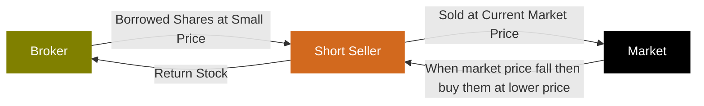

金融计算期末复习+总结，应付考试集大成之作。（悲

题图：凉前辈教你量化金融！由ChatGPT-Image2生成。

# What is Algo-Trading?

* Algorithmic trading, also called Algo Trading, Quant Trading, RoboTrading, Program Trading
* Use of mathematical models and computer algorithms/programs to
  * generate trading signals (i.e. Decision making)
  * automate trading process (i.e. Execution)
* Objectives:
  * maximize profits
  * control execution costs
  * hedging and manage investment risks

## Types

|  | Human Trading | Robo-Advisory | Robo-Trading |
|:-:|:-:|:-:|:-:|
| Working Hours | ~9*5 | ~9*5 | 24*7 |
| Execution Speed | Slow | Moderate | Immediately |
| Data Inputs | Limited | Almost unlimited | Almost unlimited |
| Trading Frequency | Low | Low - mid | Low – High |
| Scalability | Limited investment size due to stress | Moderate | High |
| Accuracy/ Discipline | Variable especially when you lose | Consistent | High |
| Customization | High | Medium | Low |
| User Control | Full | Partial | Minimal |
| Risk Management | Subjective | Algorithmic | Algorithmic |

* 从时间间隔分类Time Frames:
  * Long Term: Months to Years
  * Short Term: Days, Weeks, Months
  * Intraday: Seconds to Hours
  * High frequency: Fractions of Seconds

### 👉Exercise1👈

* In comparing human trading, robo-advisory, and robo-trading, which of the following statements provides the most accurate insight regarding the scalability and risk management approaches of each trading method? **E**
  * A. Human trading is the most scalable due to its ability to adapt strategies based on market conditions, while robo-advisory relies on limited data inputs, making it less scalable.
  * B. Both human trading and robo-advisory exhibit high scalability due to personalized strategies, while robo-trading has limited scalability because it follows predefined algorithms.
  * C. Human trading is characterized by algorithmic risk management, whereas robo-advisory and robo-trading rely solely on subjective risk assessments.
  * D. Robo-advisory systems provide the highest level of customization in risk management compared to human trading and robo-trading, which both follow rigid frameworks.
  * **E. Robo-trading offers the highest scalability due to its continuous operation and algorithmic risk management, while human trading struggles with scalability due to emotional factors.**

## Terminology

1. Long and short position
2. Short-selling
3. Order book
4. Bid price, ask price
5. Market spread
6. Order types
7. Slippage
8. Mark-to-market
9. Trading system
10. Margin & leverage

### Long and short position

* Long position 多头头寸
  * Definition: Buying an asset with the expectation that its price will rise. 买入资产并预期其价格上涨。
  * Goal: Sell at a higher price to realize a profit. 以更高价格出售以实现盈利。
  * Example: Buying 100 shares of a stock at $50, selling when it reaches $70. 以50美元的价格购买100股股票，当股价达到70美元时卖出。

* Short Position 空头头寸
  * Definition: Selling an asset that you do not own, with the intention of buying it back later at a lower price. 出售你不拥有的资产，意图在日后以更低的价格买回。
  * Goal: Profit from a decline in the asset's price. 从资产价格下跌中获利。
  * Example: Selling 100 shares of a stock at $70, buying back at $50. 以70美元的价格卖出100股股票，再以50美元的价格回购。

### Short-selling

* How Short-Selling Works（有三个人：broker负责借出股、short seller负责买卖和归还、market）
  * Borrowing Shares: Obtain shares from a broker to sell. 借股：从经纪人处获取股票以进行出售。
  * Selling the Borrowed Shares: Sell the shares at the current market price. 出售借入股票：以当前市场价格出售股票。
  * Buying Back Shares: Later, buy the same number of shares at a lower price. 回购股票：稍后，以较低的价格购回相同数量的股票。
  * Returning Shares: Return the borrowed shares to the broker. 归还股票：将借用的股票归还给经纪人。

* Risks of Short-Selling
  * Unlimited Loss Potential: If the asset price rises significantly.
  * Margin Calls: Brokers may require additional funds if the trade goes against you.
  * Regulatory Risks: Short-selling can be subject to restrictions.

### Order book

* The Order Book is a real-time, continually updating list of buy and sell orders for a specific financial instrument, sorted by price level. 订单簿是特定金融工具的实时、持续更新的买卖订单列表，按价格水平排序。
* Key components
  * **Ask** Book: the list/queue for sellers 询价簿：**卖家**的列表/队列
  * **Bid** Book: the list/queue for buyers 报价簿：**买家**的列表/队列
  * Price: The price points at which investors are willing to trade 价格：投资者愿意交易的价格点
  * Size: The number of shares, contracts, or lots that traders want to buy or sell 规模：交易者想要买入或卖出的股票、合约或批次的数目
* Order Ledger 订单账簿
  * The order book is listed in a sorted price ledger, which can be ascending or descending. 订单簿列在已排序的价格账簿中，可以是升序或降序。
  * The longer the price ledger is, the more liquidity an instrument provides. It is also called "market depth". 价格账本越长，金融工具提供的流动性就越多。这也被称为“市场深度”。
* Top of the Book 报价簿顶部
  * The order book is separated into bid-book and ask-book 报价簿分为买入报价簿和卖出报价簿
  * Bid orders are sorted in descending price 买入报价按价格从高到低排序
  * Ask orders are sorted in ascending price 卖出报价按价格从低到高排序
  * The highest bid and the lowest ask are referred to "the top of the book" 最高买入价和最低卖出价统称为“报价簿顶部”
* Cumulative Book 累计报价簿
  * For each of the bid and ask book, order size accumulates from the top of the book. 对于买入报价簿和卖出报价簿，订单规模从报价簿顶部开始累计。

### Bid price, ask price

* Bid Price & Bid Size
  * Bid price is the highest price that a buyer (bidder) is willing to pay for a particular security.
  * Bid size represents the quantity a buyer is willing to purchase at the bid price.
  * The top price and size in a bid order book.
  * For example, if a buyer bids $207.01 x 3000 for a stock, it means they are willing to buy 3000 shares for not more than $207.01

* Ask Price & Ask Size
  * Ask price is the lowest price a seller is willing to accept for a security.
  * Ask size represents the quantity a seller is willing to sell at the ask price.
  * The top price and size in an ask order book.
  * For example, if a seller asks $209.94 x 200 for a stock, it implies they are willing to sell 200 shares for not less than $209.94

* 买入价与买入规模
  * 买入价是指买方（竞标者）愿意为特定证券支付的最高价格。
  * 买盘规模表示买方愿意以买盘价格购买的数量。
  * 竞价订单簿中的最高价格和最大规模。
  * 例如，如果买家对某只股票出价207.01美元x3000，这意味着他们愿意以不超过207.01美元的价格购买3000股

* 卖价与卖盘量
  * 卖价是指卖方愿意接受的证券最低价格。
  * 卖方报价量表示卖方愿意以报价价格出售的数量。
  * 卖盘簿中的最高价格和最大规模。
  * 例如，如果卖家为某只股票报价209.94美元×200股，这意味着他们愿意以不低于209.94美元的价格出售200股

### Market spread ⭐️

* The difference between the bid price and the ask price is known as the bid-ask spread.
* The bid-ask spread is a key measure of the **liquidity** of an asset or security.
* A **smaller** spread indicates a **more liquid** market, while a larger spread indicates a less liquid market.
* Percentage Spread
  * Percentage spread is often used for comparing the spread between different instruments
  * $$Percentage Spread = \frac{AskPrice - BidPrice}{MidPrice} = \frac{2\times(AskPrice - BidPrice)}{AskPrice + BidPrice}$$
* For example, if the bid price for a stock is $24 and the ask price is $25, the bid-ask spread will be $1, the percentage spread will be 4.08%.

### Order types

* Market Order
  * A market order is to buy or sell at the best available price in the current market.
  * That is, when opening a buy (sell) position using market order, it will try to execute at the best ask (bid) price.
  * A market order typically ensures an execution, but it does not guarantee a specified price. It is appropriate to use market orders when you want an immediate execution.

* 市价单
  * 市价单是指以当前市场上的最佳可用价格进行买入或卖出。
  * 即，当使用市价单开立买入（卖出）头寸时，系统会尝试以最佳卖价（买价）执行。
  * 市价单通常能确保交易执行，但不保证执行价格。当您希望立即执行交易时，使用市价单是合适的。

* Limit Order
  * A limit order is to buy or sell with a condition on the maximum price to pay or the minimum price to receive (the "limit price").
  * If the order is filled, it will only be at the specified limit price or better. However, there is no guarantee of execution.
  * A limit order may be appropriate when you think you can buy at a price lower than (or sell at a price higher than) the current market quote.
  * Example
    * The last trade price is roughly $138
    * investor who wants to buy (or sell) immediately would place a market order, which would be executed at or near the current price of $138 (white line) provided that the market was open.
    * investor who wants to buy the stock when it dropped to $131.78 would place a buy limit order with a limit price of $131.78 (green line). If the price falls to $131.78 or lower, the limit order would be triggered and executed at $131.78 or below. If the stock doesn't drop to $131.78 or below, no execution would occur.
    * investor who wants to sell the stock when it reached $143.82 would place a sell limit order with a limit price of $143.82 (red line). If the price rises to $143.82 or higher, the limit order would be triggered and executed at $143.82 or above. If the stock doesn't rise to $143.82 or above, no execution would occur.

* 限价单
  * 限价单是指以设定的最高支付价格或最低接收价格为条件进行买入或卖出（“限价”）。
  * 若订单成交，则仅以指定的限价或更优价格成交。然而，无法保证订单一定能执行。
  * 当你认为你能以低于当前市场报价的价格买入（或以高于当前市场报价的价格卖出）时，限价单可能是合适的。
  * 示例
    * 最新交易价格约为138美元
    * 想要立即买入（或卖出）的投资者会下达市价单，只要市场开放，该订单就会以当前价格138美元（白线）或接近该价格的价格执行。
    * 投资者若想在股价跌至131.78美元时买入股票，则会设置一个限价委托，将限价设为131.78美元（绿线）。如果股价跌至131.78美元或更低，则限价委托将被触发并以131.78美元或更低的价格执行。如果股价未跌至131.78美元或更低，则不会执行委托。
    * 投资者若想在股价达到143.82美元时卖出股票，则会设置一个限价卖出订单，限价为143.82美元（红线）。如果股价上涨至143.82美元或以上，限价订单将被触发并以143.82美元或以上的价格执行。如果股价未上涨至143.82美元或以上，则不会执行订单。

* Stop Order
  * A stop order is to buy or sell at the market price when it has traded at or through a specified price (the "stop price").
  * If the stock reaches the stop price, the order becomes a market order and is filled at the next available market price. If it doesn't reach the stop price, the order will not be executed.
  * A stop order may be appropriate in these scenarios:
    * you want to buy when a stock breaks out above a certain level, and believe that it will continue the trend
    * your holding stock has risen a lot and you want to protect the gain when it begins to fall
  * Example
    * The stop buy order will trigger when the price reaches 143.82 or above, and will execute as a market order at that current price.
    * Thus, if the price rise further after hitting the stop price, it is possible that the order could be executed at a price higher than the stop price.
    * Similarly for the stop sell order, once the stop price of $131.78 is reached, the order could be executed at a lower price

* 止损单
  * 止损单是指在市场价格达到或穿过指定价格（即“止损价”）时，以市场价格买入或卖出。
  * 如果股票价格达到止损价，订单将变为市价单，并以下一个可用的市场价格成交。如果未达到止损价，订单将不会被执行。
  * 在以下情况下，止损单可能适用：
    * 当股票突破某一水平时，您希望买入，并认为其趋势会持续
    * 您的持仓股票已大幅上涨，而您希望在股价开始下跌时保护收益
  * 示例
    * 当价格达到143.82或以上时，止损买入单将被触发，并以当前价格作为市价单执行。
    * 因此，若价格在触及止损价后进一步上涨，订单可能会以高于止损价的价格执行。
    * 同样，对于止损卖单，一旦达到131.78美元的止损价格，订单可能会以更低的价格执行

### Slippage

* Slippage refers to the difference between the expected execution price and the price it actually traded
* It often occurs
  * during periods of higher volatility when market orders are used
  * when large orders are executed when market depth is not sufficient to maintain the expected price of trade
* Example
  * Let's assume you have an algorithm set to buy a stock when the price drops to $50. The algorithm detects the price drop and places a buy order.
  * However, due to high demand or low liquidity, the order gets executed at $51. This $1 difference is the slippage.
  * This means that even if you were expecting to spend $5000 on 100 shares, you would end up spending $5100. The $100 is the cost of slippage

* 滑点是指预期执行价格与实际交易价格之间的差异。
* 它通常发生在
  * 使用市价单时波动性较高的时期；
  * 当市场深度不足以维持预期交易价格时执行大额订单。
* 示例
  * 假设您设置了一个算法，当股价跌至50美元时买入股票。算法检测到股价下跌并发出买入订单。
  * 然而，由于需求高涨或流动性较低，订单以51美元的价格执行。这1美元的差价就是滑点。
  * 这意味着，即使你原本预计花费5000美元购买100股，最终也会花费5100美元。这100美元就是滑点成本

### Mark-to-market

* Entry: Based on a trade signal, generate order to go short or long a certain financial instrument in a certain quantity. Trade results in a certain position in this security
* Mark-to-Market: As the price of the security changes, so does your unrealized PnL
  * For long order: $$PnL=Quantity\times(P_{bid}-P_{entry})$$.
  * For short order: $$PnL=-1\times Quantity\times(P_{ask}-P_{entry})$$.
* Exit: Generate order to exit the position and create a realized PnL
  * $$PnL=Side\times Quantity\times(P_{exit}-P_{entry})$$
* It is an accounting method to calculate the asset or portfolio value according to its current market value, rather than its book value
* It involves determining the price at which you could immediately sell an asset or close a position
* Example:
  * Suppose you purchase 100 shares of ABC stock
  * The current bid and ask price of ABC are $9.5 and $10.5
  * Mark-to-market value of your stock will be 100*$9.5 = $9500

* 入场：基于交易信号，生成指令以特定数量做空或做多某种金融工具。交易结果为该证券的特定持仓 
* 逐日结算：随着证券价格的变化，未实现损益也会相应变化
  * 对于多头订单：$$PnL=Quantity\times(P_{bid}-P_{entry})$$。
  * 对于短线订单：$$PnL=-1\times 数量\times(P_{ask}-P_{entry})$$。
* 出场：生成离场指令并计算已实现损益
  * $$PnL=持仓方向\times 数量\times(P_{出场}-P_{入场})$$ 
* 这是一种根据资产或投资组合的当前市场价值而非账面价值来计算其价值的会计方法
* 它涉及确定您能立即卖出资产或平仓的价格
* 示例：
  * 假设您购买了100股ABC股票
  * ABC股票的当前买入价和卖出价分别为9.5美元和10.5美元
  * 您股票的市值将达到100*$9.5 = 9500美元

### Trading system - Order Management System (OMS)

* Order based system
  * Transactions are managed in a round order manner
  * Partial close is not supported
  * Trading platforms: MetaTrader, TradingView, MetaStock, etc
* Position based system
  * Transactions are independent and no linkage with each other
  * Partial close is allowed
  * Trading Platforms
    * Most of the banks (eg. HSBC, SBC, BOC, etc)
    * Interactive Brokers, Binance, etc
* Example
  * Suppose you open 3 offsetting trades: #1: buy 2 shares of ABC at $123 #2: sell 1 share of ABC at $124 #3: sell 1 share of ABC at $125
  * For order based system, the unrealized PnL will be 2\*(bid - 123) + 1\*(124 - ask) + 1\*(125 - ask) = $3 + 2\*(bid - ask). You need to close all the 3 trades to realize the PnL.
  * For position based system, the orders will be offsetted based on FIFO, and PL will become realized so long as the position is net to zero. Thus, your PnL will be realized at $3.

* 基于订单的系统
  * 交易以轮次顺序管理
  * 不支持部分平仓
  * 交易平台MetaTrader、TradingView、MetaStock等
* 基于持仓的系统
  * 交易独立进行，彼此之间无关联
  * 允许部分平仓
  * 交易平台
    * 大多数银行（如汇丰银行、渣打银行、中国银行等）
    * 盈透证券、币安等
* 示例
  * 假设您开立了3笔对冲交易：#1：以123美元买入2股ABC股票 #2：以124美元卖出1股ABC股票 #3：以125美元卖出1股ABC股票
  * 对于基于订单的系统，未实现的盈亏将是2\*(买入价 - 123) + 1\*(124 - 卖出价) + 1\*(125 - 卖出价) = 3美元 + 2\*(买入价 - 卖出价)。您需要平掉所有3笔交易以实现盈亏。
  * 对于基于头寸的系统，订单将根据先进先出（FIFO）原则进行抵消，只要头寸净值为零，损益（PL）就会实现。因此，您的损益（PnL）将在3美元时实现。

### Margin & leverage

* Leverage refers to using borrowed capital as a funding source for investment to increase the potential return: $$Leverage Ratio=\frac{Asset}{Equity}=1+\frac{Debt}{Equity}$$.
* Margin is a way to create leverage: $$Margin Amount=(Account Asset Value)-(Borrowed Amount)=Equity held at broker$$.
  * There are 2 market quotations for margin requirement
    * Fixed Margin Amount: Mostly used by stock exchanges
    * Margin as a percentage: Mostly used by FX/Crypto exchanges
* As HSI Index Future has a price magnifier of 50, meaning that 1 index point change will lead to ±HK$50. Suppose current HSI Index Future price is 25000, and buying 1 lot of HSI Index Future require HK$116,774 as margin. Then, leverage ratio is calculated to be ($25000*50)/$116,774 = 10.7044
* Suppose you pay $600,000 to get stocks worth $1,000,000. Thus, leverage ratio is calculated to be $1,000,000/$600,000 = 1.6667
* As you can imagine, the lower is the margin requirement, the higher is the leverage ratio. In general, $$Leverage Ratio=\frac{1}{Margin Requirement}$$.
* Buying Power
  * For leveraged trading where traders can take out a loan based on the amount of cash held in their broker account, buying power refers to the amount of money available for investors to purchase securities. Mathematically, $$Buying Power = Leverage Ratio \times Investor's Equity$$.
  * For example, suppose an investor made an initial deposit US$100,000 to a 20:1 leveraged broker account. Then, the investor would be able to purchase, at maximum, US$2,000,000 worth of securities. Hence, a buying power of US$2,000,000

* 杠杆是指利用借入资本作为投资资金来源以增加潜在回报：$$杠杆率=\frac{资产}{权益}=1+\frac{债务}{权益}$$。
* 保证金是一种创造杠杆的方式：$$保证金金额=(账户资产价值)-(借款金额)=在经纪商处持有的净值$$。
  * 保证金要求有两种市场报价方式：
    * 固定保证金金额：主要由股票交易所使用
    * 保证金百分比：主要由外汇/加密货币交易所使用
* 由于恒生指数期货的价格放大器为50，即指数点数的变动将导致±50港元。假设当前恒生指数期货价格为25000，购买1手恒生指数期货需要116,774港元作为保证金。那么，杠杆率计算为($25000*50)/$116,774 = 10.7044
* 假设你支付60万美元购买价值100万美元的股票。因此，杠杆率计算为$1,000,000/$600,000 = 1.6667
* 你可以想象，保证金要求越低，杠杆率就越高。一般来说，杠杆率=1/保证金要求。
* 购买力
  * 在杠杆交易中，交易者可以根据其经纪账户中的现金金额申请贷款，购买力是指投资者可用于购买证券的资金金额。从数学上讲，$$购买力 = 杠杆比率 \times 投资者权益$$。
  * 例如，假设投资者向一个杠杆比率为20:1的经纪账户存入10万美元的初始存款。那么，投资者最多能够购买价值200万美元的证券。因此，其购买力为200万美元

### 👉Exercise2👈

* What is one of the main disadvantages of using a market order? **C**
  * A) It guarantees the execution price
  * B) It may not be executed at all
  * **C) It can lead to slippage in volatile markets**
  * D) It requires a waiting period
  * E) It cannot be used for large orders

* What is a primary advantage of using a limit order? **B**
  * A) It guarantees immediate execution
  * **B) It allows for price control on the order execution**
  * C) It is always executed before market orders
  * D) It eliminates the risk of slippage
  * E) It can be used only for small orders

* What does the cumulative book represent? **C**
  * A) Historical trading volumes
  * B) Individual buy and sell orders
  * **C) Total quantities of orders at each price level**
  * D) The highest trading price of the day
  * E) The average liquidity of a market

* What does the "Top of the Book" refer to in trading? **B**
  * A) The total number of trades executed
  * **B) The highest bid and lowest ask prices**
  * C) The trading volume over time
  * D) The closing price of a stock
  * E) The most recent trades

* What information does the bid-ask spread in an order book indicate? **B**
  * A) The total number of shares traded in a day
  * **B) The difference between the highest bid and the lowest ask prices**
  * C) The average price of trades over a specified period
  * D) The total market capitalization of a stock
  * E) The time elapsed since the last trade

* What does a smaller bid-ask spread typically indicate? **C**
  * A) Increased trading costs
  * B) Higher market volatility
  * **C) Greater market liquidity**
  * D) Decreased trading activity
  * E) Lower investor interest

* Which of the following statements best describes the mechanics and risks associated with short-selling a stock? **B**
  * A) Short-selling involves buying shares with the expectation that the price will rise, allowing for a profit upon selling.
  * **B) In short-selling, an investor borrows shares from a broker to sell them at the current market price, aiming to buy them back later at a lower price.**
  * C) Short-sellers are guaranteed profits as long as they can find a buyer for the borrowed shares.
  * D) Short-selling is considered a low-risk strategy because the maximum loss is capped at the initial investment.
  * E) Regulations prohibit short-selling during periods of high market volatility to protect investors.

* Which of the following statements about short-selling in the stock market is the most accurate? **B**
  * A) Short-selling allows investors to profit from an increase in stock prices by borrowing shares.
  * **B) Short-selling involves borrowing shares and selling them with the expectation that the stock price will decline.**
  * C) Short-selling is only permitted for institutional investors and not for retail investors.
  * D) The losses from short-selling are limited to the initial investment made by the investor.
  * E) Short-selling has no impact on the overall market liquidity or stock prices.

* In an Order Management System (OMS), which statement most accurately highlights the distinction between an order-based system and a position-based system? **D**
  * A) An order-based system permits partial closures, whereas a position-based system does not.
  * B) In an order-based system, transactions are handled independently, while in a position based system, they follow a round order process.
  * C) An order-based system design is commonly adopted by banks.
  * **D) In an order-based system, transactions are processed in a round order and do not accommodate partial closures, while a position-based system enables independent transaction management and supports partial closures.**
  * E) Both systems function identically and exhibit no differences in transaction management.

* A trader is analyzing two stocks, Stock A and Stock B. The following bid and ask prices are observed: Stock A: Bid Price= $30, Ask Price= $32. Stock B: Bid Price= $25, Ask Price= $27. Calculate the percentage spread for both stocks and determine which stock has a better liquidity. **C**
  * A) Stock A: 6.45%, Stock B: 7.69%; Stock B has a better liquidity.
  * B) Stock A: 3.22%, Stock B: 3.85%; Stock A has a better liquidity.
  * **C) Stock A: 6.45%, Stock B: 7.69%; Stock A has a better liquidity.**
  * D) Stock A: 3.22%, Stock B: 3.85%; Stock B has a better liquidity.
  * E) Stock A: $2, Stock B: $2; Stock A and Stock B have the same liquidity.

$$A=\frac{2\times(AskPrice - BidPrice)}{AskPrice + BidPrice}=\frac{2\times(32-30)}{32+30}=6.45\%$$

$$B=\frac{2\times(AskPrice - BidPrice)}{AskPrice + BidPrice}=\frac{2\times(27-25)}{27+25}=7.69\%$$

$$A<B$$

### 👉Takeaway1👈

1. 交易类型有三种：人、机器辅助和机器自动。人最慢、最主观、规模最小、但是控制最高、定制最强。
2. 做空需要三个角色：broker负责借给short seller股权，short seller负责向market以当前价格出售股权，然后当股价下跌时回购，short seller此时将回购的股权还给broker。
3. bid-买-从高到低，ask-卖-从低到高
4. Order Ledger、Top of the Book、Cumulative Book的区别
5. spread必考一道计算题
6. Market Order、Limit Order、Stop Order的区别。Limit Order是期望的价格，不一定成交；Stop Order是Market Order穿过某一价格时以Market Order成交。
7. Market Order会造成slippage
8. Order based system和Position based system。Position based system是银行，允许Partial close

# Risk

## Definition

Risk simply refers to uncertainty. In finance, risk refers to the uncertainty of the investment return.
* Up-side risk: the possibility of making money
* Down-side risk: the possibility of losing money

## Risk Management Cycle

1. Risk Identification
2. Risk Assessment / Measurement
3. Risk Treatment
4. Risk Monitoring

## Risk Identification

这里可能会考风险类别的判断

1. Market Risk
  * Equity Risk
  * FX Risk
  * Commodity Risk
2. Interest rate Risk
3. Credit Risk
4. Liquidity Risk
5. Operational Risk
6. Legal Risk
7. Reputational Risk
8. Strategic Risk

1234 are **investment related risks**.

### Market Risk

Market Risk is the potential for financial losses due to changes in market prices. It affects assets such as stocks, bonds, currencies, and commodities. This type of risk is inherent to all investments and can be influenced by factors like economic changes, political events, and natural disasters.

* Example: Suppose you own shares in a tech company. If the stock market experiences a downturn, the value of your shares may decrease regardless of the company's performance, due to overall market sentiment.

### Interest Rate Risk

Interest Rate Risk is the potential for investment losses due to fluctuations in interest rates. It primarily affects the value of bonds and other fixed-income securities. When interest rates rise, bond prices typically fall, and vice versa. This risk is crucial for investors and financial institutions managing portfolios sensitive to interest rate changes.

* Example: Imagine you own a bond with a fixed interest rate of 3%. If the market interest rate rises to 4%, new bonds offer better returns, making your bond less attractive. Consequently, the market value of your bond decreases.

### Credit Risk

Credit Risk is the possibility of a loss resulting from a borrower's failure to repay a loan or meet contractual obligations. It affects lenders and investors in bonds or loans. Credit risk is a key consideration in lending and investing, influencing interest rates and lending terms.

* Example: If a bank lends money to a business, and the business defaults on the loan, the bank faces credit risk. This risk can lead to financial loss for the bank due to the unpaid loan amount.

### Liquidity Risk

Liquidity Risk is the risk that an entity may not be able to quickly convert assets into cash without significant loss in value. It affects individuals, businesses, and financial institutions. Liquidity risk is important for managing cash flow and ensuring that obligations can be met when they come due.

* Example: Imagine a company owns a large amount of real estate. If it suddenly needs cash to cover expenses, selling the properties quickly might force them to accept lower prices, resulting in a financial loss.

### 👉Exercise11👈

* What type of risk involved in these examples?

  1. A company defaults on its loan payment. **Credit Risk**
  2. You need to sell a property quickly but can't find a buyer without reducing the price significantly. **Liquidity Risk**
  3. The value of your bond portfolio decreases due to rising interest rates. **Interest Rate Risk**
  4. Stock prices drop due to a sudden economic downturn. **Market Risk (Stock Risk)**
  5. A bank is unable to meet its short-term cash obligations. **Liquidity Risk**
  6. An investor worries about a borrower's ability to repay a loan. **Credit Risk**
  7. The price of a commodity fluctuates widely and affects your investment. **Market Risk (Commodity Risk)**
  8. You are a fresh graduate. You worry about the house price keeps increasing and unaffordable to buy. **Affordability Risk**

### 👉Take Away1👈

1. 借钱不还信用风险，银行没钱流动风险
2. 股票套牢市场风险，没钱买房买车钞能力风险

## Risk Assessment / Measurement

### Volatility Analysis - Historical Estimates

* Standard Deviation: $$\sigma_{t,n}=\sqrt{\frac{1}{n}\sum_{i=1}^{n}(x_{t,i}-\bar{x}_{t})^2}$$
  * Standard derivation is a statistical measure that quantifies the amount of variation or dispersion in a set of data values. 标准差是一种统计指标，用于量化一组数据值中的变异或离散程度。
  * Volatility is often measured using standard deviation. 波动性通常使用标准差来衡量。
  * High standard deviation indicates high volatility, meaning the asset's price can vary significantly. 标准差高表示波动性大，即资产价格可能存在显著波动。
  * Since n is fixed and the last n observations are used, we also call this a moving average (MA) estimate. 由于n是固定的，并且使用了最后n个观测值，因此我们也称此为移动平均（MA）估计。
  * Common values for n: 30, 60, 120 days, etc. n的常见取值：30天、60天、120天等。
  * If one believes that the long term volatility is a constant, then a larger n should be used. 如果认为长期波动率是恒定的，那么应使用较大的n值。
  * If one wants to reflect more about the current situation, then a smaller n should be considered. 如果想要更深入地思考当前形势，那么应考虑使用较小的n值。
  * Disadvantage: extreme observations can affect the estimate for a prolonged period of time (ghost features). A small n gives more pronounced ghost features but for a shorter period of time. 缺点：极端观测值可能会在较长时间内影响估计结果（产生虚假特征）。样本量较小会使虚假特征更为显著，但影响时间较短。

### Volatility Analysis - EWMA

### Volatility Analysis - ARCH

### Volatility Analysis - GARCH

### Value at Risk (VaR)

### Stress Testing

### Scenario Analysis

### 👉Take Away2👈

## Capital Management

### Fixed Sized

### Balance Rescaling

### Dollar Risk Approach

### Kelly Criterion

### 👉Take Away3👈

# Portfolio

