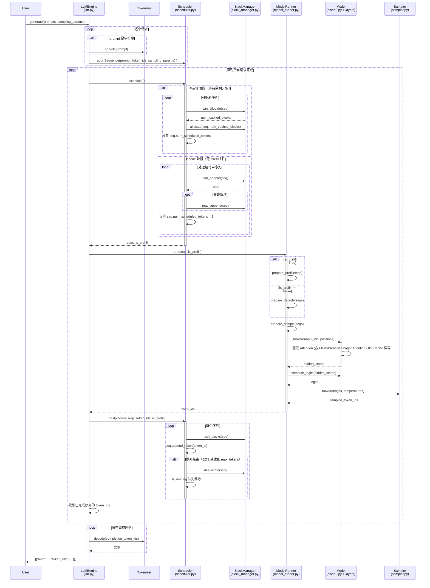

Nano-vLLM is a lightweight vLLM implementation built from scratch. It has comparable inference speeds to vLLM, while it has 1,200 lines of Python code, which is much less than vLLM. Optimization includes Prefix caching, Tensor Parallelism, Torch compilation, CUDA graph, etc.

Nano-vLLM是从零开始构建的轻量级vLLM实现。其推理速度与vLLM相当，但Python代码仅1200行，远少于vLLM。优化措施包括前缀缓存、张量并行、Torch编译、CUDA图等。


(Banner: Logo of [Nano-vLLM](https://github.com/GeeeekExplorer/nano-vllm.git){:target="_blank"}. **All codes are from Nano-vLLM GitHub Repository**.)


## 调用图




## 解析


## 项目结构

```bash
D:.
│  bench.py
│  example.py
│  pyproject.toml
│    
└─nanovllm
    │  config.py
    │  llm.py
    │  sampling_params.py
    │  __init__.py
    │  
    ├─engine
    │      block_manager.py
    │      llm_engine.py
    │      model_runner.py
    │      scheduler.py
    │      sequence.py
    │      
    ├─layers
    │      activation.py
    │      attention.py
    │      embed_head.py
    │      layernorm.py
    │      linear.py
    │      rotary_embedding.py
    │      sampler.py
    │      
    ├─models
    │      qwen3.py
    │      
    └─utils
            context.py
            loader.py
```

## 全部代码

bench.py

```python
import os
import time
from random import randint, seed
from nanovllm import LLM, SamplingParams
# from vllm import LLM, SamplingParams


def main():
    seed(0)
    num_seqs = 256
    max_input_len = 1024
    max_ouput_len = 1024

    path = os.path.expanduser("~/huggingface/Qwen3-0.6B/")
    llm = LLM(path, enforce_eager=False, max_model_len=4096)

    prompt_token_ids = [[randint(0, 10000) for _ in range(randint(100, max_input_len))] for _ in range(num_seqs)]
    sampling_params = [SamplingParams(temperature=0.6, ignore_eos=True, max_tokens=randint(100, max_ouput_len)) for _ in range(num_seqs)]
    # uncomment the following line for vllm
    # prompt_token_ids = [dict(prompt_token_ids=p) for p in prompt_token_ids]

    llm.generate(["Benchmark: "], SamplingParams())
    t = time.time()
    llm.generate(prompt_token_ids, sampling_params, use_tqdm=False)
    t = (time.time() - t)
    total_tokens = sum(sp.max_tokens for sp in sampling_params)
    throughput = total_tokens / t
    print(f"Total: {total_tokens}tok, Time: {t:.2f}s, Throughput: {throughput:.2f}tok/s")


if __name__ == "__main__":
    main()
```

example.py

```python
import os
from nanovllm import LLM, SamplingParams
from transformers import AutoTokenizer


def main():
    path = os.path.expanduser("~/huggingface/Qwen3-0.6B/")
    tokenizer = AutoTokenizer.from_pretrained(path)
    llm = LLM(path, enforce_eager=True, tensor_parallel_size=1)

    sampling_params = SamplingParams(temperature=0.6, max_tokens=256)
    prompts = [
        "introduce yourself",
        "list all prime numbers within 100",
    ]
    prompts = [
        tokenizer.apply_chat_template(
            [{"role": "user", "content": prompt}],
            tokenize=False,
            add_generation_prompt=True,
        )
        for prompt in prompts
    ]
    outputs = llm.generate(prompts, sampling_params)

    for prompt, output in zip(prompts, outputs):
        print("\n")
        print(f"Prompt: {prompt!r}")
        print(f"Completion: {output['text']!r}")


if __name__ == "__main__":
    main()
```

pyproject.toml

```toml
[build-system]
requires = ["setuptools>=61"]
build-backend = "setuptools.build_meta"

[project]
name = "nano-vllm"
version = "0.2.0"
authors = [{ name = "Xingkai Yu" }]
license = "MIT"
license-files = ["LICENSE"]
readme = "README.md"
description = "a lightweight vLLM implementation built from scratch"
requires-python = ">=3.10,<3.13"
dependencies = [
    "torch>=2.4.0",
    "triton>=3.0.0",
    "transformers>=4.51.0",
    "flash-attn",
    "xxhash",
]

[project.urls]
Homepage="https://github.com/GeeeekExplorer/nano-vllm"

[tool.setuptools.packages.find]
where = ["."]
include = ["nanovllm*"]

```


### nanovllm

config.py
```python
import os
from dataclasses import dataclass
from transformers import AutoConfig


@dataclass(slots=True)
class Config:
    model: str
    max_num_batched_tokens: int = 16384
    max_num_seqs: int = 512
    max_model_len: int = 4096
    gpu_memory_utilization: float = 0.9
    tensor_parallel_size: int = 1
    enforce_eager: bool = False
    hf_config: AutoConfig | None = None
    eos: int = -1
    kvcache_block_size: int = 256
    num_kvcache_blocks: int = -1

    def __post_init__(self):
        assert os.path.isdir(self.model)
        assert self.kvcache_block_size % 256 == 0
        assert 1 <= self.tensor_parallel_size <= 8
        self.hf_config = AutoConfig.from_pretrained(self.model)
        self.max_model_len = min(self.max_model_len, self.hf_config.max_position_embeddings)

```

llm.py

```python
from nanovllm.engine.llm_engine import LLMEngine


class LLM(LLMEngine):
    pass
```


sampling_params.py

```python
from dataclasses import dataclass


@dataclass(slots=True)
class SamplingParams:
    temperature: float = 1.0
    max_tokens: int = 64
    ignore_eos: bool = False

    def __post_init__(self):
        assert self.temperature > 1e-10, "greedy sampling is not permitted"
```


\_\_init__.py

```python
from nanovllm.llm import LLM
from nanovllm.sampling_params import SamplingParams
```

#### engine

block_manager.py

```python
from collections import deque
import xxhash
import numpy as np

from nanovllm.engine.sequence import Sequence


class Block:

    def __init__(self, block_id):
        self.block_id = block_id
        self.ref_count = 0
        self.hash = -1
        self.token_ids = []

    def update(self, hash: int, token_ids: list[int]):
        self.hash = hash
        self.token_ids = token_ids

    def reset(self):
        self.ref_count = 1
        self.hash = -1
        self.token_ids = []


class BlockManager:

    def __init__(self, num_blocks: int, block_size: int):
        self.block_size = block_size
        self.blocks: list[Block] = [Block(i) for i in range(num_blocks)]
        self.hash_to_block_id: dict[int, int] = dict()
        self.free_block_ids: deque[int] = deque(range(num_blocks))
        self.used_block_ids: set[int] = set()

    @classmethod
    def compute_hash(cls, token_ids: list[int], prefix: int = -1):
        h = xxhash.xxh64()
        if prefix != -1:
            h.update(prefix.to_bytes(8, "little"))
        h.update(np.array(token_ids).tobytes())
        return h.intdigest()

    def _allocate_block(self) -> int:
        block_id = self.free_block_ids.popleft()
        block = self.blocks[block_id]
        assert block.ref_count == 0
        if block.hash != -1 and self.hash_to_block_id.get(block.hash) == block_id:
            del self.hash_to_block_id[block.hash]
        block.reset()
        self.used_block_ids.add(block_id)
        return block_id

    def _deallocate_block(self, block_id: int):
        assert self.blocks[block_id].ref_count == 0
        self.used_block_ids.remove(block_id)
        self.free_block_ids.append(block_id)

    def can_allocate(self, seq: Sequence) -> int:
        h = -1
        num_cached_blocks = 0
        num_new_blocks = seq.num_blocks
        for i in range(seq.num_blocks - 1):
            token_ids = seq.block(i)
            h = self.compute_hash(token_ids, h)
            block_id = self.hash_to_block_id.get(h, -1)
            if block_id == -1 or self.blocks[block_id].token_ids != token_ids:
                break
            num_cached_blocks += 1
            if block_id in self.used_block_ids:
                num_new_blocks -= 1
        if len(self.free_block_ids) < num_new_blocks:
            return -1
        return num_cached_blocks

    def allocate(self, seq: Sequence, num_cached_blocks: int):
        assert not seq.block_table
        h = -1
        for i in range(num_cached_blocks):
            token_ids = seq.block(i)
            h = self.compute_hash(token_ids, h)
            block_id = self.hash_to_block_id[h]
            block = self.blocks[block_id]
            if block_id in self.used_block_ids:
                block.ref_count += 1
            else:
                block.ref_count = 1
                self.free_block_ids.remove(block_id)
                self.used_block_ids.add(block_id)
            seq.block_table.append(block_id)
        for i in range(num_cached_blocks, seq.num_blocks):
            seq.block_table.append(self._allocate_block())
        seq.num_cached_tokens = num_cached_blocks * self.block_size

    def deallocate(self, seq: Sequence):
        for block_id in reversed(seq.block_table):
            block = self.blocks[block_id]
            block.ref_count -= 1
            if block.ref_count == 0:
                self._deallocate_block(block_id)
        seq.num_cached_tokens = 0
        seq.block_table.clear()

    def can_append(self, seq: Sequence) -> bool:
        return len(self.free_block_ids) >= (len(seq) % self.block_size == 1)

    def may_append(self, seq: Sequence):
        if len(seq) % self.block_size == 1:
            seq.block_table.append(self._allocate_block())

    def hash_blocks(self, seq: Sequence):
        start = seq.num_cached_tokens // self.block_size
        end = (seq.num_cached_tokens + seq.num_scheduled_tokens) // self.block_size
        if start == end: return
        h = self.blocks[seq.block_table[start - 1]].hash if start > 0 else -1
        for i in range(start, end):
            block = self.blocks[seq.block_table[i]]
            token_ids = seq.block(i)
            h = self.compute_hash(token_ids, h)
            block.update(h, token_ids)
            self.hash_to_block_id[h] = block.block_id
```

llm_engine.py

```python
import atexit
from dataclasses import fields
from time import perf_counter
from tqdm.auto import tqdm
from transformers import AutoTokenizer
import torch.multiprocessing as mp

from nanovllm.config import Config
from nanovllm.sampling_params import SamplingParams
from nanovllm.engine.sequence import Sequence
from nanovllm.engine.scheduler import Scheduler
from nanovllm.engine.model_runner import ModelRunner


class LLMEngine:

    def __init__(self, model, **kwargs):
        config_fields = {field.name for field in fields(Config)}
        config_kwargs = {k: v for k, v in kwargs.items() if k in config_fields}
        config = Config(model, **config_kwargs)
        Sequence.block_size = config.kvcache_block_size
        self.ps = []
        self.events = []
        ctx = mp.get_context("spawn")
        for i in range(1, config.tensor_parallel_size):
            event = ctx.Event()
            process = ctx.Process(target=ModelRunner, args=(config, i, event))
            process.start()
            self.ps.append(process)
            self.events.append(event)
        self.model_runner = ModelRunner(config, 0, self.events)
        self.tokenizer = AutoTokenizer.from_pretrained(config.model, use_fast=True)
        config.eos = self.tokenizer.eos_token_id
        self.scheduler = Scheduler(config)
        atexit.register(self.exit)

    def exit(self):
        self.model_runner.call("exit")
        del self.model_runner
        for p in self.ps:
            p.join()

    def add_request(self, prompt: str | list[int], sampling_params: SamplingParams):
        if isinstance(prompt, str):
            prompt = self.tokenizer.encode(prompt)
        seq = Sequence(prompt, sampling_params)
        self.scheduler.add(seq)

    def step(self):
        seqs, is_prefill = self.scheduler.schedule()
        num_tokens = sum(seq.num_scheduled_tokens for seq in seqs) if is_prefill else -len(seqs)
        token_ids = self.model_runner.call("run", seqs, is_prefill)
        self.scheduler.postprocess(seqs, token_ids, is_prefill)
        outputs = [(seq.seq_id, seq.completion_token_ids) for seq in seqs if seq.is_finished]
        return outputs, num_tokens

    def is_finished(self):
        return self.scheduler.is_finished()

    def generate(
        self,
        prompts: list[str] | list[list[int]],
        sampling_params: SamplingParams | list[SamplingParams],
        use_tqdm: bool = True,
    ) -> list[str]:
        pbar = tqdm(total=len(prompts), desc="Generating", dynamic_ncols=True, disable=not use_tqdm)
        if not isinstance(sampling_params, list):
            sampling_params = [sampling_params] * len(prompts)
        for prompt, sp in zip(prompts, sampling_params):
            self.add_request(prompt, sp)
        outputs = {}
        prefill_throughput = decode_throughput = 0.
        while not self.is_finished():
            t = perf_counter()
            output, num_tokens = self.step()
            if num_tokens > 0:
                prefill_throughput = num_tokens / (perf_counter() - t)
            else:
                decode_throughput = -num_tokens / (perf_counter() - t)
            pbar.set_postfix({
                "Prefill": f"{int(prefill_throughput)}tok/s",
                "Decode": f"{int(decode_throughput)}tok/s",
            })
            for seq_id, token_ids in output:
                outputs[seq_id] = token_ids
                pbar.update(1)
        pbar.close()
        outputs = [outputs[seq_id] for seq_id in sorted(outputs.keys())]
        outputs = [{"text": self.tokenizer.decode(token_ids), "token_ids": token_ids} for token_ids in outputs]
        return outputs
```

model_runner.py

```python
import pickle
import torch
import torch.distributed as dist
from multiprocessing.synchronize import Event
from multiprocessing.shared_memory import SharedMemory

from nanovllm.config import Config
from nanovllm.engine.sequence import Sequence
from nanovllm.models.qwen3 import Qwen3ForCausalLM
from nanovllm.layers.sampler import Sampler
from nanovllm.utils.context import set_context, get_context, reset_context
from nanovllm.utils.loader import load_model


class ModelRunner:

    def __init__(self, config: Config, rank: int, event: Event | list[Event]):
        self.config = config
        hf_config = config.hf_config
        self.block_size = config.kvcache_block_size
        self.enforce_eager = config.enforce_eager
        self.world_size = config.tensor_parallel_size
        self.rank = rank
        self.event = event

        dist.init_process_group("nccl", "tcp://localhost:2333", world_size=self.world_size, rank=rank)
        torch.cuda.set_device(rank)
        default_dtype = torch.get_default_dtype()
        torch.set_default_dtype(hf_config.dtype)
        torch.set_default_device("cuda")
        self.model = Qwen3ForCausalLM(hf_config)
        load_model(self.model, config.model)
        self.sampler = Sampler()
        self.warmup_model()
        self.allocate_kv_cache()
        if not self.enforce_eager:
            self.capture_cudagraph()
        torch.set_default_device("cpu")
        torch.set_default_dtype(default_dtype)

        if self.world_size > 1:
            if rank == 0:
                self.shm = SharedMemory(name="nanovllm", create=True, size=2**20)
                dist.barrier()
            else:
                dist.barrier()
                self.shm = SharedMemory(name="nanovllm")
                self.loop()

    def exit(self):
        if self.world_size > 1:
            self.shm.close()
            dist.barrier()
            if self.rank == 0:
                self.shm.unlink()
        if not self.enforce_eager:
            del self.graphs, self.graph_pool
        torch.cuda.synchronize()
        dist.destroy_process_group()

    def loop(self):
        while True:
            method_name, args = self.read_shm()
            self.call(method_name, *args)
            if method_name == "exit":
                break

    def read_shm(self):
        assert self.world_size > 1 and self.rank > 0
        self.event.wait()
        n = int.from_bytes(self.shm.buf[0:4], "little")
        method_name, *args = pickle.loads(self.shm.buf[4:n+4])
        self.event.clear()
        return method_name, args

    def write_shm(self, method_name, *args):
        assert self.world_size > 1 and self.rank == 0
        data = pickle.dumps([method_name, *args])
        n = len(data)
        self.shm.buf[0:4] = n.to_bytes(4, "little")
        self.shm.buf[4:n+4] = data
        for event in self.event:
            event.set()

    def call(self, method_name, *args):
        if self.world_size > 1 and self.rank == 0:
            self.write_shm(method_name, *args)
        method = getattr(self, method_name, None)
        return method(*args)

    def warmup_model(self):
        torch.cuda.empty_cache()
        torch.cuda.reset_peak_memory_stats()
        max_num_batched_tokens, max_model_len = self.config.max_num_batched_tokens, self.config.max_model_len
        seq_len = min(max_num_batched_tokens, max_model_len)
        num_seqs = min(max_num_batched_tokens // seq_len, self.config.max_num_seqs)
        seqs = [Sequence([0] * seq_len) for _ in range(num_seqs)]
        for seq in seqs:
            seq.num_scheduled_tokens = seq_len
        self.run(seqs, True)
        torch.cuda.empty_cache()

    def allocate_kv_cache(self):
        config = self.config
        hf_config = config.hf_config
        free, total = torch.cuda.mem_get_info()
        used = total - free
        peak = torch.cuda.memory_stats()["allocated_bytes.all.peak"]
        current = torch.cuda.memory_stats()["allocated_bytes.all.current"]
        num_kv_heads = hf_config.num_key_value_heads // self.world_size
        head_dim = getattr(hf_config, "head_dim", hf_config.hidden_size // hf_config.num_attention_heads)
        block_bytes = 2 * hf_config.num_hidden_layers * self.block_size * num_kv_heads * head_dim * hf_config.dtype.itemsize
        config.num_kvcache_blocks = int(total * config.gpu_memory_utilization - used - peak + current) // block_bytes
        assert config.num_kvcache_blocks > 0
        self.kv_cache = torch.empty(2, hf_config.num_hidden_layers, config.num_kvcache_blocks, self.block_size, num_kv_heads, head_dim)
        layer_id = 0
        for module in self.model.modules():
            if hasattr(module, "k_cache") and hasattr(module, "v_cache"):
                module.k_cache = self.kv_cache[0, layer_id]
                module.v_cache = self.kv_cache[1, layer_id]
                layer_id += 1

    def prepare_block_tables(self, seqs: list[Sequence]):
        max_len = max(len(seq.block_table) for seq in seqs)
        block_tables = [seq.block_table + [-1] * (max_len - len(seq.block_table)) for seq in seqs]
        block_tables = torch.tensor(block_tables, dtype=torch.int32, pin_memory=True).cuda(non_blocking=True)
        return block_tables

    def prepare_prefill(self, seqs: list[Sequence]):
        input_ids = []
        positions = []
        cu_seqlens_q = [0]
        cu_seqlens_k = [0]
        max_seqlen_q = 0
        max_seqlen_k = 0
        slot_mapping = []
        block_tables = None
        for seq in seqs:
            start = seq.num_cached_tokens
            seqlen_q = seq.num_scheduled_tokens
            end = start + seqlen_q
            seqlen_k = end
            input_ids.extend(seq[start:end])
            positions.extend(range(start, end))
            cu_seqlens_q.append(cu_seqlens_q[-1] + seqlen_q)
            cu_seqlens_k.append(cu_seqlens_k[-1] + seqlen_k)
            max_seqlen_q = max(seqlen_q, max_seqlen_q)
            max_seqlen_k = max(seqlen_k, max_seqlen_k)
            if not seq.block_table:    # warmup
                continue
            start_block = start // self.block_size
            end_block = (end + self.block_size - 1) // self.block_size
            for i in range(start_block, end_block):
                slot_start = seq.block_table[i] * self.block_size
                if i == start_block:
                    slot_start += start % self.block_size
                if i != end_block - 1:
                    slot_end = seq.block_table[i] * self.block_size + self.block_size
                else:
                    slot_end = seq.block_table[i] * self.block_size + end - i * self.block_size
                slot_mapping.extend(range(slot_start, slot_end))
        if cu_seqlens_k[-1] > cu_seqlens_q[-1]:    # prefix cache
            block_tables = self.prepare_block_tables(seqs)
        input_ids = torch.tensor(input_ids, dtype=torch.int64, pin_memory=True).cuda(non_blocking=True)
        positions = torch.tensor(positions, dtype=torch.int64, pin_memory=True).cuda(non_blocking=True)
        cu_seqlens_q = torch.tensor(cu_seqlens_q, dtype=torch.int32, pin_memory=True).cuda(non_blocking=True)
        cu_seqlens_k = torch.tensor(cu_seqlens_k, dtype=torch.int32, pin_memory=True).cuda(non_blocking=True)
        slot_mapping = torch.tensor(slot_mapping, dtype=torch.int32, pin_memory=True).cuda(non_blocking=True)
        set_context(True, cu_seqlens_q, cu_seqlens_k, max_seqlen_q, max_seqlen_k, slot_mapping, None, block_tables)
        return input_ids, positions

    def prepare_decode(self, seqs: list[Sequence]):
        input_ids = []
        positions = []
        slot_mapping = []
        context_lens = []
        for seq in seqs:
            input_ids.append(seq.last_token)
            positions.append(len(seq) - 1)
            context_lens.append(len(seq))
            slot_mapping.append(seq.block_table[-1] * self.block_size + seq.last_block_num_tokens  - 1)
        input_ids = torch.tensor(input_ids, dtype=torch.int64, pin_memory=True).cuda(non_blocking=True)
        positions = torch.tensor(positions, dtype=torch.int64, pin_memory=True).cuda(non_blocking=True)
        slot_mapping = torch.tensor(slot_mapping, dtype=torch.int32, pin_memory=True).cuda(non_blocking=True)
        context_lens = torch.tensor(context_lens, dtype=torch.int32, pin_memory=True).cuda(non_blocking=True)
        block_tables = self.prepare_block_tables(seqs)
        set_context(False, slot_mapping=slot_mapping, context_lens=context_lens, block_tables=block_tables)
        return input_ids, positions

    def prepare_sample(self, seqs: list[Sequence]):
        temperatures = [seq.temperature for seq in seqs]
        temperatures = torch.tensor(temperatures, dtype=torch.float32, pin_memory=True).cuda(non_blocking=True)
        return temperatures

    @torch.inference_mode()
    def run_model(self, input_ids: torch.Tensor, positions: torch.Tensor, is_prefill: bool):
        if is_prefill or self.enforce_eager or input_ids.size(0) > 512:
            return self.model.compute_logits(self.model(input_ids, positions))
        else:
            bs = input_ids.size(0)
            context = get_context()
            graph = self.graphs[next(x for x in self.graph_bs if x >= bs)]
            graph_vars = self.graph_vars
            graph_vars["input_ids"][:bs] = input_ids
            graph_vars["positions"][:bs] = positions
            graph_vars["slot_mapping"].fill_(-1)
            graph_vars["slot_mapping"][:bs] = context.slot_mapping
            graph_vars["context_lens"].zero_()
            graph_vars["context_lens"][:bs] = context.context_lens
            graph_vars["block_tables"][:bs, :context.block_tables.size(1)] = context.block_tables
            graph.replay()
            return self.model.compute_logits(graph_vars["outputs"][:bs])

    def run(self, seqs: list[Sequence], is_prefill: bool) -> list[int]:
        input_ids, positions = self.prepare_prefill(seqs) if is_prefill else self.prepare_decode(seqs)
        temperatures = self.prepare_sample(seqs) if self.rank == 0 else None
        logits = self.run_model(input_ids, positions, is_prefill)
        token_ids = self.sampler(logits, temperatures).tolist() if self.rank == 0 else None
        reset_context()
        return token_ids

    @torch.inference_mode()
    def capture_cudagraph(self):
        config = self.config
        hf_config = config.hf_config
        max_bs = min(self.config.max_num_seqs, 512)
        max_num_blocks = (config.max_model_len + self.block_size - 1) // self.block_size
        input_ids = torch.zeros(max_bs, dtype=torch.int64)
        positions = torch.zeros(max_bs, dtype=torch.int64)
        slot_mapping = torch.zeros(max_bs, dtype=torch.int32)
        context_lens = torch.zeros(max_bs, dtype=torch.int32)
        block_tables = torch.zeros(max_bs, max_num_blocks, dtype=torch.int32)
        outputs = torch.zeros(max_bs, hf_config.hidden_size)
        self.graph_bs = [1, 2, 4, 8] + list(range(16, max_bs + 1, 16))
        self.graphs = {}
        self.graph_pool = None

        for bs in reversed(self.graph_bs):
            graph = torch.cuda.CUDAGraph()
            set_context(False, slot_mapping=slot_mapping[:bs], context_lens=context_lens[:bs], block_tables=block_tables[:bs])
            outputs[:bs] = self.model(input_ids[:bs], positions[:bs])    # warmup
            with torch.cuda.graph(graph, self.graph_pool):
                outputs[:bs] = self.model(input_ids[:bs], positions[:bs])    # capture
            if self.graph_pool is None:
                self.graph_pool = graph.pool()
            self.graphs[bs] = graph
            torch.cuda.synchronize()
            reset_context()

        self.graph_vars = dict(
            input_ids=input_ids,
            positions=positions,
            slot_mapping=slot_mapping,
            context_lens=context_lens,
            block_tables=block_tables,
            outputs=outputs,
        )
```

scheduler.py

```python
from collections import deque

from nanovllm.config import Config
from nanovllm.engine.sequence import Sequence, SequenceStatus
from nanovllm.engine.block_manager import BlockManager


class Scheduler:

    def __init__(self, config: Config):
        self.max_num_seqs = config.max_num_seqs
        self.max_num_batched_tokens = config.max_num_batched_tokens
        self.eos = config.eos
        self.block_size = config.kvcache_block_size
        self.block_manager = BlockManager(config.num_kvcache_blocks, config.kvcache_block_size)
        self.waiting: deque[Sequence] = deque()
        self.running: deque[Sequence] = deque()

    def is_finished(self):
        return not self.waiting and not self.running

    def add(self, seq: Sequence):
        self.waiting.append(seq)

    def schedule(self) -> tuple[list[Sequence], bool]:
        scheduled_seqs = []
        num_batched_tokens = 0

        # prefill
        while self.waiting and len(scheduled_seqs) < self.max_num_seqs:
            seq = self.waiting[0]
            remaining = self.max_num_batched_tokens - num_batched_tokens
            if remaining == 0:
                break
            if not seq.block_table:
                num_cached_blocks = self.block_manager.can_allocate(seq)
                if num_cached_blocks == -1:
                    break
                num_tokens = seq.num_tokens - num_cached_blocks * self.block_size
            else:
                num_tokens = seq.num_tokens - seq.num_cached_tokens
            if remaining < num_tokens and scheduled_seqs:  # only allow chunked prefill for the first seq
                break
            if not seq.block_table:
                self.block_manager.allocate(seq, num_cached_blocks)
            seq.num_scheduled_tokens = min(num_tokens, remaining)
            num_batched_tokens += seq.num_scheduled_tokens
            if seq.num_cached_tokens + seq.num_scheduled_tokens == seq.num_tokens:
                seq.status = SequenceStatus.RUNNING
                self.waiting.popleft()
                self.running.append(seq)
            scheduled_seqs.append(seq)

        if scheduled_seqs:
            return scheduled_seqs, True

        # decode
        while self.running and len(scheduled_seqs) < self.max_num_seqs:
            seq = self.running.popleft()
            while not self.block_manager.can_append(seq):
                if self.running:
                    self.preempt(self.running.pop())
                else:
                    self.preempt(seq)
                    break
            else:
                seq.num_scheduled_tokens = 1
                seq.is_prefill = False
                self.block_manager.may_append(seq)
                scheduled_seqs.append(seq)
        assert scheduled_seqs
        self.running.extendleft(reversed(scheduled_seqs))
        return scheduled_seqs, False

    def preempt(self, seq: Sequence):
        seq.status = SequenceStatus.WAITING
        seq.is_prefill = True
        self.block_manager.deallocate(seq)
        self.waiting.appendleft(seq)

    def postprocess(self, seqs: list[Sequence], token_ids: list[int], is_prefill: bool):
        for seq, token_id in zip(seqs, token_ids):
            self.block_manager.hash_blocks(seq)
            seq.num_cached_tokens += seq.num_scheduled_tokens
            seq.num_scheduled_tokens = 0
            if is_prefill and seq.num_cached_tokens < seq.num_tokens:
                continue
            seq.append_token(token_id)
            if (not seq.ignore_eos and token_id == self.eos) or seq.num_completion_tokens == seq.max_tokens:
                seq.status = SequenceStatus.FINISHED
                self.block_manager.deallocate(seq)
                self.running.remove(seq)
```

sequence.py

```python
from copy import copy
from enum import Enum, auto
from itertools import count

from nanovllm.sampling_params import SamplingParams


class SequenceStatus(Enum):
    WAITING = auto()
    RUNNING = auto()
    FINISHED = auto()


class Sequence:
    block_size = 256
    counter = count()

    def __init__(self, token_ids: list[int], sampling_params = SamplingParams()):
        self.seq_id = next(Sequence.counter)
        self.status = SequenceStatus.WAITING
        self.token_ids = copy(token_ids)
        self.last_token = token_ids[-1]
        self.num_tokens = len(self.token_ids)
        self.num_prompt_tokens = len(token_ids)
        self.num_cached_tokens = 0
        self.num_scheduled_tokens = 0
        self.is_prefill = True
        self.block_table = []
        self.temperature = sampling_params.temperature
        self.max_tokens = sampling_params.max_tokens
        self.ignore_eos = sampling_params.ignore_eos

    def __len__(self):
        return self.num_tokens

    def __getitem__(self, key):
        return self.token_ids[key]

    @property
    def is_finished(self):
        return self.status == SequenceStatus.FINISHED

    @property
    def num_completion_tokens(self):
        return self.num_tokens - self.num_prompt_tokens

    @property
    def prompt_token_ids(self):
        return self.token_ids[:self.num_prompt_tokens]

    @property
    def completion_token_ids(self):
        return self.token_ids[self.num_prompt_tokens:]

    @property
    def num_blocks(self):
        return (self.num_tokens + self.block_size - 1) // self.block_size

    @property
    def last_block_num_tokens(self):
        return self.num_tokens - (self.num_blocks - 1) * self.block_size

    def block(self, i):
        assert 0 <= i < self.num_blocks
        return self.token_ids[i*self.block_size: (i+1)*self.block_size]

    def append_token(self, token_id: int):
        self.token_ids.append(token_id)
        self.last_token = token_id
        self.num_tokens += 1

    def __getstate__(self):
        last_state = self.last_token if not self.is_prefill else self.token_ids
        return (self.num_tokens, self.num_prompt_tokens, self.num_cached_tokens, self.num_scheduled_tokens, self.block_table, last_state)

    def __setstate__(self, state):
        self.num_tokens, self.num_prompt_tokens, self.num_cached_tokens, self.num_scheduled_tokens, self.block_table, last_state = state
        if isinstance(last_state, list):
            self.token_ids = last_state
            self.last_token = self.token_ids[-1]
        else:
            self.token_ids = []
            self.last_token = last_state
```

#### layers

activation.py

```python
import torch
from torch import nn
import torch.nn.functional as F


class SiluAndMul(nn.Module):

    @torch.compile
    def forward(self, x: torch.Tensor) -> torch.Tensor:
        x, y = x.chunk(2, -1)
        return F.silu(x) * y
```


attention.py

```python
import torch
from torch import nn
import triton
import triton.language as tl

from flash_attn import flash_attn_varlen_func, flash_attn_with_kvcache
from nanovllm.utils.context import get_context


@triton.jit
def store_kvcache_kernel(
    key_ptr,
    key_stride,
    value_ptr,
    value_stride,
    k_cache_ptr,
    v_cache_ptr,
    slot_mapping_ptr,
    D: tl.constexpr,
):
    idx = tl.program_id(0)
    slot = tl.load(slot_mapping_ptr + idx)
    if slot == -1: return
    key_offsets = idx * key_stride + tl.arange(0, D)
    value_offsets = idx * value_stride + tl.arange(0, D)
    key = tl.load(key_ptr + key_offsets)
    value = tl.load(value_ptr + value_offsets)
    cache_offsets = slot * D + tl.arange(0, D)
    tl.store(k_cache_ptr + cache_offsets, key)
    tl.store(v_cache_ptr + cache_offsets, value)


def store_kvcache(key: torch.Tensor, value: torch.Tensor, k_cache: torch.Tensor, v_cache: torch.Tensor, slot_mapping: torch.Tensor):
    N, num_heads, head_dim = key.shape
    D = num_heads * head_dim
    assert key.stride(-1) == 1 and value.stride(-1) == 1
    assert key.stride(1) == head_dim and value.stride(1) == head_dim
    assert k_cache.stride(1) == D and v_cache.stride(1) == D
    assert slot_mapping.numel() == N
    store_kvcache_kernel[(N,)](key, key.stride(0), value, value.stride(0), k_cache, v_cache, slot_mapping, D)


class Attention(nn.Module):

    def __init__(
        self,
        num_heads,
        head_dim,
        scale,
        num_kv_heads,
    ):
        super().__init__()
        self.num_heads = num_heads
        self.head_dim = head_dim
        self.scale = scale
        self.num_kv_heads = num_kv_heads
        self.k_cache = self.v_cache = torch.tensor([])

    def forward(self, q: torch.Tensor, k: torch.Tensor, v: torch.Tensor):
        context = get_context()
        k_cache, v_cache = self.k_cache, self.v_cache
        if k_cache.numel() and v_cache.numel():
            store_kvcache(k, v, k_cache, v_cache, context.slot_mapping)
        if context.is_prefill:
            if context.block_tables is not None:    # prefix cache
                k, v = k_cache, v_cache
            o = flash_attn_varlen_func(q, k, v,
                                       max_seqlen_q=context.max_seqlen_q, cu_seqlens_q=context.cu_seqlens_q,
                                       max_seqlen_k=context.max_seqlen_k, cu_seqlens_k=context.cu_seqlens_k,
                                       softmax_scale=self.scale, causal=True, block_table=context.block_tables)
        else:    # decode
            o = flash_attn_with_kvcache(q.unsqueeze(1), k_cache, v_cache,
                                        cache_seqlens=context.context_lens, block_table=context.block_tables, 
                                        softmax_scale=self.scale, causal=True)
        return o
```


embed_head.py

```python
import torch
from torch import nn
import torch.nn.functional as F
import torch.distributed as dist

from nanovllm.utils.context import get_context


class VocabParallelEmbedding(nn.Module):

    def __init__(
        self,
        num_embeddings: int,
        embedding_dim: int,
    ):
        super().__init__()
        self.tp_rank = dist.get_rank()
        self.tp_size = dist.get_world_size()
        assert num_embeddings % self.tp_size == 0
        self.num_embeddings = num_embeddings
        self.num_embeddings_per_partition = self.num_embeddings // self.tp_size
        self.vocab_start_idx = self.num_embeddings_per_partition * self.tp_rank
        self.vocab_end_idx = self.vocab_start_idx + self.num_embeddings_per_partition
        self.weight = nn.Parameter(torch.empty(self.num_embeddings_per_partition, embedding_dim))
        self.weight.weight_loader = self.weight_loader

    def weight_loader(self, param: nn.Parameter, loaded_weight: torch.Tensor):
        param_data = param.data
        shard_size = param_data.size(0)
        start_idx = self.tp_rank * shard_size
        loaded_weight = loaded_weight.narrow(0, start_idx, shard_size)
        param_data.copy_(loaded_weight)

    def forward(self, x: torch.Tensor):
        if self.tp_size > 1:
            mask = (x >= self.vocab_start_idx) & (x < self.vocab_end_idx)
            x = mask * (x - self.vocab_start_idx)
        y = F.embedding(x, self.weight)
        if self.tp_size > 1:
            y = mask.unsqueeze(1) * y
            dist.all_reduce(y)
        return y


class ParallelLMHead(VocabParallelEmbedding):

    def __init__(
        self,
        num_embeddings: int,
        embedding_dim: int,
        bias: bool = False,
    ):
        assert not bias
        super().__init__(num_embeddings, embedding_dim)

    def forward(self, x: torch.Tensor):
        context = get_context()
        if context.is_prefill:
            last_indices = context.cu_seqlens_q[1:] - 1
            x = x[last_indices].contiguous()
        logits = F.linear(x, self.weight)
        if self.tp_size > 1:
            all_logits = [torch.empty_like(logits) for _ in range(self.tp_size)] if self.tp_rank == 0 else None
            dist.gather(logits, all_logits, 0)
            logits = torch.cat(all_logits, -1) if self.tp_rank == 0 else None
        return logits
```


layernorm.py

```python
import torch
from torch import nn


class RMSNorm(nn.Module):

    def __init__(
        self,
        hidden_size: int,
        eps: float = 1e-6,
    ) -> None:
        super().__init__()
        self.eps = eps
        self.weight = nn.Parameter(torch.ones(hidden_size))

    @torch.compile
    def rms_forward(
        self,
        x: torch.Tensor,
    ) -> torch.Tensor:
        orig_dtype = x.dtype
        x = x.float()
        var = x.pow(2).mean(dim=-1, keepdim=True)
        x.mul_(torch.rsqrt(var + self.eps))
        x = x.to(orig_dtype).mul_(self.weight)
        return x

    @torch.compile
    def add_rms_forward(
        self,
        x: torch.Tensor,
        residual: torch.Tensor,
    ) -> tuple[torch.Tensor, torch.Tensor]:
        orig_dtype = x.dtype
        x = x.float().add_(residual.float())
        residual = x.to(orig_dtype)
        var = x.pow(2).mean(dim=-1, keepdim=True)
        x.mul_(torch.rsqrt(var + self.eps))
        x = x.to(orig_dtype).mul_(self.weight)
        return x, residual

    def forward(
        self,
        x: torch.Tensor,
        residual: torch.Tensor | None = None,
    ) -> torch.Tensor | tuple[torch.Tensor, torch.Tensor]:
        if residual is None:
            return self.rms_forward(x)
        else:
            return self.add_rms_forward(x, residual)
```


linear.py

```python
import torch
from torch import nn
import torch.nn.functional as F
import torch.distributed as dist


def divide(numerator, denominator):
    assert numerator % denominator == 0
    return numerator // denominator


class LinearBase(nn.Module):

    def __init__(
        self,
        input_size: int,
        output_size: int,
        bias: bool = False,
        tp_dim: int | None = None,
    ):
        super().__init__()
        self.tp_dim = tp_dim
        self.tp_rank = dist.get_rank()
        self.tp_size = dist.get_world_size()
        self.weight = nn.Parameter(torch.empty(output_size, input_size))
        self.weight.weight_loader = self.weight_loader
        if bias:
            self.bias = nn.Parameter(torch.empty(output_size))
            self.bias.weight_loader = self.weight_loader
        else:
            self.register_parameter("bias", None)

    def forward(self, x: torch.Tensor) -> torch.Tensor:
        raise NotImplementedError


class ReplicatedLinear(LinearBase):

    def __init__(
        self,
        input_size: int,
        output_size: int,
        bias: bool = False,
    ):
        super().__init__(input_size, output_size, bias)

    def weight_loader(self, param: nn.Parameter, loaded_weight: torch.Tensor):
        param.data.copy_(loaded_weight)

    def forward(self, x: torch.Tensor) -> torch.Tensor:
        return F.linear(x, self.weight, self.bias)


class ColumnParallelLinear(LinearBase):

    def __init__(
        self,
        input_size: int,
        output_size: int,
        bias: bool = False,
    ):
        tp_size = dist.get_world_size()
        super().__init__(input_size, divide(output_size, tp_size), bias, 0)

    def weight_loader(self, param: nn.Parameter, loaded_weight: torch.Tensor):
        param_data = param.data
        shard_size = param_data.size(self.tp_dim)
        start_idx = self.tp_rank * shard_size
        loaded_weight = loaded_weight.narrow(self.tp_dim, start_idx, shard_size)
        param_data.copy_(loaded_weight)

    def forward(self, x: torch.Tensor) -> torch.Tensor:
        return F.linear(x, self.weight, self.bias)


class MergedColumnParallelLinear(ColumnParallelLinear):

    def __init__(
        self,
        input_size: int,
        output_sizes: list[int],
        bias: bool = False,
    ):
        self.output_sizes = output_sizes
        super().__init__(input_size, sum(output_sizes), bias)

    def weight_loader(self, param: nn.Parameter, loaded_weight: torch.Tensor, loaded_shard_id: int):
        param_data = param.data
        shard_offset = sum(self.output_sizes[:loaded_shard_id]) // self.tp_size
        shard_size = self.output_sizes[loaded_shard_id] // self.tp_size
        param_data = param_data.narrow(self.tp_dim, shard_offset, shard_size)
        loaded_weight = loaded_weight.chunk(self.tp_size, self.tp_dim)[self.tp_rank]
        param_data.copy_(loaded_weight)


class QKVParallelLinear(ColumnParallelLinear):

    def __init__(
        self,
        hidden_size: int,
        head_size: int,
        total_num_heads: int,
        total_num_kv_heads: int | None = None,
        bias: bool = False,
    ):
        tp_size = dist.get_world_size()
        total_num_kv_heads = total_num_kv_heads or total_num_heads
        self.head_size = head_size
        self.num_heads = divide(total_num_heads, tp_size)
        self.num_kv_heads = divide(total_num_kv_heads, tp_size)
        output_size = (total_num_heads + 2 * total_num_kv_heads) * self.head_size
        super().__init__(hidden_size, output_size, bias)

    def weight_loader(self, param: nn.Parameter, loaded_weight: torch.Tensor, loaded_shard_id: str):
        param_data = param.data
        assert loaded_shard_id in ["q", "k", "v"]
        if loaded_shard_id == "q":
            shard_size = self.num_heads * self.head_size
            shard_offset = 0
        elif loaded_shard_id == "k":
            shard_size = self.num_kv_heads * self.head_size
            shard_offset = self.num_heads * self.head_size
        else:
            shard_size = self.num_kv_heads * self.head_size
            shard_offset = self.num_heads * self.head_size + self.num_kv_heads * self.head_size
        param_data = param_data.narrow(self.tp_dim, shard_offset, shard_size)
        loaded_weight = loaded_weight.chunk(self.tp_size, self.tp_dim)[self.tp_rank]
        param_data.copy_(loaded_weight)


class RowParallelLinear(LinearBase):

    def __init__(
        self,
        input_size: int,
        output_size: int,
        bias: bool = False,
    ):
        tp_size = dist.get_world_size()
        super().__init__(divide(input_size, tp_size), output_size, bias, 1)

    def weight_loader(self, param: nn.Parameter, loaded_weight: torch.Tensor):
        param_data = param.data
        if param_data.ndim == 1:
            param_data.copy_(loaded_weight)
            return
        shard_size = param_data.size(self.tp_dim)
        start_idx = self.tp_rank * shard_size
        loaded_weight = loaded_weight.narrow(self.tp_dim, start_idx, shard_size)
        param_data.copy_(loaded_weight)

    def forward(self, x: torch.Tensor) -> torch.Tensor:
        y = F.linear(x, self.weight, self.bias if self.tp_rank == 0 else None)
        if self.tp_size > 1:
            dist.all_reduce(y)
        return y
```


rotary_embedding.py

```python
from functools import lru_cache
import torch
from torch import nn


def apply_rotary_emb(
    x: torch.Tensor,
    cos: torch.Tensor,
    sin: torch.Tensor,
) -> torch.Tensor:
    x1, x2 = torch.chunk(x.float(), 2, dim=-1)
    y1 = x1 * cos - x2 * sin
    y2 = x2 * cos + x1 * sin
    return torch.cat((y1, y2), dim=-1).to(x.dtype)


class RotaryEmbedding(nn.Module):

    def __init__(
        self,
        head_size: int,
        rotary_dim: int,
        max_position_embeddings: int,
        base: float,
    ) -> None:
        super().__init__()
        self.head_size = head_size
        assert rotary_dim == head_size
        inv_freq = 1.0 / (base**(torch.arange(0, rotary_dim, 2, dtype=torch.float) / rotary_dim))
        t = torch.arange(max_position_embeddings, dtype=torch.float)
        freqs = torch.einsum("i,j -> ij", t, inv_freq)
        cos = freqs.cos()
        sin = freqs.sin()
        cache = torch.cat((cos, sin), dim=-1).unsqueeze_(1)
        self.register_buffer("cos_sin_cache", cache, persistent=False)

    @torch.compile
    def forward(
        self,
        positions: torch.Tensor,
        query: torch.Tensor,
        key: torch.Tensor,
    ) -> tuple[torch.Tensor, torch.Tensor]:
        cos_sin = self.cos_sin_cache[positions]
        cos, sin = cos_sin.chunk(2, dim=-1)
        query = apply_rotary_emb(query, cos, sin)
        key = apply_rotary_emb(key, cos, sin)
        return query, key


@lru_cache(1)
def get_rope(
    head_size: int,
    rotary_dim: int,
    max_position: int,
    base: float,
):
    rotary_emb = RotaryEmbedding(head_size, rotary_dim, max_position, base)
    return rotary_emb
```


sampler.py

```python
import torch
from torch import nn


class Sampler(nn.Module):

    @torch.compile
    def forward(self, logits: torch.Tensor, temperatures: torch.Tensor):
        logits = logits.float().div_(temperatures.unsqueeze(dim=1))
        probs = torch.softmax(logits, dim=-1)
        sample_tokens = probs.div_(torch.empty_like(probs).exponential_(1).clamp_min_(1e-10)).argmax(dim=-1)
        return sample_tokens
```


#### models

qwen3.py

```python
import torch
from torch import nn
import torch.distributed as dist
from transformers import Qwen3Config

from nanovllm.layers.activation import SiluAndMul
from nanovllm.layers.attention import Attention
from nanovllm.layers.layernorm import RMSNorm
from nanovllm.layers.linear import QKVParallelLinear, MergedColumnParallelLinear, RowParallelLinear
from nanovllm.layers.rotary_embedding import get_rope
from nanovllm.layers.embed_head import VocabParallelEmbedding, ParallelLMHead


class Qwen3Attention(nn.Module):

    def __init__(
        self,
        hidden_size: int,
        num_heads: int,
        num_kv_heads: int,
        max_position: int = 4096 * 32,
        head_dim: int | None = None,
        rms_norm_eps: float = 1e-06,
        qkv_bias: bool = False,
        rope_theta: float = 10000,
        rope_scaling: dict | None = None,
    ) -> None:
        super().__init__()
        tp_size = dist.get_world_size()
        self.total_num_heads = num_heads
        assert self.total_num_heads % tp_size == 0
        self.num_heads = self.total_num_heads // tp_size
        self.total_num_kv_heads = num_kv_heads
        assert self.total_num_kv_heads % tp_size == 0
        self.num_kv_heads = self.total_num_kv_heads // tp_size
        self.head_dim = head_dim or hidden_size // self.total_num_heads
        self.q_size = self.num_heads * self.head_dim
        self.kv_size = self.num_kv_heads * self.head_dim
        self.scaling = self.head_dim ** -0.5
        self.qkv_bias = qkv_bias

        self.qkv_proj = QKVParallelLinear(
            hidden_size,
            self.head_dim,
            self.total_num_heads,
            self.total_num_kv_heads,
            bias=qkv_bias,
        )
        self.o_proj = RowParallelLinear(
            self.total_num_heads * self.head_dim,
            hidden_size,
            bias=False,
        )
        if isinstance(rope_scaling, dict):
            rope_theta = rope_scaling.get("rope_theta", rope_theta)
        self.rotary_emb = get_rope(
            self.head_dim,
            rotary_dim=self.head_dim,
            max_position=max_position,
            base=rope_theta,
        )
        self.attn = Attention(
            self.num_heads,
            self.head_dim,
            self.scaling,
            self.num_kv_heads,
        )
        if not self.qkv_bias:
            self.q_norm = RMSNorm(self.head_dim, eps=rms_norm_eps)
            self.k_norm = RMSNorm(self.head_dim, eps=rms_norm_eps)

    def forward(
        self,
        positions: torch.Tensor,
        hidden_states: torch.Tensor,
    ) -> torch.Tensor:
        qkv = self.qkv_proj(hidden_states)
        q, k, v = qkv.split([self.q_size, self.kv_size, self.kv_size], dim=-1)
        q = q.view(-1, self.num_heads, self.head_dim)
        k = k.view(-1, self.num_kv_heads, self.head_dim)
        v = v.view(-1, self.num_kv_heads, self.head_dim)
        if not self.qkv_bias:
            q = self.q_norm(q)
            k = self.k_norm(k)
        q, k = self.rotary_emb(positions, q, k)
        o = self.attn(q, k, v)
        output = self.o_proj(o.flatten(1, -1))
        return output


class Qwen3MLP(nn.Module):

    def __init__(
        self,
        hidden_size: int,
        intermediate_size: int,
        hidden_act: str,
    ) -> None:
        super().__init__()
        self.gate_up_proj = MergedColumnParallelLinear(
            hidden_size,
            [intermediate_size] * 2,
            bias=False,
        )
        self.down_proj = RowParallelLinear(
            intermediate_size,
            hidden_size,
            bias=False,
        )
        assert hidden_act == "silu"
        self.act_fn = SiluAndMul()

    def forward(self, x):
        gate_up = self.gate_up_proj(x)
        x = self.act_fn(gate_up)
        x = self.down_proj(x)
        return x


class Qwen3DecoderLayer(nn.Module):

    def __init__(
        self,
        config: Qwen3Config,
    ) -> None:
        super().__init__()
        self.self_attn = Qwen3Attention(
            hidden_size=config.hidden_size,
            num_heads=config.num_attention_heads,
            num_kv_heads=config.num_key_value_heads,
            max_position=config.max_position_embeddings,
            rms_norm_eps=config.rms_norm_eps,
            qkv_bias=getattr(config, 'attention_bias', True),
            head_dim=getattr(config, 'head_dim', None),
            rope_theta=getattr(config, "rope_theta", 1000000),
            rope_scaling=getattr(config, "rope_scaling", None),
        )
        self.mlp = Qwen3MLP(
            hidden_size=config.hidden_size,
            intermediate_size=config.intermediate_size,
            hidden_act=config.hidden_act,
        )
        self.input_layernorm = RMSNorm(config.hidden_size, eps=config.rms_norm_eps)
        self.post_attention_layernorm = RMSNorm(config.hidden_size, eps=config.rms_norm_eps)

    def forward(
        self,
        positions: torch.Tensor,
        hidden_states: torch.Tensor,
        residual: torch.Tensor | None,
    ) -> tuple[torch.Tensor, torch.Tensor]:
        if residual is None:
            hidden_states, residual = self.input_layernorm(hidden_states), hidden_states
        else:
            hidden_states, residual = self.input_layernorm(hidden_states, residual)
        hidden_states = self.self_attn(positions, hidden_states)
        hidden_states, residual = self.post_attention_layernorm(hidden_states, residual)
        hidden_states = self.mlp(hidden_states)
        return hidden_states, residual


class Qwen3Model(nn.Module):

    def __init__(
        self,
        config: Qwen3Config,
    ) -> None:
        super().__init__()
        self.embed_tokens = VocabParallelEmbedding(config.vocab_size, config.hidden_size)
        self.layers = nn.ModuleList([Qwen3DecoderLayer(config) for _ in range(config.num_hidden_layers)])
        self.norm = RMSNorm(config.hidden_size, eps=config.rms_norm_eps)

    def forward(
        self,
        input_ids: torch.Tensor,
        positions: torch.Tensor,
    ) -> torch.Tensor:
        hidden_states = self.embed_tokens(input_ids)
        residual = None
        for layer in self.layers:
            hidden_states, residual = layer(positions, hidden_states, residual)
        hidden_states, _ = self.norm(hidden_states, residual)
        return hidden_states


class Qwen3ForCausalLM(nn.Module):
    packed_modules_mapping = {
        "q_proj": ("qkv_proj", "q"),
        "k_proj": ("qkv_proj", "k"),
        "v_proj": ("qkv_proj", "v"),
        "gate_proj": ("gate_up_proj", 0),
        "up_proj": ("gate_up_proj", 1),
    }

    def __init__(
        self,
        config: Qwen3Config
    ) -> None:
        super().__init__()
        self.model = Qwen3Model(config)
        self.lm_head = ParallelLMHead(config.vocab_size, config.hidden_size)
        if config.tie_word_embeddings:
            self.lm_head.weight.data = self.model.embed_tokens.weight.data

    def forward(
        self,
        input_ids: torch.Tensor,
        positions: torch.Tensor,
    ) -> torch.Tensor:
        return self.model(input_ids, positions)

    def compute_logits(
        self,
        hidden_states: torch.Tensor,
    ) -> torch.Tensor:
        return self.lm_head(hidden_states)
```


#### utils

context.py

```python
from dataclasses import dataclass
import torch


@dataclass(slots=True)
class Context:
    is_prefill: bool = False
    cu_seqlens_q: torch.Tensor | None = None
    cu_seqlens_k: torch.Tensor | None = None
    max_seqlen_q: int = 0
    max_seqlen_k: int = 0
    slot_mapping: torch.Tensor | None = None
    context_lens: torch.Tensor | None = None
    block_tables: torch.Tensor | None = None

_CONTEXT = Context()

def get_context():
    return _CONTEXT

def set_context(is_prefill, cu_seqlens_q=None, cu_seqlens_k=None, max_seqlen_q=0, max_seqlen_k=0, slot_mapping=None, context_lens=None, block_tables=None):
    global _CONTEXT
    _CONTEXT = Context(is_prefill, cu_seqlens_q, cu_seqlens_k, max_seqlen_q, max_seqlen_k, slot_mapping, context_lens, block_tables)

def reset_context():
    global _CONTEXT
    _CONTEXT = Context()

```

loader.py

```python
import os
from glob import glob
import torch
from torch import nn
from safetensors import safe_open


def default_weight_loader(param: nn.Parameter, loaded_weight: torch.Tensor):
    param.data.copy_(loaded_weight)


def load_model(model: nn.Module, path: str):
    packed_modules_mapping = getattr(model, "packed_modules_mapping", {})
    for file in glob(os.path.join(path, "*.safetensors")):
        with safe_open(file, "pt", "cpu") as f:
            for weight_name in f.keys():
                for k in packed_modules_mapping:
                    if k in weight_name:
                        v, shard_id = packed_modules_mapping[k]
                        param_name = weight_name.replace(k, v)
                        param = model.get_parameter(param_name)
                        weight_loader = getattr(param, "weight_loader")
                        weight_loader(param, f.get_tensor(weight_name), shard_id)
                        break
                else:
                    param = model.get_parameter(weight_name)
                    weight_loader = getattr(param, "weight_loader", default_weight_loader)
                    weight_loader(param, f.get_tensor(weight_name))

```


